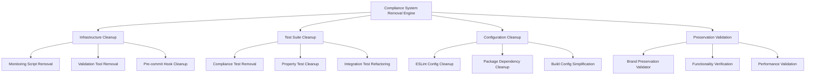

# Design Document: Brand Compliance System Removal

## Overview

This design addresses the systematic removal of the brand compliance monitoring and enforcement infrastructure while preserving all brand-compliant improvements and standalone validation scripts. The current system includes extensive monitoring tools, automated enforcement, compliance tests, and CI/CD integration that served their purpose in achieving 100% brand compliance but are now unnecessary overhead.

The design implements a careful cleanup approach that identifies and removes compliance monitoring infrastructure while ensuring zero impact on the application's brand-compliant visual appearance, core functionality, and preserving standalone brand validation scripts that remain useful for manual verification.

**Key Distinction**: This cleanup removes automated monitoring and enforcement systems while preserving:

- Brand-compliant application code and styling
- Standalone validation scripts (validate-brand-colors.ts, validate-typography.ts, etc.)
- Manual verification tools that don't create development overhead

## Architecture

### Removal Strategy Components



### Cleanup Process Flow

1. **Discovery Phase**: Identify all compliance system components across the codebase
2. **Impact Analysis**: Determine which components can be safely removed vs. preserved
3. **Systematic Removal**: Remove compliance infrastructure in dependency order
4. **Preservation Validation**: Verify brand improvements and functionality remain intact
5. **Cleanup Verification**: Confirm complete removal and clean final state

## Components and Interfaces

### 1. Infrastructure Cleanup System

**Primary Interface**: `InfrastructureCleanup`

```typescript
interface InfrastructureCleanup {
  removeMonitoringScripts(): Promise<CleanupResult>
  removeValidationTools(): Promise<CleanupResult>
  removePreCommitHooks(): Promise<CleanupResult>
  removeCIPipelineSteps(): Promise<CleanupResult>
}

interface CleanupResult {
  filesRemoved: string[]
  configurationsModified: string[]
  dependenciesRemoved: string[]
  preservedComponents: string[]
}
```

**Target Infrastructure Components**:

| Component Type     | Files to Remove                             | Preservation Notes                    |
| ------------------ | ------------------------------------------- | ------------------------------------- |
| Monitoring Scripts | `scripts/brand-compliance-*.js`             | Keep core application scripts         |
| Validation Tools   | `frontend/scripts/brand-compliance-scan.js` | Preserve build and deployment scripts |
| Pre-commit Hooks   | Brand compliance validation hooks           | Keep functional validation hooks      |
| CI/CD Steps        | Compliance checking pipeline steps          | Preserve functional testing steps     |

### 2. Test Suite Cleanup System

**Primary Interface**: `TestSuiteCleanup`

```typescript
interface TestSuiteCleanup {
  removeComplianceTests(): Promise<TestCleanupResult>
  removePropertyTests(): Promise<TestCleanupResult>
  refactorIntegrationTests(): Promise<TestCleanupResult>
  validateFunctionalTests(): Promise<TestValidationResult>
}

interface TestCleanupResult {
  testsRemoved: string[]
  testFilesDeleted: string[]
  assertionsModified: string[]
  coverageImpact: CoverageReport
}
```

**Test Cleanup Categories**:

**Remove Completely**:

- `frontend/src/__tests__/brand/` - All brand compliance property tests
- Compliance validation unit tests
- Brand monitoring integration tests
- Automated validation effectiveness tests

**Refactor/Preserve**:

- Component functionality tests (remove compliance assertions, keep functional tests)
- Chart component tests (preserve data visualization logic, remove brand validation)
- Accessibility tests (keep WCAG compliance, remove brand-specific checks)

### 3. Configuration Cleanup System

**Primary Interface**: `ConfigurationCleanup`

```typescript
interface ConfigurationCleanup {
  cleanupESLintConfig(): Promise<ConfigCleanupResult>
  removeDependencies(): Promise<DependencyCleanupResult>
  simplifyBuildConfig(): Promise<BuildCleanupResult>
  removeEnvironmentConfig(): Promise<EnvCleanupResult>
}

interface ConfigCleanupResult {
  rulesRemoved: string[]
  pluginsRemoved: string[]
  configurationsSimplified: string[]
}
```

**Configuration Cleanup Targets**:

| Configuration File          | Changes Required                        | Preservation Notes            |
| --------------------------- | --------------------------------------- | ----------------------------- |
| `frontend/eslint.config.js` | Remove brand compliance rules/plugins   | Keep functional linting rules |
| `package.json` files        | Remove compliance-specific dependencies | Keep core dependencies        |
| Build configurations        | Remove compliance validation steps      | Keep functional build steps   |
| Environment configs         | Remove compliance monitoring settings   | Keep application settings     |

### 4. Preservation Validation System

**Primary Interface**: `PreservationValidator`

```typescript
interface PreservationValidator {
  validateBrandCompliance(): Promise<BrandValidationResult>
  validateFunctionality(): Promise<FunctionalityResult>
  validatePerformance(): Promise<PerformanceResult>
  generatePreservationReport(): Promise<PreservationReport>
}

interface BrandValidationResult {
  colorsPreserved: boolean
  typographyPreserved: boolean
  componentsPreserved: boolean
  chartsPreserved: boolean
  issuesFound: string[]
}
```

**Preservation Validation Checks**:

**Brand Compliance Preservation**:

- TM brand colors remain in use across all components
- Montserrat and Source Sans 3 typography is maintained
- Brand-compliant button, form, and navigation patterns preserved
- Chart visualizations continue using TM brand color palette

**Functionality Preservation**:

- All user interactions work correctly
- Data processing and display functions normally
- Navigation and routing remain functional
- Performance meets or exceeds current benchmarks

## Data Models

### Cleanup Target Model

```typescript
interface CleanupTarget {
  path: string
  type: 'file' | 'directory' | 'configuration' | 'dependency'
  category: 'monitoring' | 'validation' | 'testing' | 'configuration'
  safeToRemove: boolean
  dependencies: string[]
  preservationNotes?: string
}

interface CleanupPlan {
  targets: CleanupTarget[]
  removalOrder: string[]
  preservationChecks: PreservationCheck[]
  rollbackPlan: RollbackStep[]
}
```

### Preservation Check Model

```typescript
interface PreservationCheck {
  name: string
  type: 'visual' | 'functional' | 'performance'
  validator: (context: ValidationContext) => Promise<boolean>
  description: string
  criticalityLevel: 'high' | 'medium' | 'low'
}

interface ValidationContext {
  beforeState: ApplicationState
  afterState: ApplicationState
  comparisonMetrics: ComparisonMetrics
}
```

Now I need to use the prework tool to analyze the acceptance criteria before writing the Correctness Properties section:

<function_calls>
<invoke name="prework">
<parameter name="featureName">brand-compliance-system-removal

## Correctness Properties

_A property is a characteristic or behavior that should hold true across all valid executions of a system-essentially, a formal statement about what the system should do. Properties serve as the bridge between human-readable specifications and machine-verifiable correctness guarantees._

### Property Reflection

After analyzing all acceptance criteria, several properties can be consolidated to eliminate redundancy:

- **Infrastructure removal properties** (1.1, 1.2, 1.3, 1.4, 1.5) can be combined into comprehensive infrastructure cleanup validation
- **Test cleanup properties** (2.1, 2.2, 2.3, 2.4, 2.5) can be unified under test suite cleanup validation
- **Utility removal properties** (3.1, 3.2, 3.3, 3.4, 3.5) can be consolidated into utility cleanup validation
- **Configuration cleanup properties** (5.1, 5.2, 5.3, 5.4, 5.5) can be combined into configuration cleanup validation
- **Documentation cleanup properties** (6.1, 6.2, 6.3, 6.4, 6.5) can be unified under documentation cleanup validation
- **Verification properties** (9.1, 9.2, 9.3, 9.4, 9.5) can be consolidated into comprehensive removal validation
- **Performance properties** (10.1, 10.2, 10.3, 10.4, 10.5) can be combined into workflow efficiency validation

### Core Properties

**Property 1: Complete Infrastructure Removal**
_For any_ compliance monitoring script, pre-commit hook, CI/CD pipeline step, or monitoring tool, the cleanup process should identify and remove all compliance infrastructure while preserving functional infrastructure components
**Validates: Requirements 1.1, 1.2, 1.3, 1.4, 1.5**

**Property 2: Test Suite Cleanup Preservation**
_For any_ test file or test assertion, the cleanup process should remove all brand compliance tests while maintaining all functional tests and ensuring test coverage for core functionality remains intact
**Validates: Requirements 2.1, 2.2, 2.3, 2.4, 2.5**

**Property 3: Utility and Tool Removal**
_For any_ compliance utility file, scanning tool, monitoring utility, or validation system component, the cleanup process should remove all compliance-specific code while preserving functional utilities and helper functions
**Validates: Requirements 3.1, 3.2, 3.3, 3.4, 3.5**

**Property 4: Brand Compliance Preservation**
_For any_ component using brand colors, typography, styling patterns, or chart visualizations, the preservation process should maintain all TM brand compliance elements without any monitoring infrastructure
**Validates: Requirements 4.1, 4.2, 4.3, 4.4, 4.5**

**Property 5: Configuration Cleanup**
_For any_ ESLint configuration, package dependency, build configuration, or environment setting, the cleanup process should remove compliance-specific configurations while maintaining all functional configurations
**Validates: Requirements 5.1, 5.2, 5.3, 5.4, 5.5**

**Property 6: Documentation Cleanup Preservation**
_For any_ compliance documentation, validation procedure, monitoring runbook, or compliance report, the cleanup process should remove compliance system documentation while preserving brand guidelines and functional documentation
**Validates: Requirements 6.1, 6.2, 6.3, 6.4, 6.5**

**Property 7: Application Functionality Preservation**
_For any_ component test, user interaction, data processing operation, or performance measurement, the application should maintain all existing functionality and pass all functional tests after compliance system removal
**Validates: Requirements 7.1, 7.2, 7.3, 7.4, 7.5**

**Property 8: Codebase Cleanliness**
_For any_ codebase scan, import analysis, dead code detection, or file structure review, the cleanup verification should find zero references to removed compliance systems and result in a clean, focused codebase
**Validates: Requirements 8.1, 8.2, 8.3, 8.4, 8.5**

**Property 9: Comprehensive Removal Validation**
_For any_ removal process completion, test execution, application runtime, or build performance, the validation system should confirm zero compliance monitoring components remain and all systems function normally
**Validates: Requirements 9.1, 9.2, 9.3, 9.4, 9.5**

**Property 10: Development Workflow Efficiency**
_For any_ code commit, build execution, test run, or development tool usage, the development workflow should be faster and more efficient after compliance system removal without any functional degradation
**Validates: Requirements 10.1, 10.2, 10.3, 10.4, 10.5**

## Error Handling

### Cleanup Process Errors

**Incomplete Removal Detection**:

- **Detection**: Automated scanning for remaining compliance system references
- **Response**: Provide detailed list of missed components with removal instructions
- **Recovery**: Re-run cleanup process on identified components

**Accidental Functional Code Removal**:

- **Detection**: Functional test failures after cleanup operations
- **Response**: Immediate rollback of cleanup changes
- **Recovery**: Restore from backup and refine cleanup targeting

**Configuration Corruption**:

- **Detection**: Build failures or application startup errors
- **Response**: Restore configuration files from backup
- **Recovery**: Manual configuration cleanup with validation

### Preservation Validation Errors

**Brand Compliance Loss**:

- **Detection**: Visual validation and color/typography scanning
- **Response**: Identify specific components with compliance issues
- **Recovery**: Restore brand-compliant styling without compliance infrastructure

**Functionality Regression**:

- **Detection**: Functional test suite execution and user interaction testing
- **Response**: Rollback changes and identify root cause
- **Recovery**: Selective cleanup with enhanced preservation validation

**Performance Degradation**:

- **Detection**: Performance benchmarking before and after cleanup
- **Response**: Identify performance bottlenecks introduced by cleanup
- **Recovery**: Optimize cleanup process and validate performance improvements

## Testing Strategy

### Dual Testing Approach

The testing strategy combines unit tests for specific cleanup scenarios with property-based tests for comprehensive validation:

**Unit Tests**:

- Specific file and directory removal scenarios
- Configuration modification edge cases
- Brand compliance preservation examples
- Error handling and recovery paths
- Integration points between cleanup components

**Property-Based Tests**:

- Universal cleanup effectiveness across all compliance components
- Brand preservation across all visual elements
- Functionality preservation across all application features
- Performance improvement validation across all workflow stages
- Comprehensive removal validation across all system components

### Property-Based Testing Configuration

**Testing Framework**: Vitest with fast-check for property-based testing
**Minimum Iterations**: 100 per property test
**Test Tagging Format**: **Feature: brand-compliance-system-removal, Property {number}: {property_text}**

**Key Test Categories**:

1. **Infrastructure Cleanup Tests**
   - Generate random directory structures with compliance and functional components
   - Verify complete compliance infrastructure removal while preserving functional components
   - Test cleanup process across various project structures

2. **Test Suite Cleanup Tests**
   - Generate test suites with mixed compliance and functional tests
   - Verify compliance test removal while preserving functional test coverage
   - Test assertion-level cleanup in integration tests

3. **Brand Preservation Tests**
   - Generate components with various styling patterns
   - Verify brand compliance preservation after cleanup
   - Test visual consistency across all component types

4. **Configuration Cleanup Tests**
   - Generate configuration files with mixed compliance and functional settings
   - Verify compliance configuration removal while preserving functional configurations
   - Test dependency cleanup across package management systems

5. **Performance Validation Tests**
   - Generate various workflow scenarios and measure performance
   - Verify performance improvements after cleanup
   - Test workflow efficiency across different development tasks

### Integration Testing

**End-to-End Cleanup Validation**:

- Full codebase cleanup and validation
- Complete application functionality testing
- Performance benchmarking across all workflows
- Visual regression testing for brand compliance

**Rollback and Recovery Testing**:

- Cleanup process failure scenarios
- Automatic rollback mechanism validation
- Manual recovery procedure testing
- Data integrity validation during cleanup operations
