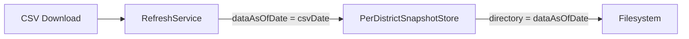
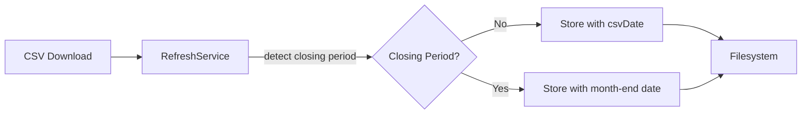

# Closing Period Snapshot Integration - Design Document

## Overview

This design integrates closing period handling into the snapshot creation flow. When the Toastmasters dashboard publishes data for a prior month (closing period), the snapshot should be dated as the last day of that month rather than the "As of" date. This ensures each month ends with accurate final data and prevents misleading snapshots in the new month.

## Architecture

### Current Data Flow



### Proposed Data Flow



## Components and Interfaces

### 1. Closing Period Detection (RefreshService)

The RefreshService already has access to the CSV date. We need to add logic to detect when the data month differs from the "As of" date month.

```typescript
interface ClosingPeriodInfo {
  isClosingPeriod: boolean
  dataMonth: string        // "YYYY-MM" format
  asOfDate: string         // The actual CSV date
  snapshotDate: string     // Date to use for snapshot (last day of dataMonth if closing)
  collectionDate: string   // When the data was actually collected (asOfDate)
}

// In RefreshService
private detectClosingPeriod(csvDate: string): ClosingPeriodInfo {
  // Parse the CSV date to get month/year
  // Compare to determine if this is closing period data
  // Return appropriate snapshot date
}
```

### 2. Enhanced Snapshot Metadata

Add fields to track closing period context:

```typescript
interface SnapshotMetadata {
  // Existing fields
  dataAsOfDate: string
  source: string
  fetchedAt: string

  // New fields for closing period tracking
  isClosingPeriodData?: boolean
  collectionDate?: string // Actual "As of" date from CSV
  logicalDate?: string // The date this snapshot represents (month-end for closing)
}
```

### 3. Snapshot Store Enhancement (PerDistrictSnapshotStore)

Modify `writeSnapshot` to accept an optional override date for the snapshot directory:

```typescript
interface WriteSnapshotOptions {
  skipCurrentPointerUpdate?: boolean
  overrideSnapshotDate?: string // Use this date instead of dataAsOfDate for directory name
}

// In writeSnapshot
const snapshotDirName = options?.overrideSnapshotDate
  ? this.generateSnapshotDirectoryName(options.overrideSnapshotDate)
  : this.generateSnapshotDirectoryName(snapshot.payload.metadata.dataAsOfDate)
```

### 4. Snapshot Comparison for Updates

Before overwriting a closing period snapshot, compare collection dates:

```typescript
interface SnapshotComparisonResult {
  shouldUpdate: boolean
  reason: 'no_existing' | 'newer_data' | 'same_or_older_data'
  existingCollectionDate?: string
  newCollectionDate: string
}

// In RefreshService or PerDistrictSnapshotStore
private async shouldUpdateClosingPeriodSnapshot(
  snapshotDate: string,
  newCollectionDate: string
): Promise<SnapshotComparisonResult>
```

## Data Models

### Enhanced NormalizedData Metadata

```typescript
interface NormalizedDataMetadata {
  source: string
  fetchedAt: string
  dataAsOfDate: string
  districtCount: number
  processingDurationMs: number

  // New closing period fields
  isClosingPeriodData?: boolean
  collectionDate?: string
  dataMonth?: string
}
```

### API Response Enhancement

The existing `_snapshot_metadata` in API responses will include:

```typescript
interface SnapshotResponseMetadata {
  snapshot_id: string
  created_at: string
  schema_version: string
  calculation_version: string
  data_as_of: string

  // New fields
  is_closing_period_data?: boolean
  collection_date?: string
  logical_date?: string
}
```

## Correctness Properties

### Property 1: Closing Period Detection Accuracy

_For any_ CSV with an "As of" date in month M+1 and data for month M, the system should identify this as a closing period and set the snapshot date to the last day of month M.
**Validates: Requirements 1.1, 1.2, 2.1**

### Property 2: Snapshot Date Correctness

_For any_ closing period data for month M, the snapshot directory should be named with the last day of month M (e.g., "2024-12-31" for December data collected in January).
**Validates: Requirements 2.1, 2.5**

### Property 3: Collection Date Preservation

_For any_ snapshot created from closing period data, the metadata should preserve the actual collection date (the "As of" date from the CSV).
**Validates: Requirements 2.6, 4.1**

### Property 4: Newer Data Wins

_For any_ attempt to update a closing period snapshot, the update should only proceed if the new data has a strictly newer collection date than the existing snapshot.
**Validates: Requirements 2.3, 2.4**

### Property 5: No Misleading New-Month Snapshots

_For any_ closing period data, no snapshot should be created with a date in the new month (the month of the "As of" date).
**Validates: Requirements 3.1**

### Property 6: Cross-Year Handling

_For any_ December closing period data collected in January, the snapshot should be dated December 31 of the prior year.
**Validates: Requirements 2.5**

## Error Handling

### Detection Errors

- Invalid CSV date format: Log error, skip closing period detection, use csvDate as-is
- Missing data month information: Fall back to normal behavior (use csvDate)

### Snapshot Comparison Errors

- Cannot read existing snapshot metadata: Treat as "no existing snapshot", allow update
- Corrupted collection date: Log warning, allow update with new data

### Write Errors

- Directory creation fails: Propagate error (existing behavior)
- Metadata write fails: Log error but don't fail the entire snapshot

## Testing Strategy

### Unit Tests

- Closing period detection with various date combinations
- Month-end date calculation (including leap years, December→January)
- Snapshot comparison logic (newer wins, equal allows update)

### Property-Based Tests

- Generate random date pairs and verify closing period detection
- Generate closing period scenarios and verify snapshot dating
- Generate update sequences and verify newer-wins behavior

### Integration Tests

- Full refresh flow with closing period data
- Snapshot overwrite scenarios
- API response metadata verification

## Implementation Notes

### Key Files to Modify

1. `backend/src/services/RefreshService.ts`
   - Add `detectClosingPeriod()` method
   - Modify `normalizeData()` to include closing period info
   - Modify `createSnapshot()` to pass override date

2. `backend/src/services/PerDistrictSnapshotStore.ts`
   - Add `overrideSnapshotDate` option to `writeSnapshot()`
   - Add method to read existing snapshot's collection date

3. `backend/src/types/snapshots.ts`
   - Add closing period fields to metadata types

4. `backend/src/routes/districts.ts`
   - Include closing period metadata in API responses

### What Does NOT Change

- **Raw CSV Storage**: CSV files continue to be stored using the "As of" date (the actual collection date). The `RawCSVCacheService` and `ToastmastersScraper` are unaffected.
- **CSV Metadata**: The existing closing period metadata in raw CSV cache (`isClosingPeriod`, `dataMonth`, `requestedDate`) remains as-is.
- Only the **snapshot directory naming** changes for closing period data.

### Backward Compatibility

Not required - the application is in development and the snapshot directory will be wiped. Existing snapshots do not need to be migrated.

### Performance Considerations

- Closing period detection is a simple date comparison (O(1))
- Snapshot comparison requires reading existing metadata (one file read)
- No significant performance impact expected
