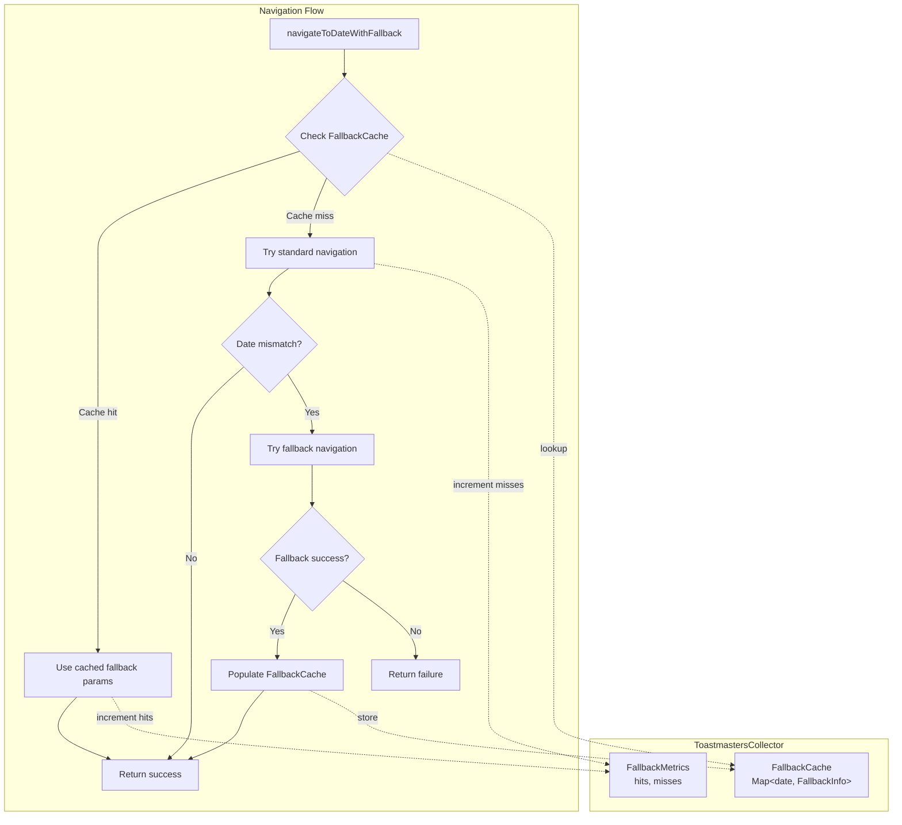

# Design Document: Closing Period Fallback Cache

## Overview

This design introduces an in-memory cache within the ToastmastersCollector class that stores knowledge about which dates require fallback navigation. When the collector successfully uses the previous-month fallback for a date, it caches this information so subsequent CSV downloads for the same date can skip the initial failed attempt and go directly to the fallback URL.

The optimization targets the inefficiency observed during closing period scraping where each of the 7+ CSV files (all-districts + 3 per district) independently discovers that fallback is needed, resulting in unnecessary failed requests.

## Architecture



## Components and Interfaces

### FallbackInfo Interface

Stores the information needed to reconstruct a fallback navigation:

```typescript
interface FallbackInfo {
  /** The date that was requested (YYYY-MM-DD format) */
  requestedDate: string

  /** The month parameter that succeeded in the fallback URL */
  fallbackMonth: number

  /** The year for the fallback month (may differ if crossing year boundary) */
  fallbackYear: number

  /** Whether the fallback crossed a program year boundary (July) */
  crossedProgramYearBoundary: boolean

  /** The actual date string returned by the dashboard */
  actualDateString: string

  /** Timestamp when this entry was cached */
  cachedAt: number
}
```

### FallbackMetrics Interface

Tracks cache efficiency:

```typescript
interface FallbackMetrics {
  /** Number of times cached fallback knowledge was reused */
  cacheHits: number

  /** Number of times fallback was discovered fresh (cache miss) */
  cacheMisses: number

  /** Number of dates that required fallback */
  fallbackDatesDiscovered: number
}
```

### ToastmastersCollector Class Modifications

Add instance properties:

```typescript
class ToastmastersCollector {
  // Existing properties...

  /** Cache of dates that require fallback navigation */
  private fallbackCache: Map<string, FallbackInfo> = new Map()

  /** Metrics for fallback cache efficiency */
  private fallbackMetrics: FallbackMetrics = {
    cacheHits: 0,
    cacheMisses: 0,
    fallbackDatesDiscovered: 0,
  }

  /** Get current fallback metrics (for reporting) */
  getFallbackMetrics(): FallbackMetrics {
    return { ...this.fallbackMetrics }
  }

  /** Check if a date has cached fallback info */
  hasCachedFallback(date: string): boolean {
    return this.fallbackCache.has(date)
  }
}
```

### Modified navigateToDateWithFallback Method

The core navigation method is modified to check the cache first:

```typescript
private async navigateToDateWithFallback(
  page: Page,
  baseUrl: string,
  pageName: string,
  dateString: string,
  districtId?: string
): Promise<{
  success: boolean
  actualDateString: string
  usedFallback: boolean
  usedCachedFallback: boolean
}> {
  // Step 1: Check fallback cache
  const cachedFallback = this.fallbackCache.get(dateString)

  if (cachedFallback) {
    // Cache hit - use cached fallback parameters directly
    this.fallbackMetrics.cacheHits++

    logger.info('Using cached fallback knowledge for date', {
      dateString,
      fallbackMonth: cachedFallback.fallbackMonth,
      crossedProgramYearBoundary: cachedFallback.crossedProgramYearBoundary,
      cachedAt: new Date(cachedFallback.cachedAt).toISOString()
    })

    const result = await this.navigateWithCachedFallback(
      page,
      baseUrl,
      pageName,
      dateString,
      cachedFallback,
      districtId
    )

    return {
      ...result,
      usedCachedFallback: true
    }
  }

  // Cache miss - proceed with standard navigation
  this.fallbackMetrics.cacheMisses++

  // ... existing navigation logic ...

  // If fallback succeeds, cache the knowledge
  if (usedFallback && success) {
    this.cacheFallbackKnowledge(dateString, fallbackParams)
  }

  return {
    success,
    actualDateString,
    usedFallback,
    usedCachedFallback: false
  }
}
```

### New Helper Methods

```typescript
/**
 * Navigate using cached fallback parameters
 */
private async navigateWithCachedFallback(
  page: Page,
  baseUrl: string,
  pageName: string,
  dateString: string,
  fallbackInfo: FallbackInfo,
  districtId?: string
): Promise<{ success: boolean; actualDateString: string; usedFallback: boolean }> {
  const dateObj = new Date(dateString + 'T00:00:00')
  const day = dateObj.getDate()
  const year = dateObj.getFullYear()
  const month = dateObj.getMonth() + 1
  const formattedDate = `${month}/${day}/${year}`

  // Determine base URL (may need to use previous program year)
  let effectiveBaseUrl = baseUrl
  if (fallbackInfo.crossedProgramYearBoundary) {
    const prevMonthDateString = `${fallbackInfo.fallbackYear}-${String(fallbackInfo.fallbackMonth).padStart(2, '0')}-${String(day).padStart(2, '0')}`
    effectiveBaseUrl = this.buildBaseUrl(prevMonthDateString)
  }

  const districtParam = districtId ? `id=${districtId}&` : ''
  const fallbackUrl = `${effectiveBaseUrl}/${pageName}?${districtParam}month=${fallbackInfo.fallbackMonth}&day=${formattedDate}`

  logger.debug('Navigating with cached fallback URL', {
    fallbackUrl,
    dateString,
    fallbackMonth: fallbackInfo.fallbackMonth
  })

  await page.goto(fallbackUrl, {
    waitUntil: 'domcontentloaded',
    timeout: this.config.timeout
  })

  // Verify the date matches
  const actualDate = await this.getSelectedDate(page)
  if (actualDate) {
    const { month: actualMonth, day: actualDay, year: actualYear, dateString: actualDateString } = actualDate

    if (actualMonth === month && actualDay === day && actualYear === year) {
      return {
        success: true,
        actualDateString,
        usedFallback: true
      }
    }
  }

  // Cached fallback didn't work - this shouldn't happen normally
  logger.warn('Cached fallback navigation failed, date mismatch', {
    dateString,
    cachedFallback: fallbackInfo
  })

  return {
    success: false,
    actualDateString: fallbackInfo.actualDateString,
    usedFallback: true
  }
}

/**
 * Cache successful fallback knowledge
 */
private cacheFallbackKnowledge(
  dateString: string,
  params: {
    fallbackMonth: number
    fallbackYear: number
    crossedProgramYearBoundary: boolean
    actualDateString: string
  }
): void {
  const fallbackInfo: FallbackInfo = {
    requestedDate: dateString,
    fallbackMonth: params.fallbackMonth,
    fallbackYear: params.fallbackYear,
    crossedProgramYearBoundary: params.crossedProgramYearBoundary,
    actualDateString: params.actualDateString,
    cachedAt: Date.now()
  }

  this.fallbackCache.set(dateString, fallbackInfo)
  this.fallbackMetrics.fallbackDatesDiscovered++

  logger.debug('Cached fallback knowledge for date', {
    dateString,
    fallbackMonth: params.fallbackMonth,
    crossedProgramYearBoundary: params.crossedProgramYearBoundary,
    actualDateString: params.actualDateString
  })
}
```

## Data Models

### Cache Key Format

The cache uses the requested date string in YYYY-MM-DD format as the key. This ensures:

- O(1) lookup via Map
- Consistent key format across all navigation calls
- Easy debugging and logging

### Cache Entry Lifecycle

1. **Creation**: When fallback navigation succeeds for a date not in cache
2. **Usage**: When any subsequent navigation request is made for the same date
3. **Expiration**: When the ToastmastersCollector instance is garbage collected (session-scoped)

## Correctness Properties

_A property is a characteristic or behavior that should hold true across all valid executions of a system-essentially, a formal statement about what the system should do. Properties serve as the bridge between human-readable specifications and machine-verifiable correctness guarantees._

### Property 1: Cache population on fallback success

_For any_ date where fallback navigation succeeds, the FallbackCache SHALL contain an entry for that date with all required fields (fallbackMonth, fallbackYear, crossedProgramYearBoundary, actualDateString) immediately after the navigation method returns.

**Validates: Requirements 1.1, 4.1, 4.3**

### Property 2: Direct fallback navigation on cache hit

_For any_ date that exists in the FallbackCache, subsequent navigation attempts SHALL use the cached fallback parameters directly and SHALL NOT attempt standard navigation first.

**Validates: Requirements 1.2, 3.2**

### Property 3: Standard navigation on cache miss

_For any_ date that does not exist in the FallbackCache, navigation SHALL first attempt standard navigation before trying fallback.

**Validates: Requirements 3.3**

### Property 4: Cache entry completeness

_For any_ entry in the FallbackCache, the entry SHALL contain: requestedDate matching the cache key, a valid fallbackMonth (1-12), a valid fallbackYear, a boolean crossedProgramYearBoundary, and a non-empty actualDateString.

**Validates: Requirements 2.1, 2.2, 2.3, 2.4**

### Property 5: Cache isolation between instances

_For any_ two ToastmastersCollector instances, populating the FallbackCache in one instance SHALL NOT affect the FallbackCache in the other instance.

**Validates: Requirements 6.3**

### Property 6: Metrics tracking accuracy

_For any_ sequence of navigation operations, the sum of cacheHits and cacheMisses SHALL equal the total number of navigation attempts, and fallbackDatesDiscovered SHALL equal the number of unique dates added to the cache.

**Validates: Requirements 7.1, 7.2**

### Property 7: No cache modification on standard success

_For any_ date where standard navigation succeeds without requiring fallback, the FallbackCache SHALL NOT be modified.

**Validates: Requirements 4.2**

## Error Handling

### Cache Lookup Failures

The cache is a simple Map, so lookup failures are not expected. If the Map implementation were to throw (e.g., due to memory issues), the error should propagate up as this indicates a serious system problem.

### Cached Fallback Navigation Failures

If a cached fallback doesn't work (date mismatch after using cached params), the collector should:

1. Log a warning
2. Return failure (don't retry with standard navigation to avoid infinite loops)
3. The cache entry remains (it may work for other page types)

This scenario is unlikely in practice since the dashboard behavior is consistent within a session.

### Metrics Overflow

The metrics counters are JavaScript numbers, which can safely represent integers up to 2^53. For a collector session, this is effectively unlimited.

## Testing Strategy

### Unit Tests

Unit tests will verify:

- FallbackInfo interface structure validation
- Cache key generation consistency
- Metrics counter increments
- Instance isolation (separate caches per instance)

### Property-Based Tests

Property-based tests will use fast-check to verify:

- Cache population invariants (Property 1, 4)
- Navigation behavior based on cache state (Property 2, 3, 7)
- Instance isolation (Property 5)
- Metrics accuracy (Property 6)

### Integration Tests

Integration tests will verify:

- End-to-end scraping with fallback cache enabled
- Metrics reporting in orchestrator summary
- Cache behavior across multiple CSV types for same date

### Test Framework

- **Unit/Property Tests**: Vitest with fast-check
- **Minimum iterations**: 100 per property test
- **Test isolation**: Each test creates fresh ToastmastersCollector instance
