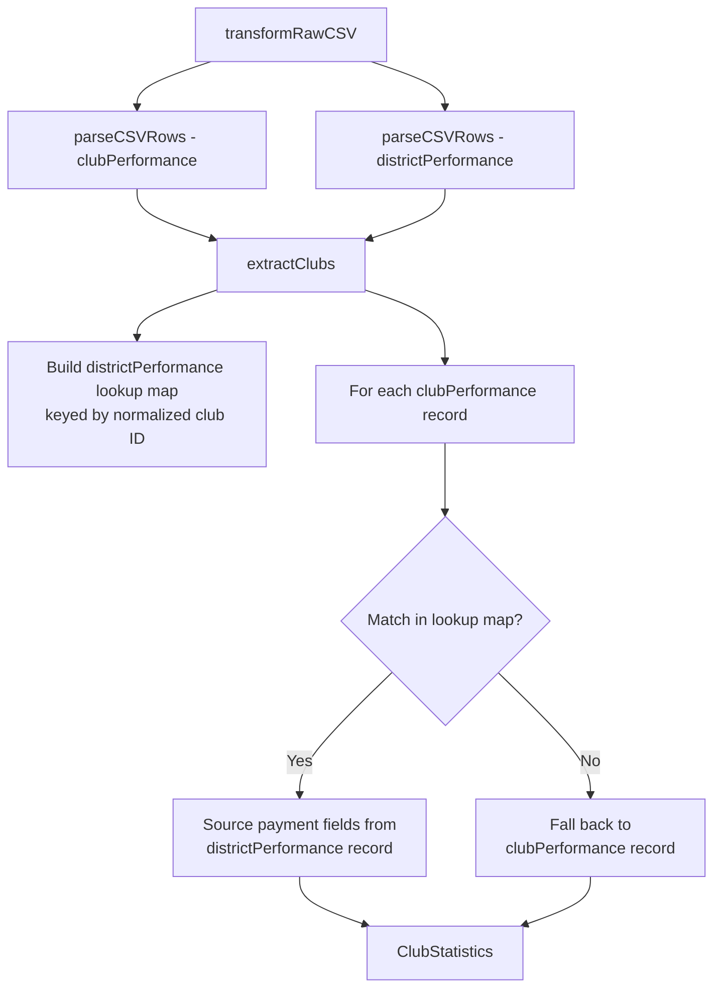

# Design Document: Club Renewal Data Fix

## Overview

The `DataTransformer.extractClubs()` method currently reads all club fields from `clubPerformance` records only. However, the Toastmasters dashboard provides renewal and payment data (`Oct. Ren.`, `Apr. Ren.`, `New`, `Total to Date`) exclusively in `districtPerformance` records (district-performance.csv), not in `clubPerformance` records (club-performance.csv).

The fix modifies `extractClubs()` to accept parsed `districtPerformance` records, build a lookup map keyed by normalized club ID, and merge payment/renewal fields from the matching district-performance record into each `ClubStatistics` object. When no match exists, the method falls back to the `clubPerformance` record (current behavior).

This approach mirrors the pattern already used in `ClubHealthAnalyticsModuleBackend.analyzeClubTrends()`, which correctly builds a `districtPerformanceByClub` map and merges payment data.

## Architecture

The change is scoped entirely to the `DataTransformer` class in `packages/analytics-core/src/transformation/DataTransformer.ts`. No new classes or modules are introduced.



### Data Flow Change

**Before (current):**

- `transformRawCSV()` calls `extractClubs(clubPerformance)` — only club-performance records
- `districtPerformance` is parsed but only passed to `calculateTotals()` and stored as raw data

**After (fixed):**

- `transformRawCSV()` calls `extractClubs(clubPerformance, districtPerformance)` — both record sets
- `extractClubs()` builds a lookup map from `districtPerformance` and merges payment fields

## Components and Interfaces

### Modified Method: `extractClubs`

**Current signature:**

```typescript
private extractClubs(clubPerformance: ParsedRecord[]): ClubStatistics[]
```

**New signature:**

```typescript
private extractClubs(
  clubPerformance: ParsedRecord[],
  districtPerformance: ParsedRecord[]
): ClubStatistics[]
```

### New Private Helper: `buildDistrictPerformanceLookup`

```typescript
private buildDistrictPerformanceLookup(
  districtPerformance: ParsedRecord[]
): Map<string, ParsedRecord>
```

Builds a `Map<string, ParsedRecord>` keyed by normalized club ID (leading zeros stripped). Extracts club ID from columns `Club`, `Club Number`, or `Club ID`. If a club ID is entirely zeros, preserves the original value.

### New Private Helper: `normalizeClubId`

```typescript
private normalizeClubId(clubId: string): string
```

Strips leading zeros from a club ID string. Returns the original value if the result would be empty (all-zeros case).

### Modified Call Site: `transformRawCSV`

The call to `extractClubs` changes from:

```typescript
const clubs = this.extractClubs(clubPerformance)
```

to:

```typescript
const clubs = this.extractClubs(clubPerformance, districtPerformance)
```

## Data Models

No changes to the `ClubStatistics` interface or any other data model. The fix only changes the source of data for existing fields:

| Field             | Current Source               | New Source                                     | Fallback          |
| ----------------- | ---------------------------- | ---------------------------------------------- | ----------------- |
| `octoberRenewals` | `clubPerformance` (always 0) | `districtPerformance` `Oct. Ren.` / `Oct. Ren` | `clubPerformance` |
| `aprilRenewals`   | `clubPerformance` (always 0) | `districtPerformance` `Apr. Ren.` / `Apr. Ren` | `clubPerformance` |
| `newMembers`      | `clubPerformance`            | `districtPerformance` `New Members` / `New`    | `clubPerformance` |
| `paymentsCount`   | `clubPerformance` (always 0) | `districtPerformance` `Total to Date`          | `clubPerformance` |
| All other fields  | `clubPerformance`            | No change                                      | N/A               |

## Correctness Properties

_A property is a characteristic or behavior that should hold true across all valid executions of a system — essentially, a formal statement about what the system should do. Properties serve as the bridge between human-readable specifications and machine-verifiable correctness guarantees._

### PBT Decision Framework Analysis

Per the testing steering document (§7.3), each candidate property was evaluated:

| Candidate             | Universal property?                         | 5 examples sufficient?                                                       | Complex input space?                                          | Algebraic property? | Decision                                                                             |
| --------------------- | ------------------------------------------- | ---------------------------------------------------------------------------- | ------------------------------------------------------------- | ------------------- | ------------------------------------------------------------------------------------ |
| Payment merge         | Yes — must hold for all club/district pairs | No — column name variants, ID formats, missing data create many combinations | Yes — two CSV schemas, column name variants, ID normalization | No                  | **PBT** (§7.1: data transformation pipeline, existing bug reveals missed edge cases) |
| Fallback              | Yes                                         | Yes — no match, empty array, missing columns                                 | No — bounded cases                                            | No                  | **Unit tests**                                                                       |
| ID normalization      | Yes — must hold for all ID formats          | No — leading zeros, all-zeros, mixed formats                                 | Yes — string normalization with edge cases                    | No                  | **PBT** (§7.1: data normalization, codebase already has PBT for normalization)       |
| Non-payment invariant | Yes                                         | Yes — a few examples with conflicting values in both sources                 | No — straightforward field sourcing                           | No                  | **Unit tests**                                                                       |
| Backward compat       | Yes                                         | Yes — single example with empty districtPerformance                          | No                                                            | No                  | **Unit tests**                                                                       |

### Property 1: Payment fields sourced from district performance when match exists

_For any_ club that appears in both `clubPerformance` and `districtPerformance` records (with varying column name formats and numeric values), the resulting `ClubStatistics` object's `octoberRenewals`, `aprilRenewals`, `newMembers`, and `paymentsCount` fields SHALL equal the corresponding values from the `districtPerformance` record.

**Validates: Requirements 1.2, 1.3, 1.4, 1.5**

### Property 2: Club ID normalization enables cross-CSV matching

_For any_ pair of club records where the club ID in `clubPerformance` and `districtPerformance` differ only in leading zeros (e.g., `00009905` vs `9905`), the DataTransformer SHALL successfully match them and merge payment data from the `districtPerformance` record.

**Validates: Requirements 2.1, 2.2**

### Unit-Test-Covered Criteria

The following requirements are best covered by well-chosen unit test examples rather than property tests, per the testing steering document's guidance to "prefer the simplest test that provides confidence":

- **Fallback behavior** (Requirements 1.6, 1.7): Club with no districtPerformance match uses clubPerformance values; missing columns default to 0.
- **Non-payment field invariance** (Requirement 3.1): Non-payment fields always come from clubPerformance regardless of districtPerformance content.
- **Backward compatibility** (Requirement 3.2): Empty districtPerformance produces identical output to current implementation.
- **Column name variants** (Requirements 1.2–1.5, 2.3): `Oct. Ren.` vs `Oct. Ren`, `Club` vs `Club Number`.
- **All-zeros club ID** (Requirement 2.4): Edge case for normalization.
- **Real-world regression** (Requirements 1.2–1.5): Club 00009905 from the bug report with known expected values.

## Error Handling

The fix introduces no new error conditions. The existing error handling patterns are preserved:

- **Missing columns**: `extractNumber()` returns 0 when a column is not found in a record. This behavior is unchanged.
- **Missing club IDs**: Records without a valid club ID in `districtPerformance` are skipped when building the lookup map (same pattern as `clubPerformance`).
- **Non-numeric values**: `extractNumber()` returns 0 for non-numeric strings. This applies to both `clubPerformance` and `districtPerformance` sources.
- **Empty districtPerformance**: When the array is empty, the lookup map is empty, and all clubs fall back to `clubPerformance` values — identical to current behavior.

## Testing Strategy

### Property-Based Testing

Library: `fast-check` (already available in the project's test dependencies)

Two property tests, each with minimum 100 iterations. Tests generate random CSV record pairs with varying club IDs, column names, and numeric values.

**Generators needed:**

- Random `ParsedRecord` for `clubPerformance` with valid club ID and name
- Random `ParsedRecord` for `districtPerformance` with payment columns and matching club ID
- Random club IDs with varying leading-zero counts

Tag format: **Feature: club-renewal-data-fix, Property {N}: {title}**

### Unit Tests

Unit tests cover specific examples and edge cases where property tests add complexity without value:

- Fallback to clubPerformance when no districtPerformance match exists
- Default to 0 when neither source has payment columns
- Column name variants (`Oct. Ren.` vs `Oct. Ren` vs `October Renewals`)
- All-zeros club ID edge case
- Non-payment fields unchanged when districtPerformance has conflicting values
- Backward compatibility with empty districtPerformance array
- Real-world regression test with Club 00009905 data from the bug report

### Test Isolation

Per the testing steering document:

- Tests use fresh `DataTransformer` instances per test
- No shared state between tests
- No filesystem, network, or clock dependencies
- All tests are deterministic and safe for parallel execution
