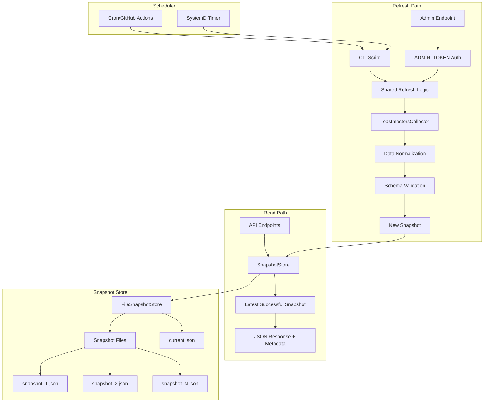

# Data Refresh Architecture - Design Document

## Overview

The Data Refresh Architecture transforms the current tightly-coupled system where API read requests can trigger expensive scraping operations into a clean, snapshot-based architecture. This design separates data refresh concerns from read operations, ensuring consistent performance and reliability.

The solution introduces a SnapshotStore abstraction that manages immutable, versioned snapshots of normalized data. Read operations always serve from the most recent successful snapshot, while refresh operations run independently and atomically update the snapshot store. This architecture aligns with the production maintenance steering document's emphasis on snapshot-based data handling and last-known-good patterns.

## Architecture

### High-Level Architecture



### Data Flow

1. **Read Operations**: API endpoints → SnapshotStore.getLatestSuccessful() → Cached snapshot data
2. **Refresh Operations**: Admin endpoint/CLI → Scraping → Normalization → Validation → New snapshot → Atomic pointer update
3. **Error Handling**: Failed refresh → Failed snapshot created → Current pointer unchanged → Reads continue from last successful snapshot

## Components and Interfaces

### 1. SnapshotStore Interface

**Purpose**: Provides a clean abstraction for snapshot persistence and retrieval, enabling future storage mechanism changes without affecting business logic.

```typescript
interface SnapshotStore {
  /**
   * Get the most recent successful snapshot
   * @returns Latest successful snapshot or null if none exists
   */
  getLatestSuccessful(): Promise<Snapshot | null>

  /**
   * Get the most recent snapshot regardless of status
   * @returns Latest snapshot or null if none exists
   */
  getLatest(): Promise<Snapshot | null>

  /**
   * Write a new snapshot atomically
   * @param snapshot The snapshot to persist
   */
  writeSnapshot(snapshot: Snapshot): Promise<void>

  /**
   * List snapshots with optional filtering and limiting
   * @param limit Maximum number of snapshots to return
   * @param filters Optional filters for debugging
   */
  listSnapshots(
    limit?: number,
    filters?: SnapshotFilters
  ): Promise<SnapshotMetadata[]>
}
```

### 2. FileSnapshotStore Implementation

**Purpose**: File-based implementation of SnapshotStore using existing CACHE_DIR conventions.

**Storage Structure**:

```
CACHE_DIR/
├── snapshots/
│   ├── 1704067200000.json    # Snapshot files (timestamp-based IDs)
│   ├── 1704153600000.json
│   └── 1704240000000.json
└── current.json              # Atomic pointer to latest successful snapshot
```

**Key Methods**:

```typescript
class FileSnapshotStore implements SnapshotStore {
  private cacheDir: string
  private snapshotsDir: string
  private currentPointerFile: string

  constructor(cacheDir: string) {
    this.cacheDir = cacheDir
    this.snapshotsDir = path.join(cacheDir, 'snapshots')
    this.currentPointerFile = path.join(cacheDir, 'current.json')
  }

  async getLatestSuccessful(): Promise<Snapshot | null>
  async writeSnapshot(snapshot: Snapshot): Promise<void>
  private async updateCurrentPointer(snapshotId: string): Promise<void>
  private async ensureDirectoryExists(): Promise<void>
}
```

### 3. Snapshot Data Model

**Purpose**: Immutable, versioned representation of normalized application data.

```typescript
interface Snapshot {
  snapshot_id: string // Timestamp string or unix ms
  created_at: string // ISO timestamp
  schema_version: string // Data structure version
  calculation_version: string // Computation logic version
  status: 'success' | 'partial' | 'failed'
  errors: string[] // Error messages if any
  payload: NormalizedData // The actual application data
}

interface NormalizedData {
  districts: DistrictData[]
  metadata: {
    source: string
    fetchedAt: string
    dataAsOfDate: string
  }
}

interface SnapshotMetadata {
  snapshot_id: string
  created_at: string
  status: 'success' | 'partial' | 'failed'
  schema_version: string
  calculation_version: string
  size_bytes: number
  error_count: number
}
```

### 4. RefreshService

**Purpose**: Orchestrates the refresh process, handling scraping, normalization, validation, and snapshot creation.

```typescript
class RefreshService {
  constructor(
    private snapshotStore: SnapshotStore,
    private collector: ToastmastersCollector,
    private validator: DataValidator
  ) {}

  /**
   * Execute a complete refresh cycle
   * @returns RefreshResult with status and snapshot information
   */
  async executeRefresh(): Promise<RefreshResult>

  private async scrapeData(): Promise<RawData>
  private async normalizeData(rawData: RawData): Promise<NormalizedData>
  private async validateData(data: NormalizedData): Promise<ValidationResult>
  private async createSnapshot(
    data: NormalizedData,
    status: SnapshotStatus
  ): Promise<Snapshot>
}

interface RefreshResult {
  success: boolean
  snapshot_id?: string
  duration_ms: number
  errors: string[]
  status: 'success' | 'failed'
}
```

### 5. AdminRefreshController

**Purpose**: HTTP endpoint for authenticated refresh operations.

```typescript
class AdminRefreshController {
  constructor(private refreshService: RefreshService) {}

  /**
   * POST /api/admin/refresh
   * Requires ADMIN_TOKEN authentication
   */
  async handleRefresh(req: Request, res: Response): Promise<void>

  private validateAdminToken(req: Request): boolean
}
```

### 6. DataValidator

**Purpose**: Validates normalized data against defined schemas to prevent corrupted snapshots.

```typescript
class DataValidator {
  private schema: ZodSchema

  constructor() {
    this.schema = this.createValidationSchema()
  }

  async validate(data: NormalizedData): Promise<ValidationResult>

  private createValidationSchema(): ZodSchema
}

interface ValidationResult {
  isValid: boolean
  errors: string[]
  warnings: string[]
}
```

## Data Models

### Snapshot Format

```typescript
// Example snapshot file content
{
  "snapshot_id": "1704067200000",
  "created_at": "2024-01-01T00:00:00.000Z",
  "schema_version": "1.0.0",
  "calculation_version": "2.1.0",
  "status": "success",
  "errors": [],
  "payload": {
    "districts": [
      {
        "districtId": "123",
        "name": "District 123",
        "statistics": { /* ... */ },
        "clubs": [ /* ... */ ],
        "membership": { /* ... */ }
      }
    ],
    "metadata": {
      "source": "toastmasters-dashboard",
      "fetchedAt": "2024-01-01T00:00:00.000Z",
      "dataAsOfDate": "2023-12-31"
    }
  }
}
```

### Current Pointer Format

```typescript
// current.json content
{
  "snapshot_id": "1704067200000",
  "updated_at": "2024-01-01T00:00:00.000Z"
}
```

## Correctness Properties

_A property is a characteristic or behavior that should hold true across all valid executions of a system-essentially, a formal statement about what the system should do. Properties serve as the bridge between human-readable specifications and machine-verifiable correctness guarantees._

### Property 1: Read Operations Never Trigger Scraping

_For any_ read endpoint request, the system should never initiate scraping or refresh operations
**Validates: Requirements 1.1**

### Property 2: Reads Always Serve Latest Successful Snapshot

_For any_ read endpoint request, the system should respond with data from the most recent successful snapshot
**Validates: Requirements 1.2, 3.5**

### Property 3: Concurrent Read Performance

_For any_ set of concurrent read requests, all requests should complete within reasonable time bounds without performance degradation
**Validates: Requirements 1.3**

### Property 4: Read Performance Independence

_For any_ read operation during scraping failures or delays, response times should remain consistent and independent of scraping status
**Validates: Requirements 1.4**

### Property 5: Sub-Second Response Times

_For any_ typical data query, the system should maintain sub-second response times
**Validates: Requirements 1.5**

### Property 6: Admin Authentication Required

_For any_ refresh operation request, the system should require valid ADMIN_TOKEN authentication
**Validates: Requirements 2.1**

### Property 7: Refresh Process Separation

_For any_ initiated refresh operation, scraping and normalization should execute independently from read operations
**Validates: Requirements 2.2, 2.3**

### Property 8: Successful Refresh Creates Success Snapshot

_For any_ successful refresh operation, the system should create a new snapshot with status "success"
**Validates: Requirements 2.4**

### Property 9: Failed Refresh Preserves Current Pointer

_For any_ failed refresh operation, the system should create a failed snapshot but not update the current successful snapshot pointer
**Validates: Requirements 2.5, 4.1, 4.3**

### Property 10: Dual Execution Support

_For any_ refresh trigger method (HTTP or CLI), the system should execute the same underlying refresh logic
**Validates: Requirements 2.6**

### Property 11: Timestamp Metadata Inclusion

_For any_ data response, the system should include snapshot creation timestamp metadata
**Validates: Requirements 3.1, 7.1**

### Property 12: Version Metadata Inclusion

_For any_ snapshot, the system should include schema_version and calculation_version information
**Validates: Requirements 3.3, 8.1, 8.2**

### Property 13: Failed Snapshots Not Served

_For any_ snapshot with status "failed", the system should not serve this data to read endpoints
**Validates: Requirements 3.4**

### Property 14: Error Logging in Failed Snapshots

_For any_ scraping error during refresh, the system should log detailed error information in the failed snapshot
**Validates: Requirements 4.2**

### Property 15: Corruption Error Handling

_For any_ snapshot store corruption scenario, the system should provide clear error messages and recovery guidance
**Validates: Requirements 4.4**

### Property 16: Network Retry Logic

_For any_ network issue during scraping, the system should retry with appropriate backoff strategies
**Validates: Requirements 4.5**

### Property 17: SnapshotStore Interface Compliance

_For any_ SnapshotStore implementation, the system should provide all required interface methods
**Validates: Requirements 5.1**

### Property 18: Atomic Snapshot Persistence

_For any_ snapshot write operation, the system should persist data atomically to prevent partial writes
**Validates: Requirements 5.2**

### Property 19: Dual Query Support

_For any_ snapshot retrieval, the system should support both "latest successful" and "latest regardless of status" queries
**Validates: Requirements 5.3**

### Property 20: Current Pointer Maintenance

_For any_ successful snapshot creation, the system should maintain an accurate pointer file to the current successful snapshot
**Validates: Requirements 5.4**

### Property 21: Snapshot Listing Functionality

_For any_ snapshot listing request, the system should support filtering and limiting for debugging purposes
**Validates: Requirements 5.5**

### Property 22: Schema Validation

_For any_ snapshot creation, the system should validate the normalized payload against a defined schema
**Validates: Requirements 6.1**

### Property 23: Validation Rejection

_For any_ validation failure with missing required fields, the system should reject the snapshot and maintain the current pointer
**Validates: Requirements 6.2**

### Property 24: Refresh Operation Logging

_For any_ refresh operation start and completion, the system should log timing, status, and error information
**Validates: Requirements 6.3**

### Property 25: Snapshot ID Correlation

_For any_ snapshot creation, the system should include unique snapshot IDs in all related log entries
**Validates: Requirements 6.4**

### Property 26: Metrics Collection

_For any_ snapshot operation monitoring, the system should provide metrics on refresh success rates and durations
**Validates: Requirements 6.5**

### Property 27: Structured Error Responses

_For any_ API error condition (like no snapshot available), the system should return structured error responses that frontends can handle gracefully
**Validates: Requirements 7.2**

### Property 28: Version Preservation

_For any_ historical snapshot read, the system should preserve the original schema and calculation versions
**Validates: Requirements 8.3**

### Property 29: Version Evolution

_For any_ schema or calculation logic change, new snapshots should use current versions while preserving historical context
**Validates: Requirements 8.4**

### Property 30: Cross-Version Comparison

_For any_ snapshot comparison across different versions, the system should account for version differences through recorded metadata
**Validates: Requirements 8.5**

## Error Handling

### Refresh Failures

- **Scraping Errors**: Create failed snapshot with detailed error information, preserve current pointer
- **Network Timeouts**: Implement retry logic with exponential backoff, circuit breaker pattern
- **Validation Failures**: Reject snapshot creation, log validation errors, maintain current state
- **Storage Errors**: Retry atomic operations, provide clear error messages for corruption

### Read Operation Failures

- **No Snapshot Available**: Return HTTP 503 with structured error message
- **Corrupted Current Pointer**: Attempt recovery by scanning snapshot directory
- **File System Errors**: Graceful degradation with appropriate error responses
- **Concurrent Access**: Handle file locking and atomic operations properly

### Authentication Failures

- **Missing ADMIN_TOKEN**: Return HTTP 401 with clear authentication requirements
- **Invalid Token**: Return HTTP 403 with token validation failure message
- **Token Validation Errors**: Log security events, return appropriate HTTP status

## Testing Strategy

### Unit Testing

- Test SnapshotStore interface implementations with various scenarios
- Test RefreshService logic with mocked dependencies
- Test DataValidator with valid and invalid payloads
- Test AdminRefreshController authentication and error handling
- Test atomic file operations and concurrent access scenarios

### Property-Based Testing

Each correctness property will be implemented as a property-based test using the fast-check library:

- **Property 1-5**: Generate random read requests and verify performance/behavior
- **Property 6-10**: Generate refresh scenarios and verify authentication/execution
- **Property 11-15**: Generate snapshot scenarios and verify metadata/error handling
- **Property 16-21**: Generate storage scenarios and verify interface compliance
- **Property 22-27**: Generate validation/logging scenarios and verify behavior
- **Property 28-30**: Generate version scenarios and verify evolution handling

### Integration Testing

- Test end-to-end refresh workflows with real scraping (using test data)
- Test read endpoint behavior during refresh operations
- Test snapshot store persistence across application restarts
- Test CLI script integration with shared refresh logic
- Test error recovery scenarios and graceful degradation

### Performance Testing

- Test read endpoint response times under various load conditions
- Test concurrent read performance during refresh operations
- Test snapshot storage performance with large datasets
- Test memory usage during refresh operations
- Test file system performance with many snapshots

## Implementation Phases

### Phase 1: Core Snapshot Infrastructure (Week 1)

- Implement SnapshotStore interface and FileSnapshotStore
- Create Snapshot and related data models
- Implement basic snapshot persistence and retrieval
- Add comprehensive unit tests for storage layer

### Phase 2: Refresh Service and Validation (Week 1-2)

- Implement RefreshService with scraping integration
- Create DataValidator with Zod schema validation
- Implement atomic snapshot creation and pointer management
- Add error handling and retry logic

### Phase 3: API Integration (Week 2)

- Modify existing read endpoints to use SnapshotStore
- Implement AdminRefreshController with authentication
- Add CLI refresh script with shared logic
- Update error responses and metadata inclusion

### Phase 4: Advanced Features and Monitoring (Week 2-3)

- Implement metrics collection and monitoring
- Add comprehensive logging with snapshot ID correlation
- Implement snapshot listing and debugging features
- Add performance optimizations and caching

### Phase 5: Testing and Documentation (Week 3)

- Implement comprehensive property-based test suite
- Add integration tests for end-to-end workflows
- Create deployment documentation and migration guide
- Performance testing and optimization

## Deployment Considerations

### Environment Variables

```bash
# Required
ADMIN_TOKEN=your-secure-admin-token-here
CACHE_DIR=/path/to/cache/directory

# Optional
SNAPSHOT_RETENTION_DAYS=30
REFRESH_TIMEOUT_MS=300000
VALIDATION_STRICT_MODE=true
```

### File System Requirements

- Write permissions to CACHE_DIR
- Sufficient disk space for snapshot storage (estimate 10MB per snapshot)
- Atomic file operations support (most modern file systems)
- Backup strategy for snapshot directory

### Migration Strategy

1. **Pre-Migration**: Backup existing cache directory
2. **Deployment**: Deploy new code with snapshot system disabled
3. **Initial Snapshot**: Run manual refresh to create first snapshot
4. **Validation**: Verify snapshot creation and read operations
5. **Cutover**: Enable snapshot-based reads, disable old cache reads
6. **Cleanup**: Remove old cache files after validation period

### Monitoring and Alerting

- Monitor refresh success/failure rates
- Alert on consecutive refresh failures (>3)
- Monitor read endpoint response times
- Alert on snapshot storage disk usage (>80%)
- Monitor authentication failures and potential security issues

### Backup and Recovery

- Regular backup of snapshot directory
- Point-in-time recovery capability
- Disaster recovery procedures for complete data loss
- Snapshot integrity verification tools

## Security Considerations

### Authentication

- ADMIN_TOKEN should be cryptographically secure (minimum 32 characters)
- Token rotation strategy for production environments
- Rate limiting on admin endpoints to prevent brute force
- Audit logging for all admin operations

### File System Security

- Restrict file permissions on snapshot directory (700)
- Validate all file paths to prevent directory traversal
- Sanitize snapshot IDs to prevent injection attacks
- Regular security scanning of stored data

### Data Privacy

- Ensure snapshots don't contain sensitive personal information
- Implement data retention policies for old snapshots
- Consider encryption at rest for sensitive environments
- Audit data access patterns and unusual activity

## Performance Optimizations

### Read Performance

- In-memory caching of current snapshot metadata
- Lazy loading of snapshot payload data
- Compression of snapshot files (gzip)
- CDN integration for static snapshot serving

### Storage Optimization

- Automatic cleanup of old snapshots based on retention policy
- Snapshot deduplication for identical data
- Incremental snapshots for large datasets
- Parallel snapshot processing for multiple districts

### Network Optimization

- Connection pooling for scraping operations
- Request batching and rate limiting
- Circuit breaker pattern for external dependencies
- Caching of intermediate scraping results
