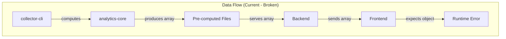
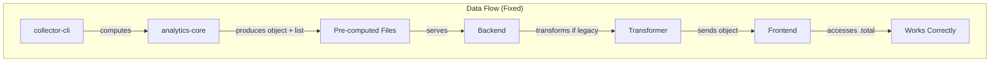

# Design Document: Distinguished Clubs Type Fix

## Overview

This design addresses the type mismatch between the `analytics-core` package and the frontend for the `distinguishedClubs` field in `DistrictAnalytics`. The fix involves:

1. Updating the type definition in `analytics-core` to produce a counts object instead of an array
2. Adding a new `distinguishedClubsList` field to preserve the detailed club information
3. Updating the `DistinguishedClubAnalyticsModule` to generate both formats
4. Adding backward compatibility transformation in the backend for legacy pre-computed files

The change is localized to the analytics computation layer and backend serving layer, with no changes required to the frontend since it already expects the correct format.

## Architecture





### Component Responsibilities

| Component                          | Responsibility                                                       |
| ---------------------------------- | -------------------------------------------------------------------- |
| `analytics-core/types.ts`          | Define `DistinguishedClubCounts` type and update `DistrictAnalytics` |
| `DistinguishedClubAnalyticsModule` | Generate counts object and club list from snapshots                  |
| `AnalyticsComputer`                | Orchestrate computation and populate both fields                     |
| `Backend analytics route`          | Transform legacy array format to object format                       |

## Components and Interfaces

### 1. Type Definitions (analytics-core/types.ts)

```typescript
/**
 * Summary counts of distinguished clubs by recognition level.
 * Used in DistrictAnalytics.distinguishedClubs field.
 */
export interface DistinguishedClubCounts {
  /** Clubs achieving Smedley Distinguished (10+ goals, 25+ members) */
  smedley: number
  /** Clubs achieving President's Distinguished (9+ goals, 20+ members) */
  presidents: number
  /** Clubs achieving Select Distinguished (7+ goals, 20+ members) */
  select: number
  /** Clubs achieving Distinguished (5+ goals, 20+ members) */
  distinguished: number
  /** Total count of all distinguished clubs */
  total: number
}

/**
 * Updated DistrictAnalytics interface
 */
export interface DistrictAnalytics {
  // ... existing fields ...

  /** Summary counts of distinguished clubs by level */
  distinguishedClubs: DistinguishedClubCounts

  /** Detailed list of distinguished clubs (new field) */
  distinguishedClubsList: DistinguishedClubSummary[]

  // ... remaining fields ...
}
```

### 2. DistinguishedClubAnalyticsModule Updates

```typescript
/**
 * Generate distinguished club counts from snapshots
 * @param snapshots - Array of district statistics snapshots
 * @returns DistinguishedClubCounts object
 */
generateDistinguishedClubCounts(
  snapshots: DistrictStatistics[]
): DistinguishedClubCounts

/**
 * Updated status type to include smedley
 */
type DistinguishedStatus = 'smedley' | 'president' | 'select' | 'distinguished' | 'none'
```

### 3. Backend Transformation Layer

```typescript
/**
 * Transform legacy distinguishedClubs array to counts object
 * @param legacyData - Array of DistinguishedClubSummary
 * @returns DistinguishedClubCounts object
 */
function transformLegacyDistinguishedClubs(
  legacyData: DistinguishedClubSummary[]
): DistinguishedClubCounts

/**
 * Type guard to detect legacy array format
 */
function isLegacyDistinguishedClubsFormat(
  data: unknown
): data is DistinguishedClubSummary[]
```

## Data Models

### DistinguishedClubCounts

| Field           | Type     | Description                                                      |
| --------------- | -------- | ---------------------------------------------------------------- |
| `smedley`       | `number` | Count of Smedley Distinguished clubs (10+ goals, 25+ members)    |
| `presidents`    | `number` | Count of President's Distinguished clubs (9+ goals, 20+ members) |
| `select`        | `number` | Count of Select Distinguished clubs (7+ goals, 20+ members)      |
| `distinguished` | `number` | Count of Distinguished clubs (5+ goals, 20+ members)             |
| `total`         | `number` | Sum of all distinguished clubs                                   |

### DistinguishedClubSummary (Existing - No Changes)

| Field            | Type                                                                | Description               |
| ---------------- | ------------------------------------------------------------------- | ------------------------- |
| `clubId`         | `string`                                                            | Unique club identifier    |
| `clubName`       | `string`                                                            | Display name of the club  |
| `status`         | `'smedley' \| 'president' \| 'select' \| 'distinguished' \| 'none'` | Recognition level         |
| `dcpPoints`      | `number`                                                            | DCP goals achieved        |
| `goalsCompleted` | `number`                                                            | Number of goals completed |

### Recognition Level Thresholds

| Level         | Goals Required | Members Required |
| ------------- | -------------- | ---------------- |
| Smedley       | 10+            | 25+              |
| President's   | 9+             | 20+              |
| Select        | 7+             | 20+              |
| Distinguished | 5+             | 20+              |

## Correctness Properties

_A property is a characteristic or behavior that should hold true across all valid executions of a system—essentially, a formal statement about what the system should do. Properties serve as the bridge between human-readable specifications and machine-verifiable correctness guarantees._

Per `testing.md` Section 7, property tests are reserved for cases where they genuinely add value. The following properties meet the criteria (mathematical invariants, consistency/roundtrip properties).

### Property 1: Total Equals Sum of Counts

_For any_ `DistinguishedClubCounts` object produced by the system, the `total` field SHALL equal the sum of `smedley + presidents + select + distinguished`.

**Rationale**: Mathematical invariant - "Totals must equal sum of parts" (testing.md Section 7.1.1)

**Validates: Requirements 2.3**

### Property 2: Counts-List Consistency

_For any_ `DistrictAnalytics` object produced by `AnalyticsComputer`, counting the clubs in `distinguishedClubsList` by their status SHALL produce the same counts as the `distinguishedClubs` object.

**Rationale**: Consistency/roundtrip property across two representations (testing.md Section 7.1.1)

**Validates: Requirements 2.1, 2.2**

### Unit Test Coverage (Not Properties)

Per testing.md Section 7.3: "Would 5 well-chosen examples provide equivalent confidence? If yes, prefer the examples."

The following requirements are better served by unit tests:

**Threshold Classification (Req 3.2)**: Boundary examples are clearer than properties:

- Club with exactly 10 goals, 25 members → smedley
- Club with 9 goals, 25 members → president (not smedley)
- Club with 10 goals, 24 members → president (not smedley)
- Club with 9 goals, 20 members → president
- Club with 7 goals, 20 members → select
- Club with 5 goals, 20 members → distinguished
- Club with 4 goals, 20 members → none

**No Double Counting (Req 3.3)**: The input space is bounded (clubs with goals/members). 3-4 examples suffice:

- Club qualifying for smedley appears only in smedley count
- Club qualifying for president (but not smedley) appears only in president count
- Mixed set of clubs produces correct exclusive counts

**Legacy Transformation (Req 4.1, 4.2)**: Simple data mapping. Examples are clearer:

- Empty array → all zeros
- Single item with status 'president' → presidents: 1, others: 0
- Mixed array → counts match status distribution

## Error Handling

### Invalid Input Handling

| Scenario                         | Handling                          |
| -------------------------------- | --------------------------------- |
| Empty snapshots array            | Return zero counts for all fields |
| Snapshot with no clubs           | Return zero counts for all fields |
| Club with negative goals/members | Treat as zero (defensive)         |
| Legacy file with malformed array | Log error, return empty counts    |

### Type Guard Failures

The backend transformation layer uses type guards to detect legacy format. If the type guard fails to identify the format:

1. Log a warning with the actual data shape
2. Attempt to serve the data as-is (may cause frontend error)
3. Include diagnostic information in error response

### Schema Version Handling

The existing `SchemaVersionError` handling in the backend remains unchanged. Legacy files with array format will be transformed regardless of schema version, as this is a data format issue not a schema version issue.

## Testing Strategy

This testing strategy follows:

- `testing.md` Section 7 (Property-Based Testing) for deciding when PBT is appropriate
- `testing.md` Section 9 (Rule-Driven and Derived Logic) for threshold-based classification

### Decision Framework Applied

Per testing.md Section 7.3, before proposing property tests:

| Question                                                    | Answer                                                                                         |
| ----------------------------------------------------------- | ---------------------------------------------------------------------------------------------- |
| What universal property would this test verify?             | Sum invariants, counts-list consistency                                                        |
| Would 5 well-chosen examples provide equivalent confidence? | No for invariants; Yes for threshold classification, no-double-counting, legacy transformation |
| Is the input space genuinely complex?                       | No - clubs have bounded goals/members                                                          |
| Does this logic have mathematical/algebraic properties?     | Yes for totals and consistency checks                                                          |

**Result**: 2 property tests + comprehensive unit tests

### Unit Tests

Unit tests will cover:

1. **Threshold Classification (Req 3.2)** - Boundary examples are clearer than properties:
   - Club with exactly 10 goals, 25 members → smedley
   - Club with 9 goals, 25 members → president (not smedley)
   - Club with 10 goals, 24 members → president (not smedley)
   - Club with 9 goals, 20 members → president
   - Club with 7 goals, 20 members → select
   - Club with 5 goals, 20 members → distinguished
   - Club with 4 goals, 20 members → none

2. **No Double Counting (Req 3.3)** - 3-4 examples suffice:
   - Club qualifying for smedley appears only in smedley count
   - Club qualifying for president (but not smedley) appears only in president count
   - Mixed set of clubs produces correct exclusive counts

3. **Legacy Transformation (Req 4.1, 4.2)** - Simple mapping, examples are clearer:
   - Empty array → all zeros
   - Single item with status 'president' → presidents: 1, others: 0
   - Mixed array → counts match status distribution

4. **Type Guard** - Identifies array vs object format

5. **Edge Cases** - Empty snapshots, single club, no distinguished clubs

### Property-Based Tests

Property tests use `fast-check` only where they genuinely add value:

| Property                            | Rationale (per testing.md)     | Validates    |
| ----------------------------------- | ------------------------------ | ------------ |
| Property 1: Total equals sum        | Mathematical invariant (7.1.1) | Req 2.3      |
| Property 2: Counts-list consistency | Consistency/roundtrip (7.1.1)  | Req 2.1, 2.2 |

Each property test:

- Runs minimum 100 iterations
- References design document property
- Tag format: **Feature: distinguished-clubs-type-fix, Property N: {property_text}**

### Test Isolation Requirements

Per testing.md Section 5 and 6:

- Deterministic (no flaky tests)
- Unique, isolated resources
- Clean up in afterEach hooks
- Pass in parallel (`--run` mode)

### Test File Locations

| Test Type                    | Location                                                                                  |
| ---------------------------- | ----------------------------------------------------------------------------------------- |
| Unit tests                   | `packages/analytics-core/src/__tests__/DistinguishedClubAnalyticsModule.test.ts`          |
| Property tests               | `packages/analytics-core/src/__tests__/DistinguishedClubAnalyticsModule.property.test.ts` |
| Backend transformation tests | `backend/src/services/__tests__/legacyTransformation.test.ts`                             |

### Why These Tests Matter

Per testing.md: "If it matters later, it must be tested now."

The distinguished club classification affects district dashboards and recognition tracking. A bug would silently misclassify clubs—exactly the subtle failure the steering warns against.
