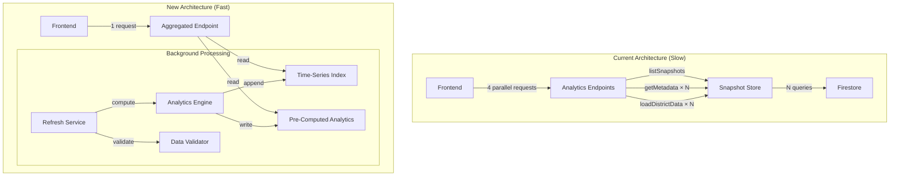
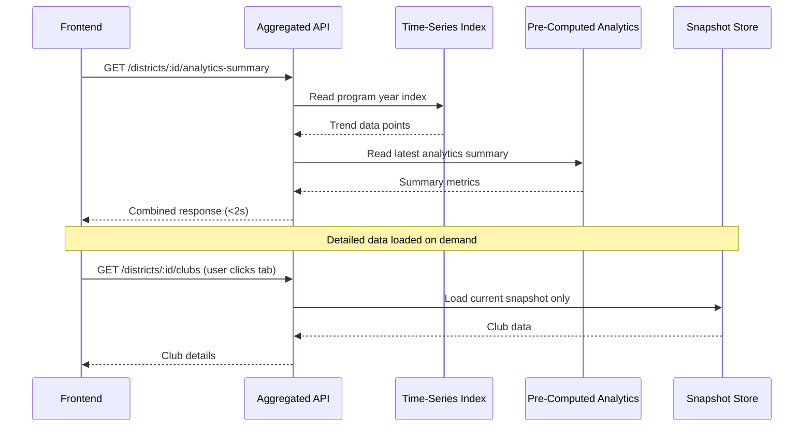

# Design Document: District Analytics Performance

## Overview

This design addresses the 504 Gateway Timeout errors on the district analytics page by fundamentally shifting from on-demand computation to pre-computed analytics. The current architecture loads all snapshots (up to 365/year × 15 years = 5,475 snapshots) and computes analytics at request time, causing 30-72 second response times.

The solution introduces:

1. **Pre-computed analytics** generated during snapshot creation
2. **Time-series index** for efficient range queries without loading individual snapshots
3. **Aggregated API endpoint** to reduce frontend requests from 4+ to 1
4. **Data validation** to filter invalid records (e.g., "As of MM/DD/YYYY" stored as district IDs)
5. **Consolidated admin panel** for snapshot and analytics management

## Architecture



### Data Flow



## Components and Interfaces

### 1. PreComputedAnalyticsService

Responsible for computing and storing analytics summaries during snapshot creation.

```typescript
interface PreComputedAnalyticsSummary {
  snapshotId: string
  districtId: string
  computedAt: string

  // Summary metrics (fast to retrieve)
  totalMembership: number
  membershipChange: number
  clubCounts: {
    total: number
    thriving: number
    vulnerable: number
    interventionRequired: number
  }
  distinguishedClubs: {
    smedley: number
    presidents: number
    select: number
    distinguished: number
    total: number
  }

  // Trend data point for this snapshot
  trendDataPoint: {
    date: string
    membership: number
    payments: number
    dcpGoals: number
  }
}

interface IPreComputedAnalyticsService {
  /**
   * Compute and store analytics for a snapshot
   * Called during snapshot creation
   */
  computeAndStore(
    snapshotId: string,
    districtData: DistrictStatistics[]
  ): Promise<void>

  /**
   * Get pre-computed analytics for a district
   */
  getAnalyticsSummary(
    districtId: string,
    snapshotId: string
  ): Promise<PreComputedAnalyticsSummary | null>

  /**
   * Get latest analytics summary for a district
   */
  getLatestSummary(
    districtId: string
  ): Promise<PreComputedAnalyticsSummary | null>
}
```

### 2. TimeSeriesIndexService

Manages the time-series index for efficient range queries.

```typescript
interface TimeSeriesDataPoint {
  date: string
  snapshotId: string
  membership: number
  payments: number
  dcpGoals: number
  distinguishedTotal: number
  clubCounts: {
    total: number
    thriving: number
    vulnerable: number
    interventionRequired: number
  }
}

interface ProgramYearIndex {
  programYear: string // e.g., "2023-2024"
  startDate: string // e.g., "2023-07-01"
  endDate: string // e.g., "2024-06-30"
  dataPoints: TimeSeriesDataPoint[]
  lastUpdated: string
}

interface ITimeSeriesIndexService {
  /**
   * Append a data point to the time-series index
   * Called after snapshot creation
   */
  appendDataPoint(
    districtId: string,
    dataPoint: TimeSeriesDataPoint
  ): Promise<void>

  /**
   * Get trend data for a date range
   * Returns data points without loading individual snapshots
   */
  getTrendData(
    districtId: string,
    startDate: string,
    endDate: string
  ): Promise<TimeSeriesDataPoint[]>

  /**
   * Get all data for a program year
   */
  getProgramYearData(
    districtId: string,
    programYear: string
  ): Promise<ProgramYearIndex | null>

  /**
   * Rebuild index from snapshots (for backfill)
   */
  rebuildIndex(districtId: string, fromDate?: string): Promise<void>
}
```

### 3. DistrictIdValidator

Validates district IDs to filter out invalid records.

```typescript
interface ValidationResult {
  isValid: boolean
  reason?: string
}

interface IDistrictIdValidator {
  /**
   * Validate a district ID
   * Returns validation result with reason if invalid
   */
  validate(districtId: string): ValidationResult

  /**
   * Filter valid districts from a list
   * Returns valid districts and logs rejected ones
   */
  filterValid(districts: DistrictStatistics[]): {
    valid: DistrictStatistics[]
    rejected: Array<{ districtId: string; reason: string }>
  }
}

// Validation rules:
// 1. Not empty, null, or whitespace-only
// 2. Does not match date pattern (e.g., "As of MM/DD/YYYY")
// 3. Contains only alphanumeric characters
const DATE_PATTERN = /^As of \d{1,2}\/\d{1,2}\/\d{4}$/i
const VALID_DISTRICT_ID_PATTERN = /^[A-Za-z0-9]+$/
```

### 4. AggregatedAnalyticsEndpoint

Single endpoint returning all analytics data.

```typescript
interface AggregatedAnalyticsResponse {
  districtId: string
  dateRange: { start: string; end: string }

  // Summary data (from pre-computed analytics)
  summary: {
    totalMembership: number
    membershipChange: number
    clubCounts: {
      total: number
      thriving: number
      vulnerable: number
      interventionRequired: number
    }
    distinguishedClubs: {
      smedley: number
      presidents: number
      select: number
      distinguished: number
      total: number
    }
    distinguishedProjection: number
  }

  // Trend data (from time-series index)
  trends: {
    membership: Array<{ date: string; count: number }>
    payments?: Array<{ date: string; payments: number }>
  }

  // Year-over-year comparison
  yearOverYear?: {
    membershipChange: number
    distinguishedChange: number
    clubHealthChange: number
  }

  // Performance targets (from latest snapshot)
  performanceTargets?: DistrictPerformanceTargets

  // Metadata
  dataSource: 'precomputed' | 'computed'
  computedAt: string
}

// Endpoint: GET /api/districts/:districtId/analytics-summary
// Query params: startDate, endDate
// Response time target: <2 seconds
```

### 5. RequestDeduplicationMiddleware

Prevents redundant processing of concurrent identical requests.

```typescript
interface PendingRequest {
  key: string
  promise: Promise<unknown>
  startedAt: number
  waitingCount: number
}

interface IRequestDeduplicationService {
  /**
   * Get or create a pending request
   * If request is already in progress, returns existing promise
   */
  getOrCreate<T>(key: string, factory: () => Promise<T>): Promise<T>

  /**
   * Get current pending request count
   */
  getPendingCount(): number

  /**
   * Clear expired pending requests
   */
  cleanup(): void
}
```

### 6. AdminPanelAPI

Backend endpoints for the consolidated admin panel.

```typescript
interface SnapshotListItem {
  snapshotId: string
  createdAt: string
  status: 'success' | 'partial' | 'failed'
  districtCount: number
  hasPrecomputedAnalytics: boolean
}

interface BackfillProgress {
  status: 'idle' | 'running' | 'completed' | 'failed'
  totalSnapshots: number
  processedSnapshots: number
  currentSnapshot?: string
  startedAt?: string
  completedAt?: string
  errors: string[]
}

interface SystemHealthMetrics {
  cacheHitRate: number
  averageResponseTime: number
  pendingOperations: number
  snapshotCount: number
  precomputedAnalyticsCount: number
}

interface IAdminAPI {
  // Snapshot management
  listSnapshots(filters?: SnapshotFilters): Promise<SnapshotListItem[]>
  deleteSnapshots(snapshotIds: string[]): Promise<void>
  deleteSnapshotsInRange(startDate: string, endDate: string): Promise<void>
  deleteAllSnapshots(districtId?: string): Promise<void>

  // Analytics management
  triggerBackfill(fromDate?: string): Promise<string> // Returns job ID
  getBackfillProgress(jobId: string): Promise<BackfillProgress>
  cancelBackfill(jobId: string): Promise<void>

  // System health
  getSystemHealth(): Promise<SystemHealthMetrics>
}
```

## Data Models

### Storage Structure

```
CACHE_DIR/
├── snapshots/
│   ├── 2024-01-15/
│   │   ├── metadata.json
│   │   ├── manifest.json
│   │   ├── district_42.json
│   │   ├── district_61.json
│   │   └── analytics-summary.json    # NEW: Pre-computed analytics
│   └── ...
├── time-series/                       # NEW: Time-series indexes
│   ├── district_42/
│   │   ├── 2023-2024.json            # Program year index
│   │   ├── 2022-2023.json
│   │   └── index-metadata.json
│   └── district_61/
│       └── ...
└── config/
    └── districts.json
```

### Pre-Computed Analytics File (analytics-summary.json)

```typescript
interface AnalyticsSummaryFile {
  snapshotId: string
  computedAt: string
  schemaVersion: string

  districts: {
    [districtId: string]: PreComputedAnalyticsSummary
  }

  // Validation summary
  validation: {
    totalRecords: number
    validRecords: number
    rejectedRecords: number
    rejectionReasons: Array<{
      districtId: string
      reason: string
    }>
  }
}
```

### Program Year Index File (e.g., 2023-2024.json)

```typescript
interface ProgramYearIndexFile {
  districtId: string
  programYear: string
  startDate: string
  endDate: string
  lastUpdated: string

  dataPoints: TimeSeriesDataPoint[]

  // Summary statistics for the program year
  summary: {
    totalDataPoints: number
    membershipStart: number
    membershipEnd: number
    membershipPeak: number
    membershipLow: number
  }
}
```

### Admin Panel State

```typescript
interface AdminPanelState {
  // Snapshot management
  snapshots: SnapshotListItem[]
  selectedSnapshots: string[]
  isLoadingSnapshots: boolean

  // Backfill status
  backfillProgress: BackfillProgress | null
  isBackfillRunning: boolean

  // System health
  systemHealth: SystemHealthMetrics | null
  lastHealthCheck: string | null

  // UI state
  activeSection: 'snapshots' | 'analytics' | 'health'
  confirmDialog: {
    isOpen: boolean
    action: string
    message: string
  } | null
}
```

## Correctness Properties

_A property is a characteristic or behavior that should hold true across all valid executions of a system—essentially, a formal statement about what the system should do. Properties serve as the bridge between human-readable specifications and machine-verifiable correctness guarantees._

### Property 1: Pre-Computed Analytics Completeness

_For any_ snapshot with valid district data, when pre-computed analytics are generated, the resulting summary SHALL contain:

- Correct membership total matching the sum of all club memberships
- Correct club health counts (thriving + vulnerable + intervention-required = total clubs)
- Correct distinguished club counts matching the source data
- A trend data point with the snapshot date and membership count

**Validates: Requirements 1.1, 1.2, 1.3**

### Property 2: Pre-Computation Error Isolation

_For any_ snapshot containing multiple districts where some districts have invalid or error-producing data, the pre-computation process SHALL:

- Successfully compute analytics for all valid districts
- Log errors for failed districts without stopping
- Not fail the entire snapshot due to individual district failures

**Validates: Requirements 1.4**

### Property 3: Time-Series Index Correctness

_For any_ sequence of snapshots created over time, the time-series index SHALL:

- Contain one data point per snapshot in chronological order
- Return exactly the data points within a requested date range (inclusive)
- Support program year boundary queries (July 1 to June 30) correctly

**Validates: Requirements 2.2, 2.3, 2.4**

### Property 4: Snapshot List Caching

_For any_ sequence of snapshot list requests within the cache TTL, the Snapshot_Store SHALL:

- Return identical results for all requests
- Not re-query the database for cached results
- Invalidate the cache after TTL expiration

**Validates: Requirements 3.2**

### Property 5: Batch Metadata Retrieval

_For any_ list of snapshot IDs, the batch metadata retrieval method SHALL:

- Return metadata for all requested snapshots that exist
- Return null/empty for snapshots that don't exist
- Return results in a single operation (not N individual queries)

**Validates: Requirements 3.4**

### Property 6: Aggregated Endpoint Parameter Support

_For any_ valid startDate and endDate parameters, the aggregated analytics endpoint SHALL:

- Accept the same parameter formats as individual endpoints
- Return data filtered to the specified date range
- Return equivalent trend data to what individual endpoints would return

**Validates: Requirements 4.4**

### Property 7: Request Deduplication

_For any_ set of N identical concurrent requests (same endpoint, same parameters), the request deduplication service SHALL:

- Execute the underlying computation exactly once
- Return the same result to all N waiting clients
- Not start additional computations while one is in progress

**Validates: Requirements 6.1, 6.2**

### Property 8: Deduplication Cache Expiration

_For any_ completed request, after the response is sent or timeout expires:

- A new identical request SHALL trigger a new computation
- The deduplication cache entry SHALL be removed
- Subsequent requests SHALL not receive stale results

**Validates: Requirements 6.3**

### Property 9: Backfill Chronological Order

_For any_ backfill operation across multiple snapshots, the system SHALL:

- Process snapshots in ascending date order (oldest first)
- Build time-series index entries in chronological sequence
- Ensure each data point's date is greater than or equal to the previous

**Validates: Requirements 7.2**

### Property 10: Backfill Resumability

_For any_ interrupted backfill operation, when resumed:

- Processing SHALL continue from the last successfully processed snapshot
- Already-processed snapshots SHALL not be reprocessed
- The final result SHALL be equivalent to an uninterrupted backfill

**Validates: Requirements 7.3**

### Property 11: Snapshot Deletion Cascade

_For any_ snapshot deletion operation (single, range, or all):

- The snapshot data files SHALL be deleted
- Associated pre-computed analytics SHALL be deleted
- Time-series index entries for deleted snapshots SHALL be removed
- No orphaned data SHALL remain after deletion

**Validates: Requirements 8.1, 8.2, 8.3**

### Property 12: District ID Validation

_For any_ input string, the district ID validator SHALL:

- Reject strings matching date patterns (e.g., "As of 01/20/2026")
- Reject empty strings, null values, and whitespace-only strings
- Reject strings containing non-alphanumeric characters
- Accept valid alphanumeric district IDs (e.g., "42", "61", "F")

**Validates: Requirements 9.1, 9.2, 9.3**

### Property 13: Validation Error Handling

_For any_ batch of records containing both valid and invalid district IDs:

- All valid records SHALL be processed successfully
- Invalid records SHALL be logged with rejection reasons
- The snapshot metadata SHALL contain accurate rejection counts
- Processing SHALL not stop due to invalid records

**Validates: Requirements 9.4, 9.5**

## Error Handling

### Pre-Computation Errors

| Error Scenario                    | Handling Strategy                            | User Impact                                                          |
| --------------------------------- | -------------------------------------------- | -------------------------------------------------------------------- |
| Single district computation fails | Log error, continue with other districts     | Partial pre-computed data; fallback to on-demand for failed district |
| All districts fail                | Mark snapshot as partial, log critical error | Analytics computed on-demand with warning                            |
| Storage write fails               | Retry with exponential backoff (3 attempts)  | Delayed availability of pre-computed data                            |

### Time-Series Index Errors

| Error Scenario       | Handling Strategy                              | User Impact                       |
| -------------------- | ---------------------------------------------- | --------------------------------- |
| Index file corrupted | Rebuild from snapshots, log warning            | Temporary slowdown during rebuild |
| Append fails         | Retry, fall back to full rebuild if persistent | No impact if retry succeeds       |
| Range query fails    | Fall back to loading individual snapshots      | Slower response time              |

### Request Deduplication Errors

| Error Scenario             | Handling Strategy                        | User Impact                        |
| -------------------------- | ---------------------------------------- | ---------------------------------- |
| Primary request fails      | Propagate error to all waiting clients   | All clients receive error response |
| Timeout waiting for result | Start new computation, log warning       | Potential duplicate computation    |
| Memory pressure            | Reduce deduplication window, log warning | More duplicate computations        |

### Admin Operation Errors

| Error Scenario           | Handling Strategy                             | User Impact                                 |
| ------------------------ | --------------------------------------------- | ------------------------------------------- |
| Deletion partially fails | Roll back if possible, report partial success | Clear indication of what was/wasn't deleted |
| Backfill interrupted     | Save progress, allow resume                   | Can continue from last checkpoint           |
| Regeneration fails       | Preserve original data, report error          | Original data remains intact                |

### Data Validation Errors

| Error Scenario               | Handling Strategy                    | User Impact                                  |
| ---------------------------- | ------------------------------------ | -------------------------------------------- |
| Invalid district ID detected | Log warning, skip record, continue   | Clean data in snapshots                      |
| Validation logic error       | Fail safe (accept record), log error | Potential invalid data; manual review needed |

## Testing Strategy

Per the property-testing-guidance steering document, property-based tests are reserved for cases with mathematical invariants, complex input spaces, or universal business rules. Most requirements in this feature are better served by well-chosen unit test examples.

### Unit Tests

Unit tests focus on individual components with specific examples:

1. **DistrictIdValidator**
   - Example: "42" → valid
   - Example: "F" → valid
   - Example: "As of 01/20/2026" → rejected (date pattern)
   - Example: "" → rejected (empty)
   - Example: " " → rejected (whitespace)
   - Example: "district-42" → rejected (invalid character)
   - Example: "As of 12/31/2024" → rejected (date pattern variant)

2. **PreComputedAnalyticsService**
   - Example: Snapshot with 3 clubs → correct totals computed
   - Example: One district fails → others still processed
   - Example: Empty district list → empty analytics, no error

3. **TimeSeriesIndexService**
   - Example: Append 3 data points → all retrievable
   - Example: Query July 1 to June 30 → correct program year data
   - Example: Query empty range → empty result

4. **RequestDeduplicationService**
   - Example: 3 concurrent identical requests → 1 computation, 3 results
   - Example: Request completes → cache cleared
   - Example: Timeout → new computation allowed

5. **Snapshot Deletion**
   - Example: Delete snapshot → analytics and index entries also deleted
   - Example: Delete range → only snapshots in range affected

### Property-Based Tests

Property-based tests are used only where they provide genuine value per the steering guidance.

**Testing Library**: fast-check

**Property 1: Pre-Computed Analytics Totals Invariant**

This property has a clear mathematical invariant: totals must equal sum of parts.

_For any_ generated district data with N clubs:

- `clubCounts.total` = `clubCounts.thriving + clubCounts.vulnerable + clubCounts.interventionRequired`
- `totalMembership` = sum of all club membership counts
- `distinguishedClubs.total` = sum of all distinguished level counts

This is warranted because:

- Mathematical invariant exists (totals = sum of parts)
- Complex input space (varying club counts, membership values)
- Existing bug ("As of" dates) suggests edge cases were missed

Tag: **Feature: district-analytics-performance, Property 1: Pre-Computed Analytics Totals Invariant**
**Validates: Requirements 1.2**

**Property 12: District ID Validation**

This property has complex input space with many boundary conditions.

_For any_ generated string:

- If matches date pattern → rejected
- If empty/whitespace → rejected
- If contains non-alphanumeric → rejected
- If alphanumeric only → accepted

This is warranted because:

- Input validation with many boundary conditions
- Existing bug reveals missed edge cases
- Manual enumeration of all date formats is impractical

Tag: **Feature: district-analytics-performance, Property 12: District ID Validation**
**Validates: Requirements 9.1, 9.2, 9.3**

### Integration Tests

Integration tests verify component interactions with real (or realistic) data:

1. **Snapshot Creation with Pre-Computation**
   - Create snapshot with sample district data
   - Verify analytics-summary.json created in snapshot directory
   - Verify time-series index updated with new data point

2. **Aggregated Endpoint Response**
   - Request aggregated analytics for a district
   - Verify response contains summary, trends, and yearOverYear sections
   - Verify dataSource field indicates "precomputed" when available

3. **Admin Operations**
   - Trigger backfill, verify progress tracking works
   - Delete snapshot, verify cascading cleanup
   - Verify admin endpoints require authorization

### Performance Tests

Performance tests verify response time requirements (run in CI with realistic data):

1. **Summary Endpoint Response Time**
   - Target: <2 seconds for any date range
   - Test with 1 program year of data

2. **Aggregated Endpoint Response Time**
   - Target: <5 seconds for any date range
   - Test with pre-computed data available
