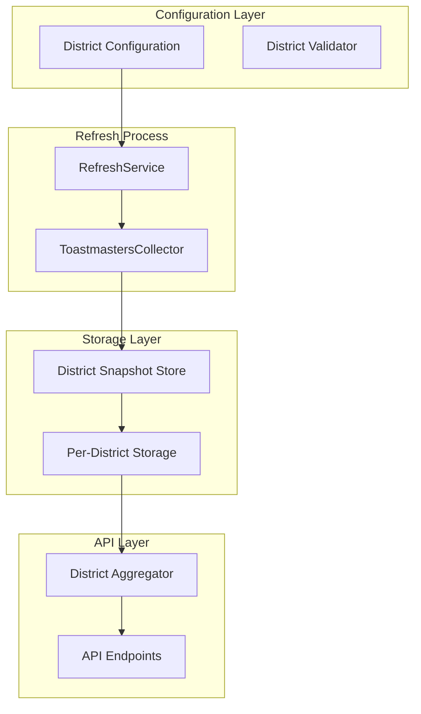

# Design Document

## Overview

The District-Scoped Data Collection feature transforms the current system from collecting all ~128 global districts to a configurable, selective approach. This design introduces administrator-controlled district selection, per-district snapshot storage, and performance optimizations that align with the production-maintenance steering document's emphasis on operational simplicity and low overhead.

## Architecture

### Current vs. New Architecture

**Current Architecture:**

```
Refresh → Scrape All 128 Districts → Single Large JSON → Snapshot
```

**New Architecture:**

```
Refresh → Scrape Configured Districts → Per-District JSON Files → Snapshot Directory
```

### High-Level Component Changes



## Components and Interfaces

### 1. District Configuration Service

**Purpose**: Manages the list of districts to collect data for

```typescript
interface DistrictConfigurationService {
  getConfiguredDistricts(): Promise<string[]>
  addDistrict(districtId: string): Promise<void>
  removeDistrict(districtId: string): Promise<void>
  validateDistrictId(districtId: string): Promise<boolean>
  getConfigurationHistory(): Promise<ConfigurationChange[]>
}

interface ConfigurationChange {
  timestamp: string
  action: 'add' | 'remove'
  districtId: string
  adminUser: string
}
```

**Storage**: Configuration stored in `config/districts.json`:

```json
{
  "configuredDistricts": ["42", "15", "F", "23"],
  "lastUpdated": "2024-01-04T12:00:00Z",
  "updatedBy": "admin",
  "version": 1
}
```

### 2. Enhanced RefreshService

**Purpose**: Modified to use configured districts instead of all districts

```typescript
interface EnhancedRefreshService {
  executeRefresh(): Promise<RefreshResult>
  executeRefreshForDistricts(districtIds: string[]): Promise<RefreshResult>
  validateConfiguration(): Promise<ConfigurationValidationResult>
}

interface ConfigurationValidationResult {
  isValid: boolean
  configuredDistricts: string[]
  validDistricts: string[]
  invalidDistricts: string[]
  warnings: string[]
}
```

**Key Changes:**

- Reads district configuration before starting refresh
- Only processes configured districts during detailed scraping
- Records per-district success/failure in metadata
- Creates partial snapshots when some districts fail

### 3. Per-District Snapshot Store

**Purpose**: Replaces single-file snapshots with directory-based storage

```typescript
interface PerDistrictSnapshotStore extends SnapshotStore {
  writeDistrictData(
    snapshotId: string,
    districtId: string,
    data: DistrictStatistics
  ): Promise<void>
  readDistrictData(
    snapshotId: string,
    districtId: string
  ): Promise<DistrictStatistics | null>
  listDistrictsInSnapshot(snapshotId: string): Promise<string[]>
  getSnapshotManifest(snapshotId: string): Promise<SnapshotManifest>
}

interface SnapshotManifest {
  snapshotId: string
  createdAt: string
  districts: DistrictManifestEntry[]
  metadata: SnapshotMetadata
}

interface DistrictManifestEntry {
  districtId: string
  fileName: string
  status: 'success' | 'failed'
  fileSize: number
  lastModified: string
}
```

### 4. District Data Aggregator

**Purpose**: Efficiently reads and combines per-district data for API responses

```typescript
interface DistrictDataAggregator {
  getDistrictData(
    snapshotId: string,
    districtId: string
  ): Promise<DistrictStatistics | null>
  getMultipleDistricts(
    snapshotId: string,
    districtIds: string[]
  ): Promise<DistrictStatistics[]>
  getAllDistricts(snapshotId: string): Promise<DistrictStatistics[]>
  getDistrictSummary(snapshotId: string): Promise<DistrictSummary[]>
}
```

### 5. Enhanced BackfillService

**Purpose**: Drives snapshot creation for missing historical data using per-district storage

```typescript
interface EnhancedBackfillService {
  initiateDistrictBackfill(request: DistrictBackfillRequest): Promise<string>
  getBackfillStatus(backfillId: string): DistrictBackfillResponse | null
  cancelBackfill(backfillId: string): Promise<boolean>

  // New snapshot integration methods
  createSnapshotFromBackfill(
    districtId: string,
    date: string,
    data: BackfillData
  ): Promise<string>
  integrateWithSnapshotStore(snapshotStore: PerDistrictSnapshotStore): void
}

interface BackfillData {
  districtPerformance: ScrapedRecord[]
  divisionPerformance: ScrapedRecord[]
  clubPerformance: ScrapedRecord[]
  sourceDataDate: string
}
```

**Key Changes for Snapshot Integration:**

- Replaces direct cache storage with snapshot creation
- Creates snapshot directories (not per-district directories) with individual district JSON files for each successful backfill date
- Integrates with PerDistrictSnapshotStore for consistent storage format
- Updates current snapshot pointer when backfilling more recent dates
- Includes backfill-specific metadata in snapshot records

```

## Data Models

### Snapshot Directory Structure

```

CACHE*DIR/
├── snapshots/
│ ├── 1704067200000/ # Snapshot directory
│ │ ├── metadata.json # Snapshot-level metadata
│ │ ├── manifest.json # List of district files
│ │ ├── district_42.json # District 42 data
│ │ ├── district_15.json # District 15 data
│ │ ├── district_F.json # District F data
│ │ └── district_23.json # District 23 data
│ └── 1704153600000/ # Another snapshot
│ ├── metadata.json
│ ├── manifest.json
│ └── district*\*.json
├── current.json # Points to latest successful snapshot
└── config/
└── districts.json # District configuration

````

### Per-District JSON Structure

```json
{
  "districtId": "42",
  "districtName": "District 42",
  "collectedAt": "2024-01-04T12:00:00Z",
  "status": "success",
  "membership": {
    /* membership stats */
  },
  "clubs": {
    /* club stats */
  },
  "education": {
    /* education stats */
  },
  "rawData": {
    "districtPerformance": [
      /* CSV records */
    ],
    "divisionPerformance": [
      /* CSV records */
    ],
    "clubPerformance": [
      /* CSV records */
    ]
  }
}
````

### Snapshot Metadata Structure

```json
{
  "snapshotId": "1704067200000",
  "createdAt": "2024-01-04T12:00:00Z",
  "schemaVersion": "2.0.0",
  "calculationVersion": "1.0.0",
  "status": "success",
  "configuredDistricts": ["42", "15", "F", "23"],
  "successfulDistricts": ["42", "15", "F"],
  "failedDistricts": ["23"],
  "errors": ["District 23: Network timeout during club performance fetch"],
  "processingDuration": 45000,
  "source": "toastmasters-dashboard",
  "dataAsOfDate": "2024-01-03"
}
```

## Correctness Properties

_A property is a characteristic or behavior that should hold true across all valid executions of a system-essentially, a formal statement about what the system should do. Properties serve as the bridge between human-readable specifications and machine-verifiable correctness guarantees._

After analyzing the acceptance criteria, the following properties emerge from the prework analysis. Several redundant properties have been consolidated to avoid duplication while maintaining comprehensive coverage.

### Property 1: District Configuration Persistence

_For any_ valid district configuration, storing the configuration and then restarting the system should preserve the exact same configuration.
**Validates: Requirements 1.5**

### Property 2: District ID Format Support

_For any_ district ID in either numeric format (e.g., "42") or alphabetic format (e.g., "F"), the configuration system should accept and store it correctly.
**Validates: Requirements 1.4**

### Property 3: Configuration Validation Enforcement

_For any_ refresh operation attempt, if no districts are configured, the system should reject the operation and require configuration first.
**Validates: Requirements 1.2, 9.5**

### Property 4: District ID Validation

_For any_ district ID being added to configuration, the system should validate it against the all-districts summary and correctly identify valid vs invalid IDs.
**Validates: Requirements 1.3, 10.1**

### Property 5: Selective Data Collection

_For any_ configured set of districts, when executing a refresh operation, the collector should fetch detailed data only for those districts and no others.
**Validates: Requirements 2.2**

### Property 6: Complete District Data Fetching

_For any_ configured district, the collector should fetch all three required CSV files: district performance, division performance, and club performance.
**Validates: Requirements 2.3**

### Property 7: Resilient Processing

_For any_ mix of valid and invalid configured districts, the system should process all valid districts and log warnings for invalid ones without stopping the overall operation.
**Validates: Requirements 2.4**

### Property 8: Success/Failure Tracking

_For any_ refresh operation, the system should record in snapshot metadata which districts succeeded and which failed with detailed error information.
**Validates: Requirements 2.5, 9.2**

### Property 9: Per-District Snapshot Structure

_For any_ snapshot creation, the system should create a directory structure with individual JSON files for each district following the naming pattern `district_{district_id}.json`.
**Validates: Requirements 3.1, 3.2, 6.1, 6.2**

### Property 10: Snapshot Metadata Completeness

_For any_ snapshot directory, it should contain both a `metadata.json` file with snapshot-level information and a `manifest.json` file listing all district files.
**Validates: Requirements 3.3, 6.4**

### Property 11: Data Aggregation Consistency

_For any_ API request requiring multiple districts, the system should aggregate only the requested per-district files and produce results equivalent to the original single-file format.
**Validates: Requirements 3.4**

### Property 13: Configuration Change Effects

_For any_ district added to or removed from configuration, subsequent refresh operations should include or exclude that district accordingly, while preserving historical data.
**Validates: Requirements 4.1, 4.2, 4.3, 4.4**

### Property 14: Configuration Change Logging

_For any_ district scope change, the system should generate clear log messages indicating what changed.
**Validates: Requirements 4.5**

### Property 15: Admin Interface Completeness

_For any_ district configuration operation (view, add, remove), the admin interface should provide corresponding endpoints that validate input and require proper authentication.
**Validates: Requirements 5.1, 5.2, 5.3, 5.4, 5.5**

### Property 16: Current Snapshot Pointer Maintenance

_For any_ successful snapshot creation, the system should update the `current.json` pointer file to reference the new snapshot.
**Validates: Requirements 6.5**

### Property 17: Selective File Access

_For any_ district-specific API request, the system should read only the relevant district file(s) from the snapshot, not all files.
**Validates: Requirements 7.1, 7.2**

### Property 18: File Access Caching

_For any_ district file accessed multiple times, subsequent accesses should be served from memory cache rather than disk.
**Validates: Requirements 7.3**

### Property 19: Performance Metrics Collection

_For any_ per-district file access, the system should record performance metrics for monitoring and analysis.
**Validates: Requirements 7.5**

### Property 20: New Snapshot Format Usage

_For any_ newly created snapshot, the system should use the per-district directory format.
**Validates: Requirements 8.2**

### Property 21: Partial Snapshot Creation

_For any_ refresh operation where some districts fail, the system should create a partial snapshot containing data for successful districts.
**Validates: Requirements 8.1**

### Property 22: Failure Recovery

_For any_ district that fails in one refresh operation, it should be retried in subsequent refresh operations.
**Validates: Requirements 8.4**

### Property 22: Status Visibility

_For any_ refresh operation, the system should provide clear visibility into which districts succeeded and failed.
**Validates: Requirements 8.5**

### Property 23: Invalid District Warnings

_For any_ configured district that doesn't exist in the Toastmasters system, the system should generate appropriate warnings.
**Validates: Requirements 9.2**

### Property 24: District ID Recommendations

_For any_ likely typo in district ID configuration, the system should provide reasonable suggestions for correction.
**Validates: Requirements 9.3**

### Property 25: Status Information Display

_For any_ configured district, the configuration interface should display the last successful data collection date.
**Validates: Requirements 9.4**

### Property 26: Backfill Snapshot Creation

_For any_ successful backfill operation for a specific date, the BackfillService should create a snapshot directory containing individual JSON files for each configured district.
**Validates: Requirements 10.1, 10.2**

### Property 27: Backfill Snapshot Store Integration

_For any_ backfill data fetched successfully, the BackfillService should use the PerDistrictSnapshotStore to write the data rather than direct cache storage.
**Validates: Requirements 10.3**

### Property 28: Backfill Current Pointer Updates

_For any_ successful backfill operation that creates a snapshot with a date more recent than the current snapshot, the system should update the current snapshot pointer.
**Validates: Requirements 10.4**

### Property 29: Backfill Metadata Completeness

_For any_ snapshot created by the BackfillService, the metadata should include backfill-specific information including source, processing details, and backfill job ID.
**Validates: Requirements 10.5**

### Property 30: Backfill Partial Snapshot Handling

_For any_ backfill operation where some districts fail, the BackfillService should create a partial snapshot containing successful districts and detailed error information for failed ones.
**Validates: Requirements 10.6**

### Property 31: Backfill District Scope Compliance

_For any_ backfill operation, the created snapshots should only include data for districts that are currently configured in the district scope.
**Validates: Requirements 10.7**

## Error Handling

### Configuration Errors

**Invalid District IDs**: When administrators attempt to configure non-existent district IDs, the system validates against the all-districts summary and provides clear error messages with suggestions for likely typos.

**Empty Configuration**: The system prevents refresh operations when no districts are configured, requiring explicit administrator action to set up the initial configuration.

**Authentication Failures**: Configuration changes require proper authentication. Unauthorized attempts are logged and rejected with appropriate HTTP status codes.

### Refresh Operation Errors

**Partial District Failures**: When some configured districts fail during data collection, the system creates a partial snapshot containing successful districts and records detailed error information for failed ones.

**Complete Refresh Failures**: When all configured districts fail, the system creates a failed snapshot with comprehensive error details while preserving the previous successful snapshot as current.

**Network and Timeout Errors**: Individual district failures due to network issues or timeouts are isolated and don't prevent processing of other districts.

### Storage Errors

**Disk Space Issues**: The system monitors available disk space and provides clear error messages when snapshot creation fails due to insufficient storage.

**File Access Errors**: When per-district files are corrupted or missing, the API layer provides meaningful error responses and falls back to alternative data sources when possible.

### API and Performance Errors

**File Access Errors**: When per-district files are corrupted or missing, the API layer provides meaningful error responses and falls back to alternative data sources when possible.

**Cache Failures**: Memory cache failures are handled gracefully with automatic fallback to disk-based file access.

**Aggregation Errors**: When combining per-district data fails, the system provides detailed error information about which districts caused issues.

## Testing Strategy

### Dual Testing Approach

The system employs both unit testing and property-based testing to ensure comprehensive coverage:

**Unit Tests**: Focus on specific examples, edge cases, and error conditions including:

- Configuration validation with known valid/invalid district IDs
- Snapshot directory structure creation
- API endpoint authentication and authorization
- Error handling scenarios with specific failure conditions

**Property-Based Tests**: Verify universal properties across all inputs including:

- Configuration persistence across system restarts (Property 1)
- District ID format support for both numeric and alphabetic formats (Property 2)
- Selective data collection respecting configured scope (Property 5)
- Per-district snapshot structure consistency (Property 9)

### Property-Based Testing Configuration

**Testing Framework**: Vitest with fast-check for property-based testing
**Test Iterations**: Minimum 100 iterations per property test to ensure comprehensive input coverage
**Test Tagging**: Each property test includes a comment referencing its design document property:

```typescript
// Feature: district-scoped-data-collection, Property 1: District Configuration Persistence
```

### Integration Testing Focus

**Database Integration**: Tests verify that district configuration persists correctly across database restarts and migrations.

**File System Integration**: Tests validate snapshot directory creation, per-district file storage, and file access patterns.

**API Integration**: Tests ensure that configuration endpoints work correctly with authentication and validation.

**Collector Integration**: Tests verify that the collector respects district configuration and handles partial failures appropriately.

### Performance Testing

**File Access Performance**: Tests measure and validate that district-specific API requests only access required files.

**Cache Effectiveness**: Tests verify that frequently accessed files are served from memory cache.

**Aggregation Performance**: Tests ensure that multi-district API responses perform efficiently with the per-district storage format.

### Error Scenario Testing

**Partial Failure Handling**: Tests simulate district failures and verify that partial snapshots are created correctly.

**Configuration Validation**: Tests verify that invalid district configurations are rejected with helpful error messages.

**Authentication Testing**: Tests ensure that configuration changes require proper authentication and authorization.

The testing strategy aligns with the production-maintenance steering document's emphasis on correctness and operational simplicity, focusing on protecting the system's core behaviors while maintaining confidence in long-term maintainability.
