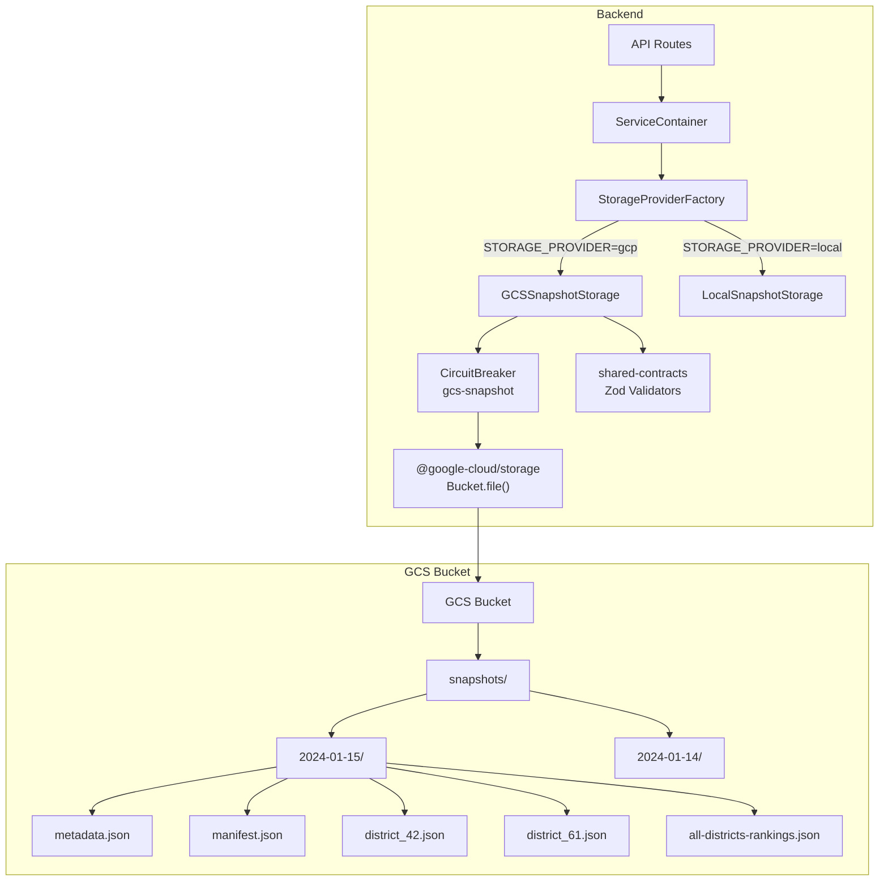

# Design Document: GCS Snapshot Storage

## Overview

GCSSnapshotStorage is a read-only implementation of the `ISnapshotStorage` interface that reads pre-computed snapshot data directly from a Google Cloud Storage bucket. It replaces `FirestoreSnapshotStorage` when `STORAGE_PROVIDER=gcp`, eliminating the Firestore dependency for snapshot reads.

The scraper-cli uploads snapshot files to GCS via `UploadService` using the path convention `{prefix}/{YYYY-MM-DD}/{filename}`. GCSSnapshotStorage reads these files using the `@google-cloud/storage` SDK, validates them against shared-contracts Zod schemas, and serves them through the existing `ISnapshotStorage` interface.

All write and delete operations throw `StorageOperationError` unconditionally — the backend is a read-only API server per the data-computation-separation principle.

Key design decisions:

- Uses `@google-cloud/storage` `Storage` and `Bucket` classes (same as `GCSRawCSVStorage`)
- Single `CircuitBreaker` instance scoped to `"gcs-snapshot"` for all operations
- Paginated prefix listings with delimiter `"/"` for efficient enumeration
- Zod schema validation on all data read from GCS
- Write-completion check via manifest's `writeComplete` flag before serving data
- Input validation (snapshot IDs, district IDs) before any GCS call
- Structured error classification (status code first, message patterns as fallback)

## Architecture



The `StorageProviderFactory` creates `GCSSnapshotStorage` when `STORAGE_PROVIDER=gcp`, passing `bucketName`, `projectId`, and an optional `prefix` (default: `"snapshots"`). This replaces the current `FirestoreSnapshotStorage` creation path for the `snapshotStorage` slot.

## Components and Interfaces

### GCSSnapshotStorageConfig

```typescript
interface GCSSnapshotStorageConfig {
  projectId: string
  bucketName: string
  prefix?: string // default: "snapshots"
  storage?: Storage // optional injected Storage instance for testing
}
```

The optional `storage` parameter enables test injection. In production, the constructor creates a `new Storage({ projectId })`. In tests, a mock `Storage` instance is passed directly. This avoids a separate factory or second constructor.

### GCSSnapshotStorage

Implements `ISnapshotStorage`. All methods are organized into these groups:

**Read operations** (delegate to GCS via circuit breaker):

- `getLatestSuccessful()` — paginated reverse-lexical prefix scan
- `getLatest()` — same scan without status filter
- `getSnapshot(snapshotId)` — assemble from metadata + manifest + district files
- `listSnapshots(limit?, filters?)` — paginated prefix scan with filtering
- `readDistrictData(snapshotId, districtId)` — single object read
- `listDistrictsInSnapshot(snapshotId)` — prefix listing with `district_` prefix
- `getSnapshotManifest(snapshotId)` — single object read
- `getSnapshotMetadata(snapshotId)` — single object read
- `readAllDistrictsRankings(snapshotId)` — single object read with writeComplete guard
- `hasAllDistrictsRankings(snapshotId)` — existence check via `file.exists()`
- `isSnapshotWriteComplete(snapshotId)` — read manifest, check `writeComplete` flag
- `isReady()` — bucket accessibility check

**Rejected operations** (throw immediately):

- `writeSnapshot()` — throws `StorageOperationError` (retryable: false)
- `writeDistrictData()` — throws `StorageOperationError` (retryable: false)
- `writeAllDistrictsRankings()` — throws `StorageOperationError` (retryable: false)
- `deleteSnapshot()` — throws `StorageOperationError` (retryable: false)

### Internal Helper Methods

```typescript
// Path construction
private buildObjectPath(snapshotId: string, filename: string): string
  // Returns: `${this.prefix}/${snapshotId}/${filename}`

// Validation
private validateSnapshotId(snapshotId: string): void
private validateDistrictId(districtId: string): void

// GCS operations (wrapped in circuit breaker)
private async readObject<T>(
  objectPath: string,
  schema: ZodSchema<T>,
  operation: string
): Promise<T | null>

private async checkObjectExists(
  objectPath: string,
  operation: string
): Promise<boolean>

// Paginated prefix iteration (async generator)
private async *iterateSnapshotPrefixes(): AsyncGenerator<string>
private async *iterateDistrictKeys(snapshotId: string): AsyncGenerator<string>

// Error classification (structured-first)
private classifyError(error: unknown): { retryable: boolean; is404: boolean }
```

### StorageProviderFactory Changes

The `createGCPProviders` method changes from creating `FirestoreSnapshotStorage` to creating `GCSSnapshotStorage`:

```typescript
// Before:
const snapshotStorage = new FirestoreSnapshotStorage({
  projectId: gcpConfig.projectId,
  collectionName,
})

// After:
const snapshotStorage = new GCSSnapshotStorage({
  projectId: gcpConfig.projectId,
  bucketName: gcpConfig.bucketName,
  prefix: 'snapshots',
})
```

### shared-contracts Schema Extension

The `SnapshotManifest` type and `SnapshotManifestSchema` need a `writeComplete` field. The scraper-cli sets this to `true` as the final step of a snapshot upload. GCSSnapshotStorage checks this flag to determine snapshot coherence.

```typescript
// Addition to SnapshotManifest type:
writeComplete?: boolean

// Addition to SnapshotManifestSchema:
writeComplete: z.boolean().optional()
```

This is an additive, backward-compatible change. Manifests without the field are treated as incomplete (no legacy exception per Requirement 9.3).

## Data Models

### GCS Object Path Convention

All paths follow the pattern established by the scraper-cli `UploadService`:

| File          | GCS Object Key                                      |
| ------------- | --------------------------------------------------- |
| Metadata      | `{prefix}/{snapshotId}/metadata.json`               |
| Manifest      | `{prefix}/{snapshotId}/manifest.json`               |
| District data | `{prefix}/{snapshotId}/district_{districtId}.json`  |
| Rankings      | `{prefix}/{snapshotId}/all-districts-rankings.json` |

Where `prefix` defaults to `"snapshots"` and `snapshotId` is a `YYYY-MM-DD` date string.

### Validation Schemas (from shared-contracts)

| File                          | Zod Schema                       | Validated Type             |
| ----------------------------- | -------------------------------- | -------------------------- |
| `metadata.json`               | `SnapshotMetadataFileSchema`     | `SnapshotMetadataFile`     |
| `manifest.json`               | `SnapshotManifestSchema`         | `SnapshotManifest`         |
| `district_{id}.json`          | `PerDistrictDataSchema`          | `PerDistrictData`          |
| `all-districts-rankings.json` | `AllDistrictsRankingsDataSchema` | `AllDistrictsRankingsData` |

All data read from GCS is typed as `unknown`, parsed with `JSON.parse`, then validated through the appropriate Zod schema before being returned to callers. Validation failures produce `StorageOperationError` with `retryable: false`.

### Snapshot ID Validation Rules

A valid Snapshot_ID must:

1. Match the regex `^\d{4}-\d{2}-\d{2}$`
2. Represent a valid calendar date (e.g., `2024-02-30` is rejected)
3. Not contain path traversal sequences (`../`, `..\\`)
4. Not contain unicode separators or percent-encoded characters (`%2F`, `%2E`)

Validation is performed via `validateSnapshotId()` before any GCS call.

### District ID Validation Rules

A valid district ID must:

1. Be a non-empty string
2. Match `^[A-Za-z0-9]+$` (alphanumeric only, matching `GCSRawCSVStorage` pattern)
3. Not contain whitespace or path traversal characters

### Error Classification (Structured-First)

The `@google-cloud/storage` SDK throws errors that may carry a numeric `code` or `statusCode` property (from the underlying HTTP response), or a string `code` (from gRPC/network layer). The classification strategy uses structured fields first, with message-pattern matching as a fallback only.

```typescript
private classifyError(error: unknown): { retryable: boolean; is404: boolean } {
  // 1. Check structured status code (highest priority)
  if (hasStatusCode(error)) {
    const code = getStatusCode(error)
    if (code === 404) return { retryable: false, is404: true }
    if ([408, 429, 500, 502, 503, 504].includes(code)) return { retryable: true, is404: false }
    if ([400, 401, 403].includes(code)) return { retryable: false, is404: false }
  }

  // 2. Check string error code (network-level errors)
  if (hasErrorCode(error)) {
    const code = getErrorCode(error)
    if (['ECONNRESET', 'ENOTFOUND', 'ECONNREFUSED', 'ETIMEDOUT'].includes(code)) {
      return { retryable: true, is404: false }
    }
  }

  // 3. Fallback: message pattern matching (lowest priority)
  if (error instanceof Error) {
    const msg = error.message.toLowerCase()
    if (msg.includes('not found') || msg.includes('no such object')) {
      return { retryable: false, is404: true }
    }
    const transientPatterns = ['network', 'timeout', 'unavailable', 'deadline', 'internal']
    if (transientPatterns.some(p => msg.includes(p))) {
      return { retryable: true, is404: false }
    }
    const permanentPatterns = ['permission denied', 'forbidden', 'invalid argument']
    if (permanentPatterns.some(p => msg.includes(p))) {
      return { retryable: false, is404: false }
    }
  }

  // 4. Unknown errors default to non-retryable
  return { retryable: false, is404: false }
}
```

Helper type guards for extracting structured error fields:

```typescript
function hasStatusCode(
  error: unknown
): error is { code: number } | { statusCode: number } {
  if (typeof error !== 'object' || error === null) return false
  const e = error as Record<string, unknown>
  return typeof e['code'] === 'number' || typeof e['statusCode'] === 'number'
}

function getStatusCode(error: unknown): number {
  const e = error as Record<string, unknown>
  return (
    typeof e['statusCode'] === 'number' ? e['statusCode'] : e['code']
  ) as number
}

function hasErrorCode(error: unknown): error is { code: string } {
  if (typeof error !== 'object' || error === null) return false
  return typeof (error as Record<string, unknown>)['code'] === 'string'
}

function getErrorCode(error: unknown): string {
  return (error as Record<string, unknown>)['code'] as string
}
```

### Circuit Breaker Configuration

The circuit breaker uses the `expectedErrors` predicate where `true` means "count this error toward the failure threshold" and `false` means "ignore this error" (per the codebase's `CircuitBreaker` implementation — see `onFailure()` which returns early when `expectedErrors` returns `false`).

```typescript
const circuitBreaker = new CircuitBreaker('gcs-snapshot', {
  failureThreshold: 5,
  recoveryTimeout: 60000, // 1 minute
  monitoringPeriod: 180000, // 3 minutes
  expectedErrors: (error: Error) => {
    const classification = classifyError(error)
    // 404s are expected (missing data) — do NOT count toward failure threshold
    if (classification.is404) return false
    // Transient infrastructure errors — count toward failure threshold
    if (classification.retryable) return true
    // Permanent errors (permission denied, validation) — don't count
    // (these won't self-heal by opening the circuit)
    return false
  },
})
```

Polarity summary:

- `expectedErrors(err) === true` → count toward failure threshold (transient infra errors)
- `expectedErrors(err) === false` → ignore (404s, permanent errors)

Only transient infrastructure errors (network, timeout, 5xx) count toward the threshold, because those are the errors that indicate GCS is unhealthy and where circuit-opening provides value. 404s and permanent errors (permission denied, bad argument) don't indicate infrastructure health issues.

### Key Algorithm: getLatestSuccessful

The design must reconcile two competing requirements:

1. Requirement 1.1: process prefixes incrementally in reverse lexical order, stop at first match
2. Requirement 10.1: avoid loading all results into memory

GCS `getFiles({ prefix, delimiter })` returns prefixes in lexical (ascending) order. To iterate in reverse without materializing all prefixes, we use a bounded approach:

```
Strategy: Materialize-and-sort with bounded expectation

Rationale: Snapshot count is bounded in practice (one per day, ~365/year,
~1000-2000 total over the system's lifetime). Full materialization of
prefix strings (not objects) is ~50KB for 2000 snapshots. This is
acceptable and avoids the complexity of reverse iteration hacks.

If snapshot count grows beyond 5000, consider adding a
latest-successful.json pointer object (written by scraper-cli)
as an O(1) fast path, with prefix scan as fallback.
```

```
Algorithm:
1. Collect all snapshot prefixes via paginated listing
   (async generator yields pages, collect into array)
2. Sort in reverse lexical order (newest first)
3. For each snapshotId:
   a. Read metadata.json → check status === "success"
   b. If not success, skip to next
   c. Read manifest.json → check writeComplete === true
   d. If not write-complete, skip to next
   e. Assemble full Snapshot object from district files
   f. Return assembled snapshot (stop iteration)
4. If no qualifying snapshot found, return null
```

The prefix listing itself is paginated (async generator with page tokens), but the collected prefix strings are materialized for sorting. This is the minimal materialization needed — only short strings, not object contents.

### Key Algorithm: getSnapshot (with single manifest read)

To avoid redundant manifest reads (issue #4 from review), the algorithm reads the manifest once and reuses it:

```
1. Validate snapshotId
2. Read manifest.json, validate → if null, return null
3. If manifest.writeComplete !== true, return null
4. Read metadata.json, validate → if null, return null
5. For each district in manifest.districts (where status === "success"):
   a. Read district_{id}.json, validate
   b. Adapt via adaptDistrictStatisticsFileToBackend()
6. Re-read manifest.json to confirm writeComplete still true
   (single re-read, not a full isSnapshotWriteComplete() call)
   → if changed to false or missing, return null
7. Assemble and return Snapshot object
```

This reduces manifest reads from 3 (in the original design) to 2 in the happy path. The post-read re-read is the minimum needed to detect concurrent scraper-cli overwrites.

### Key Algorithm: isSnapshotWriteComplete

```
1. Validate snapshotId
2. Read manifest.json at {prefix}/{snapshotId}/manifest.json
3. If manifest doesn't exist → return false
4. If manifest.writeComplete is not exactly true → return false
5. Return true
```

No legacy exception: missing `writeComplete` field means incomplete.

### Existence Checks

`hasAllDistrictsRankings()` and similar existence checks use `file.exists()` (which issues a HEAD/metadata request), not `file.download()`. This avoids downloading object content just to check existence, and keeps circuit breaker metrics clean.

```typescript
async hasAllDistrictsRankings(snapshotId: string): Promise<boolean> {
  this.validateSnapshotId(snapshotId)
  const objectPath = this.buildObjectPath(snapshotId, 'all-districts-rankings.json')
  return this.checkObjectExists(objectPath, 'hasAllDistrictsRankings')
}

private async checkObjectExists(objectPath: string, operation: string): Promise<boolean> {
  return this.circuitBreaker.execute(async () => {
    const file = this.bucket.file(objectPath)
    const [exists] = await file.exists()
    return exists
  }, { operation })
}
```

### Paginated Prefix Iteration (Async Generators)

To avoid materializing all GCS objects into memory, prefix listing and district key listing use async generators that yield results page-by-page:

```typescript
private async *iterateSnapshotPrefixes(): AsyncGenerator<string> {
  let pageToken: string | undefined
  const prefix = `${this.prefix}/`

  do {
    const [, , apiResponse] = await this.bucket.getFiles({
      prefix,
      delimiter: '/',
      maxResults: 100,
      pageToken,
      autoPaginate: false,
    })
    const prefixes: string[] = (apiResponse?.prefixes as string[]) ?? []
    for (const p of prefixes) {
      // Extract snapshotId from "snapshots/2024-01-15/" → "2024-01-15"
      const snapshotId = p.replace(prefix, '').replace(/\/$/, '')
      if (snapshotId) yield snapshotId
    }
    pageToken = apiResponse?.nextPageToken as string | undefined
  } while (pageToken)
}

private async *iterateDistrictKeys(snapshotId: string): AsyncGenerator<string> {
  let pageToken: string | undefined
  const prefix = `${this.prefix}/${snapshotId}/district_`

  do {
    const [files, , apiResponse] = await this.bucket.getFiles({
      prefix,
      maxResults: 100,
      pageToken,
      autoPaginate: false,
    })
    for (const file of files) {
      // Extract district ID from "snapshots/2024-01-15/district_42.json" → "42"
      const match = file.name.match(/district_([A-Za-z0-9]+)\.json$/)
      if (match?.[1]) yield match[1]
    }
    pageToken = apiResponse?.nextPageToken as string | undefined
  } while (pageToken)
}
```

For `getLatestSuccessful`, the snapshot prefixes are collected from the generator into an array for sorting (bounded materialization as discussed above). For `listDistrictsInSnapshot`, the generator yields district IDs incrementally.

### Metadata-to-PerDistrictSnapshotMetadata Mapping

The `SnapshotMetadataFile` from GCS needs to be mapped to the backend's `PerDistrictSnapshotMetadata` type:

```typescript
function mapMetadataFileToPerDistrictMetadata(
  file: SnapshotMetadataFile
): PerDistrictSnapshotMetadata {
  return {
    snapshotId: file.snapshotId,
    createdAt: file.createdAt,
    schemaVersion: file.schemaVersion,
    calculationVersion: file.calculationVersion,
    status: file.status,
    configuredDistricts: file.configuredDistricts,
    successfulDistricts: file.successfulDistricts,
    failedDistricts: file.failedDistricts,
    errors: file.errors,
    processingDuration: file.processingDuration,
    source: file.source,
    dataAsOfDate: file.dataAsOfDate,
    isClosingPeriodData: file.isClosingPeriodData,
    collectionDate: file.collectionDate,
    logicalDate: file.logicalDate,
  }
}
```

### Metadata-to-SnapshotMetadata Mapping (for listSnapshots)

The `errors` field in `SnapshotMetadataFile` is required by the Zod schema (`z.array(z.string())`), so `.length` is always safe. No defensive default needed.

```typescript
function mapMetadataFileToSnapshotMetadata(
  file: SnapshotMetadataFile,
  manifest: SnapshotManifest | null
): SnapshotMetadata {
  return {
    snapshot_id: file.snapshotId,
    created_at: file.createdAt,
    status: file.status,
    schema_version: file.schemaVersion,
    calculation_version: file.calculationVersion,
    size_bytes: 0, // Not tracked in GCS metadata files
    error_count: file.errors.length, // Safe: Zod schema guarantees errors is string[]
    district_count:
      manifest?.totalDistricts ??
      file.successfulDistricts.length + file.failedDistricts.length,
  }
}
```

## Correctness Properties

_A property is a characteristic or behavior that should hold true across all valid executions of a system — essentially, a formal statement about what the system should do. Properties serve as the bridge between human-readable specifications and machine-verifiable correctness guarantees._

Property 1: getLatestSuccessful returns the correct snapshot
_For any_ set of snapshot prefixes in a GCS bucket with varying metadata statuses and writeComplete flags, `getLatestSuccessful()` shall return the snapshot with the lexically greatest (most recent) ID whose metadata status is `"success"` and whose manifest `writeComplete` is `true`, or null if no such snapshot exists.
**Validates: Requirements 1.1, 9.5**

Property 2: getSnapshot assembles correctly with writeComplete guard
_For any_ valid snapshot ID where the manifest has `writeComplete === true` and all district files are present, `getSnapshot()` shall return a `Snapshot` object containing all districts listed in the manifest. If `writeComplete` is false on either the initial or post-read manifest check, `getSnapshot()` shall return null.
**Validates: Requirements 1.2, 9.4**

Property 3: Read operations construct correct paths and validate with Zod
_For any_ valid snapshot ID and file type (metadata, manifest, district, rankings), the GCS object path shall be `{prefix}/{snapshotId}/{filename}` and the returned data shall pass the corresponding shared-contracts Zod schema validation. Invalid data shall produce a `StorageOperationError` with `retryable: false`.
**Validates: Requirements 1.3, 1.4, 1.5, 4.4, 6.4**

Property 4: listDistrictsInSnapshot extracts correct district IDs
_For any_ set of GCS objects matching the prefix `{prefix}/{snapshotId}/district_`, the extracted district IDs shall exactly match the set of district file objects present under that snapshot prefix.
**Validates: Requirements 1.6**

Property 5: listSnapshots filters and sorts correctly
_For any_ set of snapshot prefixes with metadata and any combination of `SnapshotFilters`, `listSnapshots()` shall return only snapshots matching all filter criteria, sorted by snapshot ID in reverse lexical order (newest first), limited to the requested count.
**Validates: Requirements 1.7**

Property 6: Rankings read enforces writeComplete guard
_For any_ snapshot ID, `readAllDistrictsRankings()` shall return null when `isSnapshotWriteComplete()` returns false, regardless of whether the rankings file exists.
**Validates: Requirements 2.1, 2.4**

Property 7: All write and delete methods throw read-only error
_For any_ arguments passed to `writeSnapshot()`, `writeDistrictData()`, `writeAllDistrictsRankings()`, or `deleteSnapshot()`, the method shall throw a `StorageOperationError` with `provider: "gcs"` and `retryable: false`.
**Validates: Requirements 3.1, 3.2, 3.3, 3.4**

Property 8: 404 returns null without circuit breaker impact
_For any_ read operation where the GCS object does not exist (HTTP 404), the method shall return null without throwing, and the circuit breaker failure count shall not increase.
**Validates: Requirements 4.1, 5.2**

Property 9: Error classification sets retryable flag correctly
_For any_ GCS error with a structured status code, if the code is in {408, 429, 500, 502, 503, 504} or the string code is in {ECONNRESET, ENOTFOUND, ECONNREFUSED, ETIMEDOUT}, the resulting `StorageOperationError` shall have `retryable: true`. If the code is in {400, 401, 403} or matches permanent message patterns, `retryable` shall be `false`. Status code 404 shall be classified as `is404: true`. All errors shall have `provider: "gcs"`.
**Validates: Requirements 4.2, 4.3, 4.5**

Property 10: Input validation rejects invalid IDs before GCS calls
_For any_ snapshot ID that fails calendar date validation, contains path traversal sequences, unicode separators, or percent-encoded characters, or _for any_ district ID that is empty, contains whitespace, or contains path traversal characters, the operation shall throw `StorageOperationError` with `retryable: false` without making any GCS API call.
**Validates: Requirements 6.1, 6.2, 6.3, 4.6**

Property 11: isSnapshotWriteComplete checks manifest writeComplete flag
_For any_ snapshot ID, `isSnapshotWriteComplete()` shall return `true` only when the manifest exists and its `writeComplete` field is exactly `true`. Missing manifest or missing/false `writeComplete` field shall return `false`.
**Validates: Requirements 9.1, 9.2, 9.3**

## Error Handling

### Error Wrapping Strategy

All errors thrown by GCSSnapshotStorage are `StorageOperationError` instances with:

- `provider`: always `"gcs"`
- `operation`: the method name that failed (e.g., `"readDistrictData"`, `"getLatestSuccessful"`)
- `retryable`: based on structured error classification (status code first, message fallback)
- `cause`: the original error from `@google-cloud/storage` or Zod

### Error Scenarios

| Scenario                      | Behavior                      | retryable      |
| ----------------------------- | ----------------------------- | -------------- |
| Object not found (404)        | Return `null`                 | N/A (no throw) |
| Network timeout / ECONNRESET  | Throw `StorageOperationError` | `true`         |
| HTTP 429 / 500 / 502 / 503    | Throw `StorageOperationError` | `true`         |
| Permission denied / 401 / 403 | Throw `StorageOperationError` | `false`        |
| Zod validation failure        | Throw `StorageOperationError` | `false`        |
| Invalid snapshot ID           | Throw `StorageOperationError` | `false`        |
| Invalid district ID           | Throw `StorageOperationError` | `false`        |
| Circuit breaker open          | Throw `StorageOperationError` | `true`         |
| JSON parse failure            | Throw `StorageOperationError` | `false`        |
| Write/delete method called    | Throw `StorageOperationError` | `false`        |

### Circuit Breaker Behavior

- 404s do NOT count toward failure threshold (expected for missing data)
- Permanent errors (permission denied, validation) do NOT count (circuit-opening won't help)
- Only transient infrastructure errors (network, timeout, 5xx) count toward threshold
- After 5 transient failures within 3 minutes, circuit opens
- Open circuit: all operations fail fast with `retryable: true`
- After 1 minute recovery timeout, circuit enters half-open state
- One successful request closes the circuit

## Testing Strategy

### PBT Decision Framework (per testing steering document)

Before defaulting to property-based tests, each correctness property is evaluated against the steering document's decision framework:

1. Does a clear universal property exist? → If not, use unit tests.
2. Would 5 well-chosen examples provide equivalent confidence? → If yes, prefer examples.
3. Is the input space genuinely complex? → If inputs are simple/bounded, examples suffice.
4. Does the logic have mathematical/algebraic properties? → If no, PBT adds complexity without value.

Most GCSSnapshotStorage methods are straightforward read-validate-return operations against a mock GCS client. The interesting complexity lies in input validation (complex input space with many edge cases) and error classification (many error patterns to classify correctly). The read operations themselves are integration glue code — they read, parse, validate, and return — where well-chosen examples provide better confidence than random generation.

### Property-Based Tests (warranted)

Use `fast-check` (already in the project's dependencies). Minimum 100 iterations per test.

**Property 9: Error classification** — The input space of error objects is genuinely complex: numeric status codes, string error codes, message patterns, and combinations thereof. Generating random error objects with known structured fields and verifying the classification output is a natural fit for PBT.

- Tag: `Feature: gcs-snapshot-storage, Property 9: Error classification sets retryable flag correctly`

**Property 10: Input validation** — Snapshot IDs and district IDs have complex validation rules (calendar date validity, path traversal, unicode, percent-encoding). The input space is large and edge-case-rich. PBT with generators for invalid inputs catches cases that hand-picked examples miss.

- Tag: `Feature: gcs-snapshot-storage, Property 10: Input validation rejects invalid IDs before GCS calls`

### Unit Tests (preferred for remaining properties)

The remaining correctness properties are best validated with well-chosen examples. These are read-validate-return operations where the logic is straightforward and 3-5 examples per behavior provide full confidence:

- **Property 1** (getLatestSuccessful): Test with 3 scenarios — all success/write-complete, mixed statuses, no qualifying snapshots
- **Property 2** (getSnapshot assembly): Test with known district list, verify all districts present; test writeComplete guard with before/after change
- **Property 3** (path construction + Zod validation): Test each file type path; test with invalid JSON; test with schema-violating data
- **Property 4** (listDistrictsInSnapshot): Test with known set of district files, verify extracted IDs match
- **Property 5** (listSnapshots filtering): Test with specific filter combinations — status filter, date range, limit
- **Property 6** (rankings writeComplete guard): Test rankings read when write-complete vs not
- **Property 7** (write/delete rejection): Test each of the 4 methods throws correctly — only 4 cases, no need for PBT
- **Property 8** (404 → null): Test each read method with 404 response, verify null return and circuit breaker state
- **Property 11** (isSnapshotWriteComplete): Test with manifest present/absent, writeComplete true/false/missing

### Integration Points

- `StorageProviderFactory` creates `GCSSnapshotStorage` when `STORAGE_PROVIDER=gcp`
- `adaptDistrictStatisticsFileToBackend()` adapter converts `PerDistrictData` to `DistrictStatistics`
- shared-contracts Zod schemas validate all GCS data
- `CircuitBreaker` wraps all GCS operations

### Test Configuration

- Property-based tests: `fast-check` with `{ numRuns: 100 }`
- Tag format: `Feature: gcs-snapshot-storage, Property {N}: {title}`
- Mock GCS client via constructor injection (`storage?: Storage` parameter)
- Tests must be isolated and concurrent-safe per testing steering document
- All tests use unique resources and clean up in afterEach hooks
