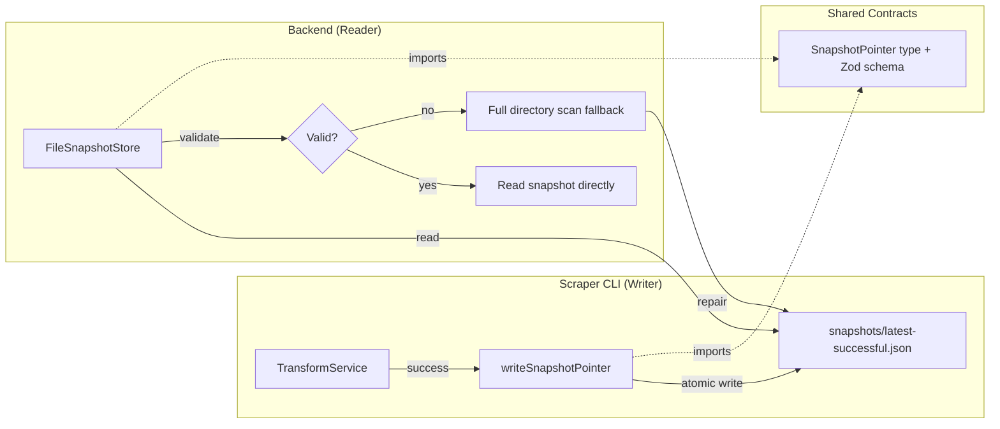

# Design Document: Latest Snapshot Pointer

## Overview

The backend's cold-start performance is bottlenecked by a full directory scan of ~4,330 snapshot directories to find the latest successful snapshot. This takes ~2.5 minutes, during which the frontend hangs.

The solution introduces a `latest-successful.json` pointer file in the `snapshots/` directory. The scraper-cli pipeline writes this file atomically after each successful transform. The backend reads it on startup to resolve the latest snapshot in O(1) instead of O(n). If the pointer is missing or invalid, the backend falls back to the existing directory scan.

A JSON file is chosen over a symlink for cross-platform compatibility (Windows support) and because it can carry metadata (timestamp, schema version) that aids validation.

## Architecture



The pointer file sits at the boundary between the two processes. The shared-contracts package owns the type and validation schema, following the existing pattern for all pre-computed file formats.

## Components and Interfaces

### 1. Shared Contracts: Snapshot Pointer Type and Schema

**Package:** `packages/shared-contracts/`

New type and Zod schema following the existing pattern (e.g., `SnapshotMetadataFile` / `SnapshotMetadataFileSchema`).

```typescript
// packages/shared-contracts/src/types/snapshot-pointer.ts
export interface SnapshotPointer {
  /** Snapshot ID (date in YYYY-MM-DD format) */
  snapshotId: string
  /** ISO timestamp when the pointer was last updated */
  updatedAt: string
  /** Schema version of the referenced snapshot */
  schemaVersion: string
}
```

```typescript
// packages/shared-contracts/src/schemas/snapshot-pointer.schema.ts
import { z } from 'zod'

export const SnapshotPointerSchema = z.object({
  snapshotId: z.string().regex(/^\d{4}-\d{2}-\d{2}$/),
  updatedAt: z.string().datetime(),
  schemaVersion: z.string(),
})
```

```typescript
// packages/shared-contracts/src/validation/validators.ts (addition)
export function validateSnapshotPointer(
  data: unknown
): ValidationResult<SnapshotPointer> {
  const result = SnapshotPointerSchema.safeParse(data)
  if (result.success) {
    return { success: true, data: result.data }
  }
  return {
    success: false,
    error: `SnapshotPointer validation failed: ${result.error.message}`,
  }
}
```

### 2. Scraper CLI: Pointer Writer

**Package:** `packages/scraper-cli/`

A new function in `TransformService` that writes the pointer file after a successful transform.

```typescript
// Added to TransformService
private async writeSnapshotPointer(snapshotDate: string): Promise<void> {
  const pointer: SnapshotPointer = {
    snapshotId: snapshotDate,
    updatedAt: new Date().toISOString(),
    schemaVersion: SCHEMA_VERSION,
  }

  // Validate before writing
  const validation = validateSnapshotPointer(pointer)
  if (!validation.success) {
    throw new Error(`Invalid snapshot pointer: ${validation.error}`)
  }

  const pointerPath = path.join(this.cacheDir, 'snapshots', 'latest-successful.json')
  const tempPath = `${pointerPath}.tmp.${Date.now()}`

  await fs.writeFile(tempPath, JSON.stringify(validation.data, null, 2), 'utf-8')
  await fs.rename(tempPath, pointerPath)
}
```

This is called at the end of `TransformService.transform()` only when the overall status is `"success"` (no failed districts).

**Concurrency guard:** The pointer should only be updated if the new snapshot date is chronologically >= the current pointer's snapshot date. This prevents a slower-running older transform from overwriting a newer pointer.

```typescript
private async writeSnapshotPointer(snapshotDate: string): Promise<void> {
  // Read existing pointer to check if we should update
  const pointerPath = path.join(this.cacheDir, 'snapshots', 'latest-successful.json')
  try {
    const existing = JSON.parse(await fs.readFile(pointerPath, 'utf-8'))
    const validation = validateSnapshotPointer(existing)
    if (validation.success && validation.data.snapshotId > snapshotDate) {
      // Existing pointer is newer, don't overwrite
      return
    }
  } catch {
    // No existing pointer or invalid - proceed with write
  }

  const pointer: SnapshotPointer = {
    snapshotId: snapshotDate,
    updatedAt: new Date().toISOString(),
    schemaVersion: SCHEMA_VERSION,
  }

  const validated = validateSnapshotPointer(pointer)
  if (!validated.success) {
    throw new Error(`Invalid snapshot pointer: ${validated.error}`)
  }

  const tempPath = `${pointerPath}.tmp.${Date.now()}`
  await fs.writeFile(tempPath, JSON.stringify(validated.data, null, 2), 'utf-8')
  await fs.rename(tempPath, pointerPath)
}
```

### 3. Backend: Pointer Reader in FileSnapshotStore

**Package:** `backend/`

Modify `findLatestSuccessfulByScanning()` to first attempt reading the pointer file. The method becomes a two-phase approach:

```typescript
// Phase 1: Try pointer file (O(1))
private async findLatestSuccessfulViaPointer(): Promise<Snapshot | null> {
  const pointerPath = path.join(this.snapshotsDir, 'latest-successful.json')

  try {
    const raw = await fs.readFile(pointerPath, 'utf-8')
    const parsed: unknown = JSON.parse(raw)
    const validation = validateSnapshotPointer(parsed)

    if (!validation.success) {
      logger.warn('Invalid snapshot pointer file', { error: validation.error })
      return null
    }

    const { snapshotId } = validation.data
    const snapshot = await this.readSnapshotFromDirectory(snapshotId)

    if (snapshot && snapshot.status === 'success') {
      return snapshot
    }

    logger.warn('Snapshot pointer references non-success snapshot', {
      snapshotId,
      status: snapshot?.status,
    })
    return null
  } catch (error: unknown) {
    const fsError = error as { code?: string }
    if (fsError.code === 'ENOENT') {
      logger.warn('Snapshot pointer file not found, will fall back to scan')
    } else {
      logger.error('Failed to read snapshot pointer', {
        error: error instanceof Error ? error.message : 'Unknown error',
      })
    }
    return null
  }
}
```

The existing `findLatestSuccessfulByScanning()` is then wrapped:

```typescript
private async findLatestSuccessful(): Promise<Snapshot | null> {
  // Phase 1: Try pointer (fast path)
  const viaPointer = await this.findLatestSuccessfulViaPointer()
  if (viaPointer) {
    return viaPointer
  }

  // Phase 2: Fall back to directory scan (slow path)
  const viaScanning = await this.findLatestSuccessfulByScanning()

  // Repair: Write pointer for future fast starts
  if (viaScanning) {
    await this.repairSnapshotPointer(viaScanning.snapshot_id)
  }

  return viaScanning
}
```

The repair function writes the pointer from the backend side when the fallback scan succeeds, so subsequent cold starts are fast even before the updated scraper-cli runs:

```typescript
private async repairSnapshotPointer(snapshotId: string): Promise<void> {
  try {
    const pointer: SnapshotPointer = {
      snapshotId,
      updatedAt: new Date().toISOString(),
      schemaVersion: SCHEMA_VERSION,
    }
    const validated = validateSnapshotPointer(pointer)
    if (!validated.success) return

    const pointerPath = path.join(this.snapshotsDir, 'latest-successful.json')
    const tempPath = `${pointerPath}.tmp.${Date.now()}`
    await fs.writeFile(tempPath, JSON.stringify(validated.data, null, 2), 'utf-8')
    await fs.rename(tempPath, pointerPath)

    logger.info('Repaired snapshot pointer after fallback scan', { snapshotId })
  } catch (error) {
    // Non-fatal: log and continue
    logger.warn('Failed to repair snapshot pointer', {
      error: error instanceof Error ? error.message : 'Unknown error',
    })
  }
}
```

**Note on architectural boundary:** The backend writing the pointer file during fallback repair is a narrow exception to the "backend is read-only" rule. This is justified because:
1. It's a cache/index repair, not data computation
2. It only happens on the fallback path (pointer missing/broken)
3. It prevents repeated slow scans
4. The data written is derived from what was just read, not computed

## Data Models

### Snapshot Pointer File

**Location:** `snapshots/latest-successful.json`

```json
{
  "snapshotId": "2026-02-06",
  "updatedAt": "2026-02-06T14:30:00.000Z",
  "schemaVersion": "1.0.0"
}
```

| Field | Type | Description |
|-------|------|-------------|
| `snapshotId` | `string` | Date-formatted snapshot ID (YYYY-MM-DD) |
| `updatedAt` | `string` | ISO 8601 timestamp of last pointer update |
| `schemaVersion` | `string` | Schema version of the referenced snapshot |

The file is intentionally minimal. It contains only what's needed to locate and validate the referenced snapshot.

### File System Layout (unchanged except for new file)

```
snapshots/
├── latest-successful.json    ← NEW
├── 2026-02-06/
│   ├── metadata.json
│   ├── manifest.json
│   ├── district_1.json
│   ├── ...
│   └── all-districts-rankings.json
├── 2026-02-05/
│   └── ...
└── ... (4,330 directories)
```

## Correctness Properties

*A property is a characteristic or behavior that should hold true across all valid executions of a system — essentially, a formal statement about what the system should do. Properties serve as the bridge between human-readable specifications and machine-verifiable correctness guarantees.*

Per the testing steering document, property tests are reserved for cases where the input space is genuinely complex or mathematical invariants exist. Most acceptance criteria in this feature have bounded, well-understood inputs where 3-5 well-chosen unit test examples provide equivalent confidence. Only two properties warrant property-based testing:

### Property 1: Chronological ordering of pointer updates

*For any* two valid snapshot dates A and B, regardless of the order in which `writeSnapshotPointer` is called, the resulting pointer file SHALL contain the chronologically later date.

This has a genuinely complex input space (arbitrary date pairs in any order) where string comparison edge cases and off-by-one errors are non-obvious.

**Validates: Requirements 1.5**

### Property 2: Snapshot pointer schema round-trip

*For any* valid `SnapshotPointer` object, serializing to JSON and parsing back through the Zod schema SHALL produce an equivalent object.

This is a serialization round-trip — exactly the pattern where property tests excel at catching encoding/decoding mismatches.

**Validates: Requirements 4.2**

### Unit Test Coverage (examples, not properties)

The remaining acceptance criteria are best covered by unit tests with well-chosen examples, as their input spaces are bounded and specific:

- **Successful transform writes valid pointer** (Requirements 1.1, 1.4): Verify pointer file content after a successful transform with a known date.
- **Non-success transform preserves pointer** (Requirements 1.2): Verify pointer unchanged after partial and failed transforms.
- **Fast path returns correct snapshot** (Requirements 2.1): Set up pointer + snapshot directory, verify correct snapshot returned.
- **Invalid pointer triggers fallback** (Requirements 2.3, 2.4, 3.1, 3.2): Test each failure mode: missing file, invalid JSON, missing directory, non-success status.
- **Fallback repairs pointer** (Requirements 3.4): Verify pointer file written after fallback scan succeeds.
- **Pointer write is additive** (Requirements 5.2, 5.3): Verify no existing files modified after pointer write.

## Error Handling

| Scenario | Component | Behavior |
|----------|-----------|----------|
| Pointer file missing (ENOENT) | Backend | Log warning, fall back to directory scan |
| Pointer file invalid JSON | Backend | Log warning, fall back to directory scan |
| Pointer file fails Zod validation | Backend | Log warning with validation error, fall back to directory scan |
| Pointer references missing directory | Backend | Log warning, fall back to directory scan |
| Pointer references non-success snapshot | Backend | Log warning with snapshot status, fall back to directory scan |
| Fallback scan finds no successful snapshot | Backend | Return null (existing behavior unchanged) |
| Pointer repair fails after fallback | Backend | Log warning, continue (non-fatal) |
| Pointer write fails in scraper-cli | Scraper CLI | Log error, do not fail the transform operation (pointer is an optimization, not critical) |
| Concurrent pointer writes | Scraper CLI | Read-compare-write with date comparison; later date always wins |

All error handling follows the principle that the pointer is an optimization. Its absence or corruption must never prevent the system from functioning — it only affects cold-start performance.

## Testing Strategy

### Approach

Per the testing steering document: "Prefer the simplest test that provides confidence" and "Property tests are for invariants, not for everything." This feature has a small, well-bounded input space (date strings, JSON files). Most acceptance criteria are best served by unit tests with well-chosen examples. Only two properties have genuinely complex input spaces warranting property-based testing.

### Property-Based Testing

**Library:** fast-check (via vitest)

Each property test runs a minimum of 100 iterations. Tests are tagged with their design property reference.

- **Property 1: Chronological ordering** — Generator produces arbitrary pairs of YYYY-MM-DD date strings. Verifies the pointer always contains the later date regardless of write order.
  - Tag: `Feature: latest-snapshot-symlink, Property 1: Chronological ordering of pointer updates`
- **Property 2: Schema round-trip** — Generator produces arbitrary valid `SnapshotPointer` objects. Verifies `JSON.parse(JSON.stringify(pointer))` passes Zod validation and equals the original.
  - Tag: `Feature: latest-snapshot-symlink, Property 2: Snapshot pointer schema round-trip`

### Unit Testing

Unit tests cover specific examples and edge cases:
- Successful transform writes pointer with correct fields (Requirements 1.1, 1.4)
- Partial/failed transform leaves pointer unchanged (Requirement 1.2)
- Atomic write leaves no `.tmp` files behind (Requirement 1.3)
- Fast path reads pointer and returns correct snapshot (Requirement 2.1)
- Missing pointer file triggers fallback scan (Requirement 3.1)
- Invalid JSON in pointer triggers fallback scan (Requirement 3.2)
- Filesystem error on pointer read triggers fallback scan (Requirement 3.3)
- Pointer referencing non-existent directory triggers fallback (Requirement 2.4)
- Pointer referencing non-success snapshot triggers fallback (Requirement 2.3)
- Fallback scan repairs pointer file (Requirement 3.4)
- Pointer write doesn't modify existing snapshot files (Requirements 5.2, 5.3)
- Backend works correctly with no pointer file (Requirement 5.1)

### Test Isolation

Per the testing steering document:
- Each test uses a unique temporary directory for the snapshot cache
- All directories are cleaned up in `afterEach` hooks
- No shared state between tests
- Tests are safe for parallel execution with `vitest --run`
