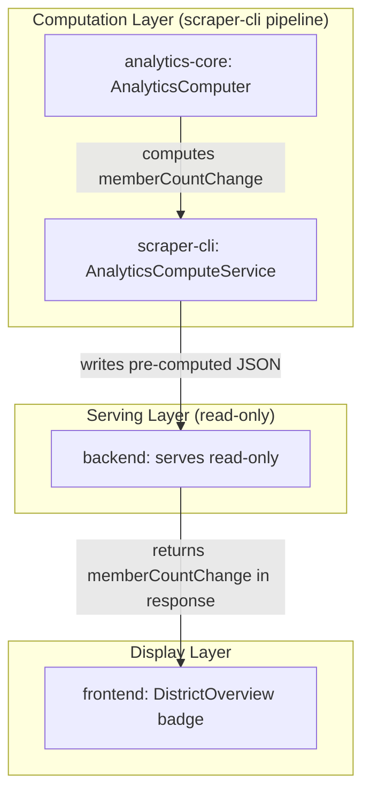

# Design Document: Membership Payments Change Badge Fix

## Overview

This design addresses two distinct bugs on the Membership Payments card change badge.

**Bug 1 (Resolved):** The badge always showed "+0 members" because `calculateMembershipChangeWithBase()` silently failed to find the district in rankings data and fell back to `calculateMembershipChange()`, which returns 0 for a single snapshot. This was fixed by adding normalized districtId lookup, diagnostic logging, and a meaningful snapshot-based fallback.

**Bug 2 (Current):** The badge displays a payment-based change value (`totalPayments - paymentBase`) but labels it "members". In Toastmasters, payments and members are different metrics. The badge should show the change in actual member count (`totalMembership`), not payment change.

The fix introduces a new `memberCountChange` field that flows through the full pre-computed analytics pipeline: `analytics-core` computes it → `scraper-cli` writes it to pre-computed files → backend serves it → frontend displays it. The existing `membershipChange` field (payment-based) is preserved for backward compatibility.

## Architecture

The fix spans four layers, following the data-computation-separation architecture:



The computation is straightforward: `memberCountChange = getTotalMembership(lastSnapshot) - getTotalMembership(firstSnapshot)`. This reuses the existing `MembershipAnalyticsModule.calculateMembershipChange()` method, which already does exactly this but was not wired into the `DistrictAnalytics` output.

## Components and Interfaces

### Modified: `DistrictAnalytics` interface (analytics-core `types.ts`)

Add `memberCountChange` field:

```typescript
interface DistrictAnalytics {
  // ... existing fields ...
  membershipChange: number    // payment-based change (existing, preserved)
  memberCountChange: number   // actual member count change (new)
  // ... rest of fields ...
}
```

### Modified: `AnalyticsComputer.computeDistrictAnalytics()`

After computing `membershipChange` (payment-based), also compute `memberCountChange`:

```typescript
// Existing: payment-based change
const membershipChange = this.calculateMembershipChangeWithBase(
  sortedSnapshots, options?.allDistrictsRankings, districtId
)

// New: actual member count change
const memberCountChange = this.membershipModule.calculateMembershipChange(sortedSnapshots)
```

This reuses `MembershipAnalyticsModule.calculateMembershipChange()` which computes `getTotalMembership(last) - getTotalMembership(first)`. For a single snapshot it returns 0, which is correct (no baseline to compare against).

### Modified: `DistrictAnalytics` interface (backend `types/analytics.ts`)

Add `memberCountChange` field to match analytics-core.

### Modified: `PreComputedAnalyticsSummary` interface (backend `types/precomputedAnalytics.ts`)

Add `memberCountChange` field:

```typescript
interface PreComputedAnalyticsSummary {
  // ... existing fields ...
  membershipChange: number     // payment-based (existing)
  memberCountChange: number    // actual member count change (new)
  // ...
}
```

### Modified: `AggregatedAnalyticsResponse` (backend `routes/districts/analyticsSummary.ts`)

Add `memberCountChange` to the summary section of the response:

```typescript
summary: {
  totalMembership: summary.totalMembership,
  membershipChange: summary.membershipChange,
  memberCountChange: summary.memberCountChange ?? 0,  // new
  // ...
}
```

### Modified: `AnalyticsSummary` interface (frontend `hooks/useAggregatedAnalytics.ts`)

Add `memberCountChange` field:

```typescript
interface AnalyticsSummary {
  totalMembership: number
  membershipChange: number
  memberCountChange: number  // new
  // ...
}
```

### Modified: `DistrictAnalytics` interface (frontend `hooks/useDistrictAnalytics.ts`)

Add `memberCountChange` field.

### Modified: `DistrictOverview` component (frontend `components/DistrictOverview.tsx`)

Change the badge to use `memberCountChange` instead of `membershipChange`:

```tsx
<span className={`text-xs px-2 py-1 rounded ${
  (analytics.memberCountChange ?? analytics.membershipChange) >= 0
    ? 'text-green-700 bg-green-100'
    : 'text-red-700 bg-red-100'
}`}>
  {(analytics.memberCountChange ?? analytics.membershipChange) >= 0 ? '+' : ''}
  {analytics.memberCountChange ?? analytics.membershipChange} members
</span>
```

The fallback to `membershipChange` handles backward compatibility with pre-computed files that haven't been regenerated yet.

### Modified: `convertToAggregatedFormat` (frontend `hooks/useAggregatedAnalytics.ts`)

Map `memberCountChange` through the conversion:

```typescript
summary: {
  totalMembership: analytics.totalMembership,
  membershipChange: analytics.membershipChange,
  memberCountChange: analytics.memberCountChange ?? 0,
  // ...
}
```

## Data Models

### New field additions (no schema changes, just field additions)

| Layer | Type | Field | Type | Description |
|-------|------|-------|------|-------------|
| analytics-core | `DistrictAnalytics` | `memberCountChange` | `number` | Actual member count change |
| backend | `DistrictAnalytics` | `memberCountChange` | `number` | Actual member count change |
| backend | `PreComputedAnalyticsSummary` | `memberCountChange` | `number` | Actual member count change |
| backend | `AggregatedAnalyticsResponse.summary` | `memberCountChange` | `number` | Actual member count change |
| frontend | `DistrictAnalytics` | `memberCountChange` | `number` | Actual member count change |
| frontend | `AnalyticsSummary` | `memberCountChange` | `number` | Actual member count change |

The existing `membershipChange` field is preserved in all types for backward compatibility.


## Correctness Properties

*A property is a characteristic or behavior that should hold true across all valid executions of a system — essentially, a formal statement about what the system should do. Properties serve as the bridge between human-readable specifications and machine-verifiable correctness guarantees.*

### Existing Properties (from Bug 1 fix — Requirements 1–3)

These properties were validated by the completed Bug 1 work and remain in effect:

**Property 1: Rankings-based payment change calculation**
*For any* district and any All_Districts_Rankings data where the district has a matching entry with valid `paymentBase` and `totalPayments`, `calculateMembershipChangeWithBase` should return `totalPayments - paymentBase`.
**Validates: Requirements 2.1**

**Property 2: Normalized districtId lookup finds format variants**
*For any* districtId string and any rankings entry whose numeric portion matches, the normalized lookup should find the ranking entry regardless of prefix formatting (e.g., "D42" matches "42", "42" matches "D42").
**Validates: Requirements 2.2**

**Property 3: Snapshot-based fallback uses membershipBase**
*For any* single snapshot with no available rankings data, `calculateMembershipChangeWithBase` should return `sum(club.paymentsCount) - sum(club.membershipBase)` across all clubs in the snapshot.
**Validates: Requirements 2.3**

### New Properties (Bug 2 fix — Requirements 4–6)

No new property-based tests are warranted for Bug 2. Per the testing steering document's decision framework:

1. The calculation (`getTotalMembership(last) - getTotalMembership(first)`) is a straightforward subtraction of two sums
2. 3-5 well-chosen unit test examples fully cover the behavior (two snapshots, single snapshot, empty snapshots, large membership counts)
3. The input space is not genuinely complex — it's bounded and predictable
4. A property test would essentially restate the implementation (`sum(last.clubs.membershipCount) - sum(first.clubs.membershipCount)`)

The existing Bug 1 properties (1–3) remain valid and cover the more complex payment-based calculation with its multiple fallback paths. The new `memberCountChange` field reuses `calculateMembershipChange()` which is already a simple, well-understood method.

## Error Handling

- If `snapshots` array is empty: `memberCountChange` is 0 (no data to compare)
- If `snapshots` has one element: `memberCountChange` is 0 (no baseline to compare against)
- If `memberCountChange` is missing from pre-computed data (old files): frontend falls back to `membershipChange` for display, backend defaults to 0 via `?? 0`
- No new error paths are introduced — the computation reuses the existing `calculateMembershipChange()` method which handles all edge cases

## Testing Strategy

### Unit Tests

Specific example tests for the new `memberCountChange` field:

1. `computeDistrictAnalytics` with two snapshots returns correct `memberCountChange` (difference in total membership)
2. `computeDistrictAnalytics` with single snapshot returns `memberCountChange` of 0
3. `computeDistrictAnalytics` preserves existing `membershipChange` (payment-based) alongside new `memberCountChange`
4. Frontend `DistrictOverview` badge renders `memberCountChange` value with "members" label
5. Frontend `DistrictOverview` badge falls back to `membershipChange` when `memberCountChange` is undefined (backward compatibility)

### Property-Based Tests

No new property-based tests for Bug 2. The existing Bug 1 properties (1–3) using `fast-check` remain in place. The new `memberCountChange` calculation is a simple subtraction that is fully covered by the unit test examples above — a property test would just restate the implementation without providing additional confidence (per testing steering document §7.2.4 and §7.3.2).

### Testing Approach Notes

Per the testing steering document: "Prefer the simplest test that provides confidence" and "When in doubt, write unit tests with good examples." The `calculateMembershipChange` method is a straightforward difference of two sums — 3-5 well-chosen examples provide full confidence. Property tests are reserved for the more complex payment-based calculation paths (Bug 1) where multiple fallback strategies and normalization logic create a genuinely complex input space.
