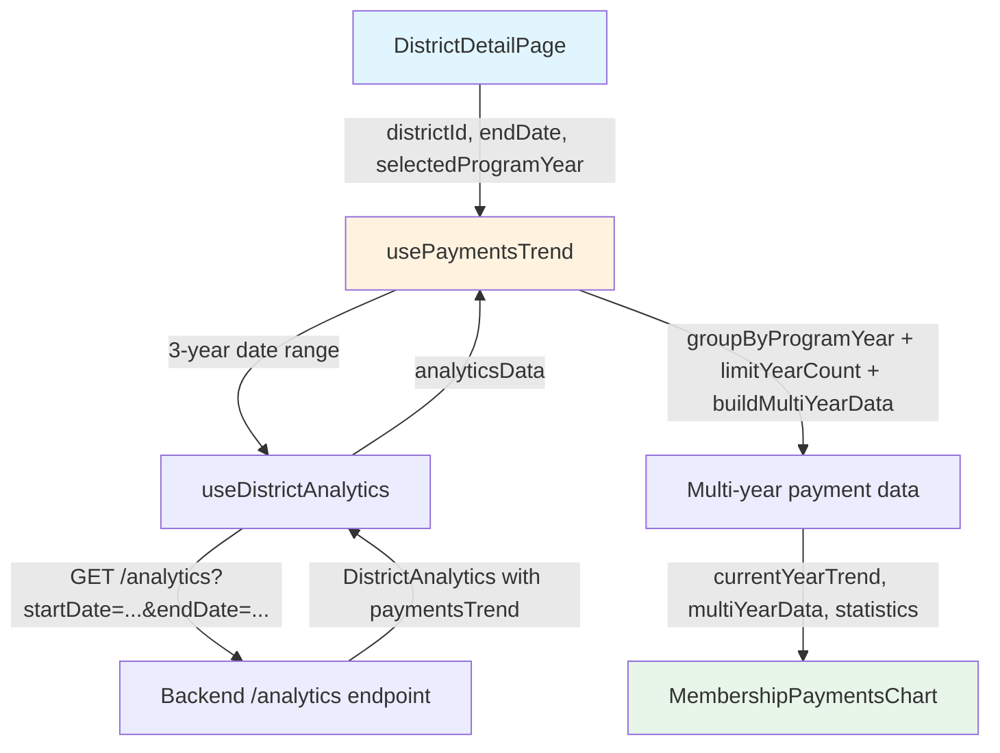

# Design Document: Payments Trend Multi-Year Comparison

## Overview

The Membership Payments Trend chart has full multi-year rendering infrastructure but only displays a single year of data. The root cause is a data flow issue: `DistrictDetailPage` passes single-year `aggregatedPaymentsTrend` (from the `/analytics-summary` endpoint, which queries a single program year range) to `usePaymentsTrend`, where it overrides the multi-year data the hook fetches internally.

The fix is a frontend-only change: stop passing `aggregatedPaymentsTrend` to `usePaymentsTrend` and let the hook use its own `useDistrictAnalytics` call, which already fetches 3 years of data. No backend changes are needed — the backend is a read-only API server and the `/analytics` endpoint already supports arbitrary date ranges.

### Design Decision: Remove aggregatedPaymentsTrend Override

Two approaches were considered:

1. **Remove the override** — Stop passing `aggregatedPaymentsTrend` to the hook. The hook's internal `useDistrictAnalytics` call already fetches 3 years. This is the simplest fix.
2. **Merge data sources** — Use `aggregatedPaymentsTrend` for the current year and `useDistrictAnalytics` for previous years. This adds complexity for no benefit since `useDistrictAnalytics` already returns current year data too.

Approach 1 was chosen for simplicity and because it uses existing, working infrastructure.

## Architecture



The change removes the data path where `DistrictDetailPage` fetched single-year payments from `useAggregatedAnalytics` and passed it as `aggregatedPaymentsTrend`. Instead, `usePaymentsTrend` exclusively uses its internal `useDistrictAnalytics` call with a 3-year date range.

### What Changes

| Component | Change |
|-----------|--------|
| `DistrictDetailPage.tsx` | Stop passing `aggregatedPaymentsTrend` to `usePaymentsTrend` |
| `usePaymentsTrend.ts` | Remove `aggregatedPaymentsTrend` parameter; always use `useDistrictAnalytics` data |
| `MembershipPaymentsChart.tsx` | No changes needed |
| Backend | No changes needed |

### What Stays the Same

- `usePaymentsTrend` still calls `useDistrictAnalytics` with a 3-year date range internally
- `groupByProgramYear`, `limitYearCount`, `buildMultiYearData` all work as-is
- `MembershipPaymentsChart` already renders multiple lines with distinct colors
- Statistics calculation (currentPayments, paymentBase, yearOverYearChange) uses `performanceTargets` from the same `useDistrictAnalytics` response
- `useAggregatedAnalytics` still provides data for the Membership Trend chart and Year-over-Year comparison on the Trends tab

## Components and Interfaces

### Modified: `usePaymentsTrend` Hook

The hook signature changes to remove the `aggregatedPaymentsTrend` parameter:

```typescript
// Before
export function usePaymentsTrend(
  districtId: string | null,
  programYearStartDate?: string,
  endDate?: string,
  aggregatedPaymentsTrend?: Array<{ date: string; payments: number }>,
  selectedProgramYear?: ProgramYear
): UsePaymentsTrendResult

// After
export function usePaymentsTrend(
  districtId: string | null,
  programYearStartDate?: string,
  endDate?: string,
  selectedProgramYear?: ProgramYear
): UsePaymentsTrendResult
```

Internal data flow change:
```typescript
// Before: aggregatedPaymentsTrend overrides internal data
const rawTrend = aggregatedPaymentsTrend ?? analyticsData.paymentsTrend

// After: always use internal multi-year data
const rawTrend = analyticsData.paymentsTrend
```

The `useMemo` dependency array also removes `aggregatedPaymentsTrend`.

### Modified: `DistrictDetailPage` Component

The call site changes to remove the `aggregatedPaymentsTrend` argument:

```typescript
// Before
const { data: paymentsTrendData, isLoading: isLoadingPaymentsTrend } =
  usePaymentsTrend(
    hasValidDates ? districtId || null : null,
    undefined,
    effectiveEndDate ?? undefined,
    aggregatedAnalytics?.trends?.payments,
    effectiveProgramYear ?? undefined
  )

// After
const { data: paymentsTrendData, isLoading: isLoadingPaymentsTrend } =
  usePaymentsTrend(
    hasValidDates ? districtId || null : null,
    undefined,
    effectiveEndDate ?? undefined,
    effectiveProgramYear ?? undefined
  )
```

### Unchanged: `MembershipPaymentsChart` Component

No changes. It already accepts `multiYearData` and renders multiple lines.

### Unchanged: Return Types

`UsePaymentsTrendResult`, `MultiYearPaymentData`, and `PaymentStatistics` interfaces remain identical.

## Data Models

No new data models are introduced. All existing types are preserved:

- `PaymentTrendDataPoint` — `{ date: string; payments: number; programYearDay: number }`
- `MultiYearPaymentData` — `{ currentYear: { label, data }, previousYears: [{ label, data }] }`
- `PaymentStatistics` — `{ currentPayments, paymentBase, yearOverYearChange, trendDirection }`
- `UsePaymentsTrendResult` — `{ data: { currentYearTrend, multiYearData, statistics } | null, isLoading, error }`

### Data Flow Example

For a district viewed in program year 2024-2025:

1. `usePaymentsTrend` calculates start date as `2022-07-01` (2 years back from 2024-2025)
2. `useDistrictAnalytics` fetches `/analytics?startDate=2022-07-01&endDate=2025-01-15`
3. Response includes `paymentsTrend` with data points spanning 3 program years
4. `groupByProgramYear` produces groups: `"2024-2025"`, `"2023-2024"`, `"2022-2023"`
5. `limitYearCount(3)` keeps all three
6. `buildMultiYearData` structures current year + 2 previous years
7. Chart renders 3 lines with distinct colors


## Correctness Properties

*A property is a characteristic or behavior that should hold true across all valid executions of a system — essentially, a formal statement about what the system should do. Properties serve as the bridge between human-readable specifications and machine-verifiable correctness guarantees.*

### Property Assessment (per Testing Steering Document §7.3)

Following the decision framework from the testing steering document, each candidate property was evaluated:

1. **Multi-year grouping (Requirements 1.1, 1.2):** `groupByProgramYear` + `limitYearCount` operate on bounded input (dates within program years, max 3 years output). 4 well-chosen examples (1 year, 2 years, 3 years, 5 years) fully cover the behavior. → **Unit tests with examples preferred.**

2. **Year-over-year change (Requirements 2.2, 2.3):** `findComparablePayment` has a 7-day threshold boundary. 4 examples (exact match, within 7 days, beyond 7 days, no previous data) cover it. → **Unit tests with examples preferred.**

3. **Selected program year grouping (Requirements 2.1, 3.3):** `buildMultiYearData` with a selected year — 2-3 examples suffice. → **Unit tests with examples preferred.**

**Conclusion:** No property-based tests are warranted for this change. The input spaces are simple and bounded, the functions are straightforward transformations, and well-chosen examples provide equivalent confidence. This aligns with the steering guidance: "Prefer the simplest test that provides confidence" and "When in doubt, write unit tests with good examples."

## Error Handling

This change does not introduce new error conditions. Existing error handling is preserved:

- If `useDistrictAnalytics` returns an error, `usePaymentsTrend` propagates it via `error` field
- If `analyticsData` is null (loading or error), the hook returns `null` data
- If `paymentsTrend` is empty or undefined, `buildPaymentTrend` returns an empty array, and the chart shows the empty state
- If no previous year data exists, `findComparablePayment` returns null, and YoY statistics show "N/A"

## Testing Strategy

### Unit Tests

Unit tests should cover:

1. **`DistrictDetailPage` call site** — Verify the component calls `usePaymentsTrend` without the `aggregatedPaymentsTrend` argument (example test, verifying the wiring change)
2. **Hook integration** — Verify that when `useDistrictAnalytics` returns multi-year data, the hook produces `multiYearData` with multiple years

### Property-Based Tests

Per the testing steering document §7.2 and §7.3 decision framework, property-based tests are not warranted for this change. The input spaces are simple and bounded, and well-chosen unit test examples provide equivalent confidence. See Correctness Properties section for the full assessment.

### Test Configuration

- Framework: Vitest (existing)
- Focus: Unit tests with well-chosen examples covering the behavioral change and boundary conditions
