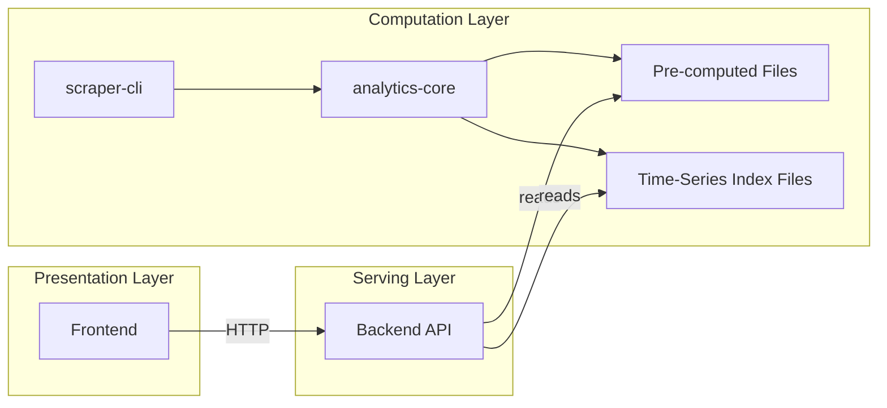

# Design Document: Payments Trend & YoY Data Pipeline Fix

## Overview

This design addresses two bugs where the data pipeline produces incorrect results:

1. The `/analytics` endpoint reads `paymentsTrend` from a single snapshot's pre-computed file (yielding 1-2 data points) instead of querying the time-series index across the requested date range (which would yield many monthly data points).
2. The `findSnapshotForDate` method in `AnalyticsComputer` falls back to the closest snapshot by absolute date distance when no same-year match exists, causing it to return the current year's snapshot when asked for the previous year. This makes `computeYearOverYear` compare a snapshot to itself, producing 0% change across all metrics.

Both fixes are minimal, targeted changes in the correct architectural layers.

## Architecture

The system follows strict data-computation-separation:



Bug 1 fix is in the serving layer (backend reads from time-series index instead of single snapshot file). Bug 2 fix is in the computation layer (analytics-core `findSnapshotForDate`). Bug 2's frontend guard is in the presentation layer.

## Components and Interfaces

### Component 1: Analytics Endpoint — Payments Trend Data Source Change

**File:** `backend/src/routes/districts/analytics.ts`

**Current behavior:** Reads `paymentsTrend` from `preComputedAnalyticsReader.readMembershipAnalytics(snapshotDate, districtId)`, which contains only 1-2 data points from the single snapshot.

**New behavior:** When `startDate` and `endDate` query parameters are present, use `getTimeSeriesIndexService()` to call `getTrendData(districtId, startDate, endDate)` and map the result to `{ date, payments }` objects. When date parameters are absent, omit `paymentsTrend` entirely.

**Changes required:**

1. Import `getTimeSeriesIndexService` from `./shared.js` (already exported)
2. Replace the `readMembershipAnalytics` block with a `getTrendData` call gated on `startDate`/`endDate` presence
3. Remove the `readMembershipAnalytics` import if no longer used elsewhere in this file

```typescript
// Replace the existing paymentsTrend block with:
let paymentsTrend: Array<{ date: string; payments: number }> | undefined
if (typeof startDate === 'string' && typeof endDate === 'string') {
  try {
    const timeSeriesIndexService = await getTimeSeriesIndexService()
    const timeSeriesData = await timeSeriesIndexService.getTrendData(
      districtId,
      startDate,
      endDate
    )
    if (timeSeriesData.length > 0) {
      paymentsTrend = timeSeriesData.map(dp => ({
        date: dp.date,
        payments: dp.payments,
      }))
    }
  } catch (trendError) {
    logger.debug('Could not read payments trend from time-series index', {
      operation: 'getDistrictAnalytics',
      districtId,
      error: trendError instanceof Error ? trendError.message : 'Unknown error',
    })
  }
}
```

This is a read-only operation — no computation. The time-series index files are pre-computed by scraper-cli, consistent with the data-computation-separation steering document.

### Component 2: findSnapshotForDate — Date Proximity Guard

**File:** `packages/analytics-core/src/analytics/AnalyticsComputer.ts`

**Current behavior:** When no exact match or same-year snapshot exists, returns the closest snapshot by absolute date difference — even if it's years away.

**New behavior:** After finding the closest snapshot, check if it's within 180 days of the target date. If not, return `undefined`.

```typescript
private findSnapshotForDate(
  snapshots: DistrictStatistics[],
  targetDate: string
): DistrictStatistics | undefined {
  if (snapshots.length === 0) {
    return undefined
  }

  // Exact match — always return
  const exactMatch = snapshots.find(s => s.snapshotDate === targetDate)
  if (exactMatch) {
    return exactMatch
  }

  // Same calendar year — return latest
  const targetYear = parseInt(targetDate.substring(0, 4))
  const sameYearSnapshots = snapshots.filter(s => {
    const snapshotYear = parseInt(s.snapshotDate.substring(0, 4))
    return snapshotYear === targetYear
  })
  if (sameYearSnapshots.length > 0) {
    return sameYearSnapshots[sameYearSnapshots.length - 1]
  }

  // Closest snapshot with proximity guard
  let closestSnapshot: DistrictStatistics | undefined
  let closestDiff = Infinity
  const MAX_PROXIMITY_MS = 180 * 24 * 60 * 60 * 1000 // 180 days

  for (const snapshot of snapshots) {
    const diff = Math.abs(
      new Date(snapshot.snapshotDate).getTime() -
        new Date(targetDate).getTime()
    )
    if (diff < closestDiff) {
      closestDiff = diff
      closestSnapshot = snapshot
    }
  }

  // Reject if closest snapshot is too far from target
  if (closestDiff > MAX_PROXIMITY_MS) {
    return undefined
  }

  return closestSnapshot
}
```

The 180-day threshold is chosen because Toastmasters program years are 12 months (July–June). A previous year snapshot should be within ~365 days of the target date, but same-year matching handles that. The fallback path only triggers for cross-year lookups where no same-year data exists, so 180 days provides a generous buffer while preventing the current-year snapshot from being returned for a previous-year query (~365 days away).

### Component 3: YearOverYearComparison — Zero-Change Guard

**File:** `frontend/src/components/YearOverYearComparison.tsx`

**Current behavior:** When `yearOverYear` is present (even with all zeros), the component reverse-calculates previous year values from percentage changes. With 0% change: `previous = current / (1 + 0/100) = current`, showing identical values.

**New behavior:** Add a check after the `!yearOverYear` guard: if all three change values are exactly 0, render the "No Historical Data" empty state.

```typescript
if (!yearOverYear) {
  return <EmptyState ... />
}

// All-zero changes indicate the backend couldn't find distinct previous year data
const allChangesZero =
  yearOverYear.membershipChange === 0 &&
  yearOverYear.distinguishedChange === 0 &&
  yearOverYear.clubHealthChange === 0

if (allChangesZero) {
  return (
    <EmptyState
      title="No Historical Data"
      message="Year-over-year comparison requires data from previous program years. Continue collecting data to enable this feature."
      icon="data"
    />
  )
}
```

## Data Models

No new data models are introduced. Existing types used:

- `TimeSeriesDataPoint` from `@toastmasters-tracker/shared-contracts` — already has `date` and `payments` fields
- `YearOverYearData` from `@toastmasters/analytics-core` — already has `dataAvailable: boolean` field
- `YearOverYearData` interface in `YearOverYearComparison.tsx` — frontend-local type with `membershipChange`, `distinguishedChange`, `clubHealthChange`

No schema changes. No new pre-computed file formats. No API response shape changes (the `/analytics` endpoint already includes `paymentsTrend` as an optional field).

## Correctness Properties

_A property is a characteristic or behavior that should hold true across all valid executions of a system — essentially, a formal statement about what the system should do. Properties serve as the bridge between human-readable specifications and machine-verifiable correctness guarantees._

Per the testing steering document, property-based tests are a tool, not a default. The `findSnapshotForDate` fix involves a simple numeric threshold (180 days) and an exact-match priority — neither has complex input spaces nor mathematical/algebraic invariants. Five well-chosen examples at boundary values (179, 180, 181, 365 days; exact match with closer alternatives) provide equivalent confidence. Therefore, no property-based tests are warranted for this fix. All acceptance criteria will be validated through unit tests with well-chosen examples.

### Correctness Invariants (validated via unit tests)

**Invariant 1: Proximity guard rejects distant snapshots**
When the closest available snapshot is more than 180 days from the target date and no exact match exists, `findSnapshotForDate` returns `undefined`.
**Validates: Requirements 2.1**

**Invariant 2: Exact date match always wins**
When a snapshot with `snapshotDate` equal to the target date exists in the array, `findSnapshotForDate` returns that snapshot regardless of other snapshots present.
**Validates: Requirements 2.3**

## Error Handling

### Analytics Endpoint (Bug 1)

- If `getTimeSeriesIndexService()` throws during initialization, the error propagates to the existing catch block which returns a 500 response. No new error handling needed.
- If `getTrendData()` throws or returns an empty array, `paymentsTrend` is omitted from the response (it's already an optional field). A debug-level log is emitted.
- If `startDate`/`endDate` are missing, `paymentsTrend` is simply not included. No error.

### findSnapshotForDate (Bug 2)

- When `findSnapshotForDate` returns `undefined` for the previous year, `computeYearOverYear` already has a guard that returns `{ dataAvailable: false, message: '...' }`. No new error handling needed — the fix makes the existing guard trigger correctly.

### YearOverYearComparison Component (Bug 2 frontend)

- The all-zero check is a presentation guard only. It renders the same `EmptyState` component already used for the `!yearOverYear` case. No new error states.

## Testing Strategy

### Unit Tests

Per the testing steering document, unit tests with well-chosen examples are preferred for bounded logic.

**Analytics endpoint (Bug 1):**

- Test that when `startDate` and `endDate` are provided, the endpoint calls `getTrendData` and includes `paymentsTrend` in the response
- Test that when `startDate`/`endDate` are absent, `paymentsTrend` is omitted
- Test that when `getTrendData` returns empty array, `paymentsTrend` is omitted
- Test that when `getTrendData` throws, `paymentsTrend` is omitted and response still succeeds

**findSnapshotForDate (Bug 2):**

- Test that a single current-year snapshot with a previous-year target date (>180 days away) returns `undefined`
- Test that an exact match is returned even when other snapshots are closer
- Test that a same-year snapshot is returned (existing behavior preserved)
- Test that a snapshot within 180 days of the target is returned (existing fallback behavior preserved)

**YearOverYearComparison (Bug 2 frontend):**

- Test that all-zero `yearOverYear` renders the empty state
- Test that non-zero `yearOverYear` renders comparison cards
- Test that `undefined` `yearOverYear` renders the empty state (existing behavior)

**computeYearOverYear integration:**

- Test that passing only `[currentSnapshot]` now returns `dataAvailable: false` (regression test for the core bug)
- Test that passing `[previousSnapshot, currentSnapshot]` returns `dataAvailable: true` with correct metrics

### Property-Based Tests

Per the testing steering document (Section 7.3 Decision Framework): the `findSnapshotForDate` fix involves a simple threshold comparison (180 days) and an exact-match priority check. These do not have complex input spaces, mathematical invariants, or algebraic properties. Five well-chosen boundary examples provide equivalent confidence. No property-based tests are warranted for this fix.
