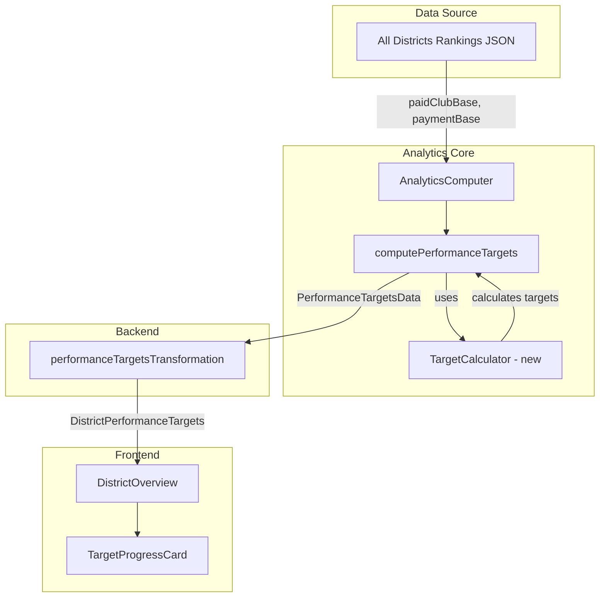

# Design Document: Performance Targets Calculation

## Overview

This design addresses two bugs in the District Overview page where performance targets show "Targets: N/A" and membership change shows "+0 members". The root cause is that the `PerformanceTargetsData` type in analytics-core computes rankings but does not compute base values, recognition level targets, or achieved recognition levels.

The fix requires:
1. Extending `PerformanceTargetsData` to include base values and recognition targets
2. Updating `computePerformanceTargets` in AnalyticsComputer to calculate these values
3. Updating the backend transformation to map the new fields correctly

## Architecture



## Components and Interfaces

### Target Calculator Module (New)

A new utility module in analytics-core for calculating recognition level targets.

```typescript
// packages/analytics-core/src/analytics/TargetCalculator.ts

/**
 * Recognition level percentages for paid clubs and membership payments targets.
 * Formula: base + (base * percentage), rounded up
 */
const GROWTH_PERCENTAGES = {
  distinguished: 0.01,  // +1%
  select: 0.03,         // +3%
  presidents: 0.05,     // +5%
  smedley: 0.08,        // +8%
} as const

/**
 * Recognition level percentages for distinguished clubs targets.
 * Formula: base * percentage, rounded up
 */
const DISTINGUISHED_PERCENTAGES = {
  distinguished: 0.45,  // 45%
  select: 0.50,         // 50%
  presidents: 0.55,     // 55%
  smedley: 0.60,        // 60%
} as const

interface RecognitionTargets {
  distinguished: number
  select: number
  presidents: number
  smedley: number
}

type RecognitionLevel = 'distinguished' | 'select' | 'presidents' | 'smedley'

/**
 * Calculates growth-based targets (paid clubs, membership payments).
 * Formula: base + (base * percentage), rounded up using Math.ceil
 */
function calculateGrowthTargets(base: number): RecognitionTargets {
  return {
    distinguished: Math.ceil(base * (1 + GROWTH_PERCENTAGES.distinguished)),
    select: Math.ceil(base * (1 + GROWTH_PERCENTAGES.select)),
    presidents: Math.ceil(base * (1 + GROWTH_PERCENTAGES.presidents)),
    smedley: Math.ceil(base * (1 + GROWTH_PERCENTAGES.smedley)),
  }
}

/**
 * Calculates percentage-based targets (distinguished clubs).
 * Formula: base * percentage, rounded up using Math.ceil
 */
function calculatePercentageTargets(base: number): RecognitionTargets {
  return {
    distinguished: Math.ceil(base * DISTINGUISHED_PERCENTAGES.distinguished),
    select: Math.ceil(base * DISTINGUISHED_PERCENTAGES.select),
    presidents: Math.ceil(base * DISTINGUISHED_PERCENTAGES.presidents),
    smedley: Math.ceil(base * DISTINGUISHED_PERCENTAGES.smedley),
  }
}

/**
 * Determines the highest achieved recognition level based on current value and targets.
 * Returns null if below all targets or if targets are unavailable.
 */
function determineAchievedLevel(
  current: number,
  targets: RecognitionTargets | null
): RecognitionLevel | null {
  if (!targets) return null
  
  if (current >= targets.smedley) return 'smedley'
  if (current >= targets.presidents) return 'presidents'
  if (current >= targets.select) return 'select'
  if (current >= targets.distinguished) return 'distinguished'
  
  return null
}
```

### Extended PerformanceTargetsData Type

```typescript
// packages/analytics-core/src/types.ts

interface RecognitionTargets {
  distinguished: number
  select: number
  presidents: number
  smedley: number
}

type RecognitionLevel = 'distinguished' | 'select' | 'presidents' | 'smedley'

interface PerformanceTargetsData {
  // Existing fields
  districtId: string
  computedAt: string
  membershipTarget: number
  distinguishedTarget: number
  clubGrowthTarget: number
  paidClubsCount: number
  currentProgress: {
    membership: number
    distinguished: number
    clubGrowth: number
  }
  projectedAchievement: {
    membership: boolean
    distinguished: boolean
    clubGrowth: boolean
  }
  paidClubsRankings: MetricRankings
  membershipPaymentsRankings: MetricRankings
  distinguishedClubsRankings: MetricRankings
  
  // NEW: Base values from All Districts Rankings
  paidClubBase: number | null
  paymentBase: number | null
  
  // NEW: Recognition level targets
  paidClubsTargets: RecognitionTargets | null
  membershipPaymentsTargets: RecognitionTargets | null
  distinguishedClubsTargets: RecognitionTargets | null
  
  // NEW: Achieved recognition levels
  paidClubsAchievedLevel: RecognitionLevel | null
  membershipPaymentsAchievedLevel: RecognitionLevel | null
  distinguishedClubsAchievedLevel: RecognitionLevel | null
}
```

### Updated computePerformanceTargets Method

```typescript
// packages/analytics-core/src/analytics/AnalyticsComputer.ts

computePerformanceTargets(
  districtId: string,
  snapshots: DistrictStatistics[],
  allDistrictsRankings?: AllDistrictsRankingsData
): PerformanceTargetsData {
  // ... existing code for rankings calculation ...
  
  // Extract base values from all-districts rankings
  const districtRanking = allDistrictsRankings?.rankings.find(
    r => r.districtId === districtId
  )
  
  const paidClubBase = districtRanking?.paidClubBase ?? null
  const paymentBase = districtRanking?.paymentBase ?? null
  
  // Calculate recognition targets
  const paidClubsTargets = paidClubBase !== null 
    ? calculateGrowthTargets(paidClubBase) 
    : null
    
  const membershipPaymentsTargets = paymentBase !== null 
    ? calculateGrowthTargets(paymentBase) 
    : null
    
  const distinguishedClubsTargets = paidClubBase !== null 
    ? calculatePercentageTargets(paidClubBase) 
    : null
  
  // Get current values
  const currentPaidClubs = totalPaidClubs
  const currentMembershipPayments = districtRanking?.totalPayments ?? 
    this.membershipModule.getTotalPayments(latestSnapshot)
  const currentDistinguished = /* existing calculation */
  
  // Determine achieved levels
  const paidClubsAchievedLevel = determineAchievedLevel(
    currentPaidClubs, 
    paidClubsTargets
  )
  const membershipPaymentsAchievedLevel = determineAchievedLevel(
    currentMembershipPayments, 
    membershipPaymentsTargets
  )
  const distinguishedClubsAchievedLevel = determineAchievedLevel(
    currentDistinguished, 
    distinguishedClubsTargets
  )
  
  return {
    // ... existing fields ...
    paidClubBase,
    paymentBase,
    paidClubsTargets,
    membershipPaymentsTargets,
    distinguishedClubsTargets,
    paidClubsAchievedLevel,
    membershipPaymentsAchievedLevel,
    distinguishedClubsAchievedLevel,
  }
}
```

### Updated Backend Transformation

```typescript
// backend/src/utils/performanceTargetsTransformation.ts

export function transformPerformanceTargets(
  performanceTargets: PerformanceTargetsData
): DistrictPerformanceTargets {
  return {
    paidClubs: {
      current: performanceTargets.paidClubsCount,
      base: performanceTargets.paidClubBase,
      targets: performanceTargets.paidClubsTargets,
      achievedLevel: performanceTargets.paidClubsAchievedLevel,
      rankings: performanceTargets.paidClubsRankings ?? NULL_RANKINGS,
    },
    membershipPayments: {
      current: performanceTargets.currentProgress.membership,
      base: performanceTargets.paymentBase,
      targets: performanceTargets.membershipPaymentsTargets,
      achievedLevel: performanceTargets.membershipPaymentsAchievedLevel,
      rankings: performanceTargets.membershipPaymentsRankings ?? NULL_RANKINGS,
    },
    distinguishedClubs: {
      current: performanceTargets.currentProgress.distinguished,
      base: performanceTargets.paidClubBase, // Distinguished uses Club_Base
      targets: performanceTargets.distinguishedClubsTargets,
      achievedLevel: performanceTargets.distinguishedClubsAchievedLevel,
      rankings: performanceTargets.distinguishedClubsRankings ?? NULL_RANKINGS,
    },
  }
}
```

## Data Models

### Recognition Targets Structure

```typescript
interface RecognitionTargets {
  distinguished: number  // Lowest tier
  select: number
  presidents: number
  smedley: number        // Highest tier
}
```

### Target Calculation Formulas

| Metric | Distinguished | Select | President's | Smedley |
|--------|---------------|--------|-------------|---------|
| Paid Clubs | Base + 1% | Base + 3% | Base + 5% | Base + 8% |
| Membership Payments | Base + 1% | Base + 3% | Base + 5% | Base + 8% |
| Distinguished Clubs | 45% of Base | 50% of Base | 55% of Base | 60% of Base |

All calculations use `Math.ceil()` for rounding up.

### Data Flow

1. **All Districts Rankings JSON** contains `paidClubBase` and `paymentBase` for each district
2. **AnalyticsComputer.computePerformanceTargets** extracts base values and calculates targets
3. **PerformanceTargetsData** includes base values, targets, and achieved levels
4. **Backend transformation** maps to frontend-expected format
5. **TargetProgressCard** displays targets and progress bars


## Correctness Properties

*A property is a characteristic or behavior that should hold true across all valid executions of a system—essentially, a formal statement about what the system should do. Properties serve as the bridge between human-readable specifications and machine-verifiable correctness guarantees.*

### Property 1: Base Value Extraction

*For any* All_Districts_Rankings data containing a district with paidClubBase and paymentBase values, when computePerformanceTargets is called with that rankings data, the resulting PerformanceTargetsData SHALL have paidClubBase and paymentBase equal to the values from the rankings data.

**Validates: Requirements 1.1, 1.2**

### Property 2: Growth-Based Target Calculation

*For any* positive base value B, the growth-based targets (for paid clubs and membership payments) SHALL satisfy:
- Distinguished target = ⌈B × 1.01⌉
- Select target = ⌈B × 1.03⌉
- President's target = ⌈B × 1.05⌉
- Smedley target = ⌈B × 1.08⌉

**Validates: Requirements 2.1, 2.2, 2.3, 2.4, 3.1, 3.2, 3.3, 3.4**

### Property 3: Percentage-Based Target Calculation

*For any* positive base value B, the percentage-based targets (for distinguished clubs) SHALL satisfy:
- Distinguished target = ⌈B × 0.45⌉
- Select target = ⌈B × 0.50⌉
- President's target = ⌈B × 0.55⌉
- Smedley target = ⌈B × 0.60⌉

**Validates: Requirements 4.1, 4.2, 4.3, 4.4**

### Property 4: Ceiling Rounding Invariant

*For any* calculated target value, the result SHALL be an integer that is greater than or equal to the unrounded mathematical result. Specifically, for any base B and percentage P, the target T = ⌈B × P⌉ SHALL satisfy: T ≥ B × P AND T is an integer AND T - (B × P) < 1.

**Validates: Requirements 2.6, 3.6, 4.6**

### Property 5: Achieved Level Determination

*For any* current value C and valid recognition targets T (where T.distinguished ≤ T.select ≤ T.presidents ≤ T.smedley), the achieved level SHALL be:
- "smedley" if C ≥ T.smedley
- "presidents" if T.presidents ≤ C < T.smedley
- "select" if T.select ≤ C < T.presidents
- "distinguished" if T.distinguished ≤ C < T.select
- null if C < T.distinguished

**Validates: Requirements 5.1, 5.2, 5.3, 5.4, 5.5**

### Property 6: Backend Transformation Mapping

*For any* valid PerformanceTargetsData object P, the transformed DistrictPerformanceTargets object T SHALL satisfy:
- T.paidClubs.base = P.paidClubBase
- T.membershipPayments.base = P.paymentBase
- T.distinguishedClubs.base = P.paidClubBase
- T.paidClubs.targets = P.paidClubsTargets
- T.membershipPayments.targets = P.membershipPaymentsTargets
- T.distinguishedClubs.targets = P.distinguishedClubsTargets
- T.paidClubs.achievedLevel = P.paidClubsAchievedLevel
- T.membershipPayments.achievedLevel = P.membershipPaymentsAchievedLevel
- T.distinguishedClubs.achievedLevel = P.distinguishedClubsAchievedLevel

**Validates: Requirements 7.1, 7.2, 7.3, 7.4, 7.5, 7.6, 7.7, 7.8, 7.9**

### Property 7: Membership Change Calculation

*For any* district with Payment_Base value B and current total payments P, the membershipChange SHALL equal P - B.

**Validates: Requirements 8.1, 8.2**

## Error Handling

### Missing All-Districts Rankings Data

When `allDistrictsRankings` is not provided to `computePerformanceTargets`:
- Set `paidClubBase` to `null`
- Set `paymentBase` to `null`
- Set all target objects (`paidClubsTargets`, `membershipPaymentsTargets`, `distinguishedClubsTargets`) to `null`
- Set all achieved levels to `null`
- Rankings will use the existing null rankings pattern

### District Not Found in Rankings

When the district ID is not found in the rankings array:
- Same behavior as missing rankings data
- Log a warning for debugging purposes

### Invalid Base Values

If base values are negative or zero (which shouldn't happen with valid data):
- Treat as if base is unavailable
- Set targets to `null`

## Testing Strategy

Per the testing steering document, we prefer the simplest test that provides confidence. Property-based tests are reserved for cases with mathematical invariants or complex input spaces where examples alone are insufficient.

### Unit Tests (Primary)

Unit tests with well-chosen examples will cover:

1. **Target calculation functions**:
   - Test with specific base values (e.g., 100, 95, 50)
   - Verify ceiling rounding with values that produce fractional results (e.g., base=99 → 99 × 1.01 = 99.99 → 100)
   - Test boundary values

2. **Achieved level determination**:
   - Test at exact threshold boundaries
   - Test just below and just above each threshold
   - Test null targets case

3. **Backend transformation**:
   - Test complete transformation with all fields populated
   - Test transformation with null base/targets
   - Verify field mapping correctness

4. **Edge cases**:
   - Missing rankings data (null/undefined)
   - District not found in rankings
   - Zero or negative base values (defensive)

### Property-Based Tests (Selective)

Property-based testing is warranted for:

1. **Ceiling rounding invariant** (Property 4): This is a mathematical invariant that should hold for all positive base values. A property test ensures we don't miss edge cases in the rounding logic.
   - **Rationale**: The ceiling function has subtle edge cases with floating-point arithmetic that are hard to enumerate manually.

2. **Achieved level determination** (Property 5): The classification logic has multiple boundaries and the input space (current value × targets) is large.
   - **Rationale**: Boundary conditions are error-prone and property testing can find edge cases we might miss.

### Tests NOT Using Property-Based Testing

The following will use unit tests with specific examples:

- **Base value extraction** (Property 1): Simple data extraction, 3-5 examples sufficient
- **Growth target calculation** (Property 2): Mathematical formula, specific examples verify correctness
- **Percentage target calculation** (Property 3): Mathematical formula, specific examples verify correctness
- **Backend transformation** (Property 6): Data mapping, specific examples verify correctness
- **Membership change calculation** (Property 7): Simple subtraction, specific examples sufficient

### Test Configuration

- Property tests: Minimum 100 iterations
- Use fast-check for TypeScript property-based testing
- Tag format for property tests: **Feature: performance-targets-calculation, Property {number}: {property_text}**

### Integration Tests

Integration tests should verify:
1. End-to-end flow from rankings data to frontend display
2. Correct handling when analytics are regenerated
3. Backward compatibility with existing data
