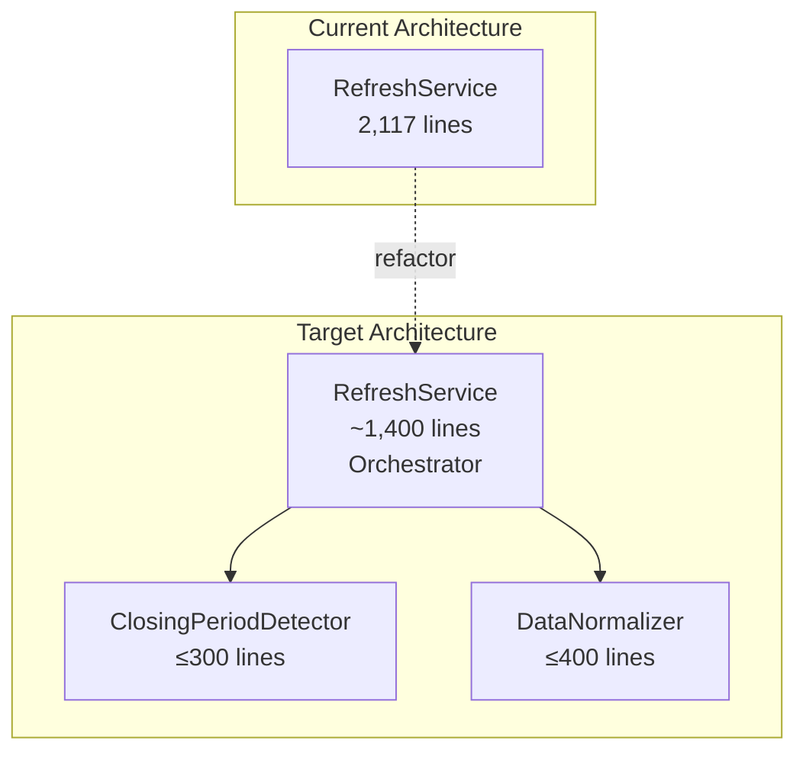
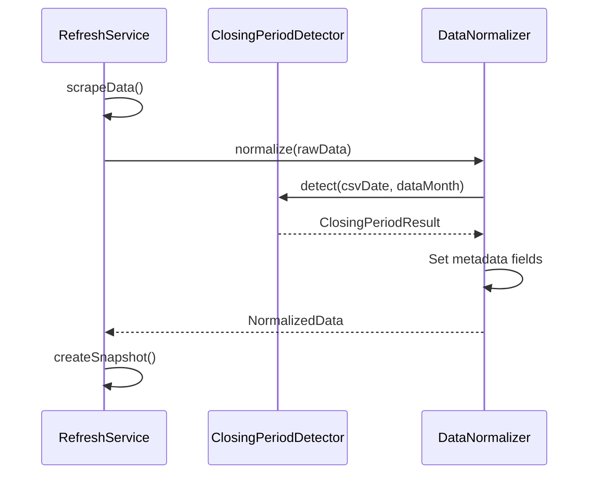
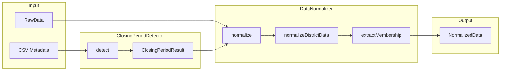

# Design Document: RefreshService Refactor

## Overview

This design specifies the extraction of two specialized modules from `RefreshService.ts` (2,117 lines, 34 methods):

1. **ClosingPeriodDetector** - Handles Toastmasters month-end closing period detection logic
2. **DataNormalizer** - Transforms raw scraped data into normalized snapshot format

The refactoring preserves the existing public API while improving maintainability through separation of concerns. The extracted modules will be independently testable with clear interfaces and dependency injection support.

### Design Rationale

The current `RefreshService` violates the Single Responsibility Principle by combining:

- Orchestration logic (coordinating scraping, validation, snapshot creation)
- Domain logic (closing period detection rules)
- Transformation logic (data normalization)

Extracting these concerns enables:

- Independent testing of complex domain rules
- Clearer documentation of business logic
- Easier maintenance and future modifications
- Better code organization with focused modules

## Architecture



### Module Responsibilities

| Module                | Responsibility                                          | Line Limit |
| --------------------- | ------------------------------------------------------- | ---------- |
| RefreshService        | Orchestration, scraping coordination, snapshot creation | ~1,400     |
| ClosingPeriodDetector | Closing period detection, logical date calculation      | ≤300       |
| DataNormalizer        | Raw data transformation, membership extraction          | ≤400       |

## Components and Interfaces

### ClosingPeriodDetector

Encapsulates the complex domain logic for detecting Toastmasters month-end closing periods.

```typescript
/**
 * Result of closing period detection
 */
export interface ClosingPeriodResult {
  /** Whether the data represents a closing period */
  isClosingPeriod: boolean
  /** The month the data represents (YYYY-MM format) */
  dataMonth: string
  /** The "As of" date from the CSV */
  asOfDate: string
  /** The date to use for the snapshot (last day of data month for closing periods) */
  snapshotDate: string
  /** The actual collection date */
  collectionDate: string
}

/**
 * Dependencies required by ClosingPeriodDetector
 */
export interface ClosingPeriodDetectorDependencies {
  /** Logger instance for diagnostic output */
  logger: Logger
}

/**
 * Detects and handles Toastmasters month-end closing periods
 *
 * A closing period occurs when the Toastmasters dashboard publishes data
 * for a prior month (data month) with an "As of" date in the current month.
 * During closing periods, snapshots should be dated as the last day of the
 * data month, not the "As of" date.
 */
export class ClosingPeriodDetector {
  constructor(dependencies: ClosingPeriodDetectorDependencies)

  /**
   * Detect if CSV data represents a closing period
   *
   * @param csvDate - The "As of" date from the CSV (YYYY-MM-DD)
   * @param dataMonth - The month the statistics represent (YYYY-MM or MM)
   * @returns Closing period detection result
   */
  detect(csvDate: string, dataMonth: string): ClosingPeriodResult

  /**
   * Calculate the last day of a given month
   *
   * @param year - The year
   * @param month - The month (1-12)
   * @returns The last day of the month (1-31)
   */
  getLastDayOfMonth(year: number, month: number): number

  /**
   * Parse a data month string into year and month components
   *
   * @param dataMonth - Data month in YYYY-MM or MM format
   * @param referenceYear - Reference year for MM format
   * @param referenceMonth - Reference month for cross-year detection
   * @returns Parsed year and month, or null if invalid
   */
  parseDataMonth(
    dataMonth: string,
    referenceYear: number,
    referenceMonth: number
  ): { year: number; month: number } | null
}
```

### DataNormalizer

Transforms raw scraped CSV data into the structured `NormalizedData` format.

```typescript
/**
 * Raw district data from scraping operations
 */
export interface RawDistrictData {
  districtPerformance: ScrapedRecord[]
  divisionPerformance: ScrapedRecord[]
  clubPerformance: ScrapedRecord[]
}

/**
 * Dependencies required by DataNormalizer
 */
export interface DataNormalizerDependencies {
  /** Logger instance for diagnostic output */
  logger: Logger
  /** Closing period detector for date handling */
  closingPeriodDetector: ClosingPeriodDetector
}

/**
 * Transforms raw scraped data into normalized snapshot format
 */
export class DataNormalizer {
  constructor(dependencies: DataNormalizerDependencies)

  /**
   * Normalize all raw data into NormalizedData format
   *
   * @param rawData - Raw data from scraping operations
   * @returns Normalized data ready for snapshot creation
   */
  normalize(rawData: RawData): Promise<NormalizedData>

  /**
   * Normalize data for a single district
   *
   * @param districtId - The district identifier
   * @param data - Raw scraped data for the district
   * @param asOfDate - The "As of" date from CSV
   * @returns Normalized district statistics
   */
  normalizeDistrictData(
    districtId: string,
    data: RawDistrictData,
    asOfDate: string
  ): Promise<DistrictStatistics>

  /**
   * Extract total membership from club performance data
   *
   * @param clubPerformance - Array of club performance records
   * @returns Total membership count
   */
  extractMembershipTotal(clubPerformance: ScrapedRecord[]): number

  /**
   * Extract club membership details
   *
   * @param clubPerformance - Array of club performance records
   * @returns Array of club membership details
   */
  extractClubMembership(clubPerformance: ScrapedRecord[]): ClubMembership[]

  /**
   * Count active clubs from performance data
   *
   * @param clubPerformance - Array of club performance records
   * @returns Count of active clubs
   */
  countActiveClubs(clubPerformance: ScrapedRecord[]): number

  /**
   * Count distinguished clubs from performance data
   *
   * @param clubPerformance - Array of club performance records
   * @returns Count of distinguished clubs
   */
  countDistinguishedClubs(clubPerformance: ScrapedRecord[]): number
}
```

### Updated RefreshService

The refactored `RefreshService` delegates to extracted modules while preserving its public API.

```typescript
/**
 * RefreshService dependencies including extracted modules
 */
export interface RefreshServiceDependencies {
  snapshotStore: SnapshotStore
  collector: ToastmastersCollector
  rawCSVCache: RawCSVCacheService
  validator?: DataValidator
  districtConfigService?: DistrictConfigurationService
  rankingCalculator?: RankingCalculator
  // New extracted module dependencies
  closingPeriodDetector?: ClosingPeriodDetector
  dataNormalizer?: DataNormalizer
}

export class RefreshService {
  private readonly closingPeriodDetector: ClosingPeriodDetector
  private readonly dataNormalizer: DataNormalizer

  constructor(
    snapshotStore: SnapshotStore,
    collector: ToastmastersCollector,
    rawCSVCache: RawCSVCacheService,
    validator?: DataValidator,
    districtConfigService?: DistrictConfigurationService,
    rankingCalculator?: RankingCalculator,
    // Optional injected modules (created internally if not provided)
    closingPeriodDetector?: ClosingPeriodDetector,
    dataNormalizer?: DataNormalizer
  )

  // Public API remains unchanged
  executeRefresh(): Promise<RefreshResult>
  validateConfiguration(): Promise<ConfigurationValidationResult>
  getCircuitBreakerStats(): { scraping: unknown }
  resetCircuitBreaker(): void
}
```

## Data Models

### Closing Period Detection Flow



### Data Transformation Pipeline



## Correctness Properties

_A property is a characteristic or behavior that should hold true across all valid executions of a system—essentially, a formal statement about what the system should do. Properties serve as the bridge between human-readable specifications and machine-verifiable correctness guarantees._

### Property 1: Closing Period Detection Correctness

_For any_ valid CSV date and data month combination, the ClosingPeriodDetector SHALL correctly identify whether it represents a closing period by comparing the data month to the CSV date month, and when a closing period is detected, the snapshot date SHALL be the last day of the data month.

**Validates: Requirements 1.1, 1.2, 1.3**

### Property 2: Data Normalization Transformation

_For any_ valid raw scraped data input, the DataNormalizer SHALL produce a valid NormalizedData structure where:

- The number of districts in output equals the number of successfully processed district entries in input
- Each district has valid membership, clubs, and education statistics structures
- Metadata fields are correctly populated

**Validates: Requirements 2.1, 2.2**

### Property 3: Membership Calculation Consistency

_For any_ club performance data array, the extracted membership total SHALL equal the sum of individual club membership counts, and the count of clubs with membership details SHALL equal the number of valid club records in the input.

**Validates: Requirements 2.3, 2.4, 2.5**

### Property 4: API Contract Preservation

_For any_ valid input to RefreshService public methods (executeRefresh, validateConfiguration), the return type structure SHALL match the documented interface exactly, ensuring backward compatibility with existing consumers.

**Validates: Requirements 3.1, 3.2, 3.3, 3.4**

### Property 5: Date Boundary Conditions

_For any_ month boundary scenario (including February in leap/non-leap years, months with 30/31 days, and year boundaries), the ClosingPeriodDetector SHALL correctly calculate the last day of the month and handle cross-year closing periods.

**Validates: Requirements 1.1, 1.2, 5.4**

## Error Handling

### ClosingPeriodDetector Error Handling

| Error Condition           | Handling Strategy                                    |
| ------------------------- | ---------------------------------------------------- |
| Invalid date format       | Return non-closing period result with original dates |
| Invalid data month format | Log warning, return non-closing period result        |
| Parsing failure           | Log error, return safe fallback result               |

```typescript
// Example error handling in detect()
try {
  // Parse and validate dates
  const csvDateObj = new Date(csvDate)
  if (isNaN(csvDateObj.getTime())) {
    this.logger.warn('Invalid CSV date format', { csvDate })
    return this.createNonClosingPeriodResult(csvDate, dataMonth)
  }
  // ... detection logic
} catch (error) {
  this.logger.error('Error detecting closing period', {
    csvDate,
    dataMonth,
    error,
  })
  return this.createNonClosingPeriodResult(csvDate, dataMonth)
}
```

### DataNormalizer Error Handling

| Error Condition                | Handling Strategy                                |
| ------------------------------ | ------------------------------------------------ |
| District normalization failure | Log warning, skip district, continue with others |
| No districts normalized        | Throw error (cannot create valid snapshot)       |
| Missing required fields        | Use default values, log warning                  |

```typescript
// Example error handling in normalize()
for (const [districtId, data] of rawData.districtData.entries()) {
  try {
    const districtStats = await this.normalizeDistrictData(
      districtId,
      data,
      asOfDate
    )
    districts.push(districtStats)
  } catch (error) {
    this.logger.warn('Failed to normalize district data', { districtId, error })
    // Continue with other districts
  }
}

if (districts.length === 0) {
  throw new Error('No districts were successfully normalized')
}
```

## Testing Strategy

### Dual Testing Approach

This refactoring requires both unit tests and property-based tests:

- **Unit tests**: Verify specific examples, edge cases, and error conditions
- **Property tests**: Verify universal properties across all valid inputs

### Property-Based Testing Configuration

- **Framework**: fast-check (already used in the codebase)
- **Minimum iterations**: 100 per property test
- **Tag format**: `Feature: refresh-service-refactor, Property N: [property text]`

### Test Organization

```
backend/src/services/__tests__/
├── ClosingPeriodDetector.test.ts           # Unit tests
├── ClosingPeriodDetector.property.test.ts  # Property tests
├── DataNormalizer.test.ts                  # Unit tests
├── DataNormalizer.property.test.ts         # Property tests
└── RefreshService.integration.test.ts      # Integration tests
```

### Unit Test Coverage Requirements

#### ClosingPeriodDetector Unit Tests

- Normal data (same month) detection
- Closing period detection (data month < CSV month)
- Cross-year boundary handling (December data in January)
- February handling (leap year and non-leap year)
- Invalid input handling
- Edge cases: first/last day of month

#### DataNormalizer Unit Tests

- Single district normalization
- Multiple district normalization
- Empty club performance handling
- Missing field handling
- Membership extraction accuracy
- Club counting accuracy

### Property Test Requirements

Each correctness property MUST be implemented as a separate property-based test:

1. **Property 1 Test**: Generate random date pairs, verify closing period detection logic
2. **Property 2 Test**: Generate random raw data structures, verify normalization output validity
3. **Property 3 Test**: Generate random club arrays, verify membership sum consistency
4. **Property 4 Test**: Generate random valid inputs, verify return type structure
5. **Property 5 Test**: Generate boundary dates, verify last-day-of-month calculations

### Existing Test Preservation

All existing tests in these files MUST continue to pass:

- `RefreshService.closing-period.property.test.ts`
- `RefreshService.district-scoped.test.ts`
- Related integration tests

## File Structure

```
backend/src/services/
├── RefreshService.ts              # Refactored orchestrator (~1,400 lines)
├── ClosingPeriodDetector.ts       # New module (≤300 lines)
├── DataNormalizer.ts              # New module (≤400 lines)
└── __tests__/
    ├── ClosingPeriodDetector.test.ts
    ├── ClosingPeriodDetector.property.test.ts
    ├── DataNormalizer.test.ts
    ├── DataNormalizer.property.test.ts
    └── RefreshService.integration.test.ts
```

## Migration Strategy

### Phase 1: Extract ClosingPeriodDetector

1. Create `ClosingPeriodDetector.ts` with extracted logic
2. Add unit tests for the new module
3. Update `RefreshService` to use the new module
4. Verify existing tests pass

### Phase 2: Extract DataNormalizer

1. Create `DataNormalizer.ts` with extracted logic
2. Add unit tests for the new module
3. Update `RefreshService` to use the new module
4. Verify existing tests pass

### Phase 3: Add Property Tests

1. Implement property tests for ClosingPeriodDetector
2. Implement property tests for DataNormalizer
3. Verify all properties pass

### Phase 4: Cleanup and Documentation

1. Remove dead code from RefreshService
2. Update inline documentation
3. Verify line count constraints are met
