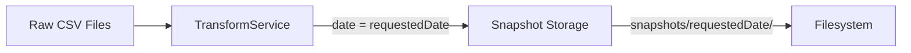
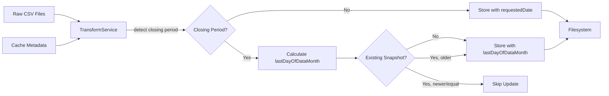
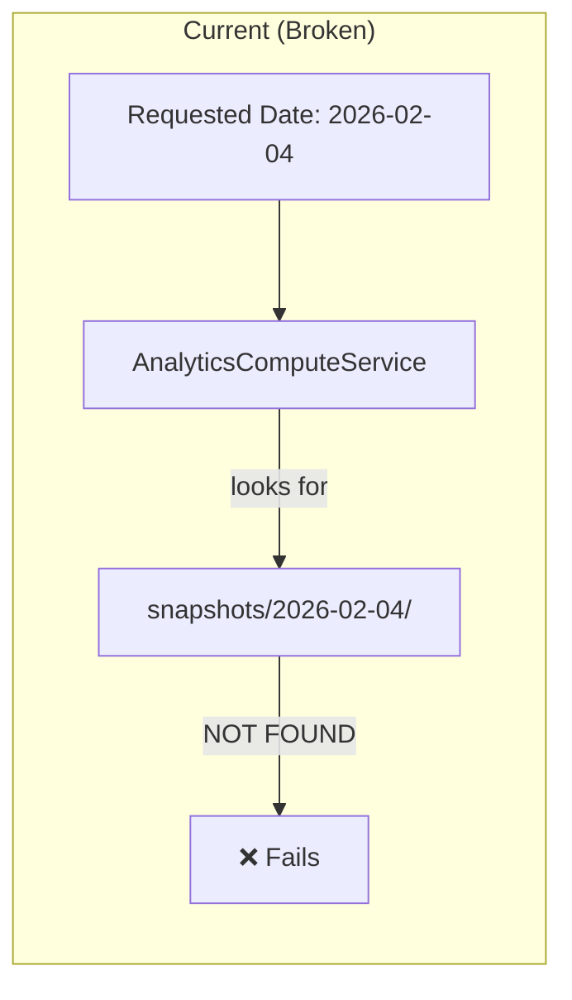
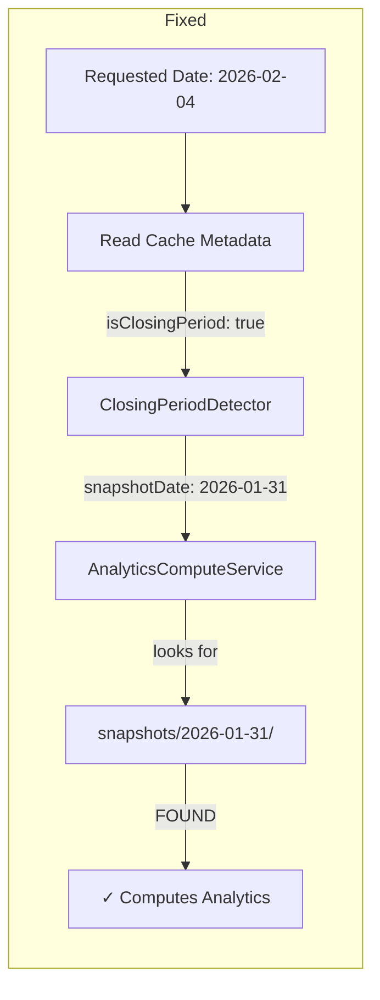

# Design Document: Collector CLI Month-End Compliance

## Overview

This design modifies the TransformService in the collector-cli package to handle month-end closing periods correctly. When the Toastmasters dashboard publishes data for a prior month (closing period), the TransformService will read cache metadata to detect this condition and write snapshots to the last day of the data month rather than the requested date.

The key changes are:

1. Read cache metadata from `raw-csv/{date}/metadata.json` to detect closing periods
2. Calculate the correct snapshot date (last day of data month) for closing period data
3. Include closing period fields in snapshot metadata
4. Implement "newer data wins" logic for closing period snapshot updates

## Architecture

### Current Data Flow



### Proposed Data Flow



## Components and Interfaces

### 1. ClosingPeriodDetector (New Utility)

A utility class to encapsulate closing period detection and date calculation logic. This mirrors the existing `ClosingPeriodDetector` in the backend but is adapted for the collector-cli context.

```typescript
interface ClosingPeriodInfo {
  isClosingPeriod: boolean
  dataMonth: string // "YYYY-MM" format
  collectionDate: string // The actual "As of" date (YYYY-MM-DD)
  snapshotDate: string // Date to use for snapshot directory
  logicalDate: string // Same as snapshotDate for closing periods
}

class ClosingPeriodDetector {
  /**
   * Detect closing period from cache metadata
   */
  detect(
    requestedDate: string,
    metadata: CacheMetadata | null
  ): ClosingPeriodInfo

  /**
   * Calculate the last day of a given month
   */
  getLastDayOfMonth(year: number, month: number): number
}
```

### 2. TransformService Modifications

The TransformService needs the following modifications:

```typescript
interface TransformServiceConfig {
  cacheDir: string
  logger?: Logger
}

class TransformService {
  // New: Read cache metadata for a date
  private async readCacheMetadata(date: string): Promise<CacheMetadata | null>

  // New: Determine snapshot date based on closing period detection
  private determineSnapshotDate(
    requestedDate: string,
    metadata: CacheMetadata | null
  ): ClosingPeriodInfo

  // New: Check if existing snapshot should be updated
  private async shouldUpdateSnapshot(
    snapshotDate: string,
    newCollectionDate: string
  ): Promise<boolean>

  // Modified: Use closing period info for snapshot directory
  async transform(
    options: TransformOperationOptions
  ): Promise<TransformOperationResult>
}
```

### 3. Enhanced Snapshot Metadata

The `SnapshotMetadataFile` interface in shared-contracts already has the required fields:

```typescript
interface SnapshotMetadataFile {
  // Existing fields...
  snapshotId: string
  createdAt: string
  schemaVersion: string
  // ...

  // Closing period fields (already defined)
  isClosingPeriodData?: boolean
  collectionDate?: string
  logicalDate?: string
}
```

## Data Models

### Cache Metadata (Input)

Located at `CACHE_DIR/raw-csv/{date}/metadata.json`:

```typescript
interface CacheMetadata {
  date: string
  isClosingPeriod?: boolean
  dataMonth?: string // "YYYY-MM" format
}
```

### Snapshot Metadata (Output)

Located at `CACHE_DIR/snapshots/{date}/metadata.json`:

```typescript
interface SnapshotMetadataFile {
  snapshotId: string
  createdAt: string
  schemaVersion: string
  calculationVersion: string
  status: 'success' | 'partial' | 'failed'
  configuredDistricts: string[]
  successfulDistricts: string[]
  failedDistricts: string[]
  errors: string[]
  processingDuration: number
  source: string
  dataAsOfDate: string

  // Closing period fields
  isClosingPeriodData?: boolean
  collectionDate?: string
  logicalDate?: string
}
```

## Correctness Properties

_A property is a characteristic or behavior that should hold true across all valid executions of a system—essentially, a formal statement about what the system should do. Properties serve as the bridge between human-readable specifications and machine-verifiable correctness guarantees._

### Property 1: Last Day of Month Calculation

_For any_ valid year and month combination, the `getLastDayOfMonth` function should return the correct last day (handling February in leap years, 30-day months, and 31-day months).

**Validates: Requirements 2.1**

**Rationale for PBT**: This is a mathematical calculation with a complex input space (leap years, varying month lengths). Property-based testing is well-suited to verify correctness across all valid inputs.

### Property 2: Closing Period Snapshot Date Calculation

_For any_ closing period data with a valid data month, the calculated snapshot date should be the last day of that data month, including correct handling of cross-year scenarios (December data collected in January).

**Validates: Requirements 2.2, 2.3, 5.1, 5.2**

**Rationale for PBT**: Date calculations with cross-year boundaries have non-obvious edge cases. Property-based testing can generate diverse date combinations to verify correctness.

## Unit Test Coverage (Non-Property Tests)

The following requirements are best covered by unit tests with well-chosen examples rather than property-based tests:

### Cache Metadata Extraction (Requirements 1.1, 1.2, 1.3, 1.4)

Unit tests with specific examples:

- Valid metadata with `isClosingPeriod: true` and `dataMonth: "2024-12"`
- Valid metadata with `isClosingPeriod: false`
- Missing metadata file (edge case)
- Corrupted/invalid JSON (edge case)

**Rationale**: Simple file reading and JSON parsing. A few well-chosen examples provide sufficient confidence.

### Closing Period Metadata Fields (Requirements 3.1, 3.2, 3.3, 3.4)

Unit tests with specific examples:

- Closing period snapshot includes all three fields correctly
- Non-closing-period snapshot omits or sets fields to false

**Rationale**: Straightforward field assignment. Examples are clearer than properties.

### Newer Data Wins Logic (Requirements 4.1, 4.2, 4.3, 4.4)

Unit tests with specific examples:

- New data is newer → update proceeds
- New data is equal → update skipped
- New data is older → update skipped
- Existing snapshot has no collectionDate → update proceeds

**Rationale**: Simple date comparison with clear boundary conditions. Four examples cover all cases.

### Non-Closing-Period Behavior (Requirements 2.4)

Unit tests with specific examples:

- `isClosingPeriod: false` → snapshot at requested date
- `isClosingPeriod: undefined` → snapshot at requested date

**Rationale**: Default behavior verification. Two examples suffice.

## Error Handling

### Metadata Read Errors

- **File not found**: Treat as non-closing-period data, continue normally
- **JSON parse error**: Log warning, treat as non-closing-period data
- **Missing fields**: Use defaults (isClosingPeriod=false)

### Snapshot Comparison Errors

- **Cannot read existing snapshot metadata**: Allow update (treat as no existing snapshot)
- **Missing collectionDate in existing snapshot**: Allow update

### Date Calculation Errors

- **Invalid dataMonth format**: Log error, fall back to requested date
- **Invalid year/month values**: Log error, fall back to requested date

## Testing Strategy

### Decision Framework Applied

Per the testing steering document, property-based tests are warranted when:

1. Mathematical invariants exist ✓ (last day of month calculation)
2. Complex input spaces with non-obvious edge cases ✓ (date calculations with year boundaries)

Property-based tests are NOT warranted for:

- Simple CRUD operations (metadata reading/writing)
- Integration glue code (wiring components)
- Cases where 3-5 examples fully cover the behavior (newer data wins logic)

### Unit Tests

Unit tests should cover:

- Cache metadata parsing with valid, invalid, and missing data (3-4 examples)
- Closing period detection with specific scenarios (3-4 examples)
- Snapshot date determination for closing vs non-closing periods (2-3 examples)
- Collection date comparison logic (4 examples covering all branches)
- Metadata field population for closing period snapshots (2 examples)

### Property-Based Tests

Property tests (using fast-check) are limited to:

- **Property 1**: Last day of month calculation - mathematical invariant
- **Property 2**: Closing period snapshot date calculation - complex date arithmetic

**Configuration**:

- Library: fast-check
- Minimum iterations: 100 per property test
- Tag format: **Feature: collector-cli-month-end-compliance, Property {number}: {property_text}**

### Integration Tests

Integration tests should verify:

- Full transform flow with closing period cache metadata
- Snapshot directory creation at correct location
- Metadata file contents for closing period snapshots
- Update behavior when existing snapshot exists

## Implementation Notes

### Key Files to Modify

1. **`packages/collector-cli/src/services/TransformService.ts`**
   - Add `readCacheMetadata()` method
   - Add `determineSnapshotDate()` method
   - Add `shouldUpdateSnapshot()` method
   - Modify `transform()` to use closing period logic
   - Modify `writeMetadata()` to include closing period fields

2. **`packages/collector-cli/src/utils/ClosingPeriodDetector.ts`** (New file)
   - Create utility class for closing period detection
   - Port logic from `backend/src/services/ClosingPeriodDetector.ts`

### What Does NOT Change

- **Raw CSV Storage**: CSV files continue to be stored using the "As of" date
- **Collector Logic**: The `ToastmastersCollector` already handles closing period detection
- **Cache Metadata Format**: The existing metadata format is sufficient
- **Shared Contracts**: The `SnapshotMetadataFile` already has the required fields

### Cross-Year Handling

December closing period data collected in January requires special handling:

- Data month: "2024-12" (December 2024)
- Collection date: "2025-01-05" (January 2025)
- Snapshot date: "2024-12-31" (last day of December 2024)

The `parseDataMonth` function must handle this by checking if the data month is greater than the collection month, indicating a year boundary crossing.

### Backward Compatibility

Existing snapshots without closing period metadata will continue to work. The new fields are optional in the schema. When checking for updates, missing `collectionDate` in existing snapshots allows the update to proceed.

---

## AnalyticsComputeService Closing Period Handling

This section extends the month-end compliance feature to the `compute-analytics` command. The TransformService already handles closing periods by writing snapshots to the last day of the data month. The AnalyticsComputeService must also detect closing periods and look for snapshots at the adjusted date.

### Problem Statement

When the backfill pipeline runs during a closing period:

1. `transform` command detects closing period and writes snapshot to `2026-01-31` (last day of data month)
2. `compute-analytics` command looks for snapshot at `2026-02-04` (requested date) and fails with "Snapshot not found"

The fix is to have `compute-analytics` also read cache metadata and adjust the snapshot lookup date.

### Architecture Extension





### AnalyticsComputeService Modifications

The AnalyticsComputeService needs the following modifications:

```typescript
class AnalyticsComputeService {
  // Existing: ClosingPeriodDetector is already available as a utility
  private readonly closingPeriodDetector: ClosingPeriodDetector

  // New: Read cache metadata for a date (same logic as TransformService)
  private async readCacheMetadata(date: string): Promise<CacheMetadata | null>

  // New: Determine the actual snapshot date to use
  private determineSnapshotDate(
    requestedDate: string,
    metadata: CacheMetadata | null
  ): ClosingPeriodInfo

  // Modified: Use closing period info for snapshot lookup
  async compute(
    options: ComputeOperationOptions
  ): Promise<ComputeOperationResult>
}
```

### Key Changes to `compute()` Method

1. At the start of `compute()`, read cache metadata for the requested date
2. Use `ClosingPeriodDetector.detect()` to determine the actual snapshot date
3. Use the adjusted snapshot date for:
   - `snapshotExists()` check
   - `discoverAvailableDistricts()` call
   - `computeDistrictAnalytics()` calls
   - Analytics output directory
4. Report the actual snapshot date used in the JSON output

### Reuse of Existing Components

The implementation reuses:

- **ClosingPeriodDetector**: Already created for TransformService, can be reused directly
- **Cache metadata format**: Same `CacheMetadata` interface
- **readCacheMetadata logic**: Can be extracted to a shared utility or duplicated (simple enough)

### Unit Test Coverage for AnalyticsComputeService

Unit tests with specific examples:

- Cache metadata with `isClosingPeriod: true` → looks for snapshot at last day of data month
- Cache metadata with `isClosingPeriod: false` → looks for snapshot at requested date
- Missing cache metadata → looks for snapshot at requested date
- Cross-year scenario (December data in January) → looks for snapshot at December 31 of prior year

**Rationale**: The ClosingPeriodDetector is already tested with property-based tests. The AnalyticsComputeService integration only needs unit tests to verify correct wiring.

### Integration Test Coverage

Integration tests should verify:

- Full compute-analytics flow with closing period cache metadata
- Analytics written to correct directory (alongside snapshot)
- JSON output reports actual snapshot date used

### Error Handling

- **Cache metadata not found**: Fall back to requested date (non-closing-period behavior)
- **Cache metadata parse error**: Log warning, fall back to requested date
- **Snapshot not found at adjusted date**: Report error with helpful message indicating the expected location
