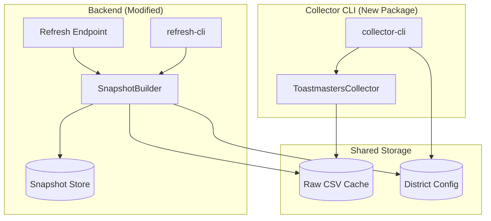

# Design Document: Collector CLI Separation

## Overview

This design separates the Toastmasters dashboard scraping functionality from the backend application into a standalone CLI tool. The architecture creates two independent components that communicate through a shared Raw CSV Cache:

1. **Collector CLI (`collector-cli`)**: A standalone Node.js CLI tool that scrapes data from the Toastmasters dashboard and stores it in the Raw CSV Cache
2. **SnapshotBuilder Service**: A new backend service that creates snapshots exclusively from cached CSV data

This separation follows the Unix philosophy of "do one thing well" and enables independent scheduling, scaling, and deployment of scraping and snapshot creation operations.

## Architecture



## Components and Interfaces

### Collector CLI Package Structure

```
packages/collector-cli/
├── package.json
├── tsconfig.json
├── src/
│   ├── index.ts              # CLI entry point
│   ├── cli.ts                # Commander.js CLI definition
│   ├── CollectorOrchestrator.ts # Orchestrates scraping operations
│   ├── services/
│   │   ├── ToastmastersCollector.ts  # Moved from backend
│   │   └── index.ts
│   ├── types/
│   │   └── index.ts
│   └── utils/
│       └── logger.ts
└── bin/
    └── collector-cli           # Executable entry point
```

### CollectorOrchestrator Interface

```typescript
interface CollectorOrchestratorConfig {
  cacheDir: string
  districtConfigPath: string
  timeout: number
  verbose: boolean
}

interface ScrapeOptions {
  date?: string // YYYY-MM-DD format, defaults to current date
  districts?: string[] // Specific districts to scrape, defaults to all configured
  force?: boolean // Force re-scrape even if cache exists
}

interface ScrapeResult {
  success: boolean
  date: string
  districtsProcessed: string[]
  districtsSucceeded: string[]
  districtsFailed: string[]
  cacheLocations: string[]
  errors: Array<{
    districtId: string
    error: string
    timestamp: string
  }>
  duration_ms: number
}

interface CollectorOrchestrator {
  scrape(options: ScrapeOptions): Promise<ScrapeResult>
  validateConfiguration(): Promise<{ isValid: boolean; errors: string[] }>
  getCacheStatus(date: string): Promise<{
    date: string
    cachedDistricts: string[]
    missingDistricts: string[]
  }>
}
```

### SnapshotBuilder Interface

```typescript
interface SnapshotBuilderConfig {
  cacheDir: string
  snapshotDir: string
}

interface BuildOptions {
  date?: string // YYYY-MM-DD format, defaults to current date
  skipCurrentPointerUpdate?: boolean // For backfill operations
}

interface BuildResult {
  success: boolean
  snapshotId?: string
  date: string
  districtsIncluded: string[]
  districtsMissing: string[]
  status: 'success' | 'partial' | 'failed'
  errors: string[]
  duration_ms: number
}

interface SnapshotBuilder {
  build(options: BuildOptions): Promise<BuildResult>
  getCacheAvailability(date: string): Promise<{
    date: string
    available: boolean
    cachedDistricts: string[]
    configuredDistricts: string[]
    missingDistricts: string[]
  }>
}
```

### CLI Interface

```bash
# Collector CLI
collector-cli scrape [options]
  --date <YYYY-MM-DD>     Target date for scraping (default: today)
  --districts <list>      Comma-separated district IDs to scrape
  --force                 Force re-scrape even if cache exists
  --timeout <seconds>     Maximum duration (default: 300)
  --verbose               Enable detailed logging
  --config <path>         Alternative configuration file
  --help                  Display help

# Backend refresh CLI (modified)
refresh-cli [options]
  --date <YYYY-MM-DD>     Build snapshot from cached data for date
  --verbose               Enable detailed logging
  --timeout <seconds>     Maximum duration (default: 300)
  --help                  Display help
```

## Data Models

### Cache Metadata Extension

The existing `RawCSVCacheMetadata` will be used without modification. The Collector CLI will populate all metadata fields including:

```typescript
interface RawCSVCacheMetadata {
  date: string // YYYY-MM-DD
  fetchedAt: string // ISO timestamp
  source: string // 'toastmasters-dashboard'
  dataMonth?: string // YYYY-MM for closing period detection
  isClosingPeriod?: boolean // True if data month differs from fetch date
  integrity: {
    fileCount: number
    totalSize: number
    checksums: Record<string, string>
  }
  downloadStats: {
    cacheHits: number
    cacheMisses: number
    downloads: number
  }
}
```

### Scrape Summary Output

```typescript
interface ScrapeSummary {
  timestamp: string
  date: string
  status: 'success' | 'partial' | 'failed'
  districts: {
    total: number
    succeeded: number
    failed: number
    skipped: number
  }
  cache: {
    directory: string
    filesCreated: number
    totalSize: number
  }
  errors: Array<{
    districtId: string
    error: string
  }>
  duration_ms: number
}
```

## Correctness Properties

_A property is a characteristic or behavior that should hold true across all valid executions of a system—essentially, a formal statement about what the system should do. Properties serve as the bridge between human-readable specifications and machine-verifiable correctness guarantees._

### Property 1: CLI Date Parsing Validity

_For any_ valid date string in YYYY-MM-DD format passed to the `--date` option, the Collector CLI SHALL accept it and use it as the target date for scraping.

**Validates: Requirements 1.3**

### Property 2: Scrape Output Contains Required Fields

_For any_ successful or partial scrape operation, the JSON output SHALL contain: timestamp, date, status, districts processed, cache locations, and duration.

**Validates: Requirements 1.9**

### Property 3: Partial Failure Resilience

_For any_ scrape operation where at least one district fails, the Collector CLI SHALL continue processing remaining districts and include all failures in the summary output.

**Validates: Requirements 1.10**

### Property 4: Exit Code Consistency

_For any_ scrape operation, the exit code SHALL be 0 if all districts succeed, 1 if some districts fail, and 2 if all districts fail or a fatal error occurs.

**Validates: Requirements 1.11**

### Property 5: Cache Storage Structure

_For any_ successfully scraped CSV data, the file SHALL be stored in the Raw CSV Cache directory structure at the path `{cacheDir}/raw-csv/{date}/{type}_{districtId}.csv`.

**Validates: Requirements 2.1**

### Property 6: Cache Metadata Completeness

_For any_ stored CSV file, the associated metadata SHALL include: scrape timestamp, source identifier, and data month.

**Validates: Requirements 2.2**

### Property 7: Closing Period Detection

_For any_ CSV content containing a footer with "Month of MMM, As of MM/DD/YYYY" pattern, the cache metadata SHALL correctly identify if it's a closing period (data month differs from collection month).

**Validates: Requirements 2.3**

### Property 8: Atomic Write Guarantee

_For any_ cache write operation, either the complete file and metadata are written, or no partial files remain in the cache directory.

**Validates: Requirements 2.4**

### Property 9: Cache Skip Behavior

_For any_ scrape operation where cache already exists for the date and district, the Collector CLI SHALL skip scraping unless the `--force` flag is provided.

**Validates: Requirements 2.6**

### Property 10: SnapshotBuilder Isolation

_For any_ snapshot build operation, the SnapshotBuilder SHALL NOT make any network requests or invoke browser automation—it SHALL only read from the local cache.

**Validates: Requirements 3.2, 4.2**

### Property 11: Snapshot Normalization and Ranking

_For any_ valid cached CSV data, the SnapshotBuilder SHALL produce a snapshot with normalized district data and calculated rankings.

**Validates: Requirements 3.3**

### Property 12: Partial Snapshot Creation

_For any_ build operation where some configured districts have cached data and others don't, the SnapshotBuilder SHALL create a partial snapshot containing available districts and record missing districts in metadata.

**Validates: Requirements 3.5**

### Property 13: Metadata Preservation

_For any_ cached data with closing period metadata, the resulting snapshot SHALL preserve the isClosingPeriod, collectionDate, and dataMonth fields.

**Validates: Requirements 3.7**

### Property 14: Cache Detection

_For any_ new cache entry created by the Collector CLI, the Backend SHALL detect and be able to use that data on subsequent refresh operations.

**Validates: Requirements 5.4**

### Property 15: Retry Behavior

_For any_ network error during scraping, the Collector CLI SHALL retry with exponential backoff (at least 3 attempts) before marking the district as failed.

**Validates: Requirements 6.1**

### Property 16: Cache Integrity Validation

_For any_ cached CSV file, the SnapshotBuilder SHALL validate the file's checksum against metadata before processing, and skip corrupted files with appropriate error logging.

**Validates: Requirements 6.3, 6.4**

### Property 17: Configuration Consistency

_For any_ configuration value (cache directory, district list), both the Collector CLI and Backend SHALL read from the same source and produce identical values.

**Validates: Requirements 7.1, 7.2**

### Property 18: Configuration Refresh

_For any_ change to the district configuration file, the Collector CLI SHALL use the updated configuration on its next invocation.

**Validates: Requirements 7.3**

## Error Handling

### Collector CLI Error Handling

| Error Type              | Handling Strategy                                  | Exit Code   |
| ----------------------- | -------------------------------------------------- | ----------- |
| Invalid CLI arguments   | Display error and usage help                       | 2           |
| Configuration not found | Display error with config path                     | 2           |
| Network timeout         | Retry with exponential backoff, then fail district | 1 (partial) |
| Circuit breaker open    | Report status, skip remaining districts            | 1 or 2      |
| Cache write failure     | Log error, mark district as failed                 | 1 (partial) |
| All districts failed    | Report all errors                                  | 2           |

### SnapshotBuilder Error Handling

| Error Type           | Handling Strategy                 | Result            |
| -------------------- | --------------------------------- | ----------------- |
| No cache for date    | Return error with available dates | Failed            |
| Partial cache        | Create partial snapshot           | Partial           |
| Corrupted cache file | Skip file, log error, continue    | Partial           |
| Validation failure   | Include in snapshot errors        | Partial or Failed |
| Write failure        | Throw error, no snapshot created  | Failed            |

## Testing Strategy

### Unit Tests

Unit tests will verify individual component behavior:

- CLI argument parsing and validation
- Date format validation
- District ID parsing
- Configuration loading
- Cache path construction
- Metadata serialization/deserialization

### Property-Based Tests

Property-based tests will verify universal properties using fast-check:

- **Property 1**: Date parsing accepts all valid YYYY-MM-DD strings
- **Property 4**: Exit codes match expected values for all outcome combinations
- **Property 7**: Closing period detection correctly identifies month mismatches
- **Property 9**: Cache skip behavior respects force flag
- **Property 10**: SnapshotBuilder makes no network calls
- **Property 17**: Configuration values are consistent between components

### Integration Tests

Integration tests will verify component interactions:

- Collector CLI writes to cache, SnapshotBuilder reads from cache
- End-to-end flow from scrape to snapshot creation
- Error propagation through the system

### Test Configuration

- Property tests: Minimum 100 iterations per property
- Integration tests: Use isolated test cache directories
- Mock external dependencies (Toastmasters dashboard) for deterministic testing
