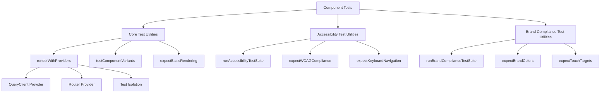

# Design Document

## Overview

The Test Suite Optimization feature will systematically reduce code duplication and improve maintainability across the existing 1,090+ test suite while maintaining comprehensive coverage. The design leverages shared testing utilities to eliminate redundant patterns, standardize testing approaches, and provide automatic brand compliance and accessibility validation.

## Architecture

### Current State Analysis

The existing test suite demonstrates excellent coverage and performance:

- **1,090+ tests** across 104 test files
- **99.8% pass rate** with 20-second execution time
- **Comprehensive coverage** including unit, integration, and property-based tests

However, analysis reveals significant optimization opportunities:

- **70+ redundant test patterns** across component tests
- **47 "should render" tests** using identical patterns
- **23 "should display" tests** with similar structures
- **Inconsistent accessibility and brand compliance testing**

### Target Architecture

The optimized architecture will implement a three-tier testing utility system:



## Components and Interfaces

### Core Test Utilities (`componentTestUtils.ts`)

**Purpose**: Provide fundamental testing patterns for component rendering and interaction.

**Key Functions**:

- `renderWithProviders(component, options)`: Renders components with all necessary providers
- `testComponentVariants(Component, variants)`: Parameterized testing for component variants
- `expectBasicRendering(component, testId)`: Standard rendering validation
- `testLoadingStates(Component, loadingProps, loadedProps)`: Loading state validation
- `testErrorStates(Component, errorProps, expectedMessage)`: Error handling validation

**Interface**:

```typescript
interface ComponentVariant<T> {
  name: string
  props: T
  expectedText?: string
  expectedClass?: string
  expectedAttribute?: { name: string; value: string }
}

interface TestUtilityOptions {
  skipProviders?: boolean
  customProviders?: React.ComponentType<any>[]
  testId?: string
}
```

### Accessibility Test Utilities (`accessibilityTestUtils.ts`)

**Purpose**: Ensure WCAG AA compliance and keyboard accessibility across all components.

**Key Functions**:

- `runAccessibilityTestSuite(component)`: Comprehensive accessibility validation
- `expectWCAGCompliance(component)`: WCAG AA standard validation
- `expectKeyboardNavigation(component)`: Keyboard accessibility testing
- `expectColorContrast(component)`: Color contrast validation
- `expectScreenReaderCompatibility(component)`: Screen reader support testing

**Validation Criteria**:

- Minimum 4.5:1 contrast ratio for normal text
- 44px minimum touch targets for interactive elements
- Proper ARIA attributes and landmarks
- Keyboard navigation support

### Brand Compliance Test Utilities (`brandComplianceTestUtils.ts`)

**Purpose**: Validate adherence to Toastmasters International brand guidelines.

**Key Functions**:

- `runBrandComplianceTestSuite(component)`: Complete brand validation
- `expectBrandColors(component)`: Toastmasters color palette validation
- `expectBrandTypography(component)`: Typography compliance testing
- `expectTouchTargets(component)`: 44px minimum touch target validation
- `expectGradientUsage(component)`: Maximum one gradient per screen validation

**Brand Standards**:

- Toastmasters color palette: Loyal Blue, True Maroon, Cool Gray, Happy Yellow
- Typography: Montserrat (headlines), Source Sans 3 (body)
- Touch targets: 44px minimum for interactive elements
- Gradient constraints: Maximum one per screen

## Data Models

### Test Pattern Classification

```typescript
interface TestPattern {
  id: string
  type:
    | 'render'
    | 'display'
    | 'interaction'
    | 'variant'
    | 'accessibility'
    | 'brand'
  frequency: number
  codeLines: number
  migrationComplexity: 'low' | 'medium' | 'high'
  utilityFunction: string
}

interface MigrationPlan {
  phase: 1 | 2 | 3
  patterns: TestPattern[]
  estimatedReduction: number
  riskLevel: 'low' | 'medium' | 'high'
}
```

### Optimization Metrics

```typescript
interface OptimizationMetrics {
  beforeOptimization: {
    totalLines: number
    testFiles: number
    redundantPatterns: number
    executionTime: number
  }
  afterOptimization: {
    totalLines: number
    testFiles: number
    sharedUtilities: number
    executionTime: number
  }
  improvements: {
    codeReduction: number
    consistencyScore: number
    maintainabilityIndex: number
  }
}
```

## Correctness Properties

_A property is a characteristic or behavior that should hold true across all valid executions of a system-essentially, a formal statement about what the system should do. Properties serve as the bridge between human-readable specifications and machine-verifiable correctness guarantees._

Based on the prework analysis, the following correctness properties will validate the test suite optimization:

### Utility Function Properties

**Property 1: Test utility function availability**
_For any_ test utility module, all required functions (renderWithProviders, testComponentVariants, runBrandComplianceTestSuite, runAccessibilityTestSuite, expectBasicRendering) should be exported and callable
**Validates: Requirements 1.1, 1.2, 1.3, 1.4, 1.5**

**Property 2: Consistent component rendering**
_For any_ React component, renderWithProviders should render it successfully with all necessary providers without throwing errors
**Validates: Requirements 1.1**

**Property 3: Variant testing effectiveness**
_For any_ component with multiple variants, testComponentVariants should generate individual test cases for each variant and validate expected properties
**Validates: Requirements 1.2**

**Property 4: Brand compliance detection**
_For any_ component with brand violations, runBrandComplianceTestSuite should detect and report the violations accurately
**Validates: Requirements 1.3, 8.4**

**Property 5: Accessibility compliance detection**
_For any_ component with accessibility violations, runAccessibilityTestSuite should detect and report the violations accurately
**Validates: Requirements 1.4, 8.4**

### Migration Properties

**Property 6: Pattern replacement completeness**
_For any_ migrated test file, old redundant patterns should be replaced with shared utility calls while maintaining identical test coverage
**Validates: Requirements 2.1, 2.2, 2.3, 2.4, 2.5**

**Property 7: Test coverage preservation**
_For any_ test suite before and after migration, the coverage metrics should be equivalent or improved
**Validates: Requirements 2.5, 8.1**

### Code Reduction Properties

**Property 8: Minimum code reduction achievement**
_For any_ optimized test suite, the total lines of code should be reduced by at least 20% compared to the original
**Validates: Requirements 3.1**

**Property 9: Specific pattern reduction**
_For any_ optimized test suite, the 47 "should render" patterns and 23 "should display" patterns should be replaced with shared utility calls
**Validates: Requirements 3.2, 3.3**

**Property 10: Performance maintenance**
_For any_ optimized test suite, the execution time should remain under 25 seconds for the complete suite
**Validates: Requirements 3.5, 6.1**

### Quality Improvement Properties

**Property 11: Universal compliance testing**
_For any_ component test after optimization, it should include both brand compliance and accessibility validation
**Validates: Requirements 4.1, 4.2**

**Property 12: Test pass rate maintenance**
_For any_ optimized test suite, the pass rate should maintain or exceed 99.8%
**Validates: Requirements 4.4**

**Property 13: Consistent error messaging**
_For any_ test failure in the optimized suite, error messages should follow consistent patterns and provide clear diagnostic information
**Validates: Requirements 4.3**

### Performance Properties

**Property 14: Parallel execution preservation**
_For any_ test suite using shared utilities, parallel test execution should work correctly without race conditions or shared state issues
**Validates: Requirements 6.2**

**Property 15: Minimal utility overhead**
_For any_ test using shared utilities, the execution time overhead should be less than 5% compared to equivalent direct testing
**Validates: Requirements 6.3**

**Property 16: Memory efficiency maintenance**
_For any_ test suite using shared utilities, memory consumption should not exceed the original test suite by more than 10%
**Validates: Requirements 6.4**

### Utility Compatibility Properties

**Property 17: Cross-component compatibility**
_For any_ React component type (functional, class, with hooks, without hooks), shared utilities should work correctly without modification
**Validates: Requirements 8.3**

**Property 18: Property-based test preservation**
_For any_ existing property-based test, it should continue to function correctly after optimization and maintain its effectiveness in catching violations
**Validates: Requirements 8.5**

## Error Handling

### Migration Error Recovery

The optimization process must handle various error scenarios:

**Test Migration Failures**:

- Automatic rollback to previous test version if migration fails
- Detailed error reporting for manual intervention
- Validation of test functionality before committing changes

**Utility Function Errors**:

- Graceful degradation when utilities encounter unexpected component structures
- Clear error messages indicating the specific utility and component causing issues
- Fallback to basic testing patterns when advanced utilities fail

**Performance Degradation**:

- Automatic detection of performance regressions during optimization
- Rollback mechanisms if execution time exceeds thresholds
- Memory leak detection and prevention in shared utilities

### Validation Failures

**Coverage Regression Detection**:

- Automatic comparison of test coverage before and after migration
- Alerts when coverage drops below acceptable thresholds
- Detailed reporting of uncovered code paths

**Brand/Accessibility Test Failures**:

- Clear reporting of compliance violations with specific remediation guidance
- Integration with existing CI/CD pipelines for automated failure detection
- Documentation of known exceptions and their justifications

## Testing Strategy

### Dual Testing Approach

The test suite optimization will employ both unit testing and property-based testing:

**Unit Tests**:

- Verify specific utility functions work correctly with known inputs
- Test edge cases and error conditions for each utility
- Validate migration scripts and automation tools
- Test integration points between utilities and existing test infrastructure

**Property-Based Tests**:

- Validate universal properties across all component types and test scenarios
- Generate random component configurations to test utility robustness
- Verify performance characteristics across varying test suite sizes
- Test migration effectiveness across different test pattern types

**Testing Configuration**:

- Minimum 100 iterations per property test to ensure comprehensive coverage
- Each property test tagged with format: **Feature: test-suite-optimization, Property {number}: {property_text}**
- Integration with existing Vitest configuration for seamless execution
- Parallel execution support to maintain fast feedback cycles

**Test Organization**:

- Utility tests co-located with utility implementations
- Migration validation tests in dedicated test suites
- Performance benchmarking tests for continuous monitoring
- Integration tests for end-to-end optimization workflow validation
