# Design Document: Trends Tab Historical Data Fix

## Overview

Three bugs in the Trends tab produce incorrect or missing data displays. The fixes span three layers of the system:

1. **Backend (analyticsSummary route):** When the time-series query returns zero data points (because the selected date falls before the first sparse data point), the route expands the query to the full program year so the frontend receives whatever data exists.

2. **Frontend (usePaymentsTrend hook):** The hook hardcodes `getCurrentProgramYear()` to identify the "current year" trend. When the user selects a different program year (e.g., 2024-2025), the hook still looks for data under the 2025-2026 label, finds nothing, and shows "No Payment Data Available". The fix passes the selected program year into the hook.

3. **Scraper-CLI (AnalyticsComputeService) + Frontend (YearOverYearComparison):** The scraper passes only one snapshot to `computeYearOverYear`, so `findSnapshotForDate` returns the same snapshot for both current and previous year, producing all-zero changes. The fix loads the previous year's snapshot. Additionally, the backend sends absolute `change` values but the frontend interprets them as `percentageChange` values — the fix aligns the contract by sending `percentageChange`.

## Architecture

```mermaid
graph TD
    subgraph "Bug 1: Sparse Trend Data"
        A1[Frontend requests analytics-summary<br/>startDate=2025-07-01, endDate=2025-09-26]
        A2[analyticsSummary route]
        A3[TimeSeriesIndexService.getTrendData]
        A4{0 data points?}
        A5[Re-query with full program year range<br/>2025-07-01 to 2026-06-30]
        A6[Return available data points]
        A1 --> A2 --> A3 --> A4
        A4 -->|Yes| A5 --> A6
        A4 -->|No| A6
    end

    subgraph "Bug 2: Payments Program Year"
        B1[DistrictDetailPage]
        B2[usePaymentsTrend hook]
        B3[selectedProgramYear from page state]
        B1 -->|passes selectedProgramYear| B2
        B3 -->|replaces getCurrentProgramYear| B2
    end

    subgraph "Bug 3: YoY Snapshot Loading"
        C1[AnalyticsComputeService.computeDistrictAnalytics]
        C2[loadDistrictSnapshot for current date]
        C3[Find previous year snapshot date]
        C4[loadDistrictSnapshot for previous year]
        C5[Pass both snapshots to computeYearOverYear]
        C1 --> C2 --> C3 --> C4 --> C5
    end

    subgraph "Bug 3b: YoY Contract Alignment"
        D1[analyticsSummary route]
        D2[Send percentageChange instead of change]
        D3[YearOverYearComparison component]
        D4[Correctly derives previous values]
        D1 --> D2 --> D3 --> D4
    end
```



## Components and Interfaces

### Bug 1: Backend — `analyticsSummary.ts`

**File:** `backend/src/routes/districts/analyticsSummary.ts`

**Change:** After the initial `timeSeriesIndexService.getTrendData()` call, if the result is empty, re-query using the full program year date range for the `effectiveEndDate`.

```typescript
// Current: single query with user-provided date range
const timeSeriesData = await timeSeriesIndexService.getTrendData(
  districtId,
  effectiveStartDate,
  effectiveEndDate
)

// Fixed: fallback to full program year if empty
let timeSeriesData = await timeSeriesIndexService.getTrendData(
  districtId,
  effectiveStartDate,
  effectiveEndDate
)

if (timeSeriesData.length === 0) {
  // Expand to full program year boundaries
  const programYearStart = getProgramYearStartDate(effectiveEndDate)
  const programYearEnd = getProgramYearEndDate(effectiveEndDate)
  timeSeriesData = await timeSeriesIndexService.getTrendData(
    districtId,
    programYearStart,
    programYearEnd
  )
}
```

A `getProgramYearEndDate` helper is added alongside the existing `getProgramYearStartDate`.

The response `dateRange` field continues to reflect the original requested range (not the expanded range), per Requirement 1.2.

### Bug 2: Frontend — `usePaymentsTrend.ts`

**File:** `frontend/src/hooks/usePaymentsTrend.ts`

**Change:** Add a `selectedProgramYear` parameter. Use it instead of `getCurrentProgramYear()` when identifying the "current year" in grouped data.

```typescript
// Current signature
export function usePaymentsTrend(
  districtId: string | null,
  programYearStartDate?: string,
  endDate?: string,
  aggregatedPaymentsTrend?: Array<{ date: string; payments: number }>
): UsePaymentsTrendResult

// Fixed signature — add selectedProgramYear
export function usePaymentsTrend(
  districtId: string | null,
  programYearStartDate?: string,
  endDate?: string,
  aggregatedPaymentsTrend?: Array<{ date: string; payments: number }>,
  selectedProgramYear?: ProgramYear
): UsePaymentsTrendResult
```

Inside the hook, replace:

```typescript
const currentProgramYear = getCurrentProgramYear()
```

with:

```typescript
const currentProgramYear = selectedProgramYear ?? getCurrentProgramYear()
```

**File:** `frontend/src/pages/DistrictDetailPage.tsx`

**Change:** Pass `effectiveProgramYear` to `usePaymentsTrend`:

```typescript
const { data: paymentsTrendData, isLoading: isLoadingPaymentsTrend } =
  usePaymentsTrend(
    hasValidDates ? districtId || null : null,
    undefined,
    effectiveEndDate ?? undefined,
    aggregatedAnalytics?.trends?.payments,
    effectiveProgramYear ?? undefined // NEW: pass selected program year
  )
```

### Bug 3a: Scraper-CLI — `AnalyticsComputeService.ts`

**File:** `packages/scraper-cli/src/services/AnalyticsComputeService.ts`

**Change:** In `computeDistrictAnalytics`, after loading the current snapshot, attempt to load the previous program year's snapshot for the same district. Pass both snapshots to `AnalyticsComputer.computeDistrictAnalytics`.

The previous year's snapshot date is determined by:

1. Parse the current snapshot date to find its program year
2. Find the equivalent date one year prior (using `findPreviousProgramYearDate`)
3. Look for a snapshot directory matching that date
4. If exact date not found, scan the snapshots directory for the closest date in the previous program year

```typescript
// In computeDistrictAnalytics, after loading current snapshot:
const previousYearDate = findPreviousProgramYearDate(date)
const previousSnapshot = await this.loadDistrictSnapshot(
  previousYearDate,
  districtId
)

// Pass both snapshots (or just current if previous not found)
const snapshots = previousSnapshot ? [previousSnapshot, snapshot] : [snapshot]

const computationResult = await this.analyticsComputer.computeDistrictAnalytics(
  districtId,
  snapshots,
  { allDistrictsRankings: allDistrictsRankings ?? undefined }
)
```

The `findPreviousProgramYearDate` function already exists in `AnalyticsUtils.ts` and simply subtracts one year from the date string.

**Graceful degradation:** If `loadDistrictSnapshot` returns null for the previous year (file doesn't exist), we fall back to the current single-snapshot behavior. The `computeYearOverYear` method already handles this — with only one snapshot, `findSnapshotForDate` for the previous year date returns the same snapshot, but now with two distinct snapshots it will correctly find different data.

### Bug 3b: Backend — `analyticsSummary.ts` (YoY contract fix)

**File:** `backend/src/routes/districts/analyticsSummary.ts`

**Change:** When constructing the `yearOverYear` response field, use `percentageChange` instead of `change`:

```typescript
// Current (sends absolute change)
yearOverYear = {
  membershipChange: yoyComparison.metrics.membership.change,
  distinguishedChange: yoyComparison.metrics.distinguishedClubs.change,
  clubHealthChange: yoyComparison.metrics.clubHealth.thrivingClubs.change,
}

// Fixed (sends percentage change)
yearOverYear = {
  membershipChange: yoyComparison.metrics.membership.percentageChange,
  distinguishedChange:
    yoyComparison.metrics.distinguishedClubs.percentageChange,
  clubHealthChange:
    yoyComparison.metrics.clubHealth.thrivingClubs.percentageChange,
}
```

The `YearOverYearComparison` component already interprets these values as percentage changes (it divides by 100 and uses `1 + value/100`), so no frontend change is needed for this part.

## Data Models

No new data models are introduced. The existing types are sufficient:

- **`MetricComparison`** (analytics-core/types.ts): Already has both `change` (absolute) and `percentageChange` (percentage) fields. The backend was reading the wrong field.
- **`YearOverYearData`** (analytics-core/types.ts): Already supports `dataAvailable: false` with a `message` field for when previous year data is unavailable.
- **`ProgramYear`** (frontend/utils/programYear.ts): Already exists and is used throughout the frontend. The `usePaymentsTrend` hook just needs to accept it as a parameter.
- **`AggregatedAnalyticsResponse`** (analyticsSummary.ts): The `yearOverYear` field shape doesn't change — it still has `membershipChange`, `distinguishedChange`, `clubHealthChange` as numbers. The semantic meaning changes from absolute to percentage, which aligns with how the frontend already interprets them.

## Correctness Properties

_A property is a characteristic or behavior that should hold true across all valid executions of a system — essentially, a formal statement about what the system should do. Properties serve as the bridge between human-readable specifications and machine-verifiable correctness guarantees._

Based on the prework analysis, four properties emerge after eliminating redundancies:

Property 1: Response dateRange preserves original request
_For any_ analytics-summary request with startDate and endDate parameters, the response `dateRange` field SHALL equal the originally requested date range, regardless of whether the backend expanded the time-series query internally.
**Validates: Requirements 1.2**

Property 2: Selected program year determines current trend
_For any_ set of payment trend data spanning multiple program years and any selected program year, the `currentYearTrend` returned by `usePaymentsTrend` SHALL contain only data points belonging to the selected program year, and `multiYearData.currentYear.label` SHALL equal the selected program year's label.
**Validates: Requirements 2.1, 2.2**

Property 3: Two-snapshot YoY produces distinct metrics
_For any_ two distinct `DistrictStatistics` snapshots (current and previous) with different membership totals, `computeYearOverYear` SHALL produce a `MetricComparison` where `metrics.membership.current` equals the current snapshot's total membership and `metrics.membership.previous` equals the previous snapshot's total membership, and `change` equals `current - previous`.
**Validates: Requirements 3.2**

Property 4: Route sends percentageChange values
_For any_ pre-computed `YearOverYearData` with `dataAvailable: true`, the analytics-summary route's `yearOverYear` response field SHALL contain `membershipChange` equal to `metrics.membership.percentageChange`, `distinguishedChange` equal to `metrics.distinguishedClubs.percentageChange`, and `clubHealthChange` equal to `metrics.clubHealth.thrivingClubs.percentageChange`.
**Validates: Requirements 4.1**

## Error Handling

### Bug 1: Sparse Trend Data Fallback

- If the initial time-series query returns empty, the route retries with the full program year range. If that also returns empty, an empty `trends.membership` array is returned — no error.
- The `try/catch` around `timeSeriesIndexService.getTrendData()` already handles read failures gracefully (logs warning, continues with empty trend data).

### Bug 3a: Previous Year Snapshot Loading

- If `loadDistrictSnapshot` returns `null` for the previous year date (file doesn't exist), the service falls back to passing only the current snapshot. The `computeYearOverYear` method then produces `dataAvailable: false`.
- If `loadDistrictSnapshot` throws (e.g., corrupted JSON), the existing `try/catch` in `computeDistrictAnalytics` catches it. To be more granular, the previous year load is wrapped in its own try/catch so a failure there doesn't abort the entire analytics computation.

### Bug 3b: YoY Contract

- When `yoyComparison.metrics` is undefined (dataAvailable is false), the existing guard `if (yoyComparison && yoyComparison.dataAvailable && yoyComparison.metrics)` prevents accessing undefined fields. No change needed.

## Testing Strategy

Per the testing steering document: "Prefer the simplest test that provides confidence" and "Property tests are for invariants, not for everything."

### Unit Tests (Vitest)

**Bug 1 — analyticsSummary sparse data fallback:**

- Test that when `getTrendData` returns empty for the original range but non-empty for the full program year, the route returns the expanded data. (Example test, mocked TimeSeriesIndexService)
- Test that the response `dateRange` always reflects the original request, not the expanded range.
- Edge case: both original and expanded queries return empty — verify empty array, no error.

**Bug 2 — usePaymentsTrend selected program year:**

- Test that passing `selectedProgramYear` for 2024-2025 extracts data under the "2024-2025" label as `currentYearTrend`.
- Test that when no `selectedProgramYear` is passed, the hook falls back to `getCurrentProgramYear()`.
- Edge case: selected program year has no data — verify empty `currentYearTrend` and null `multiYearData`.

**Bug 3a — AnalyticsComputeService previous snapshot loading:**

- Test that when a previous year snapshot exists, `computeDistrictAnalytics` passes 2 snapshots to `AnalyticsComputer`.
- Test that when no previous year snapshot exists, it falls back to 1 snapshot.
- Test that a read error on the previous year snapshot is caught and doesn't abort computation.

**Bug 3b — YoY contract alignment:**

- Test that the route maps `percentageChange` (not `change`) to the response `yearOverYear` fields.

### Property-Based Tests

Per the testing steering document: "Property tests are a tool, not a default" and "Would 5 well-chosen examples provide equivalent confidence? If yes, prefer the examples."

All four correctness properties are best validated with unit test examples rather than property-based tests:

- **Properties 1 and 4** verify simple field mappings in route handlers — no complex input space.
- **Property 2** tests grouping/filtering by program year label — straightforward logic where 3-5 examples (matching year, non-matching year, multiple years, empty data) fully cover the behavior.
- **Property 3** tests that two distinct snapshots produce distinct metrics — the `computeYearOverYear` computation logic is already well-tested. The fix is about passing the right inputs (two snapshots instead of one), which is wiring, not algorithmic complexity.

No property-based tests are warranted for this fix. This aligns with the steering guidance: these are bug fixes to data wiring and field mapping, not complex input spaces with mathematical invariants.
