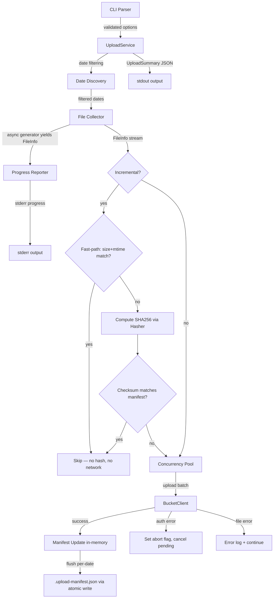

# Design Document: Upload Performance

## Overview

This design enhances the scraper-cli `upload` command to handle large-scale data (2,362+ snapshot dates, tens of thousands of files) by addressing six performance and usability bottlenecks:

1. Unnecessary checksum computation (now conditional: only for incremental comparisons)
2. No progress feedback during long operations
3. No date range filtering (only single date or all dates)
4. Per-file HTTP round-trips to GCS in incremental mode
5. Sequential file uploads
6. All files buffered in memory before processing

Additionally, the design introduces dependency injection seams for testability (FileSystem, Hasher, BucketClient, Clock, ProgressReporter).

The changes are confined to `packages/scraper-cli/` — specifically `UploadService.ts`, `cli.ts`, and `types/index.ts`. No backend changes are needed (this is a CLI-only enhancement, consistent with the data-computation-separation steering).

## Architecture

The enhanced upload pipeline follows a streaming architecture with injectable dependencies:



Key architectural decisions:
- **Dependency injection** for FileSystem, Hasher, BucketClient, Clock, ProgressReporter — enables unit testing with fakes
- **Async generators** replace array-based file collection, keeping memory flat
- **Local manifest with fast-path** (size+mtime check before hashing) replaces per-file GCS metadata lookups
- **Concurrency pool** with abort flag replaces sequential uploads
- **Progress reporter** writes date-level to stderr by default; file-level only under `--verbose`
- **Checksum computation is conditional** — only when incremental mode needs content comparison and fast-path fails

## Components and Interfaces

### New: Injectable Dependency Interfaces

These interfaces provide testability seams. Production defaults use real implementations; tests inject fakes.

```typescript
/** Minimal filesystem interface for upload operations */
interface FileSystem {
  readdir(path: string, options: { withFileTypes: true }): Promise<Dirent[]>
  stat(path: string): Promise<{ size: number; mtimeMs: number }>
  readFile(path: string): Promise<Buffer>
  writeFile(path: string, data: string): Promise<void>
  rename(oldPath: string, newPath: string): Promise<void>
  access(path: string): Promise<void>
}

/** SHA256 hashing interface */
interface Hasher {
  sha256(filePath: string): Promise<string>
}

/** GCS upload operations interface — stream-based, no remote reads */
interface BucketClient {
  uploadStream(remotePath: string, stream: Readable, contentType: string, metadata: Record<string, string>): Promise<void>
}

/** Clock interface for timestamps */
interface Clock {
  now(): string  // returns ISO timestamp
}
```

### Modified: `UploadServiceConfig`

Extended with optional injectable dependencies:

```typescript
export interface UploadServiceConfig {
  cacheDir: string
  bucket: string
  prefix: string
  projectId?: string
  logger?: Logger
  // New: injectable dependencies (all optional, defaults to production impls)
  fs?: FileSystem
  hasher?: Hasher
  bucketClient?: BucketClient
  clock?: Clock
  progressReporter?: ProgressReporter
}
```

### Modified: `UploadOperationOptions`

Extended with new fields for date range filtering and concurrency:

```typescript
export interface UploadOperationOptions {
  date?: string              // existing: single date
  since?: string             // new: inclusive start date (YYYY-MM-DD)
  until?: string             // new: inclusive end date (YYYY-MM-DD)
  incremental?: boolean      // existing
  dryRun?: boolean           // existing
  verbose?: boolean          // existing
  concurrency?: number       // new: max concurrent uploads (default 10)
}
```

### Modified: `UploadOptions` (CLI types)

```typescript
export interface UploadOptions {
  date?: string
  since?: string             // new
  until?: string             // new
  incremental: boolean
  dryRun: boolean
  verbose: boolean
  config?: string
  concurrency?: number       // new
}
```

### Modified: `FileInfo`

Checksum becomes optional to support dry-run and non-incremental modes:

```typescript
interface FileInfo {
  localPath: string
  remotePath: string
  size: number
  mtimeMs: number                // new: for fast-path comparison
  checksum: string | undefined   // undefined when not computed
}
```

### New: `UploadManifest` and `UploadManifestEntry`

```typescript
interface UploadManifestEntry {
  checksum: string
  size: number          // for fast-path comparison
  mtimeMs: number       // for fast-path comparison
  uploadedAt: string
}

interface UploadManifest {
  schemaVersion: '1.0.0'
  entries: Record<string, UploadManifestEntry>  // keyed by remotePath
}
```

### New: `ProgressReporter`

Injectable interface for streaming progress to stderr. Date-level progress is emitted after scanning completes for each date (so file count is known); file-level only under verbose.

```typescript
interface ProgressReporter {
  onDateComplete(index: number, total: number, date: string, fileCount: number): void
  onFileUploaded(remotePath: string, status: 'uploaded' | 'skipped' | 'failed'): void
  onComplete(summary: { uploaded: number; skipped: number; failed: number; duration_ms: number }): void
}
```

Default implementation writes `[1/2362] 2017-01-31: 47 files` to stderr after scanning each date. File-level output gated by verbose flag.

### Modified: `UploadService`

Key method changes:

```typescript
class UploadService implements IUploadService {
  private readonly fs: FileSystem
  private readonly hasher: Hasher
  private readonly bucketClient: BucketClient
  private readonly clock: Clock
  private readonly progressReporter: ProgressReporter

  constructor(config: UploadServiceConfig)  // wires defaults for missing deps

  // Changed: async generator, conditional checksums
  private async *collectFiles(
    dir: string,
    baseDir: string,
    computeChecksums: boolean
  ): AsyncGenerator<FileInfo>

  // New: filter dates by range (pure function)
  private filterDatesByRange(
    dates: string[],
    since?: string,
    until?: string
  ): string[]

  // New: fast-path check (size + mtime)
  private shouldSkipFastPath(
    fileInfo: FileInfo,
    manifestEntry: UploadManifestEntry | undefined
  ): boolean

  // New: load manifest from disk (returns empty on missing/corrupted)
  private async loadManifest(): Promise<UploadManifest>

  // New: save manifest atomically (write tmp + rename), retry once on failure
  private async saveManifest(manifest: UploadManifest): Promise<boolean>

  // New: upload files with concurrency pool + abort flag, stream-based
  private async uploadBatch(
    files: FileInfo[],
    date: string,
    dryRun: boolean,
    concurrency: number,
    manifest: UploadManifest
  ): Promise<{
    uploaded: string[]
    failed: string[]
    errors: Array<{ file: string; error: string; timestamp: string }>
    authError: boolean
  }>

  // New: stream a single file to GCS via BucketClient.uploadStream
  private async uploadFileStream(
    fileInfo: FileInfo,
    date: string
  ): Promise<void>

  // Modified: streaming, manifest, concurrency, progress, conditional checksums
  async upload(options: UploadOperationOptions): Promise<UploadResult>
}
```

### Concurrency Pool

Simple utility function with abort support:

```typescript
async function runWithConcurrency<T>(
  tasks: Array<() => Promise<T>>,
  limit: number,
  abortSignal: { aborted: boolean }
): Promise<PromiseSettledResult<T>[]>
```

Semaphore-style: maintains a pool of active promises, starts new ones as others complete. Before starting each task, checks `abortSignal.aborted` — if true, skips remaining tasks. This is a utility function in `UploadService.ts`.

## Data Models

### Upload Manifest File (`.upload-manifest.json`)

Stored at `{cacheDir}/.upload-manifest.json`:

```json
{
  "schemaVersion": "1.0.0",
  "entries": {
    "snapshots/2024-01-15/metadata.json": {
      "checksum": "a1b2c3d4...",
      "size": 1234,
      "mtimeMs": 1705312200000,
      "uploadedAt": "2024-01-15T10:30:00.000Z"
    }
  }
}
```

Keyed by GCS remote path. Lookups are O(1). Includes size and mtimeMs for fast-path skipping.

Written atomically: write to `.upload-manifest.json.tmp`, then rename to `.upload-manifest.json`. Flushed after each date completes. On write failure, retries once; if both attempts fail, logs error and sets `manifestWriteError: true` in the UploadResult (surfaced in the summary so the operator knows the next incremental run may re-upload).

### Existing Types (Unchanged)

`UploadResult` and `UploadSummary` remain unchanged for backward compatibility. No fields removed or renamed; only additive fields permitted.

## Correctness Properties

### Property 1: Dry-run file collection preserves metadata without checksums

*For any* directory tree of snapshot files, when `collectFiles` is called with `computeChecksums=false`, every yielded `FileInfo` SHALL have `checksum === undefined` AND have a valid `localPath`, `remotePath`, `size > 0`, and `mtimeMs > 0` matching the actual file on disk.

**Validates: Requirements 1.1, 1.2**

### Property 2: Date range filtering

*For any* list of valid YYYY-MM-DD date strings and any `since`/`until` pair where `since <= until`, `filterDatesByRange(dates, since, until)` SHALL return only dates `d` where `since <= d <= until` (lexicographic comparison), and SHALL include all such dates from the input.

**Validates: Requirements 3.1, 3.2, 3.3, 3.7**

### Property 3: Manifest fast-path correctness

*For any* file where size and mtimeMs match the manifest entry, `shouldSkipFastPath` SHALL return true. *For any* file where size or mtimeMs differ from the manifest entry (or no entry exists), `shouldSkipFastPath` SHALL return false.

**Validates: Requirements 4.2, 4.3**

### Property 4: Summary count invariant

*For any* upload operation result, `filesProcessed.length` SHALL equal `filesUploaded.length + filesFailed.length + filesSkipped.length`.

**Validates: Requirements 5.6, 6.3**

### Property 5: File collector completeness

*For any* directory tree, the async generator `collectFiles` SHALL yield exactly one `FileInfo` for each regular file in the tree, with no duplicates and no omissions.

**Validates: Requirements 6.1**

## Error Handling

| Scenario | Behavior | Exit Code |
|---|---|---|
| GCS authentication failure (deterministic: error `code` property matching `UNAUTHENTICATED` or `PERMISSION_DENIED`, or numeric code 7 or 16 — no message-pattern heuristics) | Set abort flag, cancel pending uploads, report auth error with `authError: true`, emit complete summary with accurate counts | 2 (COMPLETE_FAILURE) |
| Single file upload failure (non-auth) | Log error, record in `filesFailed`, continue with remaining files | 1 (PARTIAL_FAILURE) |
| Missing snapshot directory for `--date` | Return error result immediately | 1 |
| No snapshot dates found | Return error result | 1 |
| Invalid `--since`/`--until` format | Reject with error message before upload starts | 2 |
| `--since` after `--until` | Reject with error message before upload starts | 2 |
| `--date` combined with `--since`/`--until` | Reject with error message before upload starts | 2 |
| Invalid `--concurrency` value | Reject with error message before upload starts | 2 |
| Missing `.upload-manifest.json` | Log warning, treat as empty manifest, upload all files | N/A (not an error) |
| Corrupted `.upload-manifest.json` (invalid JSON or wrong schema) | Log warning, treat as empty manifest, upload all files | N/A (not an error) |
| Manifest write failure | Retry once. If retry fails: log error, set `manifestWriteError: true` in summary, continue uploading. Next incremental run may re-upload files from this run. | N/A (non-fatal, but surfaced in summary) |

## Testing Strategy

### Testing Framework

- **Unit tests**: vitest (already configured in the project)
- **Property-based tests**: fast-check (already a devDependency)
- **Test isolation**: Each test uses unique temp directories with cleanup (following existing patterns)

### Integration Test Suite (High-Value, Non-PBT)

These tests use fake implementations of FileSystem, Hasher, BucketClient, Clock, and ProgressReporter to test end-to-end upload logic without real IO:

1. **Dry-run**: scans dates, emits date-level progress, outputs JSON summary, no hashing, no GCS calls
2. **Non-incremental upload**: uploads all files, no manifest comparison, concurrency respected
3. **Incremental no-change**: second run uploads nothing, fast-path skips all (no hashing), minimal IO
4. **Incremental with change**: one modified file triggers exactly one upload + manifest update
5. **Manifest corrupted**: falls back to full upload, emits warning, still completes

### Unit Tests

Unit tests cover specific examples and edge cases:

- Dry-run + incremental interaction (Requirement 1.3)
- `--since` after `--until` rejection (Requirement 3.5)
- `--date` with `--since`/`--until` mutual exclusivity (Requirement 3.6)
- Missing/corrupted manifest recovery (Requirement 4.8)
- Manifest schema version field presence (Requirement 4.9)
- Default concurrency of 10 (Requirement 5.1)
- Auth error cancellation in concurrent pool (Requirement 5.4)
- Invalid concurrency value rejection (Requirement 5.5)
- Date-level progress emitted without verbose; file-level only with verbose (Requirement 2.4)
- Atomic manifest write (temp file + rename) (Requirement 4.6)
- Fast-path skip when size+mtime match (Requirement 4.2)

### Property-Based Tests

Property tests are used selectively where they provide genuine value over example-based tests (per testing steering: "property tests are a tool, not a default"):

- `filterDatesByRange` — complex input space with boundary conditions (Property 2)
- `shouldSkipFastPath` — mathematical invariant on size/mtime comparison (Property 3)
- Summary count invariant — algebraic property (Property 4)
- `collectFiles` completeness — universal property over directory trees (Property 5)

Property 1 (dry-run metadata) is better served by the integration test suite (3-5 examples provide equivalent confidence).

### Test File Organization

- `packages/scraper-cli/src/__tests__/UploadService.test.ts` — existing unit tests, extended with new cases
- `packages/scraper-cli/src/__tests__/UploadService.integration.test.ts` — new integration test suite using fakes
- `packages/scraper-cli/src/__tests__/UploadService.property.test.ts` — property-based tests for Properties 2-5

### Fake Implementations for Testing

```typescript
// Minimal fakes — injected via UploadServiceConfig
class FakeFileSystem implements FileSystem { /* in-memory directory tree */ }
class FakeHasher implements Hasher { /* deterministic: returns hash of path string */ }
class FakeBucketClient implements BucketClient { /* records uploadStream calls, can simulate failures */ }
class FakeClock implements Clock { /* returns fixed timestamp */ }
class FakeProgressReporter implements ProgressReporter { /* captures calls for assertion */ }
```
