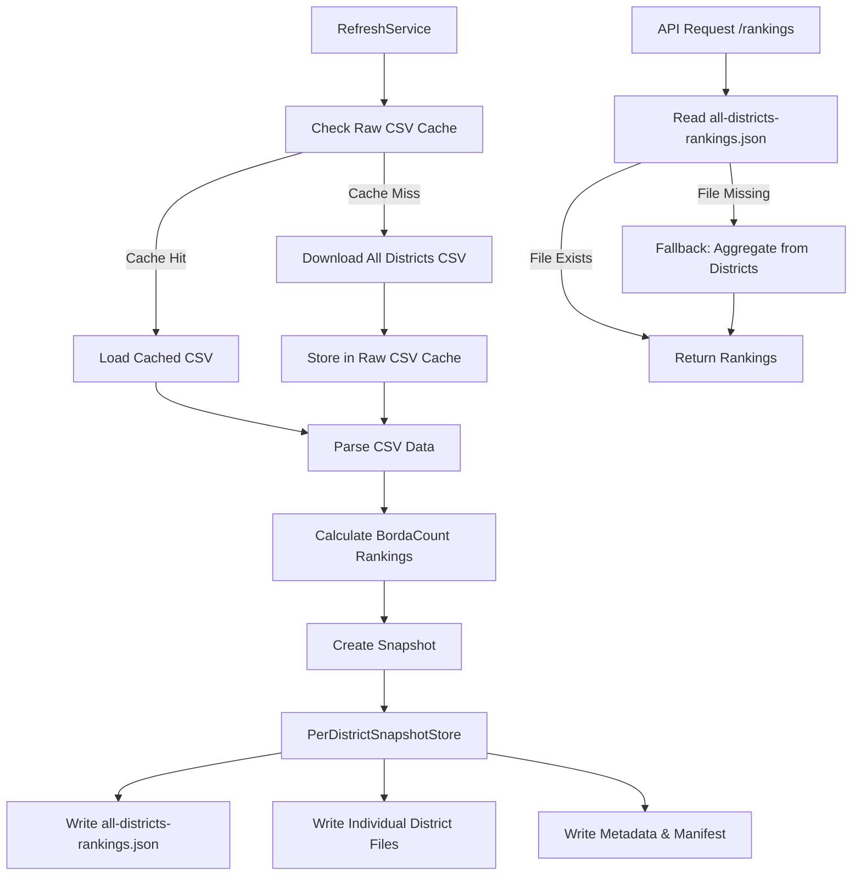

# Design Document

## Overview

This design implements storage and retrieval of All Districts rankings data by extending the PerDistrictSnapshotStore to include a dedicated rankings file at the snapshot level. The solution leverages the existing Raw CSV Cache infrastructure to avoid redundant downloads and ensures that BordaCount rankings for all districts are accessible to the frontend, regardless of which districts are configured for detailed data collection.

**Key Design Principles:**

1. The All Districts CSV provides summary data for all districts worldwide and is used to calculate comprehensive rankings
2. The system continues to fetch detailed data (3 CSV files: district, division, club performance) for each configured district
3. All automated tests use mocked data and do not contact the Toastmasters website

## Architecture

### High-Level Data Flow



### Storage Structure

```
CACHE_DIR/
├── raw-csv-cache/
│   ├── all-districts-2025-01-07.csv
│   ├── all-districts-2025-01-07.meta.json
│   └── all-districts-2025-01-06.csv
├── snapshots/
│   ├── 2025-01-07/                        # ISO date-based naming
│   │   ├── metadata.json
│   │   ├── manifest.json
│   │   ├── all-districts-rankings.json    # NEW: All districts rankings
│   │   ├── district_42.json
│   │   ├── district_15.json
│   │   └── district_F.json
│   └── 2025-01-06/
│       ├── metadata.json
│       ├── manifest.json
│       ├── all-districts-rankings.json
│       └── district_*.json
└── current.json
```

## Components and Interfaces

### 1. AllDistrictsRankingsData Interface

```typescript
/**
 * All districts rankings data structure
 */
interface AllDistrictsRankingsData {
  /** Metadata about the rankings data */
  metadata: {
    /** Snapshot ID this rankings data belongs to */
    snapshotId: string
    /** When the rankings were calculated */
    calculatedAt: string
    /** Schema version */
    schemaVersion: string
    /** Calculation version used */
    calculationVersion: string
    /** Ranking algorithm version */
    rankingVersion: string
    /** Source CSV date */
    sourceCsvDate: string
    /** When the source CSV was fetched */
    csvFetchedAt: string
    /** Total number of districts in rankings */
    totalDistricts: number
    /** Whether data came from cache */
    fromCache: boolean
  }

  /** Array of district rankings */
  rankings: DistrictRanking[]
}

/**
 * Individual district ranking information
 */
interface DistrictRanking {
  districtId: string
  districtName: string
  region: string

  // Performance metrics
  paidClubs: number
  paidClubBase: number
  clubGrowthPercent: number
  totalPayments: number
  paymentBase: number
  paymentGrowthPercent: number
  activeClubs: number
  distinguishedClubs: number
  selectDistinguished: number
  presidentsDistinguished: number
  distinguishedPercent: number

  // Rankings
  clubsRank: number
  paymentsRank: number
  distinguishedRank: number
  aggregateScore: number
}
```

### 2. RawCSVCacheService Extensions

The existing `RawCSVCacheService` already handles caching. We'll extend its usage:

```typescript
interface RawCSVCacheMetadata {
  fileName: string
  date: string
  fetchedAt: string
  fileSize: number
  checksum: string
}

class RawCSVCacheService {
  // Existing methods...

  /**
   * Get cached All Districts CSV for a specific date
   */
  async getAllDistrictsCached(date: string): Promise<{
    data: ScrapedRecord[]
    fromCache: boolean
    metadata: RawCSVCacheMetadata
  } | null>

  /**
   * Store All Districts CSV in cache
   */
  async cacheAllDistricts(
    date: string,
    data: ScrapedRecord[],
    rawCsv: string
  ): Promise<void>
}
```

### 3. PerDistrictSnapshotStore Extensions

```typescript
class PerDistrictSnapshotStore extends FileSnapshotStore {
  /**
   * Generate snapshot directory name from date
   * Uses ISO date format (YYYY-MM-DD)
   */
  private generateSnapshotDirectoryName(dataAsOfDate: string): string

  /**
   * Write all-districts rankings data to snapshot
   */
  async writeAllDistrictsRankings(
    snapshotId: string,
    rankingsData: AllDistrictsRankingsData
  ): Promise<void>

  /**
   * Read all-districts rankings data from snapshot
   */
  async readAllDistrictsRankings(
    snapshotId: string
  ): Promise<AllDistrictsRankingsData | null>

  /**
   * Check if snapshot has all-districts rankings file
   */
  async hasAllDistrictsRankings(snapshotId: string): Promise<boolean>
}
```

### 4. RefreshService Modifications

```typescript
interface RawData {
  /** All districts summary data */
  allDistricts: ScrapedRecord[]

  /** NEW: Metadata about all districts data source */
  allDistrictsMetadata: {
    fromCache: boolean
    csvDate: string
    fetchedAt: string
  }

  /** District-specific performance data (configured districts only) */
  /** For each configured district, we fetch 3 CSV files: */
  /** 1. District performance, 2. Division performance, 3. Club performance */
  districtData: Map<
    string,
    {
      districtPerformance: ScrapedRecord[]
      divisionPerformance: ScrapedRecord[]
      clubPerformance: ScrapedRecord[]
    }
  >

  // ... existing fields
}

class RefreshService {
  /**
   * Calculate rankings for all districts from All Districts CSV
   */
  private async calculateAllDistrictsRankings(
    allDistricts: ScrapedRecord[],
    metadata: { csvDate: string; fetchedAt: string; fromCache: boolean }
  ): Promise<AllDistrictsRankingsData>

  /**
   * Modified scrapeData to use Raw CSV Cache
   */
  private async scrapeData(): Promise<RawData>
}
```

### 5. Districts Route Handler Modifications

```typescript
/**
 * GET /api/districts/rankings
 * Serve rankings from all-districts-rankings.json file
 */
router.get('/rankings', async (req, res) => {
  const snapshot = await perDistrictSnapshotStore.getLatestSuccessful()

  // Read from all-districts-rankings file
  const rankingsData = await perDistrictSnapshotStore.readAllDistrictsRankings(
    snapshot.snapshot_id
  )

  if (!rankingsData) {
    return res.status(500).json({ error: 'Rankings data not found' })
  }

  // Serve from dedicated rankings file
  return res.json({
    rankings: rankingsData.rankings,
    date: rankingsData.metadata.sourceCsvDate,
    _snapshot_metadata: {
      snapshot_id: snapshot.snapshot_id,
      created_at: snapshot.created_at,
      data_source: 'all-districts-rankings-file',
      from_cache: rankingsData.metadata.fromCache,
    },
  })
})
```

## Data Models

### AllDistrictsRankingsData File Format

```json
{
  "metadata": {
    "snapshotId": "2025-01-07",
    "calculatedAt": "2025-01-07T10:30:00.000Z",
    "schemaVersion": "2.0.0",
    "calculationVersion": "2.0.0",
    "rankingVersion": "borda-count-v1",
    "sourceCsvDate": "2025-01-07",
    "csvFetchedAt": "2025-01-07T10:25:00.000Z",
    "totalDistricts": 126,
    "fromCache": false
  },
  "rankings": [
    {
      "districtId": "42",
      "districtName": "District 42",
      "region": "Region 5",
      "paidClubs": 245,
      "paidClubBase": 240,
      "clubGrowthPercent": 2.08,
      "totalPayments": 12500,
      "paymentBase": 12000,
      "paymentGrowthPercent": 4.17,
      "activeClubs": 243,
      "distinguishedClubs": 180,
      "selectDistinguished": 45,
      "presidentsDistinguished": 12,
      "distinguishedPercent": 74.07,
      "clubsRank": 15,
      "paymentsRank": 8,
      "distinguishedRank": 3,
      "aggregateScore": 342.5
    }
    // ... all other districts
  ]
}
```

### Raw CSV Cache Metadata Format

```json
{
  "fileName": "all-districts-2025-01-07.csv",
  "date": "2025-01-07",
  "fetchedAt": "2025-01-07T10:25:00.000Z",
  "fileSize": 45678,
  "checksum": "sha256:abc123...",
  "rowCount": 126
}
```

## Correctness Properties

_A property is a characteristic or behavior that should hold true across all valid executions of a system—essentially, a formal statement about what the system should do. Properties serve as the bridge between human-readable specifications and machine-verifiable correctness guarantees._

### Property 1: All Districts Rankings Completeness

_For any_ successful snapshot created after this feature is implemented, the all-districts-rankings.json file should contain ranking data for all districts present in the All Districts CSV, not just configured districts.

**Validates: Requirements 1.3, 1.4, 1.5**

### Property 2: Raw CSV Cache Consistency

_For any_ date, if a raw CSV file exists in the cache for that date, then fetching All Districts data for that date should return the cached data without downloading, and the fromCache flag should be true.

**Validates: Requirements 2.1, 2.2, 2.5**

### Property 3: Rankings Data Immutability

_For any_ snapshot, reading the all-districts-rankings.json file multiple times should return identical data, demonstrating that rankings data is immutable once written.

**Validates: Requirements 1.3, 6.1**

### Property 4: Version Consistency

_For any_ all-districts-rankings.json file, the calculation_version and ranking_version in the metadata should match the corresponding versions in the snapshot's metadata.json file.

**Validates: Requirements 6.1, 6.2, 6.4**

### Property 5: Rankings Count Invariant

_For any_ all-districts-rankings.json file, the number of rankings in the rankings array should equal the totalDistricts value in the metadata.

**Validates: Requirements 1.5, 6.3**

### Property 6: Cache File Naming Consistency

_For any_ cached All Districts CSV file, the filename should follow the pattern `all-districts-{YYYY-MM-DD}.csv` where the date matches the date in the corresponding metadata file.

**Validates: Requirements 7.1, 7.2**

### Property 7: ISO Date Directory Naming

_For any_ snapshot created after this feature is implemented, the snapshot directory name should be in ISO date format (YYYY-MM-DD) derived from the dataAsOfDate field.

**Validates: Requirements 8.1, 8.2**

## Error Handling

### Scenario 1: Raw CSV Cache Read Failure

**Condition:** Cache file exists but cannot be read (corrupted, permissions)

**Handling:**

1. Log warning with cache file path and error
2. Fall back to downloading fresh CSV
3. Attempt to replace corrupted cache file
4. Continue with refresh operation

### Scenario 2: All Districts Rankings Calculation Failure

**Condition:** BordaCount calculator throws error for all-districts data

**Handling:**

1. Log error with details about failure
2. Fail the entire refresh operation
3. Do not create incomplete snapshot
4. Return error to caller

### Scenario 3: Rankings File Write Failure

**Condition:** Cannot write all-districts-rankings.json to snapshot directory

**Handling:**

1. Log error with snapshot ID and file path
2. Fail the entire refresh operation
3. Clean up partial snapshot directory
4. Return error to caller

### Scenario 4: Cache Cleanup Failure

**Condition:** Cannot delete old cache files during cleanup

**Handling:**

1. Log warning with file paths that failed to delete
2. Continue with cleanup of other files
3. Do not fail the overall cleanup operation
4. Retry on next cleanup cycle

## Testing Strategy

**CRITICAL:** All automated tests MUST use mocked data and MUST NOT contact the Toastmasters website. Tests should use fixtures, mocked services, or test data generators.

### Unit Tests

1. **RawCSVCacheService Tests**
   - Test cache hit scenario with valid cached file
   - Test cache miss scenario requiring download
   - Test cache metadata creation and reading
   - Test cache file naming conventions
   - Test cache cleanup with retention policies
   - **Uses:** Mocked CSV data, no network calls

2. **PerDistrictSnapshotStore Tests**
   - Test writeAllDistrictsRankings creates correct file structure
   - Test readAllDistrictsRankings returns correct data
   - Test hasAllDistrictsRankings detects file presence
   - Test rankings file included in manifest
   - **Uses:** Mocked snapshot data

3. **RefreshService Tests**
   - Test calculateAllDistrictsRankings with valid CSV data
   - Test scrapeData uses cache when available
   - Test scrapeData downloads when cache miss
   - Test rankings data passed to snapshot store
   - Test error handling when rankings calculation fails
   - **Uses:** Mocked scraper responses, no network calls

4. **Districts Route Tests**
   - Test rankings endpoint with all-districts-rankings file
   - Test error handling for missing rankings file
   - Test response metadata indicates data source
   - Test error handling for missing snapshot
   - **Uses:** Mocked snapshot data

### Integration Tests

1. **End-to-End Refresh Flow**
   - Test complete refresh creates all-districts-rankings file
   - Test rankings file contains all districts from CSV
   - Test rankings accessible via API endpoint
   - Test cache reuse on subsequent refresh for same date
   - **Uses:** Mocked scraper and mocked CSV data

2. **Cache Management**
   - Test cache cleanup removes old files
   - Test cache preserves recent files
   - Test cache handles concurrent access
   - **Uses:** Test cache directories with mocked files

### Property-Based Tests

**Note:** All property-based tests use generated test data, not real Toastmasters data.

1. **Property Test: Rankings Completeness** (Property 1)
   - Generate random All Districts CSV data
   - Calculate rankings and create snapshot
   - Verify all districts in CSV appear in rankings file
   - **Uses:** Generated CSV data
   - **Validates: Requirements 1.3, 1.4, 1.5**

2. **Property Test: Cache Consistency** (Property 2)
   - Generate random date and CSV data
   - Cache the data
   - Fetch multiple times
   - Verify all fetches return cached data with fromCache=true
   - **Uses:** Generated CSV data
   - **Validates: Requirements 2.1, 2.2, 2.5**

3. **Property Test: Rankings Immutability** (Property 3)
   - Create snapshot with rankings
   - Read rankings file multiple times
   - Verify all reads return identical data
   - **Uses:** Generated snapshot data
   - **Validates: Requirements 1.3, 6.1**

4. **Property Test: Version Consistency** (Property 4)
   - Generate random snapshot with rankings
   - Verify calculation_version matches across files
   - Verify ranking_version matches across files
   - **Uses:** Generated snapshot data
   - **Validates: Requirements 6.1, 6.2, 6.4**

5. **Property Test: Rankings Count Invariant** (Property 5)
   - Generate random All Districts data
   - Create rankings file
   - Verify rankings.length === metadata.totalDistricts
   - **Uses:** Generated CSV data
   - **Validates: Requirements 1.5, 6.3**

## Implementation Notes

**Data Fetching Strategy:**

- The All Districts CSV provides summary data for all ~126 districts worldwide
- For configured districts only, the system fetches 3 additional CSV files:
  1. District performance CSV
  2. Division performance CSV
  3. Club performance CSV
- This approach balances comprehensive rankings (all districts) with detailed analytics (configured districts only)

### Phase 1: Raw CSV Cache Integration

- Extend RawCSVCacheService to handle All Districts CSV
- Update RefreshService.scrapeData() to check cache first
- Add cache metadata tracking
- Ensure configured districts still fetch all 3 CSV files

### Phase 2: Rankings Storage

- Extend PerDistrictSnapshotStore with rankings file methods
- Update RefreshService to calculate all-districts rankings
- Modify snapshot creation to include rankings data

### Phase 3: API Integration

- Update /api/districts/rankings endpoint
- Add fallback logic for legacy snapshots
- Update response metadata

### Phase 4: Testing and Validation

- Implement unit tests for all new methods
- Add integration tests for complete flow
- Add property-based tests for correctness properties
- Test backward compatibility

### Performance Considerations

1. **Cache Lookup**: O(1) file system lookup by date
2. **Rankings Calculation**: O(n log n) where n = number of districts (~126)
3. **Rankings File Read**: Single file read vs aggregating from multiple district files
4. **Memory**: Rankings file ~50-100KB, minimal memory impact

## Migration Path

1. Deploy code changes
2. Delete existing timestamp-based snapshot directories
3. Run refresh operation to create new ISO date-based snapshot
4. New snapshot includes all-districts-rankings.json
5. API automatically uses new file
