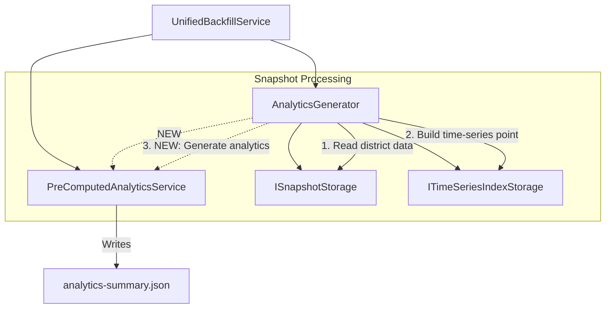

# Design Document: Analytics Backfill Fix

## Overview

This design addresses the missing pre-computed analytics generation in the Unified Backfill Service's `AnalyticsGenerator` component. The fix involves injecting `PreComputedAnalyticsService` as a required dependency and calling its `computeAndStore()` method during snapshot processing to generate `analytics-summary.json` files alongside the existing time-series index data.

The change is minimal and surgical: we add one new dependency to `AnalyticsGenerator` and one method call in `processSnapshot()`. This ensures that analytics backfill jobs produce complete analytics data that the frontend can consume without fallback warnings.

## Architecture

The fix integrates into the existing Unified Backfill Service architecture:



### Data Flow

1. `UnifiedBackfillService` creates `AnalyticsGenerator` with all dependencies including `PreComputedAnalyticsService`
2. When processing a snapshot, `AnalyticsGenerator`:
   - Reads district data from `ISnapshotStorage` (existing)
   - Builds and appends time-series data points to `ITimeSeriesIndexStorage` (existing)
   - **NEW**: Calls `PreComputedAnalyticsService.computeAndStore()` to generate `analytics-summary.json`

## Components and Interfaces

### Modified: AnalyticsGenerator

**File:** `backend/src/services/backfill/unified/AnalyticsGenerator.ts`

**Constructor Change:**

```typescript
constructor(
  snapshotStorage: ISnapshotStorage,
  timeSeriesStorage: ITimeSeriesIndexStorage,
  preComputedAnalyticsService: PreComputedAnalyticsService  // NEW required parameter
)
```

**processSnapshot() Change:**

After successfully reading district data and before returning success, call:

```typescript
// Generate pre-computed analytics for this snapshot
await this.generatePreComputedAnalytics(snapshotId, districtDataArray)
```

**New Private Method:**

```typescript
private async generatePreComputedAnalytics(
  snapshotId: string,
  districtData: DistrictStatistics[]
): Promise<void> {
  try {
    await this.preComputedAnalyticsService.computeAndStore(snapshotId, districtData)
    logger.debug('Generated pre-computed analytics for snapshot', {
      snapshotId,
      districtCount: districtData.length,
      component: 'AnalyticsGenerator',
      operation: 'generatePreComputedAnalytics',
    })
  } catch (error) {
    // Log error but don't fail the snapshot processing
    const errorMessage = error instanceof Error ? error.message : 'Unknown error'
    logger.warn('Failed to generate pre-computed analytics for snapshot', {
      snapshotId,
      error: errorMessage,
      component: 'AnalyticsGenerator',
      operation: 'generatePreComputedAnalytics',
    })
  }
}
```

### Modified: UnifiedBackfillService

**File:** `backend/src/services/backfill/unified/UnifiedBackfillService.ts`

**Constructor Change:**

Add `PreComputedAnalyticsService` parameter and pass it to `AnalyticsGenerator`:

```typescript
constructor(
  jobStorage: IBackfillJobStorage,
  snapshotStorage: ISnapshotStorage,
  timeSeriesStorage: ITimeSeriesIndexStorage,
  refreshService: RefreshService,
  configService: DistrictConfigurationService,
  preComputedAnalyticsService: PreComputedAnalyticsService,  // NEW required parameter
  config?: UnifiedBackfillServiceConfig
) {
  // ... existing initialization ...
  
  this.analyticsGenerator = new AnalyticsGenerator(
    snapshotStorage,
    timeSeriesStorage,
    preComputedAnalyticsService  // NEW: pass to AnalyticsGenerator
  )
}
```

### Existing: PreComputedAnalyticsService

**File:** `backend/src/services/PreComputedAnalyticsService.ts`

No changes required. The existing `computeAndStore()` method already:
- Accepts `snapshotId` and `districtData` array
- Computes analytics summaries for each district
- Writes `analytics-summary.json` to the snapshot directory
- Handles errors gracefully with logging

## Data Models

No new data models are required. The existing types are sufficient:

- `DistrictStatistics` - Input to `computeAndStore()`
- `AnalyticsSummaryFile` - Output written to `analytics-summary.json`
- `PreComputedAnalyticsSummary` - Per-district analytics data

## Correctness Properties

*A property is a characteristic or behavior that should hold true across all valid executions of a system—essentially, a formal statement about what the system should do. Properties serve as the bridge between human-readable specifications and machine-verifiable correctness guarantees.*

### Property 1: Analytics File Generation

*For any* snapshot processed by AnalyticsGenerator with valid district data, the `analytics-summary.json` file SHALL exist in the snapshot directory after processing completes successfully.

**Validates: Requirements 2.1**

### Property 2: Time-Series Generation Preserved

*For any* snapshot processed by AnalyticsGenerator, the time-series index data SHALL be generated regardless of whether pre-computed analytics generation succeeds or fails.

**Validates: Requirements 2.2**

### Property 3: Error Isolation

*For any* failure in PreComputedAnalyticsService.computeAndStore(), the AnalyticsGenerator SHALL continue processing and report the snapshot as successfully processed for time-series purposes.

**Validates: Requirements 2.2**

## Error Handling

### Pre-Computed Analytics Failures

When `PreComputedAnalyticsService.computeAndStore()` fails:

1. Log a warning with the snapshot ID and error message
2. Continue with time-series processing (do not fail the snapshot)
3. Report the snapshot as successfully processed
4. The error is logged but not propagated to the job result

This matches the existing pattern in `RefreshService.triggerPreComputedAnalytics()` where analytics failures don't fail the overall operation.

### Rationale

Pre-computed analytics are a performance optimization. If they fail to generate:
- The frontend falls back to on-demand computation
- Time-series data is still valuable for trend analysis
- The operator can re-run the backfill job if needed

## Testing Strategy

### Unit Tests

Unit tests should verify:

1. `AnalyticsGenerator` constructor accepts `PreComputedAnalyticsService`
2. `processSnapshot()` calls `computeAndStore()` with correct parameters
3. `processSnapshot()` continues successfully when `computeAndStore()` throws
4. `UnifiedBackfillService` passes `PreComputedAnalyticsService` to `AnalyticsGenerator`

### Integration Tests

Integration tests should verify:

1. Running an analytics-generation backfill job creates `analytics-summary.json` files
2. The generated analytics files contain valid data for all districts in the snapshot

### Property-Based Testing

Given the straightforward nature of this fix (adding a method call), property-based testing is not warranted per the project's property-testing-guidance.md. The fix:
- Does not involve complex input spaces
- Does not have mathematical invariants
- Is easily verified with specific examples
- Has low risk with obvious failure modes

Standard unit tests with well-chosen examples provide equivalent confidence.
