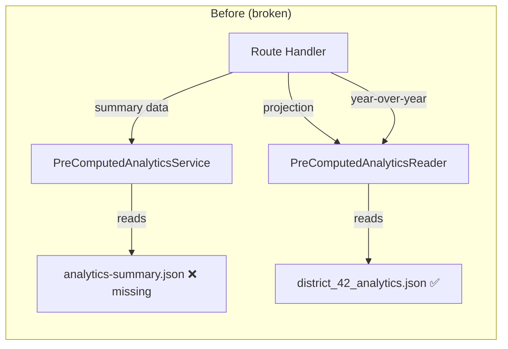
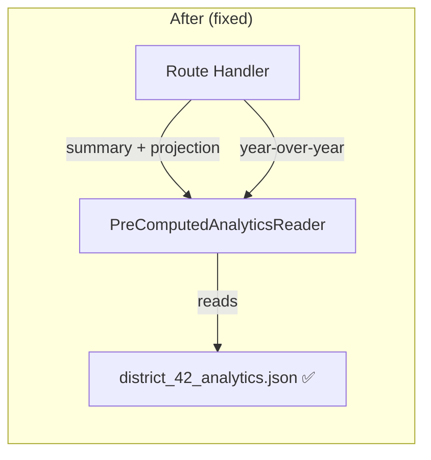

# Design Document: Analytics Summary Data Source Fix

## Overview

The analytics-summary route currently fails with a 404 because it reads summary data from `PreComputedAnalyticsService.getLatestSummary()`, which depends on an `analytics-summary.json` file that the scraper-cli never generates. The per-district analytics files (e.g., `analytics/district_42_analytics.json`) already contain all the data needed and are already partially used by the same route for year-over-year and distinguished projection data.

This fix rewires the route to use a single `PreComputedAnalyticsReader.readDistrictAnalytics()` call for all per-district data (summary, distinguished projection), eliminating the dependency on the missing file and the redundant second `readDistrictAnalytics()` call.

## Architecture

The change is scoped entirely to the route handler layer. No new services, files, or computation are introduced.

The route already has a `PreComputedAnalyticsReader` instance and already calls `snapshotStore.getLatestSuccessful()`. The fix consolidates all per-district reads into a single `readDistrictAnalytics()` call.

## Components and Interfaces

### Modified Component: `analyticsSummary.ts` Route Handler

The route handler changes are:

1. Remove the `getPreComputedAnalyticsService` import and call
2. Move the `snapshotStore.getLatestSuccessful()` call earlier (before any analytics reads)
3. Replace the `preComputedAnalyticsService.getLatestSummary(districtId)` call with `preComputedAnalyticsReader.readDistrictAnalytics(snapshotId, districtId)`
4. Remove the separate try/catch block for distinguished projection (it's now part of the single read)
5. Map `DistrictAnalytics` fields to `AggregatedAnalyticsResponse` fields

### Field Mapping: DistrictAnalytics → AggregatedAnalyticsResponse

The `DistrictAnalytics` type (from `@toastmasters/analytics-core`) contains all fields needed. The mapping is:

| AggregatedAnalyticsResponse field | Source from DistrictAnalytics |
|---|---|
| `summary.totalMembership` | `totalMembership` |
| `summary.membershipChange` | `membershipChange` |
| `summary.clubCounts.total` | `allClubs.length` |
| `summary.clubCounts.thriving` | `thrivingClubs.length` |
| `summary.clubCounts.vulnerable` | `vulnerableClubs.length` |
| `summary.clubCounts.interventionRequired` | `interventionRequiredClubs.length` |
| `summary.distinguishedClubs.smedley` | `distinguishedClubs.smedley` |
| `summary.distinguishedClubs.presidents` | `distinguishedClubs.presidents` |
| `summary.distinguishedClubs.select` | `distinguishedClubs.select` |
| `summary.distinguishedClubs.distinguished` | `distinguishedClubs.distinguished` |
| `summary.distinguishedClubs.total` | `distinguishedClubs.total` |
| `summary.distinguishedProjection` | `distinguishedProjection.projectedDistinguished` |
| `computedAt` | `latestSnapshot.created_at` (from the Snapshot object) |

Note: The frontend's `convertToAggregatedFormat` fallback function already performs this exact same mapping (deriving club counts from array lengths). This confirms the mapping is correct and consistent.

### `computedAt` Source

The current implementation gets `computedAt` from `PreComputedAnalyticsSummary.computedAt`. Since `readDistrictAnalytics()` returns only the `DistrictAnalytics` data (not the file metadata wrapper), we use `latestSnapshot.created_at` from the `Snapshot` object returned by `snapshotStore.getLatestSuccessful()`. This is semantically equivalent — it's the timestamp of the snapshot that produced the analytics.

### Unchanged Components

- `PreComputedAnalyticsReader` — no changes needed, already has the right interface
- `PreComputedAnalyticsReader.readYearOverYear()` — still called separately (different file)
- Time-series index service — still called for trend data
- `AggregatedAnalyticsResponse` interface — no changes to the response shape
- Frontend `useAggregatedAnalytics` hook — no changes needed; the response contract is preserved
- `backend/openapi.yaml` — the endpoint contract (parameters, response shape, status codes) is unchanged

### Potentially Removable Components

- `getPreComputedAnalyticsService` in `shared.ts` — if no other route files import it, the export can be removed
- `PreComputedAnalyticsService` class — if no other consumers remain after this fix, it becomes dead code (but removal is out of scope for this fix since it's still used by `UnifiedBackfillService`/`AnalyticsGenerator` for backward compatibility)

## Data Models

No new data models are introduced. The existing types are:

- `DistrictAnalytics` (from `@toastmasters/analytics-core`) — the source data type
- `AggregatedAnalyticsResponse` (defined in the route file) — the response type
- `Snapshot` (from `backend/src/types/snapshots.ts`) — provides `snapshot_id` and `created_at`

The mapping between these types is documented in the field mapping table above.

## Correctness Properties

*A property is a characteristic or behavior that should hold true across all valid executions of a system — essentially, a formal statement about what the system should do. Properties serve as the bridge between human-readable specifications and machine-verifiable correctness guarantees.*

### Prework Analysis Summary

After analyzing all acceptance criteria, the testable behaviors in this feature are:
- Field mapping from `DistrictAnalytics` to `AggregatedAnalyticsResponse` (Requirements 1.3, 2.1–2.4, 3.3, 5.1, 5.2)
- Error cases: null analytics returns 404, no snapshot returns 404 (Requirements 1.4, 1.5)
- Wiring: single `readDistrictAnalytics()` call, no `PreComputedAnalyticsService` dependency (Requirements 3.1, 4.1)

### Property Test Assessment

Per the testing steering document (Section 7.3 Decision Framework):

1. **What universal property would this test verify?** — The field mapping is a straightforward data transformation: direct field copies and `.length` calls on arrays. There are no mathematical invariants or algebraic properties.
2. **Would 5 well-chosen examples provide equivalent confidence?** — Yes. A test with a realistic `DistrictAnalytics` object (with varying club array sizes, non-zero distinguished counts, and a valid projection) fully covers the mapping logic.
3. **Is the input space genuinely complex?** — No. The inputs are bounded and simple — numeric fields and arrays.
4. **Does this logic have mathematical or algebraic properties?** — No.

**Decision: No property-based tests.** Unit tests with well-chosen examples are sufficient and more maintainable for this change. This aligns with the testing steering guidance: "Prefer the simplest test that provides confidence."

## Error Handling

Error handling behavior is preserved from the current implementation:

1. **No snapshot available**: When `snapshotStore.getLatestSuccessful()` returns null, return 404 with `ANALYTICS_NOT_AVAILABLE`
2. **No analytics file**: When `readDistrictAnalytics()` returns null, return 404 with `ANALYTICS_NOT_AVAILABLE`
3. **Schema version mismatch**: `PreComputedAnalyticsReader` throws `SchemaVersionError` — caught by the existing catch block, returns 500
4. **Corrupted file**: `PreComputedAnalyticsReader` throws `CorruptedFileError` — caught by the existing catch block, returns 500
5. **File system errors**: ENOENT/EACCES errors — caught by the existing catch block, returns 503

The year-over-year and trend data reads remain in their own try/catch blocks with graceful degradation (these are optional parts of the response).

## Testing Strategy

### Unit Tests

The existing test file `backend/src/routes/districts/__tests__/analyticsSummary.test.ts` should be updated. Key test cases:

1. **Successful mapping** — Mock `readDistrictAnalytics()` to return a realistic `DistrictAnalytics` object with varying club array sizes. Verify all response fields are correctly mapped, including club counts derived from array lengths, distinguished clubs, and `distinguishedProjection.projectedDistinguished`. _(Requirements 1.3, 2.1–2.4, 3.3, 5.1, 5.2)_

2. **404 when analytics file missing** — Mock `readDistrictAnalytics()` to return null. Verify 404 with `ANALYTICS_NOT_AVAILABLE`. _(Requirement 1.4)_

3. **404 when no snapshot exists** — Mock `snapshotStore.getLatestSuccessful()` to return null. Verify 404 with `ANALYTICS_NOT_AVAILABLE`. _(Requirement 1.5)_

4. **Single reader call** — Verify `readDistrictAnalytics()` is called exactly once per request (no redundant call for distinguished projection). _(Requirements 3.1, 3.2)_

5. **No PreComputedAnalyticsService dependency** — Verify `getPreComputedAnalyticsService` is not called. _(Requirement 4.1)_

6. **Date parameters preserved** — Verify `startDate`/`endDate` query params still filter trend data from the time-series index. _(Requirement 5.4)_

### Why No Property-Based Tests

Per the testing steering document: the field mapping is a simple data transformation with no complex input space, no mathematical invariants, and no algebraic properties. 3-5 well-chosen unit test examples provide equivalent confidence. Property tests would add complexity without additional value here.
