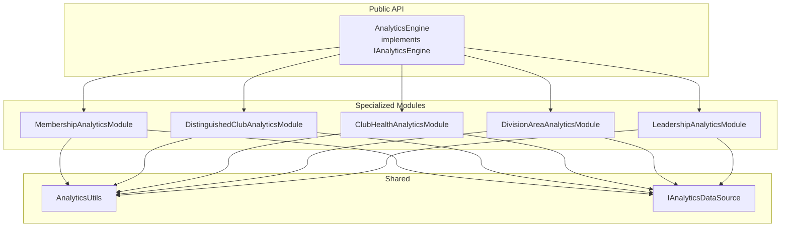

# Design Document

## Overview

This design describes the refactoring of `AnalyticsEngine.ts` from a 3,504-line monolithic class into a modular architecture with specialized analytics modules. The refactoring preserves the existing `IAnalyticsEngine` interface while delegating to focused modules for each analytics domain.

The architecture follows a facade pattern where `AnalyticsEngine` acts as the public API and orchestrator, delegating to specialized modules that handle specific analytics domains.

## Architecture



## Components and Interfaces

### AnalyticsEngine (Orchestrator)

The main class that implements `IAnalyticsEngine` and delegates to specialized modules.

```typescript
// backend/src/services/AnalyticsEngine.ts (refactored)
export class AnalyticsEngine implements IAnalyticsEngine {
  private readonly membershipModule: MembershipAnalyticsModule
  private readonly distinguishedModule: DistinguishedClubAnalyticsModule
  private readonly clubHealthModule: ClubHealthAnalyticsModule
  private readonly divisionAreaModule: DivisionAreaAnalyticsModule
  private readonly leadershipModule: LeadershipAnalyticsModule
  private readonly dataSource: IAnalyticsDataSource

  constructor(dataSource: IAnalyticsDataSource) {
    this.dataSource = dataSource
    this.membershipModule = new MembershipAnalyticsModule(dataSource)
    this.distinguishedModule = new DistinguishedClubAnalyticsModule(dataSource)
    this.clubHealthModule = new ClubHealthAnalyticsModule(dataSource)
    this.divisionAreaModule = new DivisionAreaAnalyticsModule(dataSource)
    this.leadershipModule = new LeadershipAnalyticsModule(dataSource)
  }

  // Delegates to appropriate modules
  async generateMembershipAnalytics(...): Promise<MembershipAnalytics> {
    return this.membershipModule.generateMembershipAnalytics(...)
  }

  // ... other delegating methods
}
```

### MembershipAnalyticsModule

Handles membership trends, year-over-year comparisons, and membership projections.

```typescript
// backend/src/services/analytics/MembershipAnalyticsModule.ts
export class MembershipAnalyticsModule {
  constructor(private readonly dataSource: IAnalyticsDataSource) {}

  // Public methods (≤15)
  async generateMembershipAnalytics(
    districtId: string,
    startDate?: string,
    endDate?: string
  ): Promise<MembershipAnalytics>
  async calculateMembershipYearOverYear(
    districtId: string,
    currentDate: string
  ): Promise<YearOverYearMembership | null>

  // Private helpers
  private calculateMembershipTrend(
    entries: DistrictCacheEntry[]
  ): TrendDirection
  private getTotalMembership(entry: DistrictCacheEntry): number
  private calculateMembershipChange(current: number, previous: number): number
  private calculateTopGrowthClubs(entry: DistrictCacheEntry): ClubGrowth[]
  private calculateTopDecliningClubs(entry: DistrictCacheEntry): ClubDecline[]
  private identifySeasonalPatterns(
    entries: DistrictCacheEntry[]
  ): SeasonalPattern[]
  private calculateProgramYearChange(entries: DistrictCacheEntry[]): number
}
```

### DistinguishedClubAnalyticsModule

Handles DCP goals analysis, distinguished club projections, and achievement tracking.

```typescript
// backend/src/services/analytics/DistinguishedClubAnalyticsModule.ts
export class DistinguishedClubAnalyticsModule {
  constructor(private readonly dataSource: IAnalyticsDataSource) {}

  // Public methods
  async generateDistinguishedClubAnalytics(
    districtId: string,
    startDate?: string,
    endDate?: string
  ): Promise<DistinguishedClubAnalytics>
  async calculateDistinguishedYearOverYear(
    districtId: string,
    currentDate: string
  ): Promise<YearOverYearDistinguished | null>

  // Private helpers
  private calculateDistinguishedClubs(
    entry: DistrictCacheEntry
  ): DistinguishedCounts
  private projectDistinguishedClubs(entries: DistrictCacheEntry[]): number
  private calculateDistinguishedProjection(
    entries: DistrictCacheEntry[]
  ): DistinguishedProjection
  private trackDistinguishedAchievements(
    entries: DistrictCacheEntry[]
  ): DistinguishedClubAchievement[]
  private analyzeDCPGoals(entry: DistrictCacheEntry): DCPGoalAnalysis
  private determineDistinguishedLevel(club: ScrapedRecord): DistinguishedLevel
  private identifyDistinguishedLevel(club: ScrapedRecord): DistinguishedLevel
  private extractDistinguishedLevelFromStatus(
    status: string
  ): DistinguishedLevel
  private isHigherLevel(level1: string, level2: string): boolean
  private getLevel4FieldName(club: ScrapedRecord): {
    fieldName: string
    value: unknown
  }
}
```

### ClubHealthAnalyticsModule

Handles at-risk club identification, health scores, and club trend analysis.

```typescript
// backend/src/services/analytics/ClubHealthAnalyticsModule.ts
export class ClubHealthAnalyticsModule {
  constructor(private readonly dataSource: IAnalyticsDataSource) {}

  // Public methods
  async identifyAtRiskClubs(districtId: string): Promise<ClubTrend[]>
  async getClubTrends(
    districtId: string,
    clubId: string
  ): Promise<ClubTrend | null>
  async analyzeClubHealth(
    districtId: string,
    date: string
  ): Promise<ClubHealthSummary>

  // Private helpers
  private analyzeClubTrends(entries: DistrictCacheEntry[]): ClubTrend[]
  private assessClubHealth(
    club: ScrapedRecord,
    history: ScrapedRecord[]
  ): ClubHealthStatus
  private calculateClubHealthScore(club: ScrapedRecord): number
  private countVulnerableClubs(entry: DistrictCacheEntry): number
  private countInterventionRequiredClubs(entry: DistrictCacheEntry): number
  private countThrivingClubs(entry: DistrictCacheEntry): number
  private getCSPStatus(club: ScrapedRecord): boolean
  private calculateNetGrowth(club: ScrapedRecord): number
}
```

### DivisionAreaAnalyticsModule

Handles division and area performance analysis.

```typescript
// backend/src/services/analytics/DivisionAreaAnalyticsModule.ts
export class DivisionAreaAnalyticsModule {
  constructor(private readonly dataSource: IAnalyticsDataSource) {}

  // Public methods
  async compareDivisions(
    districtId: string,
    date: string
  ): Promise<DivisionAnalytics[]>
  async analyzeAreas(districtId: string, date: string): Promise<AreaAnalytics[]>

  // Private helpers
  private analyzeDivisions(entry: DistrictCacheEntry): DivisionAnalytics[]
  private analyzeAreas(entry: DistrictCacheEntry): AreaAnalytics[]
  private detectDivisionTrends(
    entries: DistrictCacheEntry[]
  ): Map<string, TrendDirection>
  private getDivisionDcpGoals(clubs: ScrapedRecord[]): number
  private getTotalDcpGoals(entry: DistrictCacheEntry): number
}
```

### LeadershipAnalyticsModule

Handles leadership effectiveness insights and correlations.

```typescript
// backend/src/services/analytics/LeadershipAnalyticsModule.ts
export class LeadershipAnalyticsModule {
  constructor(private readonly dataSource: IAnalyticsDataSource) {}

  // Public methods
  async generateLeadershipInsights(
    districtId: string,
    startDate?: string,
    endDate?: string
  ): Promise<LeadershipInsights>

  // Private helpers
  private calculateLeadershipEffectiveness(
    entries: DistrictCacheEntry[]
  ): LeadershipEffectivenessScore[]
  private calculateDivisionHealthScore(clubs: ScrapedRecord[]): number
  private calculateDivisionGrowthScore(
    clubs: ScrapedRecord[],
    previousClubs?: ScrapedRecord[]
  ): number
  private calculateDivisionDCPScore(clubs: ScrapedRecord[]): number
  private identifyBestPracticeDivisions(
    scores: LeadershipEffectivenessScore[]
  ): LeadershipEffectivenessScore[]
  private isDivisionConsistent(
    divisionId: string,
    entries: DistrictCacheEntry[]
  ): boolean
  private trackLeadershipChanges(
    entries: DistrictCacheEntry[]
  ): LeadershipChange[]
  private analyzeAreaDirectorCorrelations(
    entry: DistrictCacheEntry
  ): AreaDirectorCorrelation[]
  private generateLeadershipSummary(
    scores: LeadershipEffectivenessScore[],
    correlations: AreaDirectorCorrelation[]
  ): LeadershipSummary
}
```

### AnalyticsUtils (Shared Utilities)

Common utility functions shared across all modules.

```typescript
// backend/src/services/analytics/AnalyticsUtils.ts
export function parseIntSafe(
  value: string | number | null | undefined,
  defaultValue?: number
): number
export function ensureString(value: string | number | null | undefined): string
export function getCurrentProgramMonth(dateString?: string): number
export function getMonthName(month: number): string
export function getDCPCheckpoint(month: number): number
export function findPreviousProgramYearDate(currentDate: string): string
export function calculatePercentageChange(
  current: number,
  previous: number
): number
export function determineTrend(values: number[]): TrendDirection
```

## Data Models

The existing data models from `backend/src/types/analytics.ts` remain unchanged:

- `ClubTrend` - Club-specific trend data
- `DivisionAnalytics` - Division performance metrics
- `AreaAnalytics` - Area performance metrics
- `MembershipAnalytics` - Membership trend analysis
- `DistinguishedClubAnalytics` - Distinguished club metrics
- `LeadershipInsights` - Leadership effectiveness data
- `YearOverYearComparison` - Year-over-year metrics
- `DistrictAnalytics` - Comprehensive district analytics

No changes to data models are required as this is a pure refactoring.

## File Structure

```
backend/src/services/
├── AnalyticsEngine.ts                    # Refactored orchestrator (~200 lines)
└── analytics/
    ├── index.ts                          # Module exports
    ├── AnalyticsUtils.ts                 # Shared utilities (~150 lines)
    ├── MembershipAnalyticsModule.ts      # Membership analytics (~500 lines)
    ├── DistinguishedClubAnalyticsModule.ts # Distinguished club analytics (~600 lines)
    ├── ClubHealthAnalyticsModule.ts      # Club health analytics (~450 lines)
    ├── DivisionAreaAnalyticsModule.ts    # Division/area analytics (~400 lines)
    └── LeadershipAnalyticsModule.ts      # Leadership analytics (~700 lines)
```

## Correctness Properties

_A property is a characteristic or behavior that should hold true across all valid executions of a system—essentially, a formal statement about what the system should do. Properties serve as the bridge between human-readable specifications and machine-verifiable correctness guarantees._

### Property 1: Output Equivalence

_For any_ valid district ID and date range, calling any public method on the refactored AnalyticsEngine SHALL produce results identical to the pre-refactor implementation.

**Validates: Requirements 2.3, 5.4**

This is the fundamental correctness property for this refactoring. Since we are not changing behavior, only structure, the outputs must be byte-for-byte identical (accounting for floating-point precision).

### Property 2: Module Delegation Consistency

_For any_ valid input to a public AnalyticsEngine method, the result of delegating to a specialized module SHALL equal the result of the original monolithic implementation.

**Validates: Requirements 1.1, 1.2, 1.3, 1.4, 1.5**

This property ensures that extracting methods into modules does not alter their behavior.

### Property 3: Utility Function Equivalence

_For any_ valid input to a shared utility function (parseIntSafe, ensureString, getDCPCheckpoint, etc.), the extracted utility SHALL produce results identical to the original private method.

**Validates: Requirements 3.1, 3.2, 3.3, 3.4**

## Error Handling

Error handling behavior is preserved from the original implementation:

1. **Invalid district ID**: Returns empty/default analytics objects
2. **Missing data**: Gracefully handles missing snapshots with appropriate defaults
3. **Data source errors**: Propagates errors from IAnalyticsDataSource
4. **Invalid date ranges**: Handles gracefully with available data

No changes to error handling behavior are introduced.

## Testing Strategy

### Unit Tests

Each extracted module will have dedicated unit tests:

- `MembershipAnalyticsModule.test.ts`
- `DistinguishedClubAnalyticsModule.test.ts`
- `ClubHealthAnalyticsModule.test.ts`
- `DivisionAreaAnalyticsModule.test.ts`
- `LeadershipAnalyticsModule.test.ts`
- `AnalyticsUtils.test.ts`

### Property-Based Tests

Property-based tests will verify output equivalence:

- **Test Framework**: fast-check
- **Minimum iterations**: 100 per property
- **Strategy**: Generate random but valid district data, compare outputs between original and refactored implementations

```typescript
// Example property test structure
describe('AnalyticsEngine Refactoring Properties', () => {
  it('Property 1: Output equivalence for generateMembershipAnalytics', () => {
    fc.assert(
      fc.asyncProperty(
        fc.string(), // districtId
        fc.option(fc.date()), // startDate
        fc.option(fc.date()), // endDate
        async (districtId, startDate, endDate) => {
          const original = await originalEngine.generateMembershipAnalytics(
            districtId,
            startDate,
            endDate
          )
          const refactored = await refactoredEngine.generateMembershipAnalytics(
            districtId,
            startDate,
            endDate
          )
          expect(refactored).toEqual(original)
        }
      ),
      { numRuns: 100 }
    )
  })
})
```

### Integration Tests

Existing integration tests in `AnalyticsEngine.integration.test.ts` must pass without modification.

### Static Analysis

- Line count verification for each module (≤800 lines)
- Public method count verification (≤15 per module)
- Import verification for shared utilities
