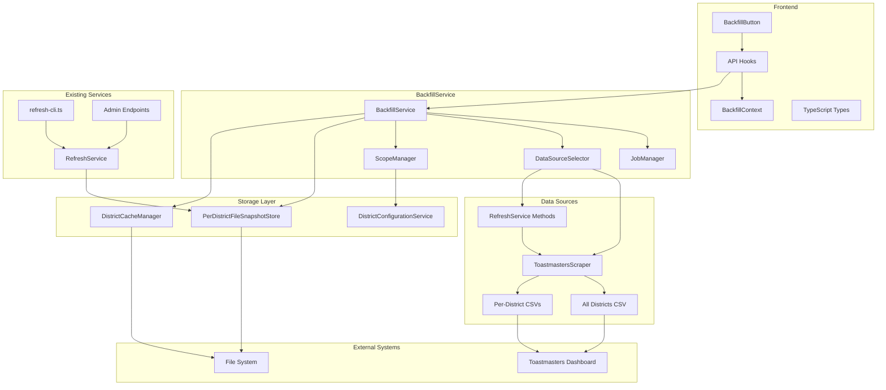

# Design Document

## Overview

The BackfillService is a complete rewrite that replaces the existing BackfillService and DistrictBackfillService with a modern, unified system. The new service leverages RefreshService methods as the primary data acquisition mechanism for historical data collection, providing:

1. **RefreshService Integration**: Direct use of proven RefreshService methods for reliable historical data acquisition
2. **Intelligent Collection**: Automatic selection of optimal collection strategies based on scope and requirements
3. **Clean Architecture**: Modern TypeScript implementation without legacy compatibility concerns
4. **Unified Storage**: Consistent use of PerDistrictFileSnapshotStore for all historical data

The BackfillService maintains clear operational separation from RefreshService while leveraging its proven capabilities for historical data collection.

## Architecture

### Core Components



### Service Integration

The unified service integrates with existing infrastructure components:

- **PerDistrictFileSnapshotStore**: Primary storage mechanism for all snapshot operations
- **DistrictConfigurationService**: Provides district scoping and validation
- **AlertManager**: Handles error notifications and monitoring alerts
- **CircuitBreaker**: Protects against external service failures
- **RetryManager**: Implements resilient retry logic for transient failures

## Components and Interfaces

### Frontend Components

#### BackfillButton Component

Enhanced React component for initiating and monitoring backfill operations:

```typescript
interface BackfillButtonProps {
  className?: string
  onBackfillStart?: (backfillId: string) => void
  districtId?: string // For district-specific backfills
  showAdvancedOptions?: boolean // Show targeting and performance options
}

interface BackfillRequest {
  // Targeting options
  targetDistricts?: string[]

  // Date range
  startDate?: string
  endDate?: string

  // Collection preferences
  collectionType?: 'system-wide' | 'per-district' | 'auto'

  // Performance options
  concurrency?: number
  retryFailures?: boolean
  skipExisting?: boolean
  rateLimitDelayMs?: number
  enableCaching?: boolean
}
```

#### API Hooks

Updated React Query hooks for the unified API:

```typescript
// Global backfill operations
export function useInitiateBackfill()
export function useBackfillStatus(backfillId: string | null, enabled?: boolean)
export function useCancelBackfill()

// District-specific backfill operations (legacy compatibility)
export function useInitiateDistrictBackfill(districtId: string)
export function useDistrictBackfillStatus(
  districtId: string,
  backfillId: string | null,
  enabled?: boolean
)
export function useCancelDistrictBackfill(districtId: string)
```

#### BackfillContext

Enhanced context for managing multiple concurrent backfill operations:

```typescript
interface BackfillInfo {
  backfillId: string
  type: 'global' | 'district'
  districtId?: string
  targetDistricts?: string[]
  collectionType?: string
  status?: 'processing' | 'complete' | 'error' | 'cancelled'
}

interface BackfillContextType {
  activeBackfills: BackfillInfo[]
  addBackfill: (info: BackfillInfo) => void
  updateBackfill: (backfillId: string, updates: Partial<BackfillInfo>) => void
  removeBackfill: (backfillId: string) => void
  getBackfill: (backfillId: string) => BackfillInfo | undefined
}
```

### Backend Components

#### BackfillService

The main service class that orchestrates all backfill operations:

```typescript
export class BackfillService {
  private jobs: Map<string, BackfillJob>
  private jobManager: JobManager
  private dataSourceSelector: DataSourceSelector
  private scopeManager: ScopeManager
  private snapshotStore: PerDistrictFileSnapshotStore
  private alertManager: AlertManager
  private refreshService: RefreshService

  async initiateBackfill(request: BackfillRequest): Promise<string>
  async getBackfillStatus(backfillId: string): Promise<BackfillResponse | null>
  async cancelBackfill(backfillId: string): Promise<boolean>
  async cleanupOldJobs(): Promise<void>
}
```

### JobManager

Handles job lifecycle, progress tracking, and cleanup:

```typescript
export class JobManager {
  private jobs: Map<string, BackfillJob>

  createJob(request: BackfillRequest, scope: BackfillScope): BackfillJob
  updateProgress(jobId: string, progress: Partial<BackfillProgress>): void
  getJob(jobId: string): BackfillJob | null
  cancelJob(jobId: string): boolean
  cleanupCompletedJobs(maxAge: number): void
}
```

### DataSourceSelector

Manages collection strategy selection and delegates to RefreshService methods:

```typescript
export class DataSourceSelector {
  constructor(private refreshService: RefreshService)

  selectCollectionStrategy(request: BackfillRequest): CollectionStrategy
  async executeCollection(strategy: CollectionStrategy, date: string, districts?: string[]): Promise<BackfillData>
  private async delegateToRefreshService(method: RefreshMethod, params: RefreshParams): Promise<RefreshServiceData>
}

export interface CollectionStrategy {
  type: 'system-wide' | 'per-district' | 'targeted'
  refreshMethod: RefreshMethod
  rationale: string
  estimatedEfficiency: number
  targetDistricts?: string[]
}

export interface RefreshMethod {
  name: 'getAllDistricts' | 'getDistrictPerformance' | 'getMultipleDistricts'
  params: RefreshParams
}

export interface BackfillData {
  source: 'refresh-service'
  method: RefreshMethod
  date: string
  districts: string[]
  snapshotData: DistrictStatistics[]
  metadata: CollectionMetadata
}
```

````

### ScopeManager

Manages district targeting and configuration validation:

```typescript
export class ScopeManager {
  constructor(private configService: DistrictConfigurationService)

  async validateScope(request: BackfillRequest): Promise<BackfillScope>
  async getTargetDistricts(request: BackfillRequest): Promise<string[]>
  isDistrictInScope(districtId: string, configuredDistricts: string[]): boolean
}

export interface BackfillScope {
  targetDistricts: string[]
  configuredDistricts: string[]
  scopeType: 'system-wide' | 'targeted' | 'single-district'
  validationPassed: boolean
}
````

## Data Models

### BackfillRequest

```typescript
export interface BackfillRequest {
  // Targeting options
  targetDistricts?: string[] // Specific districts to process

  // Date range
  startDate: string // ISO date string (required)
  endDate?: string // ISO date string (defaults to startDate)

  // Collection preferences
  collectionType?: 'system-wide' | 'per-district' | 'auto'

  // Processing options
  concurrency?: number // Max concurrent operations (default: 3)
  retryFailures?: boolean // Retry failed districts (default: true)
  skipExisting?: boolean // Skip already cached dates (default: true)
}
```

### BackfillJob

```typescript
export interface BackfillJob {
  backfillId: string
  status: 'processing' | 'complete' | 'error' | 'cancelled'
  scope: BackfillScope
  progress: BackfillProgress
  collectionStrategy: CollectionStrategy
  error?: string
  createdAt: number
  completedAt?: number
  snapshotIds: string[] // Created snapshots
}
```

### BackfillProgress

```typescript
export interface BackfillProgress {
  total: number // Total operations to perform
  completed: number // Completed operations
  skipped: number // Skipped (already cached)
  unavailable: number // Data not available
  failed: number // Failed operations
  current: string // Current date being processed

  // District-level tracking with enhanced error information
  districtProgress: Map<string, DistrictProgress>

  // Enhanced error tracking
  partialSnapshots: number // Snapshots created with some failures
  totalErrors: number // Total error count across all districts
  retryableErrors: number // Errors that can be retried
  permanentErrors: number // Errors that cannot be retried
}

export interface DistrictProgress {
  districtId: string
  status:
    | 'pending'
    | 'processing'
    | 'completed'
    | 'failed'
    | 'skipped'
  datesProcessed: number
  datesTotal: number
  lastError?: string
  errorTracker?: DistrictErrorTracker
  successfulDates: string[]
  failedDates: string[]
  retryCount: number
}
```

### BackfillResponse

Enhanced response format for frontend consumption:

```typescript
export interface BackfillResponse {
  backfillId: string
  status: 'processing' | 'complete' | 'error' | 'cancelled' | 'partial_success'
  scope: BackfillScope
  progress: BackfillProgress
  collectionStrategy: CollectionStrategy
  error?: string
  snapshotIds: string[]

  // Enhanced error information for frontend display
  errorSummary?: {
    totalErrors: number
    retryableErrors: number
    permanentErrors: number
    affectedDistricts: string[]
    partialSnapshots: number
  }
  partialSnapshots?: PartialSnapshotResult[]

  // Performance optimization status for frontend monitoring
  performanceStatus?: {
    rateLimiter: {
      currentCount: number
      maxRequests: number
      windowMs: number
      nextResetAt: string
    }
    concurrencyLimiter: {
      activeSlots: number
      maxConcurrent: number
      queueLength: number
    }
    intermediateCache: {
      hitRate: number
      entryCount: number
      sizeBytes: number
    }
  }
}
```

````

### BackfillData

```typescript
export interface BackfillData {
  source: 'refresh-service'
  method: RefreshMethod
  date: string
  districts: string[]
  snapshotData: DistrictStatistics[]
  metadata: CollectionMetadata
}

export interface CollectionMetadata {
  collectionStrategy: CollectionStrategy
  processingTime: number
  successCount: number
  failureCount: number
  errors?: DistrictError[]
}
````

## Correctness Properties

_A property is a characteristic or behavior that should hold true across all valid executions of a system-essentially, a formal statement about what the system should do. Properties serve as the bridge between human-readable specifications and machine-verifiable correctness guarantees._

Based on the prework analysis, I've identified several key properties that can be combined and consolidated to avoid redundancy:

### Property 1: Job Queue Unification

_For any_ backfill operation type (system-wide, targeted, or single-district), all jobs should be managed through a single job queue with unique identifiers across all types
**Validates: Requirements 1.4, 4.1, 4.2**

### Property 2: Targeting Scope Validation

_For any_ backfill request with target districts specified, all target districts should be validated against the current configuration scope before processing begins
**Validates: Requirements 2.3, 7.4**

### Property 3: Collection Strategy Selection

_For any_ backfill request, the selected collection strategy should match the scope and detail requirements (system-wide for multiple districts with summary data, per-district for detailed data or small district counts)
**Validates: Requirements 3.1, 3.2, 3.3, 3.4**

### Property 4: Snapshot Storage Consistency

_For any_ completed backfill operation, the resulting data should be stored using PerDistrictFileSnapshotStore with directory-based structure and appropriate metadata
**Validates: Requirements 5.1, 5.2, 5.5**

### Property 5: Scope-Based Snapshot Content

_For any_ backfill operation, the created snapshot should contain exactly the districts specified by the operation scope (all configured districts for system-wide, only requested districts for targeted)
**Validates: Requirements 5.3, 5.4**

### Property 6: Error Resilience and Partial Success

_For any_ backfill operation where some districts fail, processing should continue with remaining districts and create partial snapshots with detailed error tracking
**Validates: Requirements 6.1, 6.2, 6.3, 6.4**

### Property 7: Configuration Scope Enforcement

_For any_ backfill operation, processing should be restricted to districts within the current configuration scope, with out-of-scope districts logged and excluded
**Validates: Requirements 7.3, 7.5**

### Property 8: API Backward Compatibility

_For any_ legacy API endpoint request, the response format and behavior should match the original service implementation
**Validates: Requirements 8.3, 8.5, 10.3**

### Property 9: Concurrent Processing Limits

_For any_ backfill operation with concurrency limits configured, the number of simultaneous district processing operations should not exceed the specified limit
**Validates: Requirements 9.2**

### Property 10: Rate Limiting Protection

_For any_ sequence of rapid backfill requests, rate limiting should be applied to prevent overwhelming external data sources
**Validates: Requirements 9.1**

### Property 11: Frontend API Compatibility

_For any_ frontend backfill request, the API response should include all necessary data for proper UI state management and progress display
**Validates: Requirements 12.1, 12.3, 12.4**

## Error Handling

The unified service implements comprehensive error handling at multiple levels:

### District-Level Error Handling

- Individual district failures don't stop processing of other districts
- Detailed error context is captured including error type, timestamp, and retry eligibility
- Partial snapshots are created when some districts succeed and others fail

### Job-Level Error Handling

- Jobs can be cancelled at any point during processing
- Progress tracking continues even when errors occur
- Cleanup processes handle both successful and failed jobs

### System-Level Error Handling

- Circuit breakers protect against external service failures
- Retry logic with exponential backoff handles transient failures
- Alert notifications are sent for critical errors

### Error Recovery

- Failed districts can be retried individually without reprocessing successful districts
- Snapshot recovery mechanisms handle corrupted or incomplete snapshots
- Rollback capabilities allow reverting to previous service versions if issues arise

## Testing Strategy

The unified backfill service requires comprehensive testing across multiple dimensions:

### Unit Testing

- **Component Testing**: Test individual components (JobManager, DataSourceSelector, ScopeManager) in isolation
- **Error Handling**: Test error scenarios and edge cases for each component
- **Configuration**: Test various configuration combinations and validation logic
- **Data Transformation**: Test conversion between different data formats

### Property-Based Testing

- **Property Tests**: Implement the 10 correctness properties identified above using a property-based testing framework
- **Input Generation**: Generate random backfill requests, district configurations, and data scenarios
- **Invariant Validation**: Verify that system invariants hold across all generated test cases
- **Concurrency Testing**: Test concurrent operations with randomly generated timing and load patterns

### Integration Testing

- **Snapshot Store Integration**: Test integration with PerDistrictFileSnapshotStore across all operation types
- **External Service Integration**: Test integration with ToastmastersAPIService and ToastmastersScraper
- **Configuration Service Integration**: Test integration with DistrictConfigurationService for scope validation
- **End-to-End Workflows**: Test complete backfill workflows from request to snapshot creation

### Performance Testing

- **Concurrency Limits**: Verify that concurrency controls work correctly under load
- **Rate Limiting**: Test rate limiting behavior with various request patterns
- **Memory Usage**: Monitor memory usage during large-scale operations
- **Processing Time**: Measure processing time for different operation types and scales

### Compatibility Testing

- **API Compatibility**: Test that legacy endpoints continue to work correctly
- **Data Format Compatibility**: Verify that existing snapshots remain readable
- **Migration Testing**: Test migration utilities with real legacy data
- **Rollback Testing**: Verify that rollback mechanisms work correctly

Each property-based test should run a minimum of 100 iterations to ensure comprehensive coverage of the input space. Tests should be tagged with the format: **Feature: unified-backfill-service, Property {number}: {property_text}** to maintain traceability to the design properties.
