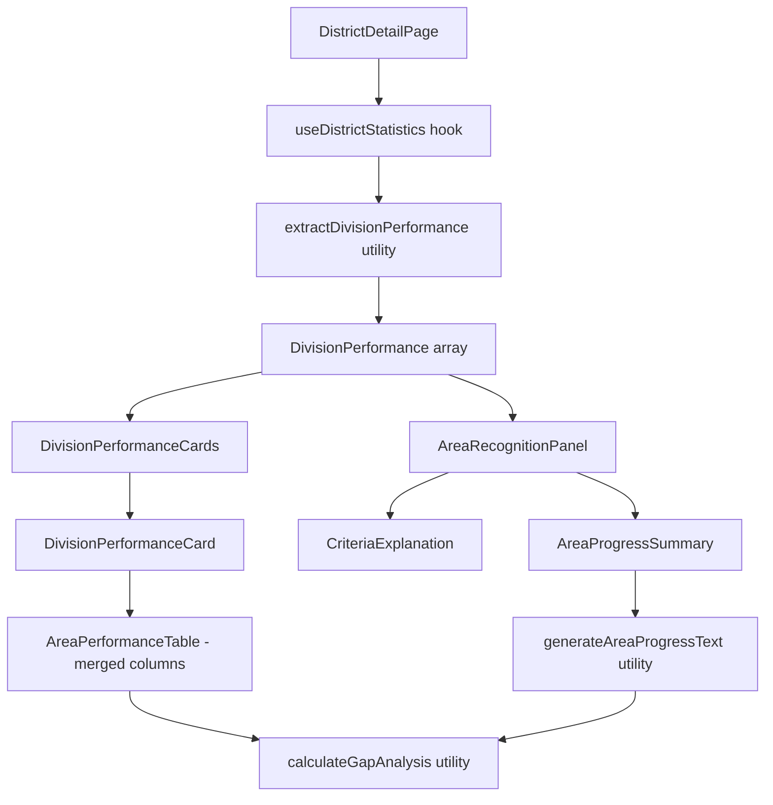

# Design Document: Area Distinguished Criteria

## Overview

This feature adds an Area Recognition section to the existing Divisions & Areas tab on the District page. The section displays the Distinguished Area Program (DAP) criteria and shows each area's current progress toward achieving Distinguished, Select Distinguished, and President's Distinguished status.

The design leverages existing data structures (`AreaPerformance`, `DivisionPerformance`) and calculation utilities (`divisionStatus.ts`) already present in the codebase. The new component will integrate seamlessly with the existing `DivisionPerformanceCards` component pattern.

## Architecture

The feature follows the existing frontend architecture:

```text
DistrictDetailPage.tsx
└── Divisions & Areas Tab
    ├── DivisionPerformanceCards (existing, enhanced)
    │   └── DivisionPerformanceCard
    │       ├── DivisionSummary
    │       └── AreaPerformanceTable (merged with recognition metrics)
    │           Columns: Area | Paid/Base | Distinguished | First Round Visits |
    │                    Second Round Visits | Recognition | Gap to D | Gap to S | Gap to P
    └── AreaRecognitionPanel
        ├── CriteriaExplanation
        └── AreaProgressSummary
```

Note: The standalone AreaProgressTable component has been removed. Its columns have been merged into the AreaPerformanceTable within each Division card.

### Data Flow



## Components and Interfaces

### AreaRecognitionPanel Component

Main container component for the area recognition section.

```typescript
interface AreaRecognitionPanelProps {
  /** Division performance data containing area information */
  divisions: DivisionPerformance[]
  /** Loading state indicator */
  isLoading?: boolean
}
```

Note: AreaRecognitionPanel no longer includes AreaProgressTable. It only contains CriteriaExplanation and AreaProgressSummary.

### AreaPerformanceTable Component (Enhanced)

The existing AreaPerformanceTable within each DivisionPerformanceCard has been enhanced to include recognition metrics. This consolidates all area information in one place.

**Column Structure:**
| Column | Description |
|--------|-------------|
| Area | Area identifier |
| Paid/Base | Paid clubs count vs club base with percentage (e.g., "5/5 100%") |
| Distinguished | Distinguished clubs count vs club base with percentage |
| First Round Visits | First round visit completion status |
| Second Round Visits | Second round visit completion status |
| Recognition | Badge showing current recognition level |
| Gap to D | Distinguished clubs needed for Distinguished (50% of base) |
| Gap to S | Distinguished clubs needed for Select (50% + 1) |
| Gap to P | Distinguished clubs needed for President's (base+1, 50%+1) |

```typescript
interface AreaPerformanceTableProps {
  /** Array of area performance data to display */
  areas: AreaPerformance[]
}
```

### CriteriaExplanation Component

Displays the DAP criteria and eligibility requirements.

```typescript
interface CriteriaExplanationProps {
  /** Whether to show in collapsed/expanded state */
  defaultExpanded?: boolean
}
```

### AreaProgressSummary Component

Displays all areas with concise English paragraphs describing their progress and what's needed for each recognition level.

```typescript
interface AreaProgressSummaryProps {
  /** All areas from all divisions */
  areas: AreaWithDivision[]
  /** Loading state indicator */
  isLoading?: boolean
}

interface AreaWithDivision extends AreaPerformance {
  /** Parent division identifier */
  divisionId: string
}
```

### Area Progress Text Generation

Generates a concise English paragraph for each area describing:

1. Current status and recognition level achieved
2. Eligibility requirements (no net club loss + club visits if data available)
3. What's needed for the next level (building incrementally)
4. Additional requirements for higher levels (only the differences)

```typescript
interface AreaProgressText {
  /** Area identifier with division context */
  areaLabel: string
  /** Current recognition level achieved */
  currentLevel: RecognitionLevel
  /** Concise paragraph describing progress and gaps */
  progressText: string
}

/**
 * Generates a concise English paragraph describing an area's progress.
 * Includes all DAP criteria: paid clubs, distinguished clubs, and club visits.
 *
 * Examples:
 * - "Area A1 (Division A) has achieved President's Distinguished status with all club visits complete."
 * - "Area A2 (Division A) has achieved Distinguished status (4 of 4 clubs paid, 2 of 4 distinguished).
 *    For Select Distinguished, 1 more club needs to become distinguished.
 *    For President's Distinguished, also add 1 paid club.
 *    Club visits: 4 of 4 first-round complete, 2 of 4 second-round complete."
 * - "Area B1 (Division B) has a net club loss (3 of 4 clubs paid). To become eligible,
 *    add 1 paid club. Then for Distinguished, 2 clubs need to become distinguished.
 *    Club visits: first-round 75% complete (3 of 4), second-round not started."
 * - "Area C1 (Division C) is not yet distinguished (4 of 4 clubs paid, 1 of 4 distinguished).
 *    For Distinguished, 1 more club needs to become distinguished.
 *    For Select Distinguished, 1 additional club. For President's Distinguished, also add 1 paid club.
 *    Club visits: status unknown."
 */
function generateAreaProgressText(
  area: AreaWithDivision,
  gapAnalysis: GapAnalysis
): AreaProgressText
```

### Gap Analysis Types

```typescript
interface GapAnalysis {
  /** Current recognition level achieved */
  currentLevel: 'none' | 'distinguished' | 'select' | 'presidents'
  /** Whether no net club loss requirement is met (paidClubs >= clubBase) */
  meetsNoNetLossRequirement: boolean
  /** Number of additional paid clubs needed to meet club base (0 if met) */
  paidClubsNeeded: number
  /** Gap to Distinguished level */
  distinguishedGap: GapToLevel
  /** Gap to Select Distinguished level */
  selectGap: GapToLevel
  /** Gap to President's Distinguished level */
  presidentsGap: GapToLevel
}

interface GapToLevel {
  /** Whether this level is already achieved */
  achieved: boolean
  /** Number of additional distinguished clubs needed (0 if achieved) */
  distinguishedClubsNeeded: number
  /** Number of additional paid clubs needed for this level (0 if met) */
  paidClubsNeeded: number
  /** Whether this level is achievable (no net loss requirement met) */
  achievable: boolean
}
```

## Data Models

### Existing Types (from divisionStatus.ts)

The feature reuses existing types:

- `AreaPerformance`: Contains `clubBase`, `paidClubs`, `distinguishedClubs`, `status`, `isQualified`
- `DivisionPerformance`: Contains `divisionId` and `areas: AreaPerformance[]`
- `DistinguishedStatus`: Status enum including recognition levels

### DAP Thresholds (from TOASTMASTERS_DASHBOARD_KNOWLEDGE.md)

**Eligibility Requirements:**

1. No net club loss (paidClubs >= clubBase)
2. Club Visits: 75% of club base for first-round visits by Nov 30, 75% for second-round by May 31

**Recognition Levels:**

| Level                          | Paid Clubs      | Distinguished Clubs (of club base) |
| ------------------------------ | --------------- | ---------------------------------- |
| Distinguished Area             | ≥ club base     | ≥ 50%                              |
| Select Distinguished Area      | ≥ club base     | ≥ 50% + 1 club                     |
| President's Distinguished Area | ≥ club base + 1 | ≥ 50% + 1 club                     |

**Key Differences from Previous Implementation:**

- Distinguished percentage is calculated against **club base**, not paid clubs
- Paid clubs threshold is **≥ club base** (no net loss), not 75%
- Select Distinguished requires 50% + 1 additional club (not 75%)
- President's Distinguished requires club base + 1 paid clubs AND 50% + 1 distinguished

## Correctness Properties

_A property is a characteristic or behavior that should hold true across all valid executions of a system—essentially, a formal statement about what the system should do. Properties serve as the bridge between human-readable specifications and machine-verifiable correctness guarantees._

### Property 1: All Areas Displayed

_For any_ set of divisions containing areas, when the AreaProgressSummary is rendered, all areas from all divisions should appear in the output exactly once, each with a progress paragraph.

**Validates: Requirements 5.1**

### Property 2: Progress Text Completeness

_For any_ area with valid performance data, the generated progress text should mention:

- The area's current recognition level (or that it's not yet distinguished)
- What's needed to reach the next achievable level (if not at President's Distinguished)
- The incremental differences for higher levels (building on previous requirements)

**Validates: Requirements 5.2, 5.3, 5.6**

### Property 3: Incremental Gap Description

_For any_ area not at President's Distinguished, the progress text should describe gaps incrementally:

- First mention what's needed for the next level
- Then mention only the additional requirements for higher levels (not repeating previous requirements)

Example: "For Select Distinguished, 1 more club needs to become distinguished. For President's Distinguished, also add 1 paid club."

**Validates: Requirements 6.2, 6.3, 6.4**

### Property 4: Net Loss Blocker Description

_For any_ area where paidClubs < clubBase, the progress text should:

- Clearly state the net club loss situation
- Explain that paid clubs must be added before recognition is possible
- Then describe what's needed for each level after eligibility is met

**Validates: Requirements 6.1, 6.6**

### Property 5: Recognition Level Classification

_For any_ area with valid metrics, the recognition level should be determined as follows:

- If paidClubs < clubBase: "Not Eligible" (net club loss)
- Else if paidClubs >= clubBase + 1 AND distinguishedClubs >= Math.ceil(clubBase \* 0.50) + 1: "President's Distinguished"
- Else if paidClubs >= clubBase AND distinguishedClubs >= Math.ceil(clubBase \* 0.50) + 1: "Select Distinguished"
- Else if paidClubs >= clubBase AND distinguishedClubs >= Math.ceil(clubBase \* 0.50): "Distinguished"
- Else: "Not Distinguished"

**Validates: Requirements 5.6, 6.5**

### Property 6: Achieved Status Description

_For any_ area that has achieved a recognition level, the progress text should clearly state the achievement. If President's Distinguished is achieved, no further gaps should be mentioned.

**Validates: Requirements 6.5**

## Error Handling

### Missing Data Scenarios

| Scenario                           | Handling                                |
| ---------------------------------- | --------------------------------------- |
| No divisions in district           | Display empty state with message        |
| Division has no areas              | Skip division in area list              |
| Area has zero clubs (clubBase = 0) | Display "N/A" for percentages           |
| Area has zero paid clubs           | Display 0% for distinguished percentage |

### Edge Cases

1. **New areas with no history**: Display current metrics with all gaps calculated
2. **Areas with 100% distinguished**: Show "Achieved" for all levels
3. **Areas with exactly threshold values**: Correctly classify as meeting threshold

## Testing Strategy

### Testing Approach

Per the property-testing-guidance steering document, this feature does **not** warrant property-based testing because:

1. The calculations are simple arithmetic (percentages, gaps) with bounded inputs
2. The input space is small and well-defined (club counts 0-20 typically)
3. 5-10 well-chosen examples fully cover the behavior including edge cases
4. The logic has no mathematical invariants or complex algebraic properties

Unit tests with specific examples provide equivalent confidence and are more maintainable.

### Unit Tests

Unit tests should cover:

**Component Rendering:**

- AreaRecognitionPanel renders with valid division data
- Empty state when no divisions provided
- Loading state display
- Criteria explanation content is present and accurate

**Progress Text Generation:**

- Area at President's Distinguished: "Area A1 (Division A) has achieved President's Distinguished status."
- Area at Select Distinguished: mentions achievement and what's needed for President's (1 more paid club)
- Area at Distinguished: mentions achievement and incremental gaps for Select and President's
- Area not distinguished but eligible: describes gaps to each level incrementally
- Area with net club loss: explains eligibility requirement first, then gaps

**Incremental Gap Description:**

- Gaps build on each other (don't repeat requirements)
- Select gap only mentions distinguished clubs needed beyond Distinguished
- President's gap only mentions paid club needed beyond Select

**Recognition Level Classification:**

- Area with net club loss (paidClubs < clubBase) → "Not Eligible"
- Area at 50% distinguished of club base → "Distinguished"
- Area at 50% + 1 distinguished of club base → "Select Distinguished"
- Area at 50% + 1 distinguished AND club base + 1 paid → "President's Distinguished"

**Edge Cases:**

- Area with 0 clubs (clubBase = 0)
- Area with 0 paid clubs
- Area with exactly threshold values (boundary conditions)
- Area with 1 club (minimum case)

**Accessibility:**

- Semantic HTML structure
- ARIA labels present
- Keyboard navigation support

### Test File Structure

```text
frontend/src/components/__tests__/
├── AreaRecognitionPanel.test.tsx    # Main component tests
├── AreaProgressSummary.test.tsx     # Summary component tests
├── CriteriaExplanation.test.tsx     # Criteria display tests
frontend/src/utils/__tests__/
├── areaGapAnalysis.test.ts          # Gap calculation utility tests
└── areaProgressText.test.ts         # Progress text generation tests
```
