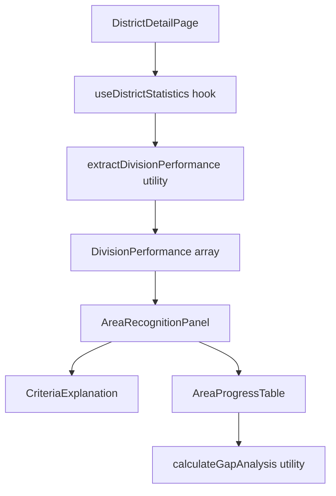

# Design Document: Area Distinguished Criteria

## Overview

This feature adds an Area Recognition section to the existing Divisions & Areas tab on the District page. The section displays the Distinguished Area Program (DAP) criteria and shows each area's current progress toward achieving Distinguished, Select Distinguished, and President's Distinguished status.

The design leverages existing data structures (`AreaPerformance`, `DivisionPerformance`) and calculation utilities (`divisionStatus.ts`) already present in the codebase. The new component will integrate seamlessly with the existing `DivisionPerformanceCards` component pattern.

## Architecture

The feature follows the existing frontend architecture:

```
DistrictDetailPage.tsx
└── Divisions & Areas Tab
    ├── DivisionPerformanceCards (existing)
    └── AreaRecognitionPanel (new)
        ├── CriteriaExplanation (new)
        └── AreaProgressTable (new)
```

### Data Flow



## Components and Interfaces

### AreaRecognitionPanel Component

Main container component for the area recognition section.

```typescript
interface AreaRecognitionPanelProps {
  /** Division performance data containing area information */
  divisions: DivisionPerformance[]
  /** Loading state indicator */
  isLoading?: boolean
}
```

### CriteriaExplanation Component

Displays the DAP criteria and eligibility requirements.

```typescript
interface CriteriaExplanationProps {
  /** Whether to show in collapsed/expanded state */
  defaultExpanded?: boolean
}
```

### AreaProgressTable Component

Displays all areas with their current progress and gap analysis.

```typescript
interface AreaProgressTableProps {
  /** All areas from all divisions */
  areas: AreaWithDivision[]
  /** Loading state indicator */
  isLoading?: boolean
}

interface AreaWithDivision extends AreaPerformance {
  /** Parent division identifier */
  divisionId: string
}
```

### Gap Analysis Types

```typescript
interface GapAnalysis {
  /** Current recognition level achieved */
  currentLevel: 'none' | 'distinguished' | 'select' | 'presidents'
  /** Whether paid clubs threshold (75%) is met */
  meetsPaidThreshold: boolean
  /** Number of additional paid clubs needed (0 if threshold met) */
  paidClubsNeeded: number
  /** Gap to Distinguished level */
  distinguishedGap: GapToLevel
  /** Gap to Select Distinguished level */
  selectGap: GapToLevel
  /** Gap to President's Distinguished level */
  presidentsGap: GapToLevel
}

interface GapToLevel {
  /** Whether this level is already achieved */
  achieved: boolean
  /** Number of additional distinguished clubs needed (0 if achieved) */
  clubsNeeded: number
  /** Whether this level is achievable (paid threshold met) */
  achievable: boolean
}
```

## Data Models

### Existing Types (from divisionStatus.ts)

The feature reuses existing types:

- `AreaPerformance`: Contains `clubBase`, `paidClubs`, `distinguishedClubs`, `status`, `isQualified`
- `DivisionPerformance`: Contains `divisionId` and `areas: AreaPerformance[]`
- `DistinguishedStatus`: Status enum including recognition levels

### DAP Thresholds (from toastmasters-rules-reference.md)

| Level                          | Paid Clubs | Distinguished Clubs (of paid) |
| ------------------------------ | ---------- | ----------------------------- |
| Distinguished Area             | ≥ 75%      | ≥ 50%                         |
| Select Distinguished Area      | ≥ 75%      | ≥ 75%                         |
| President's Distinguished Area | ≥ 75%      | 100%                          |

## Correctness Properties

_A property is a characteristic or behavior that should hold true across all valid executions of a system—essentially, a formal statement about what the system should do. Properties serve as the bridge between human-readable specifications and machine-verifiable correctness guarantees._

### Property 1: All Areas Displayed

_For any_ set of divisions containing areas, when the AreaProgressTable is rendered, all areas from all divisions should appear in the output exactly once.

**Validates: Requirements 5.1**

### Property 2: Area Metrics Display Completeness

_For any_ area with valid performance data (clubBase, paidClubs, distinguishedClubs), the rendered output should contain the paid clubs count, total clubs count (clubBase), and distinguished clubs count.

**Validates: Requirements 5.2, 5.3**

### Property 3: Paid Clubs Percentage Calculation

_For any_ area where clubBase > 0, the displayed paid clubs percentage should equal `Math.round((paidClubs / clubBase) * 100)`.

**Validates: Requirements 5.4**

### Property 4: Distinguished Clubs Percentage Calculation

_For any_ area where paidClubs > 0, the displayed distinguished clubs percentage should equal `Math.round((distinguishedClubs / paidClubs) * 100)`. When paidClubs = 0, the percentage should be 0.

**Validates: Requirements 5.5**

### Property 5: Recognition Level Classification

_For any_ area with valid metrics, the recognition level should be determined as follows:

- If paidClubs/clubBase < 0.75: "Not Eligible" (paid threshold not met)
- Else if distinguishedClubs/paidClubs >= 1.0: "President's Distinguished"
- Else if distinguishedClubs/paidClubs >= 0.75: "Select Distinguished"
- Else if distinguishedClubs/paidClubs >= 0.50: "Distinguished"
- Else: "Not Distinguished"

**Validates: Requirements 5.6, 6.5**

### Property 6: Paid Clubs Gap Calculation

_For any_ area, the number of additional paid clubs needed should equal `max(0, Math.ceil(clubBase * 0.75) - paidClubs)`.

**Validates: Requirements 6.1**

### Property 7: Distinguished Clubs Gap Calculation

_For any_ area where the paid threshold is met (paidClubs/clubBase >= 0.75):

- Distinguished gap = `max(0, Math.ceil(paidClubs * 0.50) - distinguishedClubs)`
- Select Distinguished gap = `max(0, Math.ceil(paidClubs * 0.75) - distinguishedClubs)`
- President's Distinguished gap = `max(0, paidClubs - distinguishedClubs)`

**Validates: Requirements 6.2, 6.3, 6.4**

### Property 8: Paid Threshold Blocker Display

_For any_ area where paidClubs/clubBase < 0.75, the gap analysis for all recognition levels should indicate that the paid clubs requirement must be met first, rather than showing distinguished club gaps.

**Validates: Requirements 6.6**

## Error Handling

### Missing Data Scenarios

| Scenario                           | Handling                                |
| ---------------------------------- | --------------------------------------- |
| No divisions in district           | Display empty state with message        |
| Division has no areas              | Skip division in area list              |
| Area has zero clubs (clubBase = 0) | Display "N/A" for percentages           |
| Area has zero paid clubs           | Display 0% for distinguished percentage |

### Edge Cases

1. **New areas with no history**: Display current metrics with all gaps calculated
2. **Areas with 100% distinguished**: Show "Achieved" for all levels
3. **Areas with exactly threshold values**: Correctly classify as meeting threshold

## Testing Strategy

### Testing Approach

Per the property-testing-guidance steering document, this feature does **not** warrant property-based testing because:

1. The calculations are simple arithmetic (percentages, gaps) with bounded inputs
2. The input space is small and well-defined (club counts 0-20 typically)
3. 5-10 well-chosen examples fully cover the behavior including edge cases
4. The logic has no mathematical invariants or complex algebraic properties

Unit tests with specific examples provide equivalent confidence and are more maintainable.

### Unit Tests

Unit tests should cover:

**Component Rendering:**

- AreaRecognitionPanel renders with valid division data
- Empty state when no divisions provided
- Loading state display
- Criteria explanation content is present and accurate

**Gap Calculation Logic:**

- Paid clubs gap: area with 4 clubs, 2 paid → needs 1 more (75% = 3)
- Paid clubs gap: area with 4 clubs, 3 paid → needs 0 (threshold met)
- Distinguished gap: 4 paid clubs, 1 distinguished → needs 1 for Distinguished (50% = 2)
- Select gap: 4 paid clubs, 2 distinguished → needs 1 for Select (75% = 3)
- Presidents gap: 4 paid clubs, 3 distinguished → needs 1 for Presidents (100% = 4)

**Recognition Level Classification:**

- Area below paid threshold → "Not Eligible"
- Area at 50% distinguished → "Distinguished"
- Area at 75% distinguished → "Select Distinguished"
- Area at 100% distinguished → "President's Distinguished"

**Edge Cases:**

- Area with 0 clubs (clubBase = 0)
- Area with 0 paid clubs
- Area with exactly threshold values (boundary conditions)
- Area with 1 club (minimum case)

**Accessibility:**

- Semantic HTML structure
- ARIA labels present
- Keyboard navigation support

### Test File Structure

```
frontend/src/components/__tests__/
├── AreaRecognitionPanel.test.tsx    # Main component tests
├── AreaProgressTable.test.tsx       # Table component tests
├── CriteriaExplanation.test.tsx     # Criteria display tests
└── gapCalculation.test.ts           # Gap calculation utility tests
```
