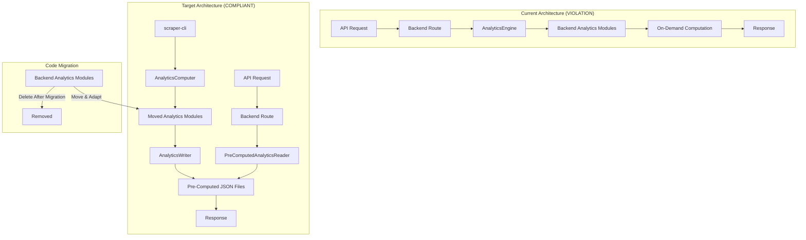

# Design Document: Backend Computation Removal

## Overview

This design removes on-demand analytics computation from the backend to enforce the data-computation-separation steering document. The backend currently violates the architectural mandate by performing extensive analytics computation through the `AnalyticsEngine` class and its associated modules.

### Critical Design Decision: Reuse Hardened Backend Code

The backend analytics modules (`backend/src/services/analytics/`) have been hardened with bug fixes over weeks. The analytics-core modules are simpler versions. **We must NOT rewrite this code** - instead, we will:

1. **Move the hardened backend analytics modules to analytics-core** (preserving all bug fixes)
2. **Update scraper-cli to use the moved modules** for pre-computation
3. **Update backend routes to read pre-computed files** instead of computing on-demand
4. **Remove the original backend modules** after migration

This approach ensures:
- All bug fixes are preserved
- No code is rewritten from scratch
- The hardened logic becomes the single source of truth in analytics-core

### Key Changes

1. **Move backend analytics modules to analytics-core** - MembershipAnalyticsModule, ClubHealthAnalyticsModule, DistinguishedClubAnalyticsModule, DivisionAreaAnalyticsModule, LeadershipAnalyticsModule, AreaDivisionRecognitionModule
2. **Adapt moved modules** to work with DistrictStatistics[] instead of IAnalyticsDataSource
3. **Extend AnalyticsComputer** to use the moved modules
4. **Extend AnalyticsWriter** to write new analytics file types
5. **Update backend routes** to read from pre-computed files
6. **Extend PreComputedAnalyticsReader** to support new file types
7. **Remove AnalyticsEngine** and original analytics modules from backend

## Architecture



The target architecture ensures:
- Backend is a pure read-only API server
- All computation happens in scraper-cli during the data pipeline
- Pre-computed files are the contract between scraper-cli and backend
- Sub-10ms response times are achievable
- **Hardened code is preserved** by moving, not rewriting

## Components and Interfaces

### 0. Module Migration Strategy (CRITICAL)

The backend analytics modules must be moved to analytics-core, not rewritten. The key adaptation is changing from `IAnalyticsDataSource` (async data retrieval) to `DistrictStatistics[]` (pre-loaded data).

**Modules to Move:**
| Backend Module | Target Location | Adaptation Required |
| -------------- | --------------- | ------------------- |
| `MembershipAnalyticsModule` | `analytics-core/analytics/` | Remove IAnalyticsDataSource, accept DistrictStatistics[] |
| `ClubHealthAnalyticsModule` | `analytics-core/analytics/` | Remove IAnalyticsDataSource, accept DistrictStatistics[] |
| `DistinguishedClubAnalyticsModule` | `analytics-core/analytics/` | Remove IAnalyticsDataSource, accept DistrictStatistics[] |
| `DivisionAreaAnalyticsModule` | `analytics-core/analytics/` | Remove IAnalyticsDataSource, accept DistrictStatistics[] |
| `LeadershipAnalyticsModule` | `analytics-core/analytics/` | Remove IAnalyticsDataSource, accept DistrictStatistics[] |
| `AreaDivisionRecognitionModule` | `analytics-core/analytics/` | Remove IAnalyticsDataSource, accept DistrictStatistics[] |
| `AnalyticsUtils` | `analytics-core/analytics/` | Direct copy (no dependencies) |

**Adaptation Pattern:**
```typescript
// BEFORE (backend module with async data source)
export class MembershipAnalyticsModule {
  private readonly dataSource: IAnalyticsDataSource
  
  constructor(dataSource: IAnalyticsDataSource) {
    this.dataSource = dataSource
  }
  
  async generateMembershipAnalytics(districtId: string): Promise<MembershipAnalytics> {
    const dataEntries = await this.loadDistrictData(districtId)
    // ... computation logic (PRESERVE THIS)
  }
}

// AFTER (analytics-core module with pre-loaded data)
export class MembershipAnalyticsModule {
  // No constructor - stateless module
  
  generateMembershipAnalytics(
    districtId: string,
    snapshots: DistrictStatistics[]
  ): MembershipAnalytics {
    // ... same computation logic (PRESERVED)
  }
}
```

The computation logic inside each method is **preserved exactly** - only the data loading mechanism changes.

### 1. New Analytics Types (analytics-core/types.ts)

New types for analytics data that needs to be pre-computed:

```typescript
/**
 * Membership analytics data structure.
 * Pre-computed by scraper-cli, served by backend.
 */
export interface MembershipAnalyticsData {
  districtId: string
  dateRange: DateRange
  totalMembership: number
  membershipChange: number
  membershipTrend: MembershipTrendPoint[]
  paymentsTrend: PaymentsTrendPoint[]
  yearOverYear?: YearOverYearComparison
  growthRate: number
  retentionRate: number
}

/**
 * Vulnerable clubs data structure.
 * Pre-computed list of clubs requiring attention.
 */
export interface VulnerableClubsData {
  districtId: string
  computedAt: string
  totalVulnerableClubs: number
  interventionRequiredClubs: number
  vulnerableClubs: ClubTrend[]
  interventionRequired: ClubTrend[]
}

/**
 * Leadership insights data structure.
 * Pre-computed leadership effectiveness metrics.
 */
export interface LeadershipInsightsData {
  districtId: string
  dateRange: DateRange
  officerCompletionRate: number
  trainingCompletionRate: number
  leadershipEffectivenessScore: number
  topPerformingDivisions: DivisionRanking[]
  areasNeedingSupport: AreaPerformance[]
}

/**
 * Distinguished club analytics data structure.
 * Comprehensive distinguished club progress and projections.
 */
export interface DistinguishedClubAnalyticsData {
  districtId: string
  dateRange: DateRange
  distinguishedClubs: DistinguishedClubCounts
  distinguishedClubsList: DistinguishedClubSummary[]
  distinguishedProjection: DistinguishedProjection
  progressByLevel: {
    smedley: { current: number; projected: number; trend: string }
    presidents: { current: number; projected: number; trend: string }
    select: { current: number; projected: number; trend: string }
    distinguished: { current: number; projected: number; trend: string }
  }
}

/**
 * Year-over-year comparison data structure.
 * Pre-computed historical comparison metrics.
 */
export interface YearOverYearData {
  districtId: string
  currentDate: string
  previousYearDate: string
  dataAvailable: boolean
  message?: string
  metrics?: {
    membership: MetricComparison
    distinguishedClubs: MetricComparison
    clubHealth: {
      thrivingClubs: MetricComparison
      vulnerableClubs: MetricComparison
      interventionRequiredClubs: MetricComparison
    }
    dcpGoals: {
      totalGoals: MetricComparison
      averagePerClub: MetricComparison
    }
    clubCount: MetricComparison
  }
  multiYearTrends?: MultiYearTrend[]
}

interface MetricComparison {
  current: number
  previous: number
  change: number
  percentageChange: number
}

interface MultiYearTrend {
  year: number
  date: string
  membership: number
  distinguishedClubs: number
  totalDcpGoals: number
  clubCount: number
}

/**
 * Performance targets data structure.
 * Pre-computed recognition level targets.
 */
export interface PerformanceTargetsData {
  districtId: string
  computedAt: string
  membershipTarget: number
  distinguishedTarget: number
  clubGrowthTarget: number
  currentProgress: {
    membership: number
    distinguished: number
    clubGrowth: number
  }
  projectedAchievement: {
    membership: boolean
    distinguished: boolean
    clubGrowth: boolean
  }
}

/**
 * Club trends data for individual club lookup.
 * Stored per-club for efficient retrieval.
 */
export interface ClubTrendsIndex {
  districtId: string
  computedAt: string
  clubs: Record<string, ClubTrend>
}
```

### 2. Extended AnalyticsComputer (analytics-core)

The AnalyticsComputer needs new methods to compute additional analytics:

```typescript
export interface ExtendedAnalyticsComputationResult extends AnalyticsComputationResult {
  membershipAnalytics: MembershipAnalyticsData
  vulnerableClubs: VulnerableClubsData
  leadershipInsights: LeadershipInsightsData
  distinguishedClubAnalytics: DistinguishedClubAnalyticsData
  yearOverYear: YearOverYearData
  performanceTargets: PerformanceTargetsData
  clubTrendsIndex: ClubTrendsIndex
}

export class AnalyticsComputer implements IAnalyticsComputer {
  // Existing method
  async computeDistrictAnalytics(
    districtId: string,
    snapshots: DistrictStatistics[],
    options?: ComputeOptions
  ): Promise<ExtendedAnalyticsComputationResult>
  
  // New methods for extended analytics
  private computeMembershipAnalytics(
    districtId: string,
    snapshots: DistrictStatistics[]
  ): MembershipAnalyticsData
  
  private computeVulnerableClubs(
    districtId: string,
    clubHealth: ClubHealthData
  ): VulnerableClubsData
  
  private computeLeadershipInsights(
    districtId: string,
    snapshots: DistrictStatistics[]
  ): LeadershipInsightsData
  
  private computeDistinguishedClubAnalytics(
    districtId: string,
    snapshots: DistrictStatistics[]
  ): DistinguishedClubAnalyticsData
  
  private computeYearOverYear(
    districtId: string,
    snapshots: DistrictStatistics[],
    currentDate: string
  ): YearOverYearData
  
  private computePerformanceTargets(
    districtId: string,
    snapshots: DistrictStatistics[]
  ): PerformanceTargetsData
  
  private buildClubTrendsIndex(
    districtId: string,
    clubHealth: ClubHealthData
  ): ClubTrendsIndex
}
```

### 3. Extended AnalyticsWriter (scraper-cli)

New methods to write additional analytics files:

```typescript
export class AnalyticsWriter implements IAnalyticsWriter {
  // Existing methods...
  
  // New methods for extended analytics
  async writeMembershipAnalytics(
    snapshotDate: string,
    districtId: string,
    data: MembershipAnalyticsData,
    options?: WriteAnalyticsOptions
  ): Promise<string>
  
  async writeVulnerableClubs(
    snapshotDate: string,
    districtId: string,
    data: VulnerableClubsData,
    options?: WriteAnalyticsOptions
  ): Promise<string>
  
  async writeLeadershipInsights(
    snapshotDate: string,
    districtId: string,
    data: LeadershipInsightsData,
    options?: WriteAnalyticsOptions
  ): Promise<string>
  
  async writeDistinguishedClubAnalytics(
    snapshotDate: string,
    districtId: string,
    data: DistinguishedClubAnalyticsData,
    options?: WriteAnalyticsOptions
  ): Promise<string>
  
  async writeYearOverYear(
    snapshotDate: string,
    districtId: string,
    data: YearOverYearData,
    options?: WriteAnalyticsOptions
  ): Promise<string>
  
  async writePerformanceTargets(
    snapshotDate: string,
    districtId: string,
    data: PerformanceTargetsData,
    options?: WriteAnalyticsOptions
  ): Promise<string>
  
  async writeClubTrendsIndex(
    snapshotDate: string,
    districtId: string,
    data: ClubTrendsIndex,
    options?: WriteAnalyticsOptions
  ): Promise<string>
}
```

### 4. Extended PreComputedAnalyticsReader (backend)

New methods to read additional analytics files:

```typescript
export class PreComputedAnalyticsReader implements IPreComputedAnalyticsReader {
  // Existing methods...
  
  // New methods for extended analytics
  async readMembershipAnalytics(
    snapshotDate: string,
    districtId: string
  ): Promise<MembershipAnalyticsData | null>
  
  async readVulnerableClubs(
    snapshotDate: string,
    districtId: string
  ): Promise<VulnerableClubsData | null>
  
  async readLeadershipInsights(
    snapshotDate: string,
    districtId: string
  ): Promise<LeadershipInsightsData | null>
  
  async readDistinguishedClubAnalytics(
    snapshotDate: string,
    districtId: string
  ): Promise<DistinguishedClubAnalyticsData | null>
  
  async readYearOverYear(
    snapshotDate: string,
    districtId: string
  ): Promise<YearOverYearData | null>
  
  async readPerformanceTargets(
    snapshotDate: string,
    districtId: string
  ): Promise<PerformanceTargetsData | null>
  
  async readClubTrends(
    snapshotDate: string,
    districtId: string,
    clubId: string
  ): Promise<ClubTrend | null>
}
```

### 5. Updated Backend Routes

Each route will be updated to read from pre-computed files:

```typescript
// Example: membership-analytics route (BEFORE - VIOLATION)
analyticsRouter.get('/:districtId/membership-analytics', async (req, res) => {
  const analyticsEngine = await getAnalyticsEngine()
  const analytics = await analyticsEngine.generateMembershipAnalytics(districtId)
  res.json(analytics)
})

// Example: membership-analytics route (AFTER - COMPLIANT)
analyticsRouter.get('/:districtId/membership-analytics', async (req, res) => {
  const latestSnapshot = await snapshotStore.getLatestSuccessful()
  if (!latestSnapshot) {
    return res.status(404).json({
      error: {
        code: 'NO_DATA_AVAILABLE',
        message: 'No snapshot data available',
        details: 'Run scraper-cli to fetch data'
      }
    })
  }
  
  const analytics = await preComputedAnalyticsReader.readMembershipAnalytics(
    latestSnapshot.snapshot_id,
    districtId
  )
  
  if (!analytics) {
    return res.status(404).json({
      error: {
        code: 'ANALYTICS_NOT_FOUND',
        message: 'Pre-computed membership analytics not found',
        details: 'Run scraper-cli compute-analytics to generate analytics'
      }
    })
  }
  
  res.json(analytics)
})
```

## Data Models

### Pre-Computed File Structure

After implementation, the analytics directory will contain:

```
CACHE_DIR/snapshots/{date}/analytics/
├── manifest.json
├── district_{id}_analytics.json          # Existing - DistrictAnalytics
├── district_{id}_membership.json         # Existing - MembershipTrendData
├── district_{id}_clubhealth.json         # Existing - ClubHealthData
├── district_{id}_membership-analytics.json   # NEW - MembershipAnalyticsData
├── district_{id}_vulnerable-clubs.json       # NEW - VulnerableClubsData
├── district_{id}_leadership-insights.json    # NEW - LeadershipInsightsData
├── district_{id}_distinguished-analytics.json # NEW - DistinguishedClubAnalyticsData
├── district_{id}_year-over-year.json         # NEW - YearOverYearData
├── district_{id}_performance-targets.json    # NEW - PerformanceTargetsData
└── district_{id}_club-trends-index.json      # NEW - ClubTrendsIndex
```

### Route to File Mapping

| Route | Pre-Computed File | Data Type |
| ----- | ----------------- | --------- |
| `GET /api/districts/:id/membership-analytics` | `district_{id}_membership-analytics.json` | MembershipAnalyticsData |
| `GET /api/districts/:id/clubs/:clubId/trends` | `district_{id}_club-trends-index.json` | ClubTrend (from index) |
| `GET /api/districts/:id/vulnerable-clubs` | `district_{id}_vulnerable-clubs.json` | VulnerableClubsData |
| `GET /api/districts/:id/leadership-insights` | `district_{id}_leadership-insights.json` | LeadershipInsightsData |
| `GET /api/districts/:id/distinguished-club-analytics` | `district_{id}_distinguished-analytics.json` | DistinguishedClubAnalyticsData |
| `GET /api/districts/:id/year-over-year/:date` | `district_{id}_year-over-year.json` | YearOverYearData |
| `GET /api/districts/:id/analytics/export` | Multiple files | CSV transformation |
| `GET /api/districts/:id/analytics-summary` | Multiple files | Aggregated response |

## Correctness Properties

*A property is a characteristic or behavior that should hold true across all valid executions of a system—essentially, a formal statement about what the system should do. Properties serve as the bridge between human-readable specifications and machine-verifiable correctness guarantees.*

### Property 1: Pre-Computed File Completeness

*For any* district with snapshot data, running the compute-analytics command SHALL produce all required pre-computed files (membership-analytics, vulnerable-clubs, leadership-insights, distinguished-analytics, year-over-year, performance-targets, club-trends-index).

**Validates: Requirements 1.1, 2.1, 3.1, 4.1, 5.1, 6.1, 7.1**

### Property 2: Backend Route Compliance

*For any* analytics route in the backend, the route handler SHALL NOT instantiate or call AnalyticsEngine, and SHALL only read from pre-computed files via PreComputedAnalyticsReader.

**Validates: Requirements 8.1, 8.2, 8.3, 8.4, 8.5, 8.6, 8.7, 8.8**

### Property 3: Club Trends Index Lookup

*For any* club ID in a district, looking up the club in the club-trends-index SHALL return the same ClubTrend data as would be found in the allClubs array of the district analytics.

**Validates: Requirements 2.2, 2.3, 2.4**

### Property 4: Vulnerable Clubs Partition

*For any* VulnerableClubsData, the union of vulnerableClubs and interventionRequired arrays SHALL equal the set of clubs with currentStatus of 'vulnerable' or 'intervention_required' in the district analytics.

**Validates: Requirements 3.2, 3.3**

### Property 5: Year-Over-Year Data Availability

*For any* district with at least two years of snapshot data, the year-over-year pre-computed file SHALL have dataAvailable=true and contain valid metrics comparisons.

**Validates: Requirements 6.2, 6.3**

### Property 6: Missing Data Error Response

*For any* backend route request where the pre-computed file is missing, the backend SHALL return HTTP 404 with error code indicating which scraper-cli command to run.

**Validates: Requirements 1.5, 2.5, 3.5, 4.4, 5.4, 6.5, 12.1, 12.2**

### Property 7: Schema Version Validation

*For any* pre-computed file read by the backend, the schema version SHALL be validated and incompatible versions SHALL result in HTTP 500 with clear error message.

**Validates: Requirements 10.7**

### Property 8: Export Data Consistency

*For any* export request, the CSV output SHALL be derived from pre-computed files and SHALL NOT trigger on-demand computation.

**Validates: Requirements 11.1, 11.2, 11.3**

## Error Handling

### Pre-Computation Errors

| Scenario | Handling | Recovery |
| -------- | -------- | -------- |
| Snapshot not found | Log error, skip district | Continue with other districts |
| Computation failure | Log error with details | Continue with other districts |
| Write failure | Log error, fail district | Retry on next run |
| Invalid snapshot data | Log warning, use defaults | Continue processing |

### Backend Serving Errors

| Scenario | HTTP Code | Error Code | Message |
| -------- | --------- | ---------- | ------- |
| Pre-computed file not found | 404 | ANALYTICS_NOT_FOUND | Run scraper-cli compute-analytics |
| Schema version mismatch | 500 | SCHEMA_VERSION_MISMATCH | Re-run compute-analytics |
| Corrupted JSON file | 500 | CORRUPTED_FILE | Re-run compute-analytics |
| No snapshot available | 404 | NO_DATA_AVAILABLE | Run scraper-cli to fetch data |
| Invalid district ID | 400 | INVALID_DISTRICT_ID | Check district ID format |

## Testing Strategy

Per the testing steering document, property-based tests are a tool, not a default. We should prefer unit tests with well-chosen examples unless there are mathematical invariants or complex input spaces.

### Analysis: Which Properties Warrant PBT?

| Property | PBT Warranted? | Rationale |
| -------- | -------------- | --------- |
| P1: File completeness | No | Simple existence check, examples suffice |
| P2: Route compliance | No | Code inspection, not runtime property |
| P3: Club trends lookup | **Yes** | Index lookup invariant across all clubs |
| P4: Vulnerable clubs partition | **Yes** | Mathematical partition property |
| P5: YoY data availability | No | Conditional check, examples suffice |
| P6: Missing data errors | No | Error handling, examples suffice |
| P7: Schema validation | No | Version comparison, examples suffice |
| P8: Export consistency | No | Data flow check, examples suffice |

### Unit Tests (Preferred Approach)

Unit tests with well-chosen examples should cover:

1. **AnalyticsComputer extended methods**
   - computeMembershipAnalytics with single snapshot
   - computeMembershipAnalytics with multiple snapshots
   - computeVulnerableClubs with no vulnerable clubs
   - computeVulnerableClubs with mixed health statuses
   - computeYearOverYear with insufficient data
   - computeYearOverYear with full year data

2. **AnalyticsWriter new methods**
   - writeMembershipAnalytics creates correct file structure
   - writeVulnerableClubs includes all required fields
   - writeClubTrendsIndex creates valid index

3. **PreComputedAnalyticsReader new methods**
   - readMembershipAnalytics returns null for missing file
   - readMembershipAnalytics validates schema version
   - readClubTrends returns correct club from index

4. **Backend routes**
   - Route returns 404 when pre-computed file missing
   - Route returns correct data from pre-computed file
   - Route does not call AnalyticsEngine

### Property-Based Tests (Where Warranted)

Only two properties warrant PBT due to mathematical invariants:

1. **Property 3: Club trends index lookup**
   - Input space: Arbitrary club data with various IDs
   - Property: Index lookup matches allClubs array lookup
   - Rationale: Index consistency invariant

2. **Property 4: Vulnerable clubs partition**
   - Input space: Arbitrary club health data
   - Property: Union of categories equals filtered allClubs
   - Rationale: Mathematical partition property

```typescript
// Property test configuration (for the 2 PBT tests)
const PROPERTY_TEST_CONFIG = {
  numRuns: 100,
  verbose: false,
}
```

### Integration Tests

Integration tests should verify:

1. **End-to-end pre-computation** - scraper-cli compute-analytics generates all files
2. **Backend serving** - Routes correctly serve pre-computed data
3. **Error handling** - Missing files return correct 404 responses

