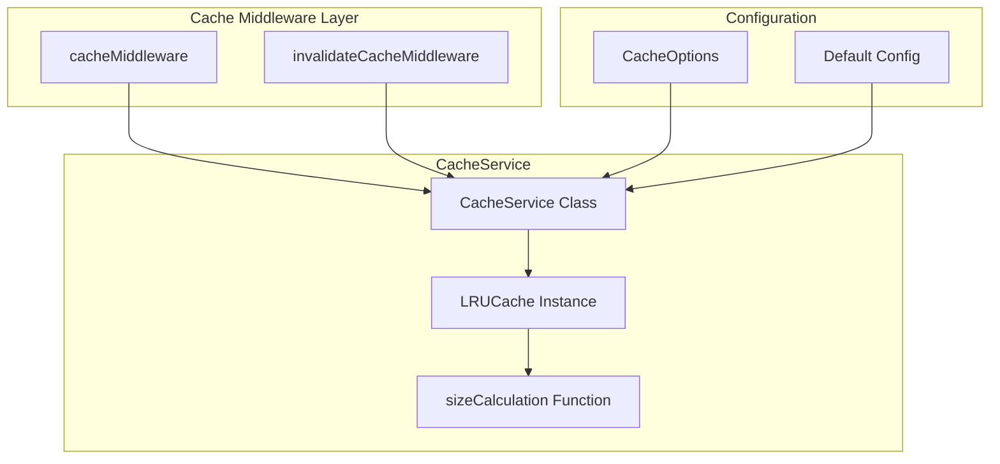

# Design Document: Bounded LRU Cache

## Overview

This design describes the replacement of `node-cache` with `lru-cache` in the `CacheService` class. The primary goal is to enforce memory bounds through maximum entry counts and total size limits, preventing unbounded memory growth as required by the Performance SLOs document (Section 7.3).

The implementation maintains full API compatibility with the existing `CacheService` interface while adding bounded memory management capabilities. The `lru-cache` library provides LRU (Least Recently Used) eviction semantics, ensuring that when limits are reached, the least recently accessed entries are evicted first.

## Architecture



## Components and Interfaces

### CacheOptions Interface

```typescript
export interface CacheOptions {
  ttl?: number           // Time to live in seconds (default: 900 = 15 minutes)
  max?: number           // Maximum number of entries (default: 1000)
  maxSize?: number       // Maximum total size in bytes (default: 50MB)
}
```

### CacheService Class

```typescript
import { LRUCache } from 'lru-cache'

export class CacheService {
  private cache: LRUCache<string, unknown>
  private defaultTTL: number
  private hits: number = 0
  private misses: number = 0

  constructor(options: CacheOptions = {}) {
    this.defaultTTL = options.ttl ?? 900

    this.cache = new LRUCache<string, unknown>({
      max: options.max ?? 1000,
      maxSize: options.maxSize ?? 50 * 1024 * 1024,
      sizeCalculation: (value: unknown) => {
        try {
          return JSON.stringify(value).length
        } catch {
          return 1024 // Fallback for non-serializable values
        }
      },
      ttl: this.defaultTTL * 1000, // Convert seconds to ms
      updateAgeOnGet: true,
      allowStale: false,
    })
  }

  get<T>(key: string): T | undefined {
    const value = this.cache.get(key) as T | undefined
    if (value !== undefined) {
      this.hits++
    } else {
      this.misses++
    }
    return value
  }

  set<T>(key: string, value: T, ttl?: number): boolean {
    const options = ttl !== undefined ? { ttl: ttl * 1000 } : undefined
    this.cache.set(key, value, options)
    return true
  }

  invalidate(key: string): number {
    return this.cache.delete(key) ? 1 : 0
  }

  invalidateMultiple(keys: string[]): number {
    return keys.reduce((count, key) => count + this.invalidate(key), 0)
  }

  clear(): void {
    this.cache.clear()
  }

  has(key: string): boolean {
    return this.cache.has(key)
  }

  keys(): string[] {
    return [...this.cache.keys()]
  }

  getStats(): {
    hits: number
    misses: number
    keys: number
    size: number
    maxEntries: number
    maxSize: number
  } {
    return {
      hits: this.hits,
      misses: this.misses,
      keys: this.cache.size,
      size: this.cache.calculatedSize ?? 0,
      maxEntries: this.cache.max,
      maxSize: this.cache.maxSize,
    }
  }
}

export const cacheService = new CacheService()
```

### Default Configuration Values

| Parameter | Default Value | Rationale |
|-----------|---------------|-----------|
| max | 1000 | Reasonable entry limit for API response caching |
| maxSize | 52,428,800 (50MB) | Per SLO Section 7.3 recommendation |
| ttl | 900 seconds (15 min) | Matches current node-cache default |
| updateAgeOnGet | true | Keeps frequently accessed data fresh |
| allowStale | false | Ensures data freshness per SLO requirements |

## Correctness Properties

### Property 1: Cache Round-Trip Consistency

*For any* key-value pair where the value is JSON-serializable, setting the value in the cache and then getting it should return an equivalent value.

**Validates: Requirements 2.1, 2.2**

### Property 2: Entry Limit Enforcement

*For any* cache configured with max N entries, after inserting N+1 unique entries, the cache should contain exactly N entries.

**Validates: Requirements 1.2, 3.4, 5.1**

### Property 3: Size Limit Enforcement

*For any* cache configured with maxSize S bytes, the total calculated size of all entries should never exceed S.

**Validates: Requirements 1.3, 3.3, 3.5, 5.2**

### Property 4: LRU Access Ordering

*For any* cache at its entry limit, accessing an entry via `get` should prevent that entry from being evicted when a new entry is added.

**Validates: Requirements 5.3**

### Property 5: Statistics Accuracy

*For any* sequence of cache operations, the statistics returned by `getStats()` should accurately reflect the number of entries, hits, and misses.

**Validates: Requirements 2.8, 6.1, 6.2, 6.3**

## Error Handling

### Size Calculation Errors

If `JSON.stringify` fails for a value (e.g., circular references), the size calculation falls back to 1KB:

```typescript
sizeCalculation: (value: unknown) => {
  try {
    return JSON.stringify(value).length
  } catch {
    return 1024 // 1KB default
  }
}
```

### Type Safety

The `get<T>` method returns `T | undefined`. Callers must handle the undefined case. The implementation does not perform runtime type validation.

## Testing Strategy

### Unit Tests

Unit tests verify specific examples and edge cases:

1. Default configuration values (max: 1000, maxSize: 50MB, ttl: 900s)
2. Custom configuration values
3. API compatibility with existing tests
4. Edge cases (single entry cache, non-serializable values)

### Property-Based Tests

Property tests verify universal properties:

1. Cache round-trip consistency
2. Entry limit enforcement
3. Size limit enforcement
4. LRU access ordering
5. Statistics accuracy

### Test Configuration

- Property-based tests: Minimum 100 iterations using fast-check
- Test framework: Vitest
- Each test creates fresh CacheService instance (no shared state)
