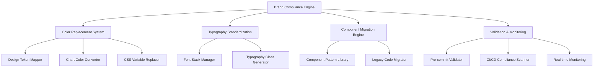

# Design Document: Brand Compliance Remediation

## Overview

This design addresses the systematic remediation of 174 brand compliance violations across 35 files in the Toastmasters application frontend. The current compliance scan reveals critical issues: only 12% color compliance and 38% typography compliance, despite audit reports claiming 98% compliance. This comprehensive solution will achieve true 100% brand compliance through automated color replacement, typography standardization, component migration, and enhanced validation systems.

The design implements a multi-phase approach: immediate violation remediation, design token enhancement, automated validation, and continuous monitoring to prevent future violations.

## Architecture

### System Components



### Data Flow

1. **Violation Detection**: Compliance scanner identifies non-compliant patterns
2. **Mapping Resolution**: Design token mapper determines appropriate TM brand replacements
3. **Automated Replacement**: Replacement engine applies systematic changes
4. **Validation**: Testing system verifies functional and visual equivalence
5. **Monitoring**: Continuous validation prevents future violations

## Components and Interfaces

### 1. Color Replacement System

**Primary Interface**: `ColorReplacementEngine`

```typescript
interface ColorReplacementEngine {
  replaceBlueColors(filePath: string): Promise<ReplacementResult>
  replaceHexColors(filePath: string): Promise<ReplacementResult>
  replaceChartColors(filePath: string): Promise<ReplacementResult>
  validateColorContrast(color: string, background: string): boolean
}

interface ColorMapping {
  from: string
  to: string
  context: 'primary' | 'secondary' | 'accent' | 'neutral'
  preserveOpacity: boolean
}
```

**Color Replacement Mappings**:

| Non-Compliant Color | TM Brand Replacement     | Usage Context                 |
| ------------------- | ------------------------ | ----------------------------- |
| `text-blue-600`     | `text-tm-loyal-blue`     | Primary actions, links        |
| `bg-blue-600`       | `bg-tm-loyal-blue`       | Primary buttons, highlights   |
| `border-blue-600`   | `border-tm-loyal-blue`   | Focus states, active elements |
| `text-blue-700`     | `text-tm-loyal-blue`     | Darker text variants          |
| `bg-blue-500`       | `bg-tm-loyal-blue`       | Interactive elements          |
| `#3b82f6`           | `var(--tm-loyal-blue)`   | Chart primary color           |
| `#ef4444`           | `var(--tm-true-maroon)`  | Error/warning states          |
| `#10b981`           | `var(--tm-loyal-blue)`   | Success states                |
| `#f59e0b`           | `var(--tm-happy-yellow)` | Warning/attention             |

### 2. Typography Standardization System

**Primary Interface**: `TypographyStandardizer`

```typescript
interface TypographyStandardizer {
  standardizeFontFamilies(filePath: string): Promise<ReplacementResult>
  enforceFontSizes(filePath: string): Promise<ReplacementResult>
  removeProhibitedEffects(filePath: string): Promise<ReplacementResult>
  validateLineHeight(element: HTMLElement): boolean
}

interface TypographyRule {
  selector: string
  fontFamily: 'headline' | 'body'
  minSize: number
  lineHeight: number
  prohibitedEffects: string[]
}
```

**Typography Standardization Rules**:

- Headlines (h1-h6, nav labels): Montserrat with system fallbacks
- Body text (p, span, div): Source Sans 3 with system fallbacks
- Minimum font size: 14px for body text
- Line height: Minimum 1.4 ratio
- Prohibited effects: drop-shadow, text-shadow, outline, glow

### 3. Component Migration Engine

**Primary Interface**: `ComponentMigrator`

```typescript
interface ComponentMigrator {
  migrateButton(component: ButtonComponent): Promise<MigratedComponent>
  migrateForm(component: FormComponent): Promise<MigratedComponent>
  migrateCard(component: CardComponent): Promise<MigratedComponent>
  migrateNavigation(component: NavComponent): Promise<MigratedComponent>
}

interface MigrationPattern {
  pattern: RegExp
  replacement: string
  validation: (original: string, migrated: string) => boolean
}
```

**Component Migration Patterns**:

| Component Type   | Current Pattern                 | Brand-Compliant Pattern |
| ---------------- | ------------------------------- | ----------------------- |
| Primary Button   | `bg-blue-600 text-white`        | `tm-btn-primary`        |
| Secondary Button | `border-blue-600 text-blue-600` | `tm-btn-secondary`      |
| Form Input       | `focus:ring-blue-500`           | `tm-form-input`         |
| Card             | `border-gray-300`               | `tm-card`               |
| Navigation       | `bg-blue-600`                   | `tm-nav`                |

### 4. Chart and Visualization System

**Primary Interface**: `ChartColorManager`

```typescript
interface ChartColorManager {
  generateBrandColorPalette(dataPoints: number): string[]
  validateChartAccessibility(colors: string[]): boolean
  replaceChartColors(chartConfig: ChartConfig): ChartConfig
}

interface ChartColorScheme {
  primary: string[]
  secondary: string[]
  accessibility: {
    contrastRatio: number
    colorBlindSafe: boolean
  }
}
```

**Chart Color Schemes**:

**Primary Data Series** (up to 4 series):

1. TM Loyal Blue (`#004165`)
2. TM True Maroon (`#772432`)
3. TM Cool Gray (`#A9B2B1`)
4. TM Happy Yellow (`#F2DF74`)

**Extended Palette** (5+ series):

- Use primary colors with opacity variations (90%, 80%, 70%)
- Maintain WCAG AA contrast ratios
- Ensure color-blind accessibility

## Data Models

### Compliance Violation Model

```typescript
interface ComplianceViolation {
  id: string
  file: string
  line: number
  column: number
  type: 'color' | 'typography' | 'component' | 'accessibility'
  severity: 'error' | 'warning'
  violation: string
  recommendation: string
  autoFixable: boolean
}

interface ComplianceReport {
  timestamp: Date
  totalViolations: number
  violationsByType: Record<string, ComplianceViolation[]>
  complianceRate: number
  fixableViolations: number
}
```

### Design Token Model

```typescript
interface DesignToken {
  name: string
  value: string
  category: 'color' | 'typography' | 'spacing' | 'gradient'
  usage: string[]
  accessibility: {
    contrastRatio?: number
    wcagLevel: 'AA' | 'AAA'
  }
}

interface TokenMapping {
  legacy: string
  token: string
  context: string[]
  migrationPriority: 'high' | 'medium' | 'low'
}
```

Now I need to use the prework tool to analyze the acceptance criteria before writing the Correctness Properties section:

<function_calls>
<invoke name="prework">
<parameter name="featureName">brand-compliance-remediation

## Correctness Properties

_A property is a characteristic or behavior that should hold true across all valid executions of a system-essentially, a formal statement about what the system should do. Properties serve as the bridge between human-readable specifications and machine-verifiable correctness guarantees._

### Property Reflection

After analyzing all acceptance criteria, several properties can be consolidated to eliminate redundancy:

- **Color compliance properties** (1.1, 1.2, 1.3, 1.4) can be combined into comprehensive color validation
- **Typography properties** (2.1, 2.2, 2.3, 2.5) can be unified under typography compliance validation
- **Component properties** (3.1, 3.2, 3.3, 3.4) can be consolidated into component pattern compliance
- **Validation properties** (5.1, 5.2, 5.3, 5.4) can be combined into automated validation effectiveness
- **Performance properties** (9.1, 9.2, 9.3, 9.5) can be unified under performance maintenance

### Core Properties

**Property 1: Complete Color Compliance**
_For any_ file in the codebase, scanning for brand violations should return zero non-compliant color usages, and all blue color classes should be replaced with TM Loyal Blue equivalents while maintaining visual hierarchy
**Validates: Requirements 1.1, 1.2, 1.5**

**Property 2: Chart Color Brand Compliance**
_For any_ chart or visualization component, all colors used for data representation should be from the approved TM brand palette, with supporting elements using TM Cool Gray
**Validates: Requirements 1.3, 4.1, 4.2**

**Property 3: Design Token Replacement**
_For any_ hardcoded hex color in components, the design token system should replace it with the appropriate CSS custom property while preserving the intended visual meaning
**Validates: Requirements 1.4, 6.1**

**Property 4: Typography System Compliance**
_For any_ text content rendered in components, the typography system should use only Montserrat for headlines and Source Sans 3 for body text, with proper fallback stacks and minimum 14px body text size
**Validates: Requirements 2.1, 2.2, 2.5**

**Property 5: Typography Effect Prohibition**
_For any_ text element in the application, no prohibited effects (drop-shadow, outline, glow) should be applied, and font loading should be optimized while maintaining brand compliance
**Validates: Requirements 2.3, 2.4**

**Property 6: Component Pattern Standardization**
_For any_ UI component (buttons, forms, cards, navigation), the component should use only approved TM design patterns and colors, with all interactive elements meeting 44px minimum touch target requirements
**Validates: Requirements 3.1, 3.2, 3.3, 3.4, 3.5**

**Property 7: Chart Accessibility and Branding**
_For any_ chart with legends, tooltips, or multiple data series, the visualization system should use brand-compliant typography and colors while maintaining WCAG AA accessibility standards
**Validates: Requirements 4.3, 4.4, 4.5**

**Property 8: Automated Validation Effectiveness**
_For any_ code commit or CI pipeline execution, the compliance validation system should detect and prevent brand violations, generate accurate reports, and provide specific remediation guidance
**Validates: Requirements 5.1, 5.2, 5.3, 5.4, 5.5**

**Property 9: Design Token System Completeness**
_For any_ brand element needed by components, the design token system should provide appropriate tokens for colors, spacing, typography, and gradients, with opacity variations in 10% increments and gradient constraint enforcement
**Validates: Requirements 6.2, 6.3, 6.4, 6.5**

**Property 10: Migration Functional Equivalence**
_For any_ component migrated from legacy patterns to brand-compliant patterns, the migration system should preserve functional behavior, visual hierarchy, and semantic meaning while ensuring zero regression
**Validates: Requirements 7.1, 7.2, 7.3, 7.4, 7.5**

**Property 11: Performance Maintenance During Compliance**
_For any_ brand compliance improvement, the system should maintain or improve performance benchmarks for asset loading, CSS bundle size, component rendering, and validation execution times
**Validates: Requirements 9.1, 9.2, 9.3, 9.4, 9.5**

**Property 12: Accessibility Preservation**
_For any_ color replacement or component update, the accessibility system should verify WCAG AA contrast ratios, maintain 44px touch targets, provide clear focus indicators, and ensure screen reader compatibility
**Validates: Requirements 10.1, 10.2, 10.3, 10.4, 10.5**

## Error Handling

### Validation Errors

**Color Validation Failures**:

- **Detection**: Automated scanning identifies non-compliant colors
- **Response**: Provide specific replacement mapping and context
- **Recovery**: Offer automated fix suggestions with preview

**Typography Violations**:

- **Detection**: Font family and size validation during build
- **Response**: Clear error messages with approved alternatives
- **Recovery**: Automatic replacement with brand-compliant typography

**Component Pattern Violations**:

- **Detection**: Component usage scanning against approved patterns
- **Response**: Show approved pattern examples and migration path
- **Recovery**: Automated component migration with functional testing

### Migration Errors

**Functional Regression**:

- **Detection**: Automated testing before and after migration
- **Response**: Rollback to previous state and flag for manual review
- **Recovery**: Manual migration with enhanced testing

**Visual Hierarchy Loss**:

- **Detection**: Visual regression testing and contrast validation
- **Response**: Adjust color mappings to preserve hierarchy
- **Recovery**: Manual color selection with accessibility validation

**Performance Degradation**:

- **Detection**: Performance monitoring during migration
- **Response**: Optimize asset loading and CSS generation
- **Recovery**: Performance profiling and targeted optimization

## Testing Strategy

### Dual Testing Approach

The testing strategy combines unit tests for specific scenarios with property-based tests for comprehensive validation:

**Unit Tests**:

- Specific color replacement examples
- Typography standardization edge cases
- Component migration scenarios
- Error handling and recovery paths
- Integration points between systems

**Property-Based Tests**:

- Universal color compliance across all files
- Typography compliance for all text elements
- Component pattern adherence across all components
- Performance maintenance under various conditions
- Accessibility preservation during all changes

### Property-Based Testing Configuration

**Testing Framework**: Vitest with fast-check for property-based testing
**Minimum Iterations**: 100 per property test
**Test Tagging Format**: **Feature: brand-compliance-remediation, Property {number}: {property_text}**

**Key Test Categories**:

1. **Color Compliance Tests**
   - Generate random component files with various color patterns
   - Verify zero violations after remediation
   - Test color mapping preservation of visual hierarchy

2. **Typography Validation Tests**
   - Generate text components with various font specifications
   - Verify compliance with brand typography rules
   - Test font loading optimization and fallback behavior

3. **Component Migration Tests**
   - Generate legacy component patterns
   - Verify functional equivalence after migration
   - Test performance impact of component updates

4. **Chart Color Tests**
   - Generate charts with varying numbers of data series
   - Verify brand color usage and accessibility compliance
   - Test color-blind accessibility across all combinations

5. **Validation System Tests**
   - Generate code with various violation patterns
   - Verify detection accuracy and remediation guidance
   - Test performance of validation processes

### Integration Testing

**End-to-End Compliance Validation**:

- Full application scan and remediation
- Visual regression testing for all components
- Performance benchmarking before and after changes
- Accessibility testing with assistive technologies

**CI/CD Integration**:

- Pre-commit hook validation
- Build-time compliance checking
- Automated deployment with compliance gates
- Continuous monitoring and alerting
