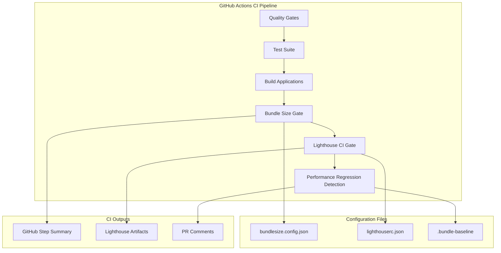

# Design Document: CI Performance Gates

## Overview

This design implements CI performance gates with Lighthouse CI and bundle size enforcement for the Toast-Stats application. The solution integrates with the existing GitHub Actions CI/CD pipeline to enforce performance SLOs defined in `docs/performance-slos.md` Section 5.5.

The implementation consists of three main components:
1. **Bundle Size Gate** - Uses bundlesize npm package to enforce JavaScript and CSS size limits
2. **Lighthouse CI Gate** - Uses treosh/lighthouse-ci-action to run automated Lighthouse audits
3. **Performance Regression Detection** - Compares current metrics against stored baselines

## Architecture



## Components and Interfaces

### Component 1: Bundle Size Gate

The bundle size gate validates that JavaScript and CSS bundles do not exceed configured limits.

**Implementation**: Uses the `bundlesize` npm package with configuration in `frontend/bundlesize.config.json`.

**Interface**:
```typescript
// bundlesize.config.json schema
interface BundleSizeConfig {
  files: Array<{
    path: string;           // Glob pattern for files to check
    maxSize: string;        // Maximum size with unit (e.g., "100 KB")
    compression: 'gzip' | 'brotli' | 'none';
  }>;
}
```

**CI Integration**:
```yaml
- name: Check bundle size
  run: |
    cd frontend
    npx bundlesize --config bundlesize.config.json
```

### Component 2: Lighthouse CI Gate

The Lighthouse CI gate runs automated Lighthouse audits and enforces minimum score thresholds.

**Implementation**: Uses `treosh/lighthouse-ci-action@v10` GitHub Action with configuration in `lighthouserc.json`.

**Interface**:
```typescript
// lighthouserc.json schema (simplified)
interface LighthouseConfig {
  ci: {
    collect: {
      numberOfRuns: number;
      startServerCommand?: string;
      url: string[];
    };
    assert: {
      assertions: {
        'categories:performance': ['error', { minScore: number }];
        'categories:accessibility': ['error', { minScore: number }];
        'categories:best-practices': ['error', { minScore: number }];
        'categories:seo': ['error', { minScore: number }];
      };
    };
    upload?: {
      target: 'temporary-public-storage';
    };
  };
}
```

**CI Integration**:
```yaml
- name: Run Lighthouse CI
  uses: treosh/lighthouse-ci-action@v10
  with:
    configPath: ./lighthouserc.json
    uploadArtifacts: true
```

### Component 3: Performance Regression Detection

The regression detector compares current metrics against baseline values and fails or warns based on thresholds.

**Implementation**: Custom bash script that reads baseline values and compares against current build output.

**Interface**:
```typescript
// .bundle-baseline format (JSON)
interface BundleBaseline {
  mainBundle: number;      // Size in bytes (gzip)
  vendorBundle: number;    // Size in bytes (gzip)
  cssBundle: number;       // Size in bytes (gzip)
  timestamp: string;       // ISO date of baseline capture
  commit: string;          // Git commit SHA
}
```

**Thresholds**:
| Check | Warning Threshold | Blocking Threshold |
|-------|-------------------|-------------------|
| Bundle size increase | > 5 KB | > 20 KB |
| Lighthouse score decrease | > 5 points | > 10 points |

## Data Models

### BundleSizeConfig

```typescript
interface BundleSizeConfig {
  files: BundleSizeEntry[];
}

interface BundleSizeEntry {
  path: string;
  maxSize: string;
  compression: 'gzip' | 'brotli' | 'none';
}
```

### LighthouseConfig

```typescript
interface LighthouseConfig {
  ci: {
    collect: CollectConfig;
    assert: AssertConfig;
    upload?: UploadConfig;
  };
}

interface CollectConfig {
  numberOfRuns: number;
  startServerCommand?: string;
  startServerReadyPattern?: string;
  url: string[];
}

interface AssertConfig {
  assertions: Record<string, AssertionValue>;
}

type AssertionValue = ['error' | 'warn', { minScore?: number; maxNumericValue?: number }];

interface UploadConfig {
  target: 'temporary-public-storage' | 'lhci';
}
```

### BundleBaseline

```typescript
interface BundleBaseline {
  mainBundle: number;
  vendorBundle: number;
  cssBundle: number;
  timestamp: string;
  commit: string;
}
```


## Correctness Properties

*A property is a characteristic or behavior that should hold true across all valid executions of a system—essentially, a formal statement about what the system should do. Properties serve as the bridge between human-readable specifications and machine-verifiable correctness guarantees.*

Based on the prework analysis, the following properties have been identified:

### Property 1: Bundle Size Threshold Enforcement

*For any* bundle (main JS, vendor JS, or CSS) and its configured size limit, the Bundle_Size_Gate SHALL fail if and only if the gzip-compressed size exceeds the configured limit for that bundle type.

**Validates: Requirements 1.2, 1.3, 1.4**

This property consolidates the threshold checks for all bundle types:
- Main JS bundle: fails when > 100 KB gzip
- Vendor JS bundle: fails when > 100 KB gzip  
- CSS bundle: fails when > 50 KB gzip

### Property 2: Regression Detection Thresholds

*For any* performance metric (bundle size or Lighthouse score) and its baseline value, the Performance_Regression_Detector SHALL:
- Emit a warning when degradation exceeds the warning threshold but not the blocking threshold
- Fail the build when degradation exceeds the blocking threshold
- Pass silently when degradation is within acceptable limits

**Validates: Requirements 3.1, 3.2, 3.3, 3.4**

Specific thresholds:
| Metric | Warning Threshold | Blocking Threshold |
|--------|-------------------|-------------------|
| Bundle size increase | > 5 KB | > 20 KB |
| Lighthouse score decrease | > 5 points | > 10 points |

## Error Handling

### Configuration File Errors

| Error Condition | Handling |
|-----------------|----------|
| `bundlesize.config.json` missing | CI fails with clear error message indicating file path |
| `lighthouserc.json` missing | CI fails with clear error message indicating file path |
| Invalid JSON in config files | CI fails with JSON parse error details |
| Missing required config fields | CI fails listing missing fields |

### Bundle Size Check Errors

| Error Condition | Handling |
|-----------------|----------|
| No matching files for glob pattern | Warning logged, check continues |
| File read error | CI fails with file access error |
| Gzip compression failure | CI fails with compression error |

### Lighthouse CI Errors

| Error Condition | Handling |
|-----------------|----------|
| Server startup failure | CI fails with server error details |
| Lighthouse audit timeout | CI fails after 3 retry attempts |
| Network connectivity issues | CI fails with network error |
| Score below threshold | CI fails with score comparison details |

### Regression Detection Errors

| Error Condition | Handling |
|-----------------|----------|
| Baseline file missing | Warning logged, regression check skipped (first run) |
| Baseline file corrupted | CI fails with parse error |
| Unable to calculate current metrics | CI fails with measurement error |

## Testing Strategy

### Testing Philosophy

Per the testing steering document, this feature's tests must:
- Protect threshold-based logic with tests that name the rule being protected
- Explain *why* the rule exists
- Cover boundary conditions
- Be isolated and concurrent-safe
- Use dependency injection over global state

### Dual Testing Approach

1. **Unit Tests**: Verify specific examples, edge cases, and error conditions
2. **Property Tests**: Verify universal properties across all valid inputs

Both are complementary and necessary for comprehensive coverage.

### Rule-Driven Logic Protection

The following threshold-based rules MUST be protected by tests:

| Rule | Why It Exists | Boundary Conditions |
|------|---------------|---------------------|
| Main JS ≤ 100 KB | Performance SLO Section 5.2 budget | 100 KB exactly, 100 KB + 1 byte |
| Vendor JS ≤ 100 KB | Performance SLO Section 5.2 budget | 100 KB exactly, 100 KB + 1 byte |
| CSS ≤ 50 KB | Performance SLO Section 5.2 budget | 50 KB exactly, 50 KB + 1 byte |
| Regression > 5 KB | Warning threshold from SLO 5.5 | 5 KB exactly, 5 KB + 1 byte |
| Regression > 20 KB | Blocking threshold from SLO 5.5 | 20 KB exactly, 20 KB + 1 byte |

### Property-Based Testing Configuration

Property-based tests will use `fast-check` (already in project dependencies) with:
- Minimum 100 iterations per property test
- Tag format: **Feature: ci-performance-gates, Property {number}: {property_text}**
- Each property test MUST reference its design document property

### Test Architecture for Isolation

Tests MUST follow these isolation requirements:

```typescript
// ✅ CORRECT - Pure functions with injected configuration
interface BundleSizeChecker {
  check(bundleType: BundleType, sizeBytes: number, config: BundleSizeConfig): CheckResult;
}

// ✅ CORRECT - No global state, deterministic behavior
function checkBundleSize(
  bundleType: BundleType,
  sizeBytes: number,
  limits: Record<BundleType, number>
): CheckResult {
  const limit = limits[bundleType];
  return {
    passed: sizeBytes <= limit,
    sizeBytes,
    limitBytes: limit,
  };
}

// ❌ FORBIDDEN - Global configuration
const LIMITS = { main: 100 * 1024 }; // Global state!
```

### Property Test Implementation

```typescript
import { describe, it, expect } from 'vitest';
import * as fc from 'fast-check';

// Feature: ci-performance-gates, Property 1: Bundle Size Threshold Enforcement
// Rule: Bundle size gate fails if and only if size exceeds configured limit
// Why: Enforces performance budget from SLO Section 5.2
describe('Bundle Size Threshold Enforcement', () => {
  const limits: Record<string, number> = {
    main: 100 * 1024,
    vendor: 100 * 1024,
    css: 50 * 1024,
  };

  it('should fail if and only if bundle exceeds configured limit', () => {
    fc.assert(
      fc.property(
        fc.constantFrom('main', 'vendor', 'css'),
        fc.integer({ min: 0, max: 200 * 1024 }),
        (bundleType, sizeBytes) => {
          const limit = limits[bundleType];
          const result = checkBundleSize(bundleType, sizeBytes, limits);
          
          // Property: passed === (sizeBytes <= limit)
          return result.passed === (sizeBytes <= limit);
        }
      ),
      { numRuns: 100 }
    );
  });

  // Boundary condition tests (unit tests)
  it('should pass when bundle is exactly at limit', () => {
    expect(checkBundleSize('main', 100 * 1024, limits).passed).toBe(true);
  });

  it('should fail when bundle is 1 byte over limit', () => {
    expect(checkBundleSize('main', 100 * 1024 + 1, limits).passed).toBe(false);
  });
});

// Feature: ci-performance-gates, Property 2: Regression Detection Thresholds
// Rule: Regression detector warns/fails based on degradation thresholds
// Why: Prevents performance regressions per SLO Section 5.5
describe('Regression Detection Thresholds', () => {
  const thresholds = {
    warnBytes: 5 * 1024,
    failBytes: 20 * 1024,
  };

  it('should classify regressions correctly based on thresholds', () => {
    fc.assert(
      fc.property(
        fc.integer({ min: 0, max: 100 * 1024 }),
        fc.integer({ min: 0, max: 200 * 1024 }),
        (baseline, current) => {
          const increase = current - baseline;
          const result = detectRegression(baseline, current, thresholds);
          
          // Property: status matches threshold classification
          if (increase > thresholds.failBytes) {
            return result.status === 'fail';
          } else if (increase > thresholds.warnBytes) {
            return result.status === 'warn';
          } else {
            return result.status === 'pass';
          }
        }
      ),
      { numRuns: 100 }
    );
  });

  // Boundary condition tests (unit tests)
  it('should pass when increase is exactly at warning threshold', () => {
    const result = detectRegression(0, 5 * 1024, thresholds);
    expect(result.status).toBe('pass');
  });

  it('should warn when increase is 1 byte over warning threshold', () => {
    const result = detectRegression(0, 5 * 1024 + 1, thresholds);
    expect(result.status).toBe('warn');
  });

  it('should fail when increase is 1 byte over blocking threshold', () => {
    const result = detectRegression(0, 20 * 1024 + 1, thresholds);
    expect(result.status).toBe('fail');
  });
});
```

### CI Integration Testing

Since this feature is primarily CI configuration, integration testing will be performed by:
1. Running the CI workflow on a test branch
2. Verifying bundle size checks execute correctly
3. Verifying Lighthouse CI runs and reports scores
4. Verifying regression detection compares against baseline

Note: The property tests above validate the *logic* of threshold checking. The CI workflow itself is validated through manual testing on feature branches.
