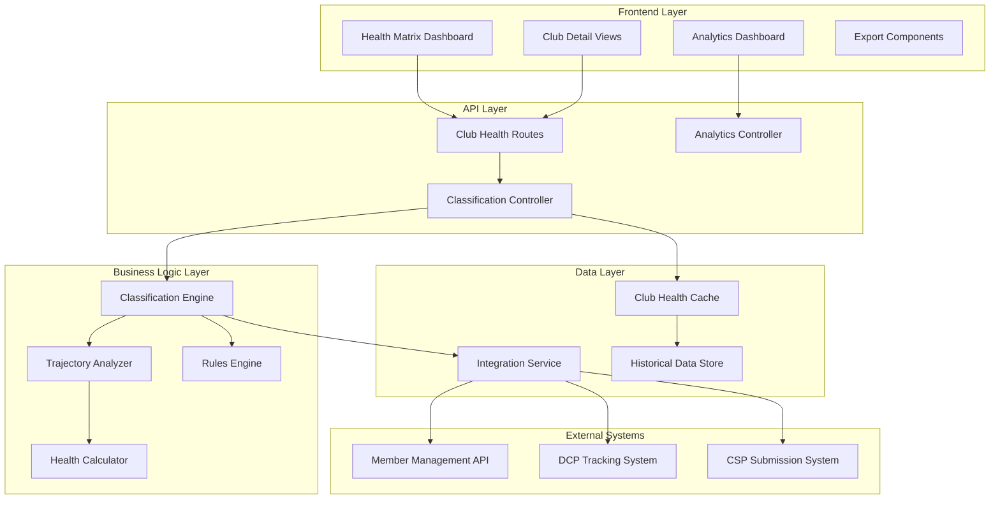

# Design Document

## Overview

The Club Health Classification system is a comprehensive backend service and frontend visualization platform that evaluates Toastmasters clubs using a sophisticated 2D classification model. The system determines both Health Status (Thriving/Vulnerable/Intervention Required) and Trajectory (Recovering/Stable/Declining) based on membership data, Distinguished Club Program (DCP) progress, and Club Success Plan (CSP) submission status.

The system integrates seamlessly with the existing Toastmasters District Visualizer architecture, leveraging established patterns for caching, API design, and frontend visualization while introducing new specialized components for club health analysis.

## Architecture

### System Components



### Technology Stack

**Backend:**

- Node.js with Express.js framework
- TypeScript for type safety
- Fast-check for property-based testing
- Vitest for unit and integration testing
- Node-cache for in-memory caching
- Existing cache management infrastructure

**Frontend:**

- React 18 with TypeScript
- Tailwind CSS with Toastmasters brand compliance
- Recharts for data visualization
- React Query for state management
- React Router for navigation

## Components and Interfaces

### Backend Components

#### 1. Classification Engine (`ClubHealthClassificationEngine`)

The core business logic component that applies the 2D classification model:

```typescript
interface ClubHealthClassificationEngine {
  classifyClub(input: ClubHealthInput): ClubHealthResult
  batchClassifyClubs(inputs: ClubHealthInput[]): ClubHealthResult[]
  validateInput(input: ClubHealthInput): ValidationResult
}

interface ClubHealthInput {
  club_name: string
  current_members: number
  member_growth_since_july: number
  current_month: Month
  dcp_goals_achieved_ytd: number
  csp_submitted: boolean
  officer_list_submitted: boolean
  officers_trained: boolean
  previous_month_members: number
  previous_month_dcp_goals_achieved_ytd: number
  previous_month_health_status: HealthStatus
}

interface ClubHealthResult {
  club_name: string
  health_status: HealthStatus
  reasons: string[]
  trajectory: Trajectory
  trajectory_reasons: string[]
  composite_key: string
  composite_label: string
  members_delta_mom: number
  dcp_delta_mom: number
  metadata: {
    evaluation_date: string
    processing_time_ms: number
    rule_version: string
  }
}
```

#### 2. Rules Engine (`ClubHealthRulesEngine`)

Implements the business rules defined in the schema:

```typescript
interface ClubHealthRulesEngine {
  evaluateHealthStatus(input: ClubHealthInput): HealthEvaluation
  evaluateTrajectory(
    input: ClubHealthInput,
    healthResult: HealthEvaluation
  ): TrajectoryEvaluation
  getDCPRequirement(month: Month): number
  checkMembershipRequirement(members: number, growth: number): boolean
}

interface HealthEvaluation {
  status: HealthStatus
  reasons: string[]
  requirements_met: {
    membership: boolean
    dcp: boolean
    csp: boolean
  }
}

interface TrajectoryEvaluation {
  trajectory: Trajectory
  reasons: string[]
  momentum_indicators: {
    members_delta_mom: number
    dcp_delta_mom: number
    health_status_change: string
  }
}
```

#### 3. Club Health Service (`ClubHealthService`)

Orchestrates data processing and caching:

```typescript
interface ClubHealthService {
  processClubHealth(input: ClubHealthInput): Promise<ClubHealthResult>
  batchProcessClubs(inputs: ClubHealthInput[]): Promise<ClubHealthResult[]>
  getClubHealthHistory(
    clubName: string,
    months: number
  ): Promise<ClubHealthHistory[]>
  getDistrictHealthSummary(districtId: string): Promise<DistrictHealthSummary>
  refreshClubData(clubName: string): Promise<ClubHealthResult>
}

interface ClubHealthHistory {
  evaluation_date: string
  health_status: HealthStatus
  trajectory: Trajectory
  members: number
  dcp_goals: number
}

interface DistrictHealthSummary {
  district_id: string
  total_clubs: number
  health_distribution: Record<HealthStatus, number>
  trajectory_distribution: Record<Trajectory, number>
  clubs_needing_attention: ClubHealthResult[]
  evaluation_date: string
}
```

#### 4. Data Integration Service (`ClubDataIntegrationService`)

Handles integration with external data sources:

```typescript
interface ClubDataIntegrationService {
  fetchMembershipData(clubName: string): Promise<MembershipData>
  fetchDCPProgress(clubName: string): Promise<DCPProgress>
  fetchCSPStatus(clubName: string): Promise<CSPStatus>
  syncClubData(clubNames: string[]): Promise<SyncResult>
}

interface MembershipData {
  current_members: number
  member_growth_since_july: number
  previous_month_members: number
  last_updated: string
}

interface DCPProgress {
  dcp_goals_achieved_ytd: number
  previous_month_dcp_goals_achieved_ytd: number
  officer_list_submitted: boolean
  officers_trained: boolean
  last_updated: string
}
```

### Frontend Components

#### 1. Health Matrix Dashboard (`HealthMatrixDashboard`)

Primary visualization component showing the 2D health matrix:

```typescript
interface HealthMatrixDashboardProps {
  districtId?: string
  filters?: HealthMatrixFilters
  onClubSelect?: (club: ClubHealthResult) => void
}

interface HealthMatrixFilters {
  healthStatus?: HealthStatus[]
  trajectory?: Trajectory[]
  division?: string[]
  area?: string[]
  membershipRange?: [number, number]
}

interface HealthMatrixCell {
  health_status: HealthStatus
  trajectory: Trajectory
  clubs: ClubHealthResult[]
  count: number
}
```

#### 2. Club Detail Modal (`ClubDetailModal`)

Detailed view for individual club health assessment:

```typescript
interface ClubDetailModalProps {
  club: ClubHealthResult
  history?: ClubHealthHistory[]
  onClose: () => void
  onExport?: () => void
}

interface ClubMetrics {
  current_metrics: {
    members: number
    dcp_goals: number
    csp_status: boolean
  }
  month_over_month: {
    member_change: number
    dcp_change: number
    health_change: string
  }
  recommendations: string[]
}
```

#### 3. District Analytics Dashboard (`DistrictAnalyticsDashboard`)

Aggregate analytics and trends visualization:

```typescript
interface DistrictAnalyticsDashboardProps {
  districtId: string
  timeRange?: TimeRange
}

interface DistrictMetrics {
  health_trends: HealthTrendData[]
  trajectory_trends: TrajectoryTrendData[]
  intervention_alerts: InterventionAlert[]
  performance_indicators: PerformanceIndicator[]
}

interface HealthTrendData {
  month: string
  thriving: number
  vulnerable: number
  intervention_required: number
}
```

## Data Models

### Core Types

```typescript
type Month =
  | 'July'
  | 'August'
  | 'September'
  | 'October'
  | 'November'
  | 'December'
  | 'January'
  | 'February'
  | 'March'
  | 'April'
  | 'May'
  | 'June'

type HealthStatus = 'Thriving' | 'Vulnerable' | 'Intervention Required'

type Trajectory = 'Recovering' | 'Stable' | 'Declining'

interface ClubHealthParameters {
  membership: {
    intervention_membership_lt: number // 12
    thriving_membership_gte: number // 20
    growth_override_gte: number // 3
  }
  trajectory: {
    upgrade_stable_to_recovering_if_vulnerable_and_members_delta_mom_gte: number // 2
  }
}

interface DCPThresholds {
  [key: string]: number
  August: 1
  September: 1
  October: 2
  November: 2
  December: 3
  January: 3
  February: 4
  March: 4
  April: 5
  May: 5
  June: 5
}
```

### Database Schema

```typescript
interface ClubHealthRecord {
  id: string
  club_name: string
  district_id: string
  evaluation_date: string
  health_status: HealthStatus
  trajectory: Trajectory
  composite_key: string
  composite_label: string

  // Input data
  current_members: number
  member_growth_since_july: number
  current_month: Month
  dcp_goals_achieved_ytd: number
  csp_submitted: boolean
  officer_list_submitted: boolean
  officers_trained: boolean

  // Calculated fields
  members_delta_mom: number
  dcp_delta_mom: number
  reasons: string[]
  trajectory_reasons: string[]

  // Metadata
  created_at: string
  updated_at: string
  rule_version: string
  processing_time_ms: number
}

interface ClubHealthCache {
  key: string
  data: ClubHealthResult | ClubHealthResult[]
  expires_at: number
  created_at: number
}
```

## Correctness Properties

_A property is a characteristic or behavior that should hold true across all valid executions of a system-essentially, a formal statement about what the system should do. Properties serve as the bridge between human-readable specifications and machine-verifiable correctness guarantees._

### Property-Based Testing Integration

The system will be validated using property-based testing to ensure correctness across all possible inputs and edge cases. Each property represents a universal rule that must hold for all valid system executions.

#### Core Classification Properties

**Property 1: Health Status Classification Completeness**
_For any_ valid club input, the Classification Engine should always produce exactly one of the three health statuses (Thriving, Vulnerable, Intervention Required) based on the defined business rules
**Validates: Requirements 1.1, 1.2, 1.4, 1.5**

**Property 2: DCP Threshold Enforcement**
_For any_ club evaluation in any month, the DCP requirement should match the defined monthly thresholds (August/September: 1+, October/November: 2+, December/January: 3+, February/March: 4+, April/May/June: 5+, July: administrative checkpoint)
**Validates: Requirements 2.1, 2.2, 2.3, 2.4, 2.5, 2.6**

**Property 3: Membership Requirement Logic**
_For any_ club, the membership requirement should be considered met if current members >= 20 OR net growth since July >= 3
**Validates: Requirements 1.3**

**Property 4: Intervention Override Rule**
_For any_ club with membership < 12 AND net growth since July < 3, the health status should be "Intervention Required" regardless of other criteria
**Validates: Requirements 1.2**

**Property 5: Trajectory Determination Logic**
_For any_ club evaluation, trajectory should be "Recovering" if health status improved, "Declining" if health status worsened, or determined by month-over-month momentum if health status unchanged
**Validates: Requirements 3.1, 3.2, 3.3, 3.4, 3.5**

**Property 6: Complete Reasoning Provision**
_For any_ club classification result, both health status reasoning and trajectory reasoning arrays should be non-empty and descriptive
**Validates: Requirements 1.6, 3.6**

#### Data Processing Properties

**Property 7: Month-over-Month Delta Calculation**
_For any_ club evaluation with previous month data, members_delta_mom should equal current_members minus previous_month_members, and dcp_delta_mom should equal current DCP goals minus previous month DCP goals
**Validates: Requirements 4.2**

**Property 8: Input Validation Completeness**
_For any_ invalid club input (missing required fields, invalid month values, negative numbers where inappropriate), the system should reject the input with descriptive error messages
**Validates: Requirements 4.1, 5.5**

**Property 9: Composite Key Generation**
_For any_ club classification result, the composite_key should follow the format "{health_status}\_\_{trajectory}" and composite_label should follow "{health_status} · {trajectory}"
**Validates: Requirements 4.5**

**Property 10: Batch Processing Consistency**
_For any_ set of club inputs, processing them individually versus as a batch should produce identical results for each club
**Validates: Requirements 4.6**

#### API Response Properties

**Property 11: API Response Completeness**
_For any_ successful club classification API response, the result should include all required fields: health_status, trajectory, reasons, trajectory_reasons, composite_key, composite_label, and calculated deltas
**Validates: Requirements 5.2, 5.6**

**Property 12: Data Persistence Completeness**
_For any_ club classification result that is stored, all required fields should be persisted including health status, trajectory, reasoning arrays, input data, and metadata
**Validates: Requirements 4.3**

#### Visualization Properties

**Property 13: Grid Position Mapping**
_For any_ club classification result, the club should be positioned in the correct matrix cell based on its health status (Y-axis) and trajectory (X-axis) combination
**Validates: Requirements 6.2**

**Property 14: Filter Logic Correctness**
_For any_ set of filter criteria applied to a club list, only clubs matching all specified criteria should be included in the filtered results
**Validates: Requirements 6.4**

**Property 15: Complete Information Display**
_For any_ club detail view, all current metrics (membership, DCP progress, CSP status), month-over-month changes, and health reasoning should be displayed
**Validates: Requirements 7.1, 7.2, 7.3**

**Property 16: Historical Data Visualization**
_For any_ club with historical data, the time-series visualization should accurately represent health status changes over time
**Validates: Requirements 7.4**

**Property 17: Recommendation Generation**
_For any_ club not meeting all requirements, specific actionable recommendations should be provided based on which requirements are unmet
**Validates: Requirements 7.5**

#### Analytics Properties

**Property 18: District Health Distribution**
_For any_ set of clubs in a district, the health status distribution should accurately count clubs in each category (Thriving, Vulnerable, Intervention Required)
**Validates: Requirements 8.1**

**Property 19: Trajectory Analytics Accuracy**
_For any_ set of clubs in a district, trajectory counts should accurately reflect the number of clubs in each trajectory category (Recovering, Stable, Declining)
**Validates: Requirements 8.2**

**Property 20: Trend Calculation Correctness**
_For any_ district with historical data, month-over-month trend calculations should accurately reflect changes in health metrics
**Validates: Requirements 8.3**

**Property 21: Pattern Identification Logic**
_For any_ district analysis, clubs consistently in "Intervention Required" or "Vulnerable" status for multiple consecutive months should be highlighted as needing attention
**Validates: Requirements 8.4**

#### System Reliability Properties

**Property 22: Incremental Update Consistency**
_For any_ club data update, recalculating the classification should produce consistent results and maintain referential integrity with historical data
**Validates: Requirements 9.4**

**Property 23: Error Handling Graceful Degradation**
_For any_ integration error or data inconsistency, the system should handle the error gracefully without corrupting existing data or classifications
**Validates: Requirements 9.5**

**Property 24: Audit Trail Completeness**
_For any_ data update or classification change, a complete audit record should be created including timestamp, user, old values, new values, and reason for change
**Validates: Requirements 9.6**

**Property 25: Concurrent Processing Safety**
_For any_ concurrent club data updates, the final state should be consistent and no data corruption should occur
**Validates: Requirements 10.4**

**Property 26: Cache Consistency**
_For any_ cached club data, the cached result should match the result that would be computed from fresh data, and cache invalidation should occur when underlying data changes
**Validates: Requirements 10.5**

## Error Handling

### Input Validation Errors

The system implements comprehensive input validation with specific error codes and messages:

```typescript
interface ValidationError {
  code: string
  message: string
  field?: string
  value?: any
}

// Example validation errors
const VALIDATION_ERRORS = {
  MISSING_REQUIRED_FIELD: 'Required field is missing',
  INVALID_MONTH: 'Month must be a valid month name',
  INVALID_MEMBERSHIP_COUNT: 'Membership count must be a non-negative integer',
  INVALID_DCP_GOALS: 'DCP goals must be a non-negative integer',
  INVALID_GROWTH_VALUE: 'Growth value must be an integer',
  FUTURE_DATE_NOT_ALLOWED: 'Evaluation date cannot be in the future',
}
```

### Business Logic Errors

```typescript
interface BusinessLogicError {
  code: string
  message: string
  context?: Record<string, any>
}

// Example business logic errors
const BUSINESS_ERRORS = {
  INSUFFICIENT_HISTORICAL_DATA:
    'Previous month data required for trajectory calculation',
  INVALID_RULE_CONFIGURATION: 'Business rule configuration is invalid',
  CLASSIFICATION_CONFLICT:
    'Multiple classification rules produced conflicting results',
}
```

### Integration Errors

```typescript
interface IntegrationError {
  code: string
  message: string
  source: string
  retryable: boolean
}

// Example integration errors
const INTEGRATION_ERRORS = {
  MEMBERSHIP_API_UNAVAILABLE:
    'Member management system is temporarily unavailable',
  DCP_DATA_STALE: 'DCP tracking data is older than acceptable threshold',
  CSP_VERIFICATION_FAILED: 'Unable to verify CSP submission status',
}
```

## Testing Strategy

### Dual Testing Approach

The system employs both unit testing and property-based testing for comprehensive coverage:

**Unit Tests:**

- Specific examples demonstrating correct behavior
- Edge cases and boundary conditions
- Error scenarios and exception handling
- Integration points between components
- Mock external dependencies for isolated testing

**Property-Based Tests:**

- Universal properties across all valid inputs
- Comprehensive input space coverage through randomization
- Invariant validation across system transformations
- Round-trip properties for serialization/deserialization
- Minimum 100 iterations per property test

### Property-Based Testing Configuration

Using **fast-check** library for TypeScript property-based testing:

```typescript
// Example property test configuration
import fc from 'fast-check'

describe('Club Health Classification Properties', () => {
  test('Property 1: Health Status Classification Completeness', () => {
    fc.assert(
      fc.property(clubHealthInputArbitrary(), input => {
        const result = classificationEngine.classifyClub(input)
        const validStatuses: HealthStatus[] = [
          'Thriving',
          'Vulnerable',
          'Intervention Required',
        ]
        return validStatuses.includes(result.health_status)
      }),
      { numRuns: 100 }
    )
  })
})
```

### Test Data Generation

Smart generators that constrain inputs to valid business domains:

```typescript
// Custom arbitraries for business domain
const monthArbitrary = () =>
  fc.constantFrom(
    'July',
    'August',
    'September',
    'October',
    'November',
    'December',
    'January',
    'February',
    'March',
    'April',
    'May',
    'June'
  )

const membershipArbitrary = () => fc.integer({ min: 0, max: 100 })

const dcpGoalsArbitrary = () => fc.integer({ min: 0, max: 10 })

const clubHealthInputArbitrary = () =>
  fc.record({
    club_name: fc.string({ minLength: 1, maxLength: 50 }),
    current_members: membershipArbitrary(),
    member_growth_since_july: fc.integer({ min: -50, max: 50 }),
    current_month: monthArbitrary(),
    dcp_goals_achieved_ytd: dcpGoalsArbitrary(),
    csp_submitted: fc.boolean(),
    officer_list_submitted: fc.boolean(),
    officers_trained: fc.boolean(),
    previous_month_members: membershipArbitrary(),
    previous_month_dcp_goals_achieved_ytd: dcpGoalsArbitrary(),
    previous_month_health_status: fc.constantFrom(
      'Thriving',
      'Vulnerable',
      'Intervention Required'
    ),
  })
```

### Test Tagging and Organization

Each property test references its design document property:

```typescript
// Test tagging format
test('Property 1: Health Status Classification Completeness', () => {
  // Feature: club-health-classification, Property 1: Health Status Classification Completeness
  // Test implementation
})
```

### Integration Testing Strategy

- Real database connections with test isolation
- Containerized external service dependencies
- End-to-end API testing with actual HTTP requests
- Frontend component testing with real data flows
- Performance testing under realistic load conditions

### Accessibility and Brand Compliance Testing

- WCAG AA compliance validation for all UI components
- Toastmasters brand guideline adherence testing
- Color contrast ratio verification
- Touch target size validation (44px minimum)
- Screen reader compatibility testing
