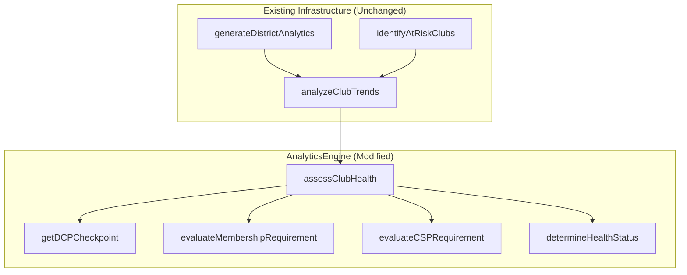

# Design Document

## Overview

This design refactors the existing `assessClubHealth` method in `AnalyticsEngine` to use a monthly DCP checkpoint-based classification system. The current simple logic (membership < 12 = critical, membership >= 12 with 0 DCP = at-risk, else healthy) is replaced with a more sophisticated evaluation that considers where clubs should be in their DCP journey at any given month.

The refactoring maintains full backward compatibility with existing API contracts by mapping new status names to existing field values.

## Architecture

### Affected Components



### Changes Summary

| Component                                  | Change Type | Description                              |
| ------------------------------------------ | ----------- | ---------------------------------------- |
| `AnalyticsEngine.assessClubHealth()`       | Modified    | New classification logic                 |
| `AnalyticsEngine.getDCPCheckpoint()`       | New         | Returns monthly DCP threshold            |
| `AnalyticsEngine.getCurrentProgramMonth()` | New         | Determines current month in program year |
| API Response Types                         | Unchanged   | Existing types preserved                 |
| Frontend Components                        | Unchanged   | No changes required                      |

## Components and Interfaces

### Modified Method: assessClubHealth

The existing method signature is preserved, but internal logic changes:

```typescript
/**
 * Assess club health using monthly DCP checkpoint system
 *
 * Classification Rules:
 * 1. Intervention Required: membership < 12 AND net growth < 3
 * 2. Thriving: membership requirement met AND DCP checkpoint met AND CSP submitted
 * 3. Vulnerable: any requirement not met (but not intervention)
 *
 * Membership Requirement: membership >= 20 OR net growth >= 3
 * DCP Checkpoint: varies by month (see getDCPCheckpoint)
 * CSP Requirement: CSP submitted (defaults to true if data unavailable)
 */
private assessClubHealth(clubTrend: ClubTrend, latestClubData?: ScrapedRecord): void
```

### New Helper Method: getDCPCheckpoint

```typescript
/**
 * Get the DCP goals checkpoint for a given month
 *
 * @param month - Month number (1-12) or month name
 * @returns Minimum DCP goals required for that month
 *
 * Thresholds:
 * - July (7): Administrative checkpoint (use 0, check officer data separately)
 * - August-September (8-9): 1 goal
 * - October-November (10-11): 2 goals
 * - December-January (12, 1): 3 goals
 * - February-March (2-3): 4 goals
 * - April-June (4-6): 5 goals
 */
private getDCPCheckpoint(month: number): number
```

### New Helper Method: getCurrentProgramMonth

```typescript
/**
 * Determine the current month for DCP checkpoint evaluation
 * Uses the snapshot date or current date to determine program month
 *
 * @param dateString - Date string in YYYY-MM-DD format
 * @returns Month number (1-12)
 */
private getCurrentProgramMonth(dateString?: string): number
```

## Data Models

### Health Status Values

The new status values used throughout the system:

| Status                | API Value                 | Display Label           | Description               |
| --------------------- | ------------------------- | ----------------------- | ------------------------- |
| Thriving              | `'thriving'`              | "Thriving"              | All requirements met      |
| Vulnerable            | `'vulnerable'`            | "Vulnerable"            | Some requirements not met |
| Intervention Required | `'intervention-required'` | "Intervention Required" | Membership crisis         |

### Updated Type Definitions

```typescript
// Updated ClubHealthStatus type
type ClubHealthStatus = 'thriving' | 'vulnerable' | 'intervention-required'

// Updated ClubTrend interface (partial)
interface ClubTrend {
  // ... existing fields
  currentStatus: ClubHealthStatus // Changed from 'healthy' | 'at-risk' | 'critical'
}

// Updated DistrictAnalytics interface (partial)
interface DistrictAnalytics {
  // ... existing fields
  thrivingClubs: ClubTrend[] // Renamed from healthyClubs
  vulnerableClubs: ClubTrend[] // Renamed from atRiskClubs
  interventionRequiredClubs: ClubTrend[] // Renamed from criticalClubs
}
```

### Classification Input Data

Uses existing fields from `ScrapedRecord`:

```typescript
interface ClassificationInputs {
  // From club performance data
  activeMembers: number // 'Active Members' field
  memBase: number // 'Mem. Base' field (for net growth)
  goalsMet: number // 'Goals Met' field

  // Calculated
  netGrowth: number // activeMembers - memBase

  // Optional (historical data compatibility)
  cspSubmitted?: boolean // CSP submission status (guaranteed present in 2025-2026+, absent in prior years)
  officerListSubmitted?: boolean // For July checkpoint
  officersTrained?: boolean // For July checkpoint
}
```

### Risk Factors Output

The `riskFactors` array in `ClubTrend` will contain specific reasons:

```typescript
// Example risk factors for Vulnerable club
riskFactors: [
  'DCP checkpoint not met: 1 goal achieved, 3 required for January',
  'CSP not submitted',
]

// Example risk factors for Intervention Required club
riskFactors: [
  'Membership below 12 (critical)',
  'Net growth since July: 1 (need 3+ to override)',
]

// Example for Thriving club
riskFactors: [] // Empty - all requirements met
```

## Correctness Properties

_A property is a characteristic or behavior that should hold true across all valid executions of a system-essentially, a formal statement about what the system should do. Properties serve as the bridge between human-readable specifications and machine-verifiable correctness guarantees._

### Property 1: Health Status Mutual Exclusivity

_For any_ club evaluation, the club SHALL be assigned exactly one of the three health statuses (Thriving, Vulnerable, Intervention Required) - never zero, never more than one.
**Validates: Requirements 1.1, 1.4, 1.5**

### Property 2: Intervention Override Rule

_For any_ club with membership < 12 AND net growth < 3, the health status SHALL be "Intervention Required" regardless of DCP goals or CSP status.
**Validates: Requirements 1.2**

### Property 3: DCP Checkpoint Monotonicity

_For any_ sequence of months from August to June, the DCP checkpoint requirement SHALL be monotonically non-decreasing (1 → 2 → 3 → 4 → 5).
**Validates: Requirements 2.1, 2.2, 2.3, 2.4, 2.5**

### Property 4: Thriving Completeness

_For any_ club classified as Thriving, ALL of the following SHALL be true: membership requirement met, DCP checkpoint met, and CSP submitted (or unavailable).
**Validates: Requirements 1.4**

### Property 5: API Type Consistency

_For any_ club health result, the `currentStatus` field SHALL contain one of the new values ('thriving', 'vulnerable', 'intervention-required').
**Validates: Requirements 3.1, 3.3**

### Property 6: Reason Completeness

_For any_ club not classified as Thriving, the `riskFactors` array SHALL contain at least one specific reason explaining why the club is not Thriving.
**Validates: Requirements 4.1, 4.2, 4.3, 4.4**

## Error Handling

### Graceful Degradation

The classification handles missing data gracefully for historical data:

| Missing Data               | Fallback Behavior                       | Notes                                                 |
| -------------------------- | --------------------------------------- | ----------------------------------------------------- |
| CSP status (pre-2025-2026) | Assume submitted (true)                 | CSP field did not exist before 2025-2026 program year |
| CSP status (2025-2026+)    | Use actual value                        | CSP field is guaranteed present                       |
| Officer training data      | Use DCP goals for July checkpoint       |                                                       |
| Mem. Base                  | Assume 0 (net growth = current members) |                                                       |
| Goals Met                  | Assume 0                                |                                                       |

### Invalid Data

```typescript
// Negative membership treated as 0
const membership = Math.max(0, parseIntSafe(club['Active Members']))

// Negative goals treated as 0
const dcpGoals = Math.max(0, parseIntSafe(club['Goals Met']))
```

## Testing Strategy

### Unit Tests

Focus on specific classification scenarios:

1. **Intervention Required cases**
   - Membership 8, net growth 0 → Intervention Required
   - Membership 11, net growth 2 → Intervention Required
   - Membership 11, net growth 3 → NOT Intervention Required (growth override)

2. **Thriving cases**
   - Membership 20, DCP 5 (June), CSP true → Thriving
   - Membership 15, net growth 5, DCP 3 (January) → Thriving

3. **Vulnerable cases**
   - Membership 20, DCP 1 (January, needs 3) → Vulnerable
   - Membership 20, DCP 5, CSP false → Vulnerable

4. **Month boundary cases**
   - Test each month transition (Aug→Sep, Sep→Oct, etc.)

### Property-Based Tests

Using fast-check for comprehensive coverage:

```typescript
// Property 1: Mutual exclusivity
fc.assert(
  fc.property(clubDataArbitrary(), clubData => {
    const result = assessClubHealth(clubData)
    const statuses = ['healthy', 'at-risk', 'critical']
    return statuses.filter(s => result.currentStatus === s).length === 1
  }),
  { numRuns: 100 }
)

// Property 2: Intervention override
fc.assert(
  fc.property(
    fc.integer({ min: 0, max: 11 }), // membership < 12
    fc.integer({ min: -10, max: 2 }), // net growth < 3
    fc.integer({ min: 0, max: 10 }), // any DCP goals
    (membership, netGrowth, dcpGoals) => {
      const result = assessClubHealth({ membership, netGrowth, dcpGoals })
      return result.currentStatus === 'critical'
    }
  ),
  { numRuns: 100 }
)
```

### Integration Tests

Verify existing analytics methods work with new classification:

1. `generateDistrictAnalytics` returns correct club arrays
2. `identifyAtRiskClubs` returns Vulnerable clubs
3. `calculateYearOverYear` uses new classification consistently
4. Frontend receives expected data format
