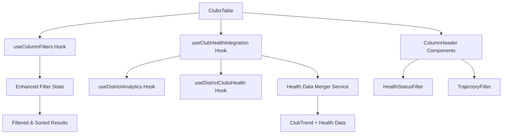
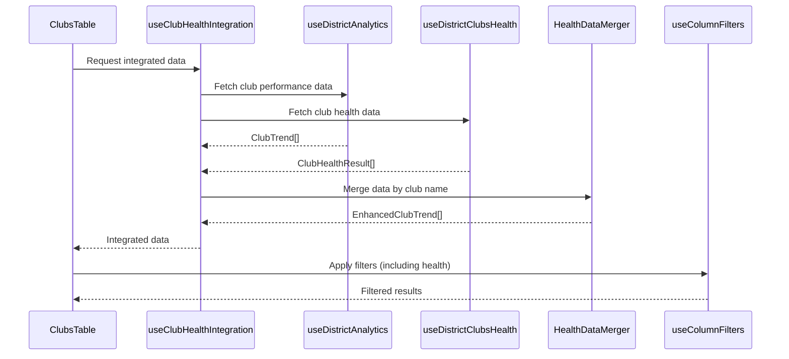

# Design Document

## Overview

This design extends the existing ClubsTable component to integrate Health Status and Trajectory information from the club health classification system. The solution leverages the existing table infrastructure, filtering system, and data fetching patterns to seamlessly add health insights without disrupting current functionality.

The design follows the established patterns in the codebase:

- React Query for data fetching and caching
- Custom hooks for data management and filtering
- Modular component architecture with TypeScript
- Toastmasters brand compliance for visual design
- Accessibility-first approach with WCAG AA compliance

## Architecture

### Component Architecture



### Data Flow Architecture



## Components and Interfaces

### Enhanced Data Types

```typescript
// Extended ClubTrend interface with health data
export interface EnhancedClubTrend extends ProcessedClubTrend {
  // Health classification data
  healthStatus?: HealthStatus
  trajectory?: Trajectory
  healthReasons?: string[]
  trajectoryReasons?: string[]
  healthDataAge?: number // Age in hours
  healthDataTimestamp?: string

  // Computed properties for filtering
  healthStatusOrder: number // For sorting
  trajectoryOrder: number // For sorting
}

// Health data integration status
export interface HealthDataStatus {
  isLoading: boolean
  isError: boolean
  isStale: boolean // > 24 hours old
  isOutdated: boolean // > 7 days old
  lastUpdated?: string
  errorMessage?: string
}
```

### New Hook: useClubHealthIntegration

```typescript
export interface UseClubHealthIntegrationResult {
  enhancedClubs: EnhancedClubTrend[]
  healthDataStatus: HealthDataStatus
  refreshHealthData: () => Promise<void>
  isRefreshing: boolean
}

export const useClubHealthIntegration = (
  districtId: string | null
): UseClubHealthIntegrationResult
```

**Purpose**: Manages the integration of club performance data with health classification data.

**Responsibilities**:

- Fetches both club performance and health data
- Merges data by club name matching
- Handles missing or stale health data gracefully
- Provides refresh functionality
- Manages loading and error states

### Enhanced Column Configuration

```typescript
// Extended column configurations
export const ENHANCED_COLUMN_CONFIGS: ColumnConfig[] = [
  // ... existing columns
  {
    field: 'healthStatus',
    label: 'Health Status',
    sortable: true,
    filterable: true,
    filterType: 'categorical',
    filterOptions: [
      'Thriving',
      'Vulnerable',
      'Intervention Required',
      'Unknown',
    ],
    tooltip:
      'Current club health classification based on membership, DCP goals, and CSP submission',
  },
  {
    field: 'trajectory',
    label: 'Trajectory',
    sortable: true,
    filterable: true,
    filterType: 'categorical',
    filterOptions: ['Recovering', 'Stable', 'Declining', 'Unknown'],
    tooltip: 'Club trend direction based on month-over-month changes',
  },
]
```

### Health Status Column Component

```typescript
interface HealthStatusCellProps {
  healthStatus?: HealthStatus
  reasons?: string[]
  dataAge?: number
  className?: string
}

export const HealthStatusCell: React.FC<HealthStatusCellProps>
```

**Features**:

- Color-coded badges using Toastmasters brand colors
- Tooltip showing classification reasoning
- Data freshness indicators
- Accessibility support with ARIA labels

### Trajectory Column Component

```typescript
interface TrajectoryCellProps {
  trajectory?: Trajectory
  reasons?: string[]
  dataAge?: number
  className?: string
}

export const TrajectoryCell: React.FC<TrajectoryCellProps>
```

**Features**:

- Directional arrow icons with color coding
- Tooltip showing trajectory reasoning
- Data freshness indicators
- Accessibility support with ARIA labels

## Data Models

### Health Data Merger Service

```typescript
export class HealthDataMerger {
  /**
   * Merges club performance data with health classification data
   */
  static mergeClubData(
    clubTrends: ClubTrend[],
    healthResults: ClubHealthResult[]
  ): EnhancedClubTrend[]

  /**
   * Normalizes club names for matching
   */
  private static normalizeClubName(name: string): string

  /**
   * Calculates data age in hours
   */
  private static calculateDataAge(timestamp: string): number

  /**
   * Determines health data status
   */
  private static getHealthDataStatus(
    healthResults: ClubHealthResult[],
    isLoading: boolean,
    error?: Error
  ): HealthDataStatus
}
```

**Matching Strategy**:

1. Exact name match (case-insensitive)
2. Normalized name match (remove special characters, extra spaces)
3. Fuzzy matching for common variations
4. Manual mapping for known mismatches

### Enhanced Filter State

```typescript
// Extended filter state to include health filters
export interface EnhancedFilterState extends FilterState {
  healthStatus?: ColumnFilter
  trajectory?: ColumnFilter
}

// Extended sort fields
export type EnhancedSortField = SortField | 'healthStatus' | 'trajectory'
```

## Correctness Properties

_A property is a characteristic or behavior that should hold true across all valid executions of a system-essentially, a formal statement about what the system should do. Properties serve as the bridge between human-readable specifications and machine-verifiable correctness guarantees._

<function_calls>
<invoke name="prework">
<parameter name="featureName">club-health-table-integration

### Property Reflection

After analyzing all acceptance criteria, I identified several areas where properties can be consolidated:

**Visual Representation Properties**: Properties 1.2-1.4 and 2.2-2.4 test similar visual rendering patterns and can be combined into comprehensive properties that test all status/trajectory values.

**Filter Functionality Properties**: Properties 3.1-3.5 and 4.1-4.5 follow identical patterns for different filter types and can be combined into general filtering properties.

**Performance Properties**: Properties 8.1-8.3 test similar performance requirements and can be combined into a single comprehensive performance property.

**Error Handling Properties**: Properties 9.1-9.6 test various error scenarios that can be combined into comprehensive error handling properties.

**Integration Properties**: Properties 11.1-11.6 test integration with existing features and can be streamlined.

### Correctness Properties

**Property 1: Health Status Display Consistency**
_For any_ club with health status data, the Health Status column should display the correct badge color and text corresponding to the club's health status (Thriving=green, Vulnerable=yellow, Intervention Required=red, Unknown=gray)
**Validates: Requirements 1.1, 1.2, 1.3, 1.4, 1.5**

**Property 2: Trajectory Display Consistency**
_For any_ club with trajectory data, the Trajectory column should display the correct arrow icon, color, and text corresponding to the club's trajectory (Recovering=up/green, Stable=horizontal/gray, Declining=down/red, Unknown=gray)
**Validates: Requirements 2.1, 2.2, 2.3, 2.4, 2.5**

**Property 3: Health Status Sorting Order**
_For any_ list of clubs sorted by health status, the sort order should follow: Intervention Required, Vulnerable, Thriving, Unknown (ascending) or reverse (descending)
**Validates: Requirements 1.6**

**Property 4: Trajectory Sorting Order**
_For any_ list of clubs sorted by trajectory, the sort order should follow: Declining, Stable, Recovering, Unknown (ascending) or reverse (descending)
**Validates: Requirements 2.6**

**Property 5: Health Status Filtering Functionality**
_For any_ combination of health status filter selections, the table should display only clubs matching the selected statuses using OR logic, and clearing filters should restore all clubs
**Validates: Requirements 3.1, 3.2, 3.3, 3.4, 3.5**

**Property 6: Trajectory Filtering Functionality**
_For any_ combination of trajectory filter selections, the table should display only clubs matching the selected trajectories using OR logic, and clearing filters should restore all clubs
**Validates: Requirements 4.1, 4.2, 4.3, 4.4, 4.5**

**Property 7: Data Integration Consistency**
_For any_ set of club performance data and health classification data, the integration service should successfully merge matching clubs by name and gracefully handle missing health data by marking it as "Unknown"
**Validates: Requirements 5.1, 5.2, 5.3, 5.4**

**Property 8: Performance Requirements**
_For any_ dataset up to 1000 clubs, filtering by health status or trajectory should complete within 100ms, sorting should complete within 100ms, and data integration should complete within 200ms
**Validates: Requirements 5.6, 8.1, 8.2, 8.3, 8.4, 8.5**

**Property 9: Accessibility Compliance**
_For any_ health status or trajectory display, the component should provide sufficient color contrast (4.5:1 minimum), descriptive ARIA labels for screen readers, and appropriate touch targets (44px minimum) on mobile devices
**Validates: Requirements 6.1, 6.2, 6.3, 6.4, 6.5**

**Property 10: Export Data Integrity**
_For any_ export operation, the CSV output should include health status and trajectory columns with human-readable values, respect active filters, and complete within 5 seconds for up to 1000 clubs
**Validates: Requirements 7.1, 7.2, 7.3, 7.4, 7.5, 7.6**

**Property 11: Error Handling Graceful Degradation**
_For any_ health data loading failure or API unavailability, the table should continue functioning with "Unknown" health indicators, display appropriate error messages, and never fail to load due to health data issues
**Validates: Requirements 9.1, 9.2, 9.3, 9.5, 9.6**

**Property 12: Data Freshness Indicators**
_For any_ health data with timestamps, the system should display appropriate freshness indicators (fresh/recent/stale/outdated) based on data age and provide refresh functionality when data becomes stale
**Validates: Requirements 9.4, 12.1, 12.2, 12.3, 12.4, 12.5, 12.6**

**Property 13: Tooltip Information Accuracy**
_For any_ health status or trajectory display, hovering should show tooltips containing the reasoning behind the classification and explanatory information about what the status/trajectory means
**Validates: Requirements 10.1, 10.2**

**Property 14: Integration with Existing Features**
_For any_ existing table functionality (clear all filters, active filter count, row clicks, pagination), the health columns should integrate seamlessly without breaking existing behavior
**Validates: Requirements 11.1, 11.2, 11.3, 11.4, 11.5, 11.6**

**Property 15: Visual Consistency and Branding**
_For any_ health status or trajectory display, the visual styling should maintain consistency with existing table design and comply with Toastmasters brand guidelines
**Validates: Requirements 6.6, 10.5**

## Error Handling

### Health Data Loading Failures

**Graceful Degradation Strategy**:

1. **API Unavailable**: Display "Unknown" status for all clubs, show retry button
2. **Partial Data**: Display available health data, mark missing clubs as "Unknown"
3. **Stale Data**: Display warning indicators, provide refresh option
4. **Network Timeout**: Show loading state, then fallback to cached data if available

**Error Recovery**:

- Automatic retry with exponential backoff (1s, 2s, 4s)
- Manual refresh button always available
- Cached data used as fallback when possible
- Error logging for troubleshooting

### Data Consistency Issues

**Club Name Matching Failures**:

- Fuzzy matching for common variations
- Manual mapping configuration for known mismatches
- Logging of unmatched clubs for manual review
- Fallback to "Unknown" status for unmatched clubs

**Data Validation**:

- Validate health status and trajectory values
- Handle unexpected API response formats
- Sanitize and normalize club names
- Validate timestamps and calculate data age

## Testing Strategy

### Dual Testing Approach

The testing strategy combines unit tests for specific scenarios with property-based tests for comprehensive coverage:

**Unit Tests**:

- Component rendering with different health statuses
- Filter dropdown interactions
- Error state displays
- Tooltip content accuracy
- Export functionality with health data
- Integration with existing table features

**Property-Based Tests**:

- Health status and trajectory display consistency across all possible values
- Filtering and sorting behavior with randomized club datasets
- Performance requirements with varying dataset sizes
- Data integration with different combinations of missing/present health data
- Accessibility compliance across different health status combinations
- Error handling with various failure scenarios

**Property Test Configuration**:

- Minimum 100 iterations per property test
- Each test tagged with feature name and property reference
- Performance tests with datasets up to 1000 clubs
- Accessibility tests with automated contrast ratio checking

**Test Data Generation**:

- Random club data with all possible health status combinations
- Simulated API responses with missing/stale data scenarios
- Performance test datasets with controlled sizes
- Edge cases like empty datasets and single-club datasets

### Integration Testing

**End-to-End Workflows**:

- Load table → Apply health filters → Sort by trajectory → Export data
- Health data refresh → Verify updated displays → Test filter persistence
- Error scenarios → Verify graceful degradation → Test recovery

**Cross-Browser Testing**:

- Health status badge rendering consistency
- Filter dropdown functionality
- Tooltip positioning and content
- Mobile responsive behavior

**Accessibility Testing**:

- Screen reader navigation through health columns
- Keyboard-only interaction with health filters
- Color contrast validation for all health status badges
- Touch target size verification on mobile devices

The testing approach ensures that health data integration maintains the high quality standards of the existing codebase while providing comprehensive coverage of the new functionality.
