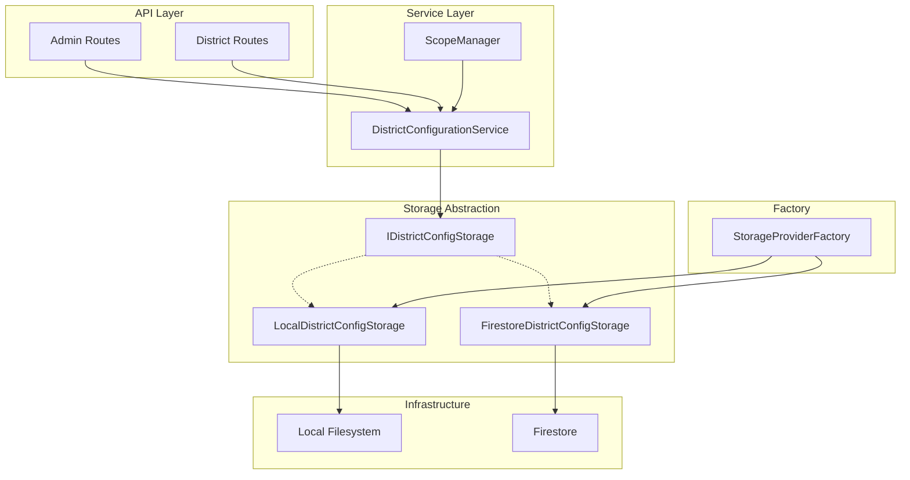
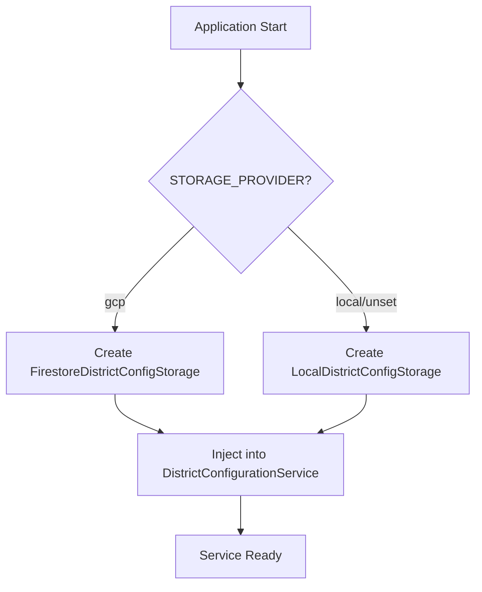

# Design Document: District Configuration Storage Abstraction

## Overview

This design extends the existing storage abstraction layer to include district configuration storage. The solution follows the established pattern used by `ISnapshotStorage` and `IRawCSVStorage`, introducing a new `IDistrictConfigStorage` interface with implementations for local filesystem and Firestore.

The key architectural decision is to extract storage operations from `DistrictConfigurationService` into a dedicated storage interface, allowing the service to remain focused on business logic (validation, normalization, audit logging) while delegating persistence to swappable storage backends.

## Architecture



### Storage Provider Selection Flow



## Components and Interfaces

### IDistrictConfigStorage Interface

The storage interface defines the contract for district configuration persistence operations. It mirrors the pattern established by `ISnapshotStorage`.

```typescript
/**
 * District configuration storage interface
 * 
 * Abstracts the persistence layer for district configuration,
 * enabling swappable implementations for local and cloud storage.
 */
export interface IDistrictConfigStorage {
  // Core configuration operations
  getConfiguration(): Promise<DistrictConfiguration | null>
  saveConfiguration(config: DistrictConfiguration): Promise<void>
  
  // Audit log operations
  appendChangeLog(change: ConfigurationChange): Promise<void>
  getChangeHistory(limit: number): Promise<ConfigurationChange[]>
  
  // Health check
  isReady(): Promise<boolean>
}
```

### LocalDistrictConfigStorage

Local filesystem implementation that maintains backward compatibility with existing file structure.

```typescript
export class LocalDistrictConfigStorage implements IDistrictConfigStorage {
  private readonly configFilePath: string
  private readonly auditLogPath: string
  
  constructor(cacheDir: string) {
    const configDir = path.join(cacheDir, 'config')
    this.configFilePath = path.join(configDir, 'districts.json')
    this.auditLogPath = path.join(configDir, 'district-changes.log')
  }
  
  async getConfiguration(): Promise<DistrictConfiguration | null> {
    // Read from cache/config/districts.json
    // Return null if file doesn't exist
  }
  
  async saveConfiguration(config: DistrictConfiguration): Promise<void> {
    // Atomic write using temp file + rename
    // Create directories if needed
  }
  
  async appendChangeLog(change: ConfigurationChange): Promise<void> {
    // Append JSON line to audit log
  }
  
  async getChangeHistory(limit: number): Promise<ConfigurationChange[]> {
    // Read and parse audit log, return most recent entries
  }
  
  async isReady(): Promise<boolean> {
    // Check if config directory is accessible
  }
}
```

### FirestoreDistrictConfigStorage

Firestore implementation for GCP environments.

```typescript
export class FirestoreDistrictConfigStorage implements IDistrictConfigStorage {
  private readonly firestore: Firestore
  private readonly circuitBreaker: CircuitBreaker
  private readonly configDocPath = 'config/districts'
  
  constructor(config: { projectId: string }) {
    this.firestore = new Firestore({ projectId: config.projectId })
    this.circuitBreaker = CircuitBreaker.createCacheCircuitBreaker(
      'firestore-district-config'
    )
  }
  
  async getConfiguration(): Promise<DistrictConfiguration | null> {
    // Read from config/districts document
    // Return null if document doesn't exist
  }
  
  async saveConfiguration(config: DistrictConfiguration): Promise<void> {
    // Write to config/districts document
    // Use circuit breaker for resilience
  }
  
  async appendChangeLog(change: ConfigurationChange): Promise<void> {
    // Add document to config/districts/history subcollection
    // Use auto-generated document ID with timestamp
  }
  
  async getChangeHistory(limit: number): Promise<ConfigurationChange[]> {
    // Query history subcollection, ordered by timestamp desc
  }
  
  async isReady(): Promise<boolean> {
    // Attempt simple read to verify connectivity
  }
}
```

### StorageProviderFactory Extension

The factory is extended to create district configuration storage alongside existing providers.

```typescript
export interface StorageProviders {
  snapshotStorage: ISnapshotStorage
  rawCSVStorage: IRawCSVStorage
  districtConfigStorage: IDistrictConfigStorage  // New
}

export class StorageProviderFactory {
  static createFromEnvironment(): StorageProviders {
    const provider = this.parseProviderType(process.env['STORAGE_PROVIDER'])
    
    if (provider === 'gcp') {
      return {
        snapshotStorage: new FirestoreSnapshotStorage({ ... }),
        rawCSVStorage: new GCSRawCSVStorage({ ... }),
        districtConfigStorage: new FirestoreDistrictConfigStorage({ ... })
      }
    }
    
    return {
      snapshotStorage: new LocalSnapshotStorage({ ... }),
      rawCSVStorage: new LocalRawCSVStorage({ ... }),
      districtConfigStorage: new LocalDistrictConfigStorage(cacheDir)
    }
  }
}
```

### Refactored DistrictConfigurationService

The service is refactored to accept storage via constructor injection.

```typescript
export class DistrictConfigurationService {
  private readonly storage: IDistrictConfigStorage
  private cachedConfig: DistrictConfiguration | null = null
  private readonly defaultConfig: DistrictConfiguration
  
  constructor(storage: IDistrictConfigStorage) {
    this.storage = storage
    this.defaultConfig = {
      configuredDistricts: [],
      lastUpdated: new Date().toISOString(),
      updatedBy: 'system',
      version: 1,
    }
  }
  
  // All existing public methods remain unchanged
  // Internal storage operations delegate to this.storage
  
  private async loadConfiguration(): Promise<DistrictConfiguration> {
    if (this.cachedConfig) return this.cachedConfig
    
    const config = await this.storage.getConfiguration()
    if (!config) return this.defaultConfig
    
    this.cachedConfig = config
    return config
  }
  
  private async saveConfiguration(config: DistrictConfiguration): Promise<void> {
    await this.storage.saveConfiguration(config)
    this.cachedConfig = config
  }
}
```

## Data Models

### Firestore Document Structure

```
config/
└── districts (document)
    ├── configuredDistricts: string[]
    ├── lastUpdated: string (ISO timestamp)
    ├── updatedBy: string
    ├── version: number
    └── history/ (subcollection)
        └── {auto-id} (document)
            ├── timestamp: string (ISO timestamp)
            ├── action: 'add' | 'remove' | 'replace'
            ├── districtId: string | null
            ├── adminUser: string
            ├── previousDistricts?: string[]
            ├── newDistricts?: string[]
            └── context?: string
```

### Type Definitions

```typescript
// Existing types remain unchanged
export interface DistrictConfiguration {
  configuredDistricts: string[]
  lastUpdated: string
  updatedBy: string
  version: number
}

export interface ConfigurationChange {
  timestamp: string
  action: 'add' | 'remove' | 'replace'
  districtId: string | null
  adminUser: string
  previousDistricts?: string[]
  newDistricts?: string[]
  context?: string
}

// New storage interface type
export interface IDistrictConfigStorage {
  getConfiguration(): Promise<DistrictConfiguration | null>
  saveConfiguration(config: DistrictConfiguration): Promise<void>
  appendChangeLog(change: ConfigurationChange): Promise<void>
  getChangeHistory(limit: number): Promise<ConfigurationChange[]>
  isReady(): Promise<boolean>
}
```


## Correctness Properties

*A property is a characteristic or behavior that should hold true across all valid executions of a system—essentially, a formal statement about what the system should do. Properties serve as the bridge between human-readable specifications and machine-verifiable correctness guarantees.*

### Property 1: Configuration Round-Trip Consistency

*For any* valid DistrictConfiguration object, saving it to storage and then reading it back SHALL produce an equivalent configuration object.

**Validates: Requirements 2.1, 3.1**

This is a round-trip property that ensures storage implementations correctly persist and retrieve configuration data without loss or corruption.

### Property 2: Storage Provider Selection Consistency

*For any* value of the STORAGE_PROVIDER environment variable, the StorageProviderFactory SHALL create the correct storage implementation type (LocalDistrictConfigStorage for 'local'/unset, FirestoreDistrictConfigStorage for 'gcp').

**Validates: Requirements 4.1, 4.2, 4.3**

This property ensures the factory correctly maps environment configuration to storage implementations.

### Property 3: Service Delegation Completeness

*For any* storage operation performed through DistrictConfigurationService, the operation SHALL be delegated to the injected IDistrictConfigStorage implementation.

**Validates: Requirements 5.2**

This property ensures the service correctly delegates all persistence operations to the storage layer.

### Property 4: Validation Preservation

*For any* district ID input, the DistrictConfigurationService SHALL apply the same validation and normalization rules regardless of which storage implementation is used.

**Validates: Requirements 5.4**

This property ensures business logic (validation, normalization) is independent of storage backend.

### Property 5: Error Type Consistency

*For any* storage operation that fails, the storage implementation SHALL throw a StorageOperationError with the operation name and provider type in the error context.

**Validates: Requirements 7.1**

This property ensures consistent error handling across storage implementations.

### Property 6: Empty Configuration Default

*For any* storage backend where no configuration exists, reading configuration SHALL return the default empty configuration (empty configuredDistricts array, version 1).

**Validates: Requirements 8.3**

This property ensures consistent behavior when configuration is missing.

### Property 7: Change History Ordering

*For any* sequence of configuration changes, getChangeHistory SHALL return changes in reverse chronological order (most recent first).

**Validates: Requirements 1.2, 3.2**

This property ensures audit log queries return predictable ordering.

## Error Handling

### Storage Operation Errors

All storage implementations throw `StorageOperationError` for operation failures:

```typescript
throw new StorageOperationError(
  `Failed to save district configuration: ${errorMessage}`,
  'saveConfiguration',
  'local', // or 'firestore'
  isRetryable,
  originalError
)
```

### Error Categories

| Error Type | Retryable | Example |
|------------|-----------|---------|
| Network timeout | Yes | Firestore connection timeout |
| Permission denied | No | Missing IAM permissions |
| Invalid data | No | Corrupted configuration file |
| Resource not found | No | Missing Firestore document (handled as null) |
| Transient failure | Yes | Firestore UNAVAILABLE status |

### Graceful Degradation

- `isReady()` returns `false` instead of throwing when storage is unavailable
- `getConfiguration()` returns `null` instead of throwing when configuration doesn't exist
- Service layer handles `null` by returning default configuration

## Testing Strategy

### Dual Testing Approach

This feature requires both unit tests and property-based tests:

- **Unit tests**: Verify specific examples, edge cases, and error conditions
- **Property tests**: Verify universal properties across all inputs

### Property-Based Testing Configuration

- **Library**: fast-check (already used in the codebase)
- **Minimum iterations**: 100 per property test
- **Tag format**: `Feature: district-configuration-storage-abstraction, Property N: {property_text}`

### Test Categories

#### Unit Tests

1. **LocalDistrictConfigStorage**
   - File path construction
   - Directory creation on first write
   - Atomic write behavior
   - Backward compatibility with existing files
   - Error handling for file system errors

2. **FirestoreDistrictConfigStorage**
   - Document path construction
   - Circuit breaker integration
   - Retryable error classification
   - Subcollection query ordering

3. **StorageProviderFactory**
   - Environment variable parsing
   - Provider type selection
   - Configuration validation

4. **DistrictConfigurationService**
   - Constructor injection
   - Cache invalidation
   - Validation logic preservation

#### Property Tests

1. **Round-trip consistency** (Property 1)
   - Generate random valid configurations
   - Save and read back
   - Verify equivalence

2. **Storage provider selection** (Property 2)
   - Generate random STORAGE_PROVIDER values
   - Verify correct implementation type

3. **Validation preservation** (Property 4)
   - Generate random district IDs
   - Verify validation results are consistent across storage backends

4. **Empty configuration default** (Property 6)
   - Test with empty/missing storage
   - Verify default configuration structure

#### Integration Tests

1. **Local storage integration**
   - Full CRUD cycle with real filesystem
   - Concurrent access handling
   - Cleanup and isolation

2. **Firestore integration** (with emulator)
   - Full CRUD cycle with Firestore emulator
   - History subcollection queries
   - Circuit breaker behavior

3. **API integration**
   - Admin routes with both storage backends
   - Backward compatibility verification
