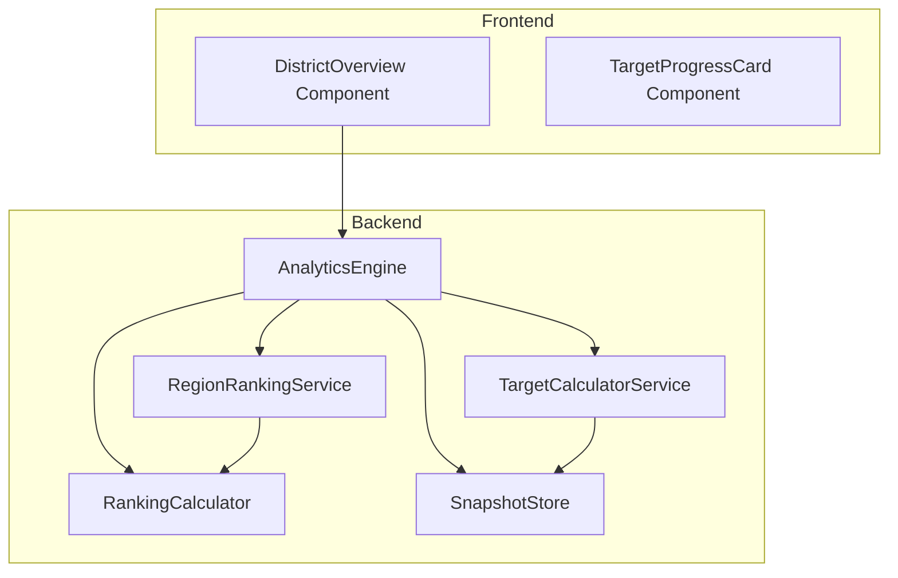

# Design Document: District Performance Targets

## Overview

This feature enhances the District Overview page by integrating performance targets and rankings into the existing metric cards. The implementation transforms three existing cards (Total Clubs → Paid Clubs, Total Membership → Membership Payments, Distinguished Clubs → enhanced with targets) and removes the "Projected Year-End" card. Each enhanced card displays progress against recognition level targets (Distinguished, Select, President's, Smedley) along with world rank, world percentile, and region rank.

The design follows the existing architecture patterns, extending the backend analytics engine with a new `TargetCalculator` service and enhancing the frontend `DistrictOverview` component to consume and display the new data.

## Architecture

### System Context



### Data Flow

1. Frontend requests district analytics via existing `/api/districts/:id/analytics` endpoint
2. Backend `AnalyticsEngine` retrieves district data from `SnapshotStore`
3. `TargetCalculatorService` computes recognition level targets using base values
4. `RegionRankingService` derives region rankings from world rankings
5. Enhanced response includes targets, rankings, and percentiles
6. Frontend `DistrictOverview` renders enhanced cards with progress indicators

## Components and Interfaces

### Backend Components

#### TargetCalculatorService

New service responsible for computing recognition level targets.

```typescript
/**
 * Recognition level target thresholds
 * Based on Toastmasters Distinguished District Program requirements
 */
interface RecognitionTargets {
  distinguished: number
  select: number
  presidents: number
  smedley: number
}

/**
 * Target calculation result for a single metric
 */
interface MetricTargets {
  base: number | null
  current: number
  targets: RecognitionTargets | null
  achievedLevel: RecognitionLevel | null
}

/**
 * Recognition levels in order of achievement
 */
type RecognitionLevel = 'distinguished' | 'select' | 'presidents' | 'smedley'

interface ITargetCalculatorService {
  /**
   * Calculate paid clubs targets based on Club_Base
   * Formula: base + (base * percentage), rounded up
   * - Distinguished: +1%
   * - Select: +3%
   * - President's: +5%
   * - Smedley: +8%
   */
  calculatePaidClubsTargets(clubBase: number, currentPaidClubs: number): MetricTargets

  /**
   * Calculate membership payments targets based on Payment_Base
   * Formula: base + (base * percentage), rounded up
   * - Distinguished: +1%
   * - Select: +3%
   * - President's: +5%
   * - Smedley: +8%
   */
  calculatePaymentsTargets(paymentBase: number, currentPayments: number): MetricTargets

  /**
   * Calculate distinguished clubs targets based on Club_Base
   * Formula: base * percentage, rounded up
   * - Distinguished: 45%
   * - Select: 50%
   * - President's: 55%
   * - Smedley: 60%
   */
  calculateDistinguishedTargets(clubBase: number, currentDistinguished: number): MetricTargets
}
```

#### RegionRankingService

New service responsible for deriving region rankings from world rankings.

```typescript
/**
 * Region ranking data for a single metric
 */
interface RegionRankData {
  regionRank: number | null
  totalInRegion: number
  region: string | null
}

/**
 * Complete ranking data for a metric
 */
interface MetricRankings {
  worldRank: number | null
  worldPercentile: number | null  // Rounded to 1 decimal place
  regionRank: number | null
  totalDistricts: number
  totalInRegion: number
  region: string | null
}

interface IRegionRankingService {
  /**
   * Calculate region rank by filtering world rankings to same region
   * Region rank 1 = best in region
   */
  calculateRegionRank(
    districtId: string,
    metric: 'clubs' | 'payments' | 'distinguished',
    allDistrictRankings: DistrictRanking[]
  ): RegionRankData

  /**
   * Calculate world percentile using formula:
   * ((totalDistricts - worldRank) / totalDistricts) * 100
   * Displayed as "Top X%" where X = 100 - percentile
   */
  calculateWorldPercentile(worldRank: number, totalDistricts: number): number
}
```

#### Enhanced DistrictAnalytics Response

Extension to existing `DistrictAnalytics` interface:

```typescript
/**
 * Performance targets and rankings for district overview
 */
interface DistrictPerformanceTargets {
  paidClubs: {
    current: number
    base: number | null
    targets: RecognitionTargets | null
    achievedLevel: RecognitionLevel | null
    rankings: MetricRankings
  }
  membershipPayments: {
    current: number
    base: number | null
    targets: RecognitionTargets | null
    achievedLevel: RecognitionLevel | null
    rankings: MetricRankings
  }
  distinguishedClubs: {
    current: number
    base: number | null  // Uses Club_Base for percentage calculation
    targets: RecognitionTargets | null
    achievedLevel: RecognitionLevel | null
    rankings: MetricRankings
  }
}

// Extended DistrictAnalytics interface
interface DistrictAnalytics {
  // ... existing fields ...
  
  /**
   * Performance targets and rankings data
   * Null if base values are unavailable
   */
  performanceTargets?: DistrictPerformanceTargets
}
```

### Frontend Components

#### TargetProgressCard

New reusable component for displaying metric with targets and rankings.

```typescript
interface TargetProgressCardProps {
  title: string
  icon: React.ReactNode
  current: number
  base: number | null
  targets: RecognitionTargets | null
  achievedLevel: RecognitionLevel | null
  rankings: MetricRankings
  badges?: React.ReactNode  // Existing sub-information (health badges, level badges)
  colorScheme: 'blue' | 'green' | 'purple'
}
```

#### Enhanced DistrictOverview

Modifications to existing component:
- Replace "Total Clubs" card with "Paid Clubs" card using `TargetProgressCard`
- Replace "Total Membership" card with "Membership Payments" card using `TargetProgressCard`
- Enhance "Distinguished Clubs" card with targets using `TargetProgressCard`
- Remove "Projected Year-End" card
- Retain existing badge displays (health status, distinguished levels)

## Data Models

### Target Calculation Formulas

#### Paid Clubs Targets (Requirement 1)

| Level | Formula | Example (Base=100) |
|-------|---------|-------------------|
| Distinguished | ceil(base × 1.01) | 101 |
| Select | ceil(base × 1.03) | 103 |
| President's | ceil(base × 1.05) | 105 |
| Smedley | ceil(base × 1.08) | 108 |

#### Membership Payments Targets (Requirement 2)

| Level | Formula | Example (Base=1000) |
|-------|---------|-------------------|
| Distinguished | ceil(base × 1.01) | 1010 |
| Select | ceil(base × 1.03) | 1030 |
| President's | ceil(base × 1.05) | 1050 |
| Smedley | ceil(base × 1.08) | 1080 |

#### Distinguished Clubs Targets (Requirement 3)

| Level | Formula | Example (Base=100) |
|-------|---------|-------------------|
| Distinguished | ceil(base × 0.45) | 45 |
| Select | ceil(base × 0.50) | 50 |
| President's | ceil(base × 0.55) | 55 |
| Smedley | ceil(base × 0.60) | 60 |

### Percentile Calculation (Requirement 5)

```
percentile = ((totalDistricts - worldRank) / totalDistricts) × 100
displayValue = "Top " + round(100 - percentile, 1) + "%"
```

Example: Rank 10 of 100 districts
- percentile = ((100 - 10) / 100) × 100 = 90%
- displayValue = "Top 10%"

### Data Source Mapping

| Field | CSV Column | Type |
|-------|-----------|------|
| Club_Base | "Paid Club Base" | number |
| Payment_Base | "Payment Base" | number |
| Paid_Clubs | "Paid Clubs" | number |
| Total_Payments | "Total YTD Payments" | number |
| Distinguished_Clubs | "Total Distinguished Clubs" | number |
| Region | "REGION" | string |

## Correctness Properties

*A property is a characteristic or behavior that should hold true across all valid executions of a system—essentially, a formal statement about what the system should do. Properties serve as the bridge between human-readable specifications and machine-verifiable correctness guarantees.*

### Property 1: Target Calculation Formula Correctness

*For any* valid base value and recognition level, the calculated target SHALL equal the ceiling of (base × multiplier), where multiplier is defined by the recognition level and metric type.

**Validates: Requirements 1.2, 1.3, 1.4, 1.5, 2.2, 2.3, 2.4, 2.5, 3.2, 3.3, 3.4, 3.5**

### Property 2: Ceiling Rounding Invariant

*For any* target calculation that produces a fractional result, the output SHALL be the smallest integer greater than or equal to the calculated value (ceiling function).

**Validates: Requirements 1.6, 2.6, 3.6**

### Property 3: Region Ranking Correctness

*For any* district with a known region, the region rank SHALL be calculated by:
1. Filtering all districts to those in the same region
2. Ordering by the metric value (descending)
3. Assigning rank 1 to the best performer

**Validates: Requirements 4.1, 4.2, 4.3, 4.4**

### Property 4: World Percentile Calculation

*For any* district with a world rank, the percentile SHALL be calculated as `((totalDistricts - worldRank) / totalDistricts) × 100`, rounded to one decimal place, and displayed as "Top X%" where X = 100 - percentile.

**Validates: Requirements 5.1, 5.2, 5.3, 5.4**

### Property 5: Target Achievement Visual Indication

*For any* metric where the current value meets or exceeds a target level, the UI SHALL display a visual indicator (checkmark or color change) for that level and all lower levels.

**Validates: Requirements 6.9**

### Property 6: API Response Completeness

*For any* district analytics request, the response SHALL include:
- Target calculations for all three metrics (or null if base unavailable)
- World rank, region rank, and world percentile for each metric
- Base values used for calculations

**Validates: Requirements 7.1, 7.2, 7.3, 7.4**

### Property 7: Missing Data Graceful Handling

*For any* district where base values are zero, missing, or invalid:
- Targets SHALL be null and display "N/A"
- Rankings SHALL display "—" if unavailable
- Region rank SHALL be omitted if region is unknown
- Tooltips SHALL explain data unavailability

**Validates: Requirements 8.1, 8.2, 8.3, 8.4**

## Error Handling

### Backend Error Handling

| Scenario | Behavior |
|----------|----------|
| Club_Base = 0 or missing | Return `null` for paid clubs targets |
| Payment_Base = 0 or missing | Return `null` for payments targets |
| Region unknown | Return `null` for region rank |
| No ranking data available | Return `null` for all rankings |
| Calculation overflow | Log error, return `null` for affected targets |

### Frontend Error Handling

| Scenario | Display |
|----------|---------|
| Targets = null | Show "N/A" with tooltip "Base data unavailable" |
| Rankings = null | Show "—" with tooltip "Ranking data unavailable" |
| Region rank = null | Omit region rank display entirely |
| API error | Show existing error state, retain last known data |

## Testing Strategy

### Unit Tests

Unit tests focus on specific examples and edge cases:

1. **TargetCalculatorService**
   - Verify correct calculation for known base values
   - Test boundary conditions (base = 1, base = 0)
   - Test ceiling rounding for fractional results

2. **RegionRankingService**
   - Verify region filtering logic
   - Test percentile calculation accuracy
   - Test handling of single-district regions

3. **Frontend Components**
   - Verify correct rendering of targets and rankings
   - Test visual indicators for achieved levels
   - Test "N/A" and "—" display for missing data

### Property-Based Tests

Property-based tests validate universal properties across many generated inputs. Each test runs minimum 100 iterations.

| Property | Test Description | Framework |
|----------|-----------------|-----------|
| Property 1 | Generate random base values, verify formula correctness | fast-check |
| Property 2 | Generate fractional results, verify ceiling applied | fast-check |
| Property 3 | Generate district sets with regions, verify ranking correctness | fast-check |
| Property 4 | Generate rank/total pairs, verify percentile formula | fast-check |
| Property 5 | Generate current/target pairs, verify visual indicators | fast-check |
| Property 6 | Generate district data, verify response completeness | fast-check |
| Property 7 | Generate missing data scenarios, verify graceful handling | fast-check |

### Integration Tests

1. **API Integration**
   - Verify enhanced analytics endpoint returns targets and rankings
   - Test with real snapshot data
   - Verify backward compatibility with existing consumers

2. **Component Integration**
   - Verify DistrictOverview renders all enhanced cards
   - Test data flow from API to component
   - Verify existing functionality preserved (badges, tooltips)

## Design Decisions

### Decision 1: Extend Existing Analytics Response

**Choice**: Add `performanceTargets` field to existing `DistrictAnalytics` response rather than creating a new endpoint.

**Rationale**:
- Maintains backward compatibility
- Single API call for all district overview data
- Consistent with existing architecture patterns
- Optional field allows gradual frontend adoption

### Decision 2: Separate Target Calculator Service

**Choice**: Create dedicated `TargetCalculatorService` rather than embedding logic in `AnalyticsEngine`.

**Rationale**:
- Single responsibility principle
- Easier to test calculation logic in isolation
- Reusable for other features (e.g., goal tracking)
- Clear separation of concerns

### Decision 3: Derive Region Rankings from World Rankings

**Choice**: Calculate region rankings by filtering existing world rankings rather than maintaining separate regional data.

**Rationale**:
- Leverages existing `RankingCalculator` infrastructure
- No additional data storage required
- Consistent ranking methodology across world and region
- Simpler maintenance

### Decision 4: Use Ceiling Function for All Targets

**Choice**: Always round up fractional targets using ceiling function.

**Rationale**:
- Consistent with Toastmasters program requirements
- Ensures targets are achievable whole numbers
- Prevents edge cases where fractional targets could be "met" by truncation

### Decision 5: Reusable TargetProgressCard Component

**Choice**: Create a single reusable component for all three enhanced cards.

**Rationale**:
- DRY principle
- Consistent visual design across metrics
- Easier maintenance and styling updates
- Supports future metric additions

### Decision 6: Remove Projected Year-End Card

**Choice**: Remove the "Projected Year-End" card entirely rather than relocating it.

**Rationale**:
- Per requirements, the card is being replaced by target-based progress tracking
- Reduces visual clutter on the overview page
- Target achievement provides more actionable information than projections
- Projection logic can be deprecated from backend
