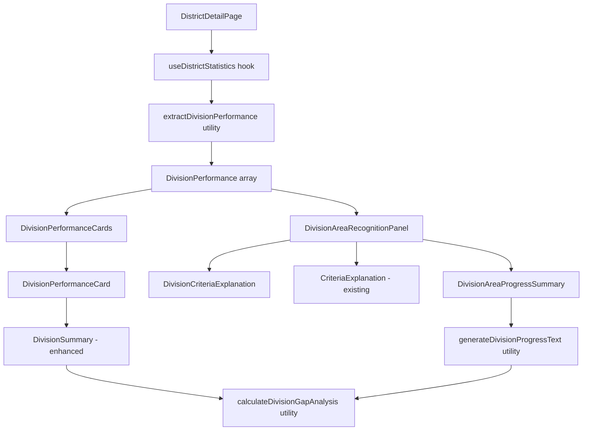

# Design Document: Division Distinguished Criteria

## Overview

This feature adds Division recognition criteria and progress display to the existing Division Performance Cards and augments the Area Recognition Panel to become a unified "Division and Area Recognition" panel. The feature displays the Distinguished Division Program (DDP) criteria and shows each division's current progress toward achieving Distinguished, Select Distinguished, and President's Distinguished status.

The design leverages existing data structures (`DivisionPerformance`, `AreaPerformance`) and calculation utilities already present in the codebase. New utilities will be created following the patterns established by `areaGapAnalysis.ts` and `areaProgressText.ts`.

## Architecture

The feature follows the existing frontend architecture:

```text
DistrictDetailPage.tsx
└── Divisions & Areas Tab
    ├── DivisionPerformanceCards (existing, enhanced)
    │   └── DivisionPerformanceCard
    │       ├── DivisionSummary (enhanced with recognition metrics)
    │       │   - Recognition badge
    │       │   - Gap to D, Gap to S, Gap to P indicators
    │       └── AreaPerformanceTable (existing)
    └── DivisionAreaRecognitionPanel (renamed from AreaRecognitionPanel)
        ├── DivisionCriteriaExplanation (new)
        ├── CriteriaExplanation (existing, for DAP)
        └── DivisionAreaProgressSummary (enhanced from AreaProgressSummary)
            - Division progress narratives
            - Area progress narratives (grouped by division)
```

### Data Flow



## Components and Interfaces

### DivisionSummary Component (Enhanced)

The existing DivisionSummary component will be enhanced to include recognition metrics.

```typescript
interface DivisionSummaryProps {
  /** Division identifier (e.g., "A", "B", "C") */
  divisionId: string
  /** Current distinguished status level */
  status: Exclude<DistinguishedStatus, 'not-qualified'>
  /** Current number of clubs that have met membership payment requirements */
  paidClubs: number
  /** Number of clubs at the start of the program year */
  clubBase: number
  /** Net growth (paidClubs - clubBase), can be positive, negative, or zero */
  netGrowth: number
  /** Current number of clubs that have achieved Distinguished status */
  distinguishedClubs: number
  /** Required number of distinguished clubs (45% of club base for Distinguished) */
  requiredDistinguishedClubs: number
  /** Gap analysis for recognition levels (new) */
  gapAnalysis?: DivisionGapAnalysis
}
```

**New Display Elements:**

- Recognition badge showing current level (Distinguished, Select Distinguished, President's Distinguished, Not Distinguished, Net Loss)
- Gap to D indicator (distinguished clubs needed for 45% threshold)
- Gap to S indicator (distinguished clubs + paid clubs needed for 50% + base+1)
- Gap to P indicator (distinguished clubs + paid clubs needed for 55% + base+2)

### DivisionAreaRecognitionPanel Component

Renamed and enhanced from AreaRecognitionPanel to include division recognition.

```typescript
interface DivisionAreaRecognitionPanelProps {
  /** Division performance data containing area information */
  divisions: DivisionPerformance[]
  /** Loading state indicator */
  isLoading?: boolean
}
```

### DivisionCriteriaExplanation Component

Displays the DDP criteria and eligibility requirements.

```typescript
interface DivisionCriteriaExplanationProps {
  /** Whether to show in collapsed/expanded state */
  defaultExpanded?: boolean
}
```

### DivisionAreaProgressSummary Component

Enhanced from AreaProgressSummary to include division progress narratives.

```typescript
interface DivisionAreaProgressSummaryProps {
  /** All divisions with their areas */
  divisions: DivisionPerformance[]
  /** Loading state indicator */
  isLoading?: boolean
}
```

### Division Progress Text Generation

Generates a concise English paragraph for each division describing:

1. Current status and recognition level achieved
2. Eligibility requirements (no net club loss) if not met
3. What's needed for the next level (building incrementally)
4. Additional requirements for higher levels (only the differences)

```typescript
interface DivisionProgressText {
  /** Division identifier */
  divisionLabel: string
  /** Current recognition level achieved */
  currentLevel: DivisionRecognitionLevel
  /** Concise paragraph describing progress and gaps */
  progressText: string
}

/**
 * Generates a concise English paragraph describing a division's progress.
 *
 * Examples:
 * - "Division A has achieved President's Distinguished status."
 * - "Division B has achieved Distinguished status (52 of 50 clubs paid, 24 of 50 distinguished).
 *    For Select Distinguished, 2 more clubs need to become distinguished and add 1 paid club.
 *    For President's Distinguished, 3 more distinguished clubs and 1 more paid club."
 * - "Division C has a net club loss (48 of 50 clubs paid). To become eligible,
 *    add 2 paid clubs. Then for Distinguished, 5 clubs need to become distinguished."
 * - "Division D is not yet distinguished (50 of 50 clubs paid, 20 of 50 distinguished).
 *    For Distinguished, 3 more clubs need to become distinguished.
 *    For Select Distinguished, 6 more distinguished clubs and 1 paid club.
 *    For President's Distinguished, 8 more distinguished clubs and 2 paid clubs."
 */
function generateDivisionProgressText(
  division: DivisionPerformance,
  gapAnalysis: DivisionGapAnalysis
): DivisionProgressText
```

### Division Gap Analysis Types

```typescript
/**
 * Recognition levels for divisions in the Distinguished Division Program
 */
type DivisionRecognitionLevel =
  | 'none'
  | 'distinguished'
  | 'select'
  | 'presidents'

/**
 * Gap information for achieving a specific recognition level
 */
interface DivisionGapToLevel {
  /** Whether this level is already achieved */
  achieved: boolean
  /** Number of additional distinguished clubs needed (0 if achieved) */
  distinguishedClubsNeeded: number
  /** Number of additional paid clubs needed for this level (0 if met) */
  paidClubsNeeded: number
  /** Whether this level is achievable (no net loss requirement met) */
  achievable: boolean
}

/**
 * Complete gap analysis for a division
 */
interface DivisionGapAnalysis {
  /** Current recognition level achieved */
  currentLevel: DivisionRecognitionLevel
  /** Whether no net club loss requirement is met (paidClubs >= clubBase) */
  meetsNoNetLossRequirement: boolean
  /** Number of additional paid clubs needed to meet club base (0 if met) */
  paidClubsNeeded: number
  /** Gap to Distinguished level (45% of club base) */
  distinguishedGap: DivisionGapToLevel
  /** Gap to Select Distinguished level (50% of club base, base+1 paid) */
  selectGap: DivisionGapToLevel
  /** Gap to President's Distinguished level (55% of club base, base+2 paid) */
  presidentsGap: DivisionGapToLevel
}
```

## Data Models

### Existing Types (from divisionStatus.ts)

The feature reuses existing types:

- `DivisionPerformance`: Contains `divisionId`, `clubBase`, `paidClubs`, `distinguishedClubs`, `status`, `netGrowth`, `areas`
- `AreaPerformance`: Contains area-level metrics
- `DistinguishedStatus`: Status enum including recognition levels

### DDP Thresholds (from TOASTMASTERS_DASHBOARD_KNOWLEDGE.md)

**Eligibility Requirements:**

1. No net club loss (paidClubs >= clubBase)

Note: Unlike DAP, DDP does NOT have club visit requirements.

**Recognition Levels:**

| Level                              | Paid Clubs      | Distinguished Clubs (of club base) |
| ---------------------------------- | --------------- | ---------------------------------- |
| Distinguished Division             | ≥ club base     | ≥ 45%                              |
| Select Distinguished Division      | ≥ club base + 1 | ≥ 50%                              |
| President's Distinguished Division | ≥ club base + 2 | ≥ 55%                              |

**Key Differences from DAP:**

- DDP uses 45%/50%/55% thresholds vs DAP's 50%/50%+1/50%+1
- DDP requires base/base+1/base+2 paid clubs vs DAP's base/base/base+1
- DDP has NO club visit requirements (DAP requires 75% visits)
- Distinguished percentage is calculated against club base (same as DAP)

## Correctness Properties

_A property is a characteristic or behavior that should hold true across all valid executions of a system—essentially, a formal statement about what the system should do. Properties serve as the bridge between human-readable specifications and machine-verifiable correctness guarantees._

### Property 1: Recognition Level Classification

_For any_ division with valid metrics (clubBase, paidClubs, distinguishedClubs), the recognition level should be determined as follows:

- If paidClubs < clubBase: "none" (net club loss - not eligible)
- Else if paidClubs >= clubBase + 2 AND distinguishedClubs >= Math.ceil(clubBase \* 0.55): "presidents"
- Else if paidClubs >= clubBase + 1 AND distinguishedClubs >= Math.ceil(clubBase \* 0.50): "select"
- Else if paidClubs >= clubBase AND distinguishedClubs >= Math.ceil(clubBase \* 0.45): "distinguished"
- Else: "none"

**Validates: Requirements 5.2, 5.5, 9.1**

### Property 2: Gap Calculation Correctness

_For any_ division with valid metrics, the gap calculations should be:

- Distinguished gap: max(0, Math.ceil(clubBase \* 0.45) - distinguishedClubs) distinguished clubs needed, 0 paid clubs needed (if no net loss)
- Select gap: max(0, Math.ceil(clubBase \* 0.50) - distinguishedClubs) distinguished clubs needed, max(0, clubBase + 1 - paidClubs) paid clubs needed
- President's gap: max(0, Math.ceil(clubBase \* 0.55) - distinguishedClubs) distinguished clubs needed, max(0, clubBase + 2 - paidClubs) paid clubs needed

**Validates: Requirements 6.2, 6.3, 6.4, 9.2, 9.3, 9.4**

### Property 3: Incremental Gap Description

_For any_ division not at President's Distinguished, the progress text should describe gaps incrementally:

- First mention what's needed for the next level
- Then mention only the additional requirements for higher levels (not repeating previous requirements)

Example: "For Select Distinguished, 3 more clubs need to become distinguished and add 1 paid club. For President's Distinguished, 3 more distinguished clubs and 1 more paid club."

**Validates: Requirements 5.4, 6.7**

### Property 4: Net Loss Blocker Display

_For any_ division where paidClubs < clubBase:

- The progress text should clearly state the net club loss situation
- The progress text should explain that paid clubs must be added before recognition is possible
- Gap indicators should show the level is not achievable until eligibility is met

**Validates: Requirements 2.3, 6.1, 9.7**

### Property 5: Achievement Display

_For any_ division that has achieved a recognition level:

- The progress text should clearly state the achievement
- Gap indicators should show "✓" for achieved levels
- Gap indicators should show the number of clubs needed for non-achieved levels

**Validates: Requirements 6.5, 9.5, 9.6**

### Property 6: President's Distinguished No Further Gaps

_For any_ division that has achieved President's Distinguished status, the progress text should not mention any further gaps or requirements.

**Validates: Requirements 6.6**

### Property 7: All Divisions Displayed

_For any_ set of divisions, when the DivisionAreaProgressSummary is rendered, all divisions should appear in the output exactly once, each with a progress paragraph.

**Validates: Requirements 5.1**

### Property 8: Next Level Requirements

_For any_ division not at President's Distinguished, the progress text should describe what's needed to reach the next achievable level.

**Validates: Requirements 5.3**

## Error Handling

### Missing Data Scenarios

| Scenario                               | Handling                                |
| -------------------------------------- | --------------------------------------- |
| No divisions in district               | Display empty state with message        |
| Division has zero clubs (clubBase = 0) | Display "N/A" for percentages           |
| Division has zero paid clubs           | Display 0% for distinguished percentage |

### Edge Cases

1. **New divisions with no history**: Display current metrics with all gaps calculated
2. **Divisions with 100% distinguished**: Show "Achieved" for all levels if paid club requirements met
3. **Divisions with exactly threshold values**: Correctly classify as meeting threshold

## Testing Strategy

### Testing Approach

Per the property-testing-guidance steering document, this feature does **not** warrant property-based testing because:

1. The calculations are simple arithmetic (percentages, gaps) with bounded inputs
2. The input space is small and well-defined (club counts typically 20-100 for divisions)
3. 5-10 well-chosen examples fully cover the behavior including edge cases
4. The logic has no mathematical invariants or complex algebraic properties

Unit tests with specific examples provide equivalent confidence and are more maintainable.

### Unit Tests

Unit tests should cover:

**Gap Calculation Utility (`divisionGapAnalysis.ts`):**

- Division at President's Distinguished: all gaps achieved
- Division at Select Distinguished: President's gap shows requirements
- Division at Distinguished: Select and President's gaps show requirements
- Division not distinguished but eligible: all gaps show requirements
- Division with net club loss: all gaps show not achievable
- Edge cases: 0 clubs, 1 club, exactly at thresholds

**Progress Text Generation (`divisionProgressText.ts`):**

- President's Distinguished achieved: "Division A has achieved President's Distinguished status."
- Select Distinguished with incremental gap to President's
- Distinguished with incremental gaps to Select and President's
- Not distinguished with all gaps described incrementally
- Net club loss scenario with eligibility explanation

**Component Rendering:**

- DivisionSummary renders recognition badge correctly
- DivisionSummary renders gap indicators correctly
- DivisionCriteriaExplanation displays correct DDP criteria
- DivisionAreaRecognitionPanel renders both division and area content
- DivisionAreaProgressSummary displays division narratives before area narratives

**Accessibility:**

- Semantic HTML structure
- ARIA labels present
- Keyboard navigation support

### Test File Structure

```text
frontend/src/utils/__tests__/
├── divisionGapAnalysis.test.ts          # Gap calculation utility tests
└── divisionProgressText.test.ts         # Progress text generation tests
frontend/src/components/__tests__/
├── DivisionSummary.test.tsx             # Enhanced summary component tests
├── DivisionCriteriaExplanation.test.tsx # Criteria display tests
├── DivisionAreaRecognitionPanel.test.tsx # Panel container tests
└── DivisionAreaProgressSummary.test.tsx  # Progress summary tests
```
