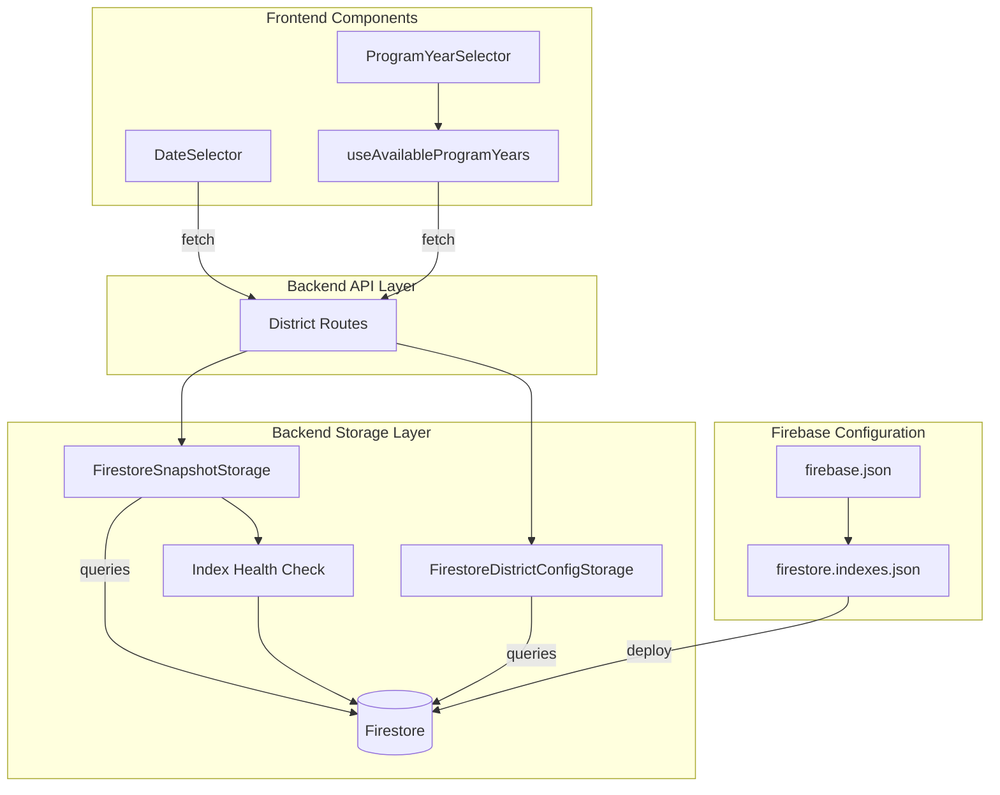

# Design Document: Firestore Index Fix

## Overview

This design addresses production failures caused by missing Firestore composite indexes. The root cause is that Firestore queries using `orderBy` with filters require composite indexes that must be explicitly created. Without these indexes, queries fail with `FAILED_PRECONDITION` errors, cascading to break the date selector, program year selector, and district API endpoints.

The solution involves:
1. Creating a `firestore.indexes.json` configuration file with all required composite indexes
2. Adding graceful degradation in backend storage services to handle index failures
3. Improving frontend error handling in date and program year selectors
4. Adding index health validation to the storage layer
5. Documenting all required indexes for future maintenance

## Architecture



## Components and Interfaces

### 1. Firestore Index Configuration

**File:** `firestore.indexes.json`

```json
{
  "indexes": [
    {
      "collectionGroup": "snapshots",
      "queryScope": "COLLECTION",
      "fields": [
        { "fieldPath": "__name__", "order": "DESCENDING" }
      ]
    },
    {
      "collectionGroup": "snapshots",
      "queryScope": "COLLECTION",
      "fields": [
        { "fieldPath": "metadata.status", "order": "ASCENDING" },
        { "fieldPath": "__name__", "order": "DESCENDING" }
      ]
    },
    {
      "collectionGroup": "history",
      "queryScope": "COLLECTION",
      "fields": [
        { "fieldPath": "timestamp", "order": "DESCENDING" }
      ]
    }
  ],
  "fieldOverrides": []
}
```

### 2. Firebase Configuration Update

**File:** `firebase.json`

Add Firestore configuration to reference the indexes file:

```json
{
  "hosting": { ... },
  "firestore": {
    "indexes": "firestore.indexes.json"
  }
}
```

### 3. Backend Storage Error Handling

**Interface:** `IndexHealthResult`

```typescript
interface IndexHealthResult {
  healthy: boolean
  missingIndexes: string[]
  indexCreationUrls: string[]
}
```

**Method Signatures:**

```typescript
// FirestoreSnapshotStorage
async isIndexHealthy(): Promise<IndexHealthResult>

// Updated error handling in existing methods
async listSnapshots(limit?: number, filters?: SnapshotFilters): Promise<SnapshotMetadata[]>
async getLatestSuccessful(): Promise<Snapshot | null>
async getLatest(): Promise<Snapshot | null>

// FirestoreDistrictConfigStorage
async getChangeHistory(limit: number): Promise<ConfigurationChange[]>
```

### 4. Frontend Error State Interface

**Interface:** `DateSelectorErrorState`

```typescript
interface DateSelectorErrorState {
  hasError: boolean
  errorMessage: string
  canRetry: boolean
}
```

**Interface:** `ProgramYearSelectorState`

```typescript
interface ProgramYearSelectorState {
  data: AvailableRankingYearsResponse | undefined
  isLoading: boolean
  isError: boolean
  error: Error | null
  isEmpty: boolean
  refetch: () => void
}
```

## Data Models

### Index Configuration Schema

The `firestore.indexes.json` follows the Firebase CLI schema:

```typescript
interface FirestoreIndexConfig {
  indexes: FirestoreIndex[]
  fieldOverrides: FieldOverride[]
}

interface FirestoreIndex {
  collectionGroup: string
  queryScope: 'COLLECTION' | 'COLLECTION_GROUP'
  fields: IndexField[]
}

interface IndexField {
  fieldPath: string
  order?: 'ASCENDING' | 'DESCENDING'
  arrayConfig?: 'CONTAINS'
}

interface FieldOverride {
  collectionGroup: string
  fieldPath: string
  indexes: OverrideIndex[]
}
```

### Error Classification

```typescript
type FirestoreErrorCode = 
  | 'FAILED_PRECONDITION'  // Missing index - non-retryable
  | 'UNAVAILABLE'          // Transient - retryable
  | 'DEADLINE_EXCEEDED'    // Timeout - retryable
  | 'INTERNAL'             // Server error - retryable
  | 'ABORTED'              // Transaction conflict - retryable

function isIndexError(error: unknown): boolean {
  if (error instanceof Error) {
    return error.message.includes('FAILED_PRECONDITION') && 
           error.message.includes('index')
  }
  return false
}

function extractIndexUrl(error: Error): string | null {
  const urlMatch = error.message.match(/https:\/\/console\.firebase\.google\.com[^\s]+/)
  return urlMatch ? urlMatch[0] : null
}
```

## Correctness Properties

*A property is a characteristic or behavior that should hold true across all valid executions of a system—essentially, a formal statement about what the system should do. Properties serve as the bridge between human-readable specifications and machine-verifiable correctness guarantees.*

### Property 1: Graceful Degradation on Index Failure

*For any* storage method in `FirestoreSnapshotStorage` or `FirestoreDistrictConfigStorage` that executes a Firestore query requiring a composite index, if the query fails with a `FAILED_PRECONDITION` error containing "index", the method SHALL return a safe default value (empty array for list operations, null for single-item operations) instead of throwing an exception.

**Validates: Requirements 2.1, 2.2, 2.3, 2.4**

### Property 2: Index Error Classification

*For any* error object where the message contains both `FAILED_PRECONDITION` and `index`, the `isIndexError` function SHALL return true, and the error SHALL be classified as non-retryable (retryable: false).

**Validates: Requirements 2.5**

### Property 3: Index URL Extraction

*For any* Firestore error message containing a Firebase console URL (matching pattern `https://console.firebase.google.com[^\s]+`), the `extractIndexUrl` function SHALL extract and return the complete URL string. For messages without a URL, it SHALL return null.

**Validates: Requirements 2.6**

### Property 4: Health Check Failure Detection

*For any* call to `isIndexHealthy` where the underlying Firestore query fails with a `FAILED_PRECONDITION` error, the method SHALL return an `IndexHealthResult` with `healthy: false` and include the index creation URL in `indexCreationUrls` if available in the error message.

**Validates: Requirements 5.3, 5.5**

## Error Handling

### Backend Error Handling Strategy

1. **Index Errors (FAILED_PRECONDITION)**
   - Log error with full message including index creation URL
   - Return safe default (empty array or null)
   - Do not retry (configuration issue, not transient)
   - Include diagnostic information in logs for operators

2. **Transient Errors (UNAVAILABLE, DEADLINE_EXCEEDED)**
   - Allow circuit breaker to handle retries
   - Throw StorageOperationError with `retryable: true`

3. **Error Logging Format**
   ```typescript
   logger.warn('Firestore query failed due to missing index', {
     operation: 'listSnapshots',
     error: errorMessage,
     indexUrl: extractIndexUrl(error),
     recommendation: 'Deploy indexes using: firebase deploy --only firestore:indexes'
   })
   ```

### Frontend Error Handling Strategy

1. **DateSelector**
   - Show error message: "Unable to load available dates. Please try again."
   - Display retry button
   - Log error to console for debugging

2. **ProgramYearSelector**
   - Show error message: "Unable to load program years."
   - Expose error state through hook for parent component handling
   - Provide refetch function for retry

## Testing Strategy

### Unit Tests

Unit tests and property tests are complementary. Unit tests focus on specific examples and edge cases, while property tests verify universal properties across generated inputs.

1. **Index Configuration Validation**
   - Verify `firestore.indexes.json` exists and follows Firebase schema
   - Verify `firebase.json` references the indexes file
   - Verify all required indexes are defined

2. **Index Error Detection**
   - Test `isIndexError` with FAILED_PRECONDITION + index messages (returns true)
   - Test `isIndexError` with other error types (returns false)
   - Test `extractIndexUrl` with valid Firebase console URLs
   - Test `extractIndexUrl` with messages without URLs (returns null)

3. **Graceful Degradation**
   - Mock Firestore to throw FAILED_PRECONDITION errors
   - Verify `listSnapshots` returns empty array on index error
   - Verify `getLatestSuccessful` returns null on index error
   - Verify `getLatest` returns null on index error
   - Verify `getChangeHistory` returns empty array on index error
   - Verify appropriate warning is logged with index URL

4. **Health Check**
   - Test `isIndexHealthy` returns `{ healthy: true }` when query succeeds
   - Test `isIndexHealthy` returns `{ healthy: false, indexCreationUrls: [...] }` when query fails
   - Test `isReady` incorporates index health validation

5. **Frontend Error States**
   - Test DateSelector renders error state on API failure
   - Test DateSelector renders empty state when no dates available
   - Test DateSelector retry button triggers refetch
   - Test ProgramYearSelector hook returns error state with error details
   - Test ProgramYearSelector hook exposes refetch function
   - Test retry count is bounded (not infinite)

### Property-Based Tests

Per the property-testing-guidance steering document, property-based testing is reserved for cases where it genuinely adds value. For this feature:

**Property 1: Graceful Degradation** - Could benefit from PBT to test various error message formats, but the input space is bounded. Well-chosen unit test examples are sufficient.

**Property 2: Index Error Classification** - The error classification logic has a simple boolean output based on string matching. Unit tests with 3-5 examples provide equivalent confidence.

**Property 3: Index URL Extraction** - URL extraction uses regex matching. Unit tests covering valid URLs, malformed URLs, and missing URLs are sufficient.

**Property 4: Health Check Failure Detection** - Tests a specific method behavior. Unit tests are more appropriate.

**Conclusion:** This feature does not require property-based tests. The input spaces are bounded, and well-chosen unit test examples provide equivalent confidence with better readability.

### Integration Tests

1. **Index Health Check with Emulator**
   - Test `isIndexHealthy` against Firebase Emulator (if indexes can be tested)
   - Verify end-to-end query execution with deployed indexes

### Test Configuration

- Use Vitest for all tests
- Mock Firestore client for unit tests
- Use Firebase Emulator for integration tests where applicable
- Minimum test coverage: 80% for new code
- Tag tests with feature reference: `Feature: firestore-index-fix`
