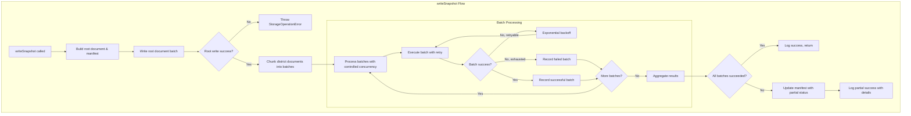
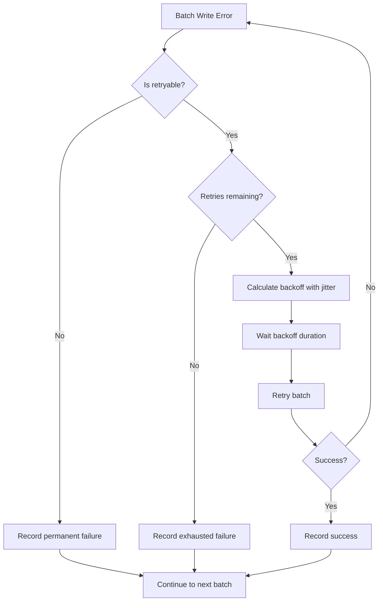

# Design Document: Firestore Write Timeout Fix

## Overview

This design addresses Firestore `DEADLINE_EXCEEDED` errors during snapshot writes by implementing chunked batch writes with retry logic, controlled concurrency, and graceful partial failure handling. The solution transforms the current single-batch write approach into a multi-batch strategy that respects Firestore's operational limits while maintaining data consistency.

The key insight is that Firestore's 500-operation batch limit is not the bottleneck—the RPC deadline (~60 seconds) is. By splitting writes into smaller batches (50 operations each) and processing them with controlled parallelism, we can complete large snapshot writes reliably.

## Architecture



## Components and Interfaces

### BatchWriteConfig Interface

```typescript
/**
 * Configuration for chunked batch write operations
 */
interface BatchWriteConfig {
  /** Maximum operations per batch (default: 50) */
  maxOperationsPerBatch: number
  
  /** Maximum concurrent batch operations (default: 3) */
  maxConcurrentBatches: number
  
  /** Timeout per batch operation in ms (default: 30000) */
  batchTimeoutMs: number
  
  /** Total operation timeout in ms (default: 300000) */
  totalTimeoutMs: number
  
  /** Maximum retry attempts per batch (default: 3) */
  maxRetries: number
  
  /** Initial backoff delay in ms (default: 1000) */
  initialBackoffMs: number
  
  /** Maximum backoff delay in ms (default: 30000) */
  maxBackoffMs: number
  
  /** Jitter factor for backoff (default: 0.2 = ±20%) */
  jitterFactor: number
}
```

### BatchWriteResult Interface

```typescript
/**
 * Result of a batch write operation
 */
interface BatchWriteResult {
  /** Batch index (0-based) */
  batchIndex: number
  
  /** Number of operations in this batch */
  operationCount: number
  
  /** Whether the batch succeeded */
  success: boolean
  
  /** Number of retry attempts made */
  retryAttempts: number
  
  /** Duration in milliseconds */
  durationMs: number
  
  /** Error message if failed */
  error?: string
  
  /** District IDs in this batch (for district batches) */
  districtIds?: string[]
}
```

### SnapshotWriteResult Interface

```typescript
/**
 * Aggregate result of a snapshot write operation
 */
interface SnapshotWriteResult {
  /** Snapshot ID that was written */
  snapshotId: string
  
  /** Whether all operations succeeded */
  complete: boolean
  
  /** Total batches processed */
  totalBatches: number
  
  /** Successful batch count */
  successfulBatches: number
  
  /** Failed batch count */
  failedBatches: number
  
  /** Total districts written */
  districtsWritten: number
  
  /** Districts that failed to write */
  failedDistricts: string[]
  
  /** Total duration in milliseconds */
  totalDurationMs: number
  
  /** Individual batch results */
  batchResults: BatchWriteResult[]
}
```

### Updated FirestoreSnapshotStorageConfig

```typescript
/**
 * Extended configuration for FirestoreSnapshotStorage
 */
export interface FirestoreSnapshotStorageConfig {
  projectId: string
  collectionName?: string
  
  /** Batch write configuration (optional, uses defaults if not provided) */
  batchWriteConfig?: Partial<BatchWriteConfig>
}
```

### New Private Methods

```typescript
class FirestoreSnapshotStorage {
  // Existing methods...
  
  /**
   * Execute a batch write with retry logic
   */
  private async executeBatchWithRetry(
    batch: WriteBatch,
    batchIndex: number,
    districtIds?: string[]
  ): Promise<BatchWriteResult>
  
  /**
   * Calculate backoff delay with jitter
   */
  private calculateBackoffDelay(attempt: number): number
  
  /**
   * Chunk district documents into batches
   */
  private chunkDistrictDocuments(
    districts: DistrictStatistics[],
    snapshotId: string
  ): Array<{ batch: WriteBatch; districtIds: string[] }>
  
  /**
   * Process batches with controlled concurrency
   */
  private async processBatchesWithConcurrency(
    batches: Array<{ batch: WriteBatch; districtIds: string[] }>,
    startIndex: number
  ): Promise<BatchWriteResult[]>
  
  /**
   * Check if an error is retryable
   */
  private isRetryableWriteError(error: unknown): boolean
}
```

## Data Models

### Firestore Document Structure (Unchanged)

The existing document structure is preserved for backward compatibility:

```
Collection: snapshots
├── Document: YYYY-MM-DD (snapshotId)
│   ├── metadata: PerDistrictSnapshotMetadata
│   ├── manifest: SnapshotManifest
│   └── rankings?: AllDistrictsRankingsData
│   └── Subcollection: districts
│       ├── Document: district_{id}
│       │   ├── districtId: string
│       │   ├── districtName: string
│       │   ├── collectedAt: string
│       │   ├── status: 'success' | 'failed'
│       │   └── data: DistrictStatistics
```

### Extended PerDistrictSnapshotMetadata

```typescript
interface PerDistrictSnapshotMetadata {
  // Existing fields...
  
  /** Districts that failed to write (new field) */
  writeFailedDistricts?: string[]
  
  /** Whether the write completed fully (new field) */
  writeComplete?: boolean
}
```


## Correctness Properties

*A property is a characteristic or behavior that should hold true across all valid executions of a system—essentially, a formal statement about what the system should do. Properties serve as the bridge between human-readable specifications and machine-verifiable correctness guarantees.*

### Property 1: Batch Size Invariant

*For any* snapshot write operation and *for any* batch created during that operation, the batch SHALL contain at most `maxOperationsPerBatch` (default 50) write operations.

**Validates: Requirements 1.2**

### Property 2: Batch Splitting Threshold

*For any* snapshot with more than `maxOperationsPerBatch` district documents, the write operation SHALL create multiple batches such that `ceil((districtCount + 1) / maxOperationsPerBatch)` batches are created (the +1 accounts for the root document).

**Validates: Requirements 1.1**

### Property 3: Root Document Ordering

*For any* snapshot write operation, the root document SHALL be included in batch index 0, and batch 0 SHALL complete successfully before any batch with index > 0 begins processing.

**Validates: Requirements 1.3, 3.2**

### Property 4: Backoff Calculation with Jitter

*For any* retry attempt number `n` (0-indexed), the calculated backoff delay SHALL be `min(initialBackoffMs * 2^n, maxBackoffMs) * (1 ± jitterFactor)`, where the jitter is uniformly distributed within the specified range.

**Validates: Requirements 2.2, 2.4**

### Property 5: Retryable Error Handling

*For any* batch write that fails with a retryable error (DEADLINE_EXCEEDED, UNAVAILABLE, INTERNAL, or ABORTED), the operation SHALL be retried up to `maxRetries` times before being marked as failed.

**Validates: Requirements 2.1**

### Property 6: Partial Failure Resilience

*For any* snapshot write where batch `i` fails after exhausting retries, batches `j` where `j > i` SHALL still be attempted, and the final result SHALL reflect all batch outcomes.

**Validates: Requirements 3.4**

### Property 7: Partial Failure Metadata Consistency

*For any* snapshot write that completes with partial success, the following invariants SHALL hold:
- `successfulBatches + failedBatches == totalBatches`
- `districtsWritten == sum of districtIds in successful batches`
- `failedDistricts == union of districtIds in failed batches`
- Snapshot status is 'partial' if and only if `failedBatches > 0`

**Validates: Requirements 3.3, 5.1, 5.2, 5.3**

### Property 8: Root Failure Fast-Fail

*For any* snapshot write where the root document batch (batch 0) fails after exhausting retries, no district batches SHALL be attempted, and the operation SHALL throw a StorageOperationError.

**Validates: Requirements 5.4**

### Property 9: Document Structure Equivalence

*For any* valid Snapshot object, when all batches succeed, reading the snapshot back via `getSnapshot()` SHALL return a Snapshot object equivalent to the input (same districts, metadata, and rankings).

**Validates: Requirements 6.2, 6.3**

## Error Handling

### Error Categories

| Error Type | Retryable | Action |
|------------|-----------|--------|
| DEADLINE_EXCEEDED | Yes | Retry with exponential backoff |
| UNAVAILABLE | Yes | Retry with exponential backoff |
| INTERNAL | Yes | Retry with exponential backoff |
| ABORTED | Yes | Retry with exponential backoff |
| PERMISSION_DENIED | No | Fail immediately |
| NOT_FOUND | No | Fail immediately |
| INVALID_ARGUMENT | No | Fail immediately |
| RESOURCE_EXHAUSTED | Yes | Retry with longer backoff |

### Error Flow



### StorageOperationError Enhancement

The existing `StorageOperationError` will include additional context for batch failures:

```typescript
throw new StorageOperationError(
  `Failed to write snapshot ${snapshotId}: Batch ${batchIndex} failed after ${retryAttempts} retries`,
  'writeSnapshot',
  'firestore',
  false, // not retryable at this level
  originalError,
  {
    batchIndex,
    retryAttempts,
    districtIds: failedDistrictIds,
    lastError: originalError.message
  }
)
```

## Testing Strategy

### Testing Approach

Per the property-testing-guidance steering document, this feature primarily uses **unit tests with well-chosen examples**. Property-based testing is reserved for cases where it genuinely adds value.

**PBT Decision Framework Applied:**

| Property | PBT Warranted? | Rationale |
|----------|----------------|-----------|
| Batch size/count | No | 5 examples (1, 49, 50, 51, 100 districts) provide equivalent confidence |
| Root ordering | No | Simple scenario, easily covered with examples |
| Backoff with jitter | **Yes** | Mathematical formula with randomness; PBT verifies jitter bounds across many attempts |
| Retryable errors | No | Finite set of error types; enumerate all cases |
| Partial failure | No | Test specific failure patterns with examples |
| Metadata consistency | No | Sum invariants can be verified with targeted examples |
| Root fast-fail | No | Single scenario, one test case sufficient |
| Document equivalence | **Yes** | Round-trip property with complex input space (varying district counts, metadata combinations) |

### Unit Tests (Primary Coverage)

1. **Batch Chunking Tests**
   - 1 district → 1 batch (root + 1 district)
   - 49 districts → 1 batch (root + 49 = 50 ops)
   - 50 districts → 2 batches (root + 49, then 1)
   - 51 districts → 2 batches
   - 100 districts → 3 batches
   - 132 districts (production case) → 3 batches

2. **Root Document Ordering Tests**
   - Verify root document in batch 0
   - Verify batch 0 completes before batch 1 starts

3. **Backoff Calculation Tests** (specific examples)
   - Attempt 0 → 1000ms base
   - Attempt 1 → 2000ms base
   - Attempt 2 → 4000ms base
   - Attempt 5 → capped at 30000ms
   - Verify jitter stays within ±20% bounds

4. **Error Classification Tests**
   - DEADLINE_EXCEEDED → retryable
   - UNAVAILABLE → retryable
   - INTERNAL → retryable
   - ABORTED → retryable
   - PERMISSION_DENIED → not retryable
   - NOT_FOUND → not retryable
   - Unknown error → not retryable

5. **Retry Behavior Tests**
   - First failure → retry
   - Second failure → retry
   - Third failure → give up, throw error
   - Non-retryable error → fail immediately

6. **Partial Failure Tests**
   - Batch 1 fails, batch 2 succeeds → partial success
   - All batches succeed → complete success
   - Root batch fails → immediate failure, no district writes

7. **Configuration Tests**
   - Default values applied when not specified
   - Custom values override defaults
   - Invalid values rejected

### Property-Based Tests (Targeted Use)

Only two properties warrant PBT per the steering guidance:

1. **Backoff Jitter Property** (Property 4)
   - **Rationale**: Mathematical formula with randomness; need to verify jitter bounds hold across many random seeds
   - Generate attempt numbers 0-10
   - Verify: `baseDelay * 0.8 <= actualDelay <= baseDelay * 1.2`
   - 100 iterations minimum

2. **Write/Read Equivalence Property** (Property 9)
   - **Rationale**: Round-trip property with complex input space; classic PBT use case
   - Generate valid Snapshot objects with 1-200 districts
   - Write via chunked implementation, read back via getSnapshot()
   - Verify equivalence of districts, metadata, rankings
   - 100 iterations minimum
   - **Note**: Requires Firestore emulator

### Test File Structure

```
backend/src/services/storage/__tests__/
├── FirestoreSnapshotStorage.chunked-write.test.ts           # Unit tests (primary)
├── FirestoreSnapshotStorage.chunked-write.property.test.ts  # PBT (backoff jitter, equivalence only)
```

### Mocking Strategy

- **Unit tests**: Mock `WriteBatch.commit()` to simulate success/failure scenarios
- **Property tests**: Use Firestore emulator for equivalence testing
- **Backoff tests**: Inject mock random function for deterministic jitter testing
