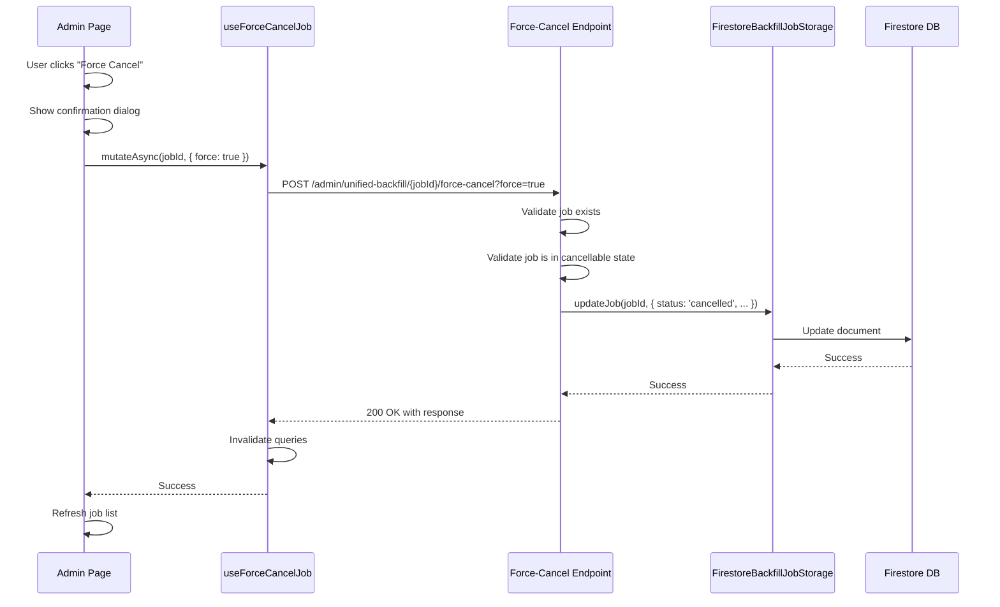

# Design Document: Force-Cancel Stuck Jobs

## Overview

This feature adds an administrative capability to force-cancel backfill jobs that are stuck in "running" or "recovering" states. The implementation spans three layers:

1. **Backend API**: A new POST endpoint at `/api/admin/unified-backfill/{jobId}/force-cancel` that updates job state in Firestore
2. **Frontend Hook**: A `useForceCancelJob` mutation hook in the existing `useUnifiedBackfill.ts` module
3. **UI Integration**: Adding the `JobHistoryList` component to the Admin page with force-cancel buttons for stuck jobs

The design leverages existing patterns from the unified backfill service, including the storage abstraction layer, admin route patterns, and React Query mutation patterns.

## Architecture



## Components and Interfaces

### Backend Components

#### Force-Cancel Route Handler

Location: `backend/src/routes/admin/unified-backfill.ts`

```typescript
/**
 * POST /api/admin/unified-backfill/:jobId/force-cancel
 * Force-cancel a stuck backfill job
 *
 * Query Parameters:
 * - force: boolean (required) - Must be true to confirm the action
 *
 * Path Parameters:
 * - jobId: string - The unique job identifier
 *
 * Requirements: 1.1, 1.2, 1.3, 1.4, 1.5, 2.1, 2.2, 2.3, 2.4, 4.1, 4.2, 4.3
 */
interface ForceCancelRequest {
  force?: boolean
}

interface ForceCancelResponse {
  jobId: string
  previousStatus: BackfillJobStatus
  newStatus: 'cancelled'
  message: string
  metadata: {
    operationId: string
    cancelledAt: string
    forceCancelled: true
  }
}
```

#### UnifiedBackfillService Extension

Location: `backend/src/services/backfill/unified/UnifiedBackfillService.ts`

```typescript
/**
 * Force-cancel a job regardless of its current execution state
 *
 * Unlike regular cancelJob(), this method:
 * - Does not check if the job is actively running
 * - Clears the checkpoint to prevent recovery
 * - Sets a specific error message indicating force-cancellation
 *
 * @param jobId - The job identifier
 * @param operatorContext - Context about who initiated the force-cancel
 * @returns true if cancelled, false if job not found or already terminal
 */
async forceCancelJob(
  jobId: string,
  operatorContext: { ip?: string; reason?: string }
): Promise<boolean>
```

### Frontend Components

#### useForceCancelJob Hook

Location: `frontend/src/hooks/useUnifiedBackfill.ts`

```typescript
/**
 * Hook to force-cancel a stuck backfill job
 *
 * @example
 * const forceCancelJob = useForceCancelJob()
 * await forceCancelJob.mutateAsync({ jobId: 'job_123', force: true })
 */
export function useForceCancelJob(): UseMutationResult<
  ForceCancelResponse,
  Error,
  { jobId: string; force: boolean }
>
```

#### JobHistoryList Enhancement

Location: `frontend/src/components/JobHistoryList.tsx`

The component will be enhanced to:
1. Accept an `onForceCancelJob` callback prop
2. Display a "Force Cancel" button for jobs with status "running" or "recovering"
3. Show a confirmation dialog before executing the force-cancel

```typescript
export interface JobHistoryListProps {
  pageSize?: number
  autoRefresh?: boolean
  refreshInterval?: number
  onJobSelect?: (jobId: string) => void
  onForceCancelJob?: (jobId: string) => Promise<void>
  className?: string
}
```

#### Admin Page Integration

Location: `frontend/src/pages/AdminPage.tsx`

The BackfillSection will be enhanced to:
1. Import and render the `JobHistoryList` component
2. Wire up the `useForceCancelJob` hook
3. Handle force-cancel confirmation and error display

## Data Models

### Job State After Force-Cancel

When a job is force-cancelled, the following fields are updated:

```typescript
{
  status: 'cancelled',
  completedAt: string,  // ISO timestamp of force-cancellation
  error: string,        // "Force-cancelled by operator at {timestamp}. Reason: {reason}"
  checkpoint: null      // Cleared to prevent recovery
}
```

### API Response Schema

```typescript
interface ForceCancelResponse {
  jobId: string
  previousStatus: BackfillJobStatus
  newStatus: 'cancelled'
  message: string
  metadata: {
    operationId: string
    cancelledAt: string
    forceCancelled: true
  }
}

interface ForceCancelErrorResponse {
  error: {
    code: string
    message: string
    details?: string
    retryable?: boolean
  }
  metadata: {
    operationId: string
    timestamp: string
  }
}
```

### Error Codes

| Code | HTTP Status | Description |
|------|-------------|-------------|
| `FORCE_REQUIRED` | 400 | The `force` parameter was not set to true |
| `JOB_NOT_FOUND` | 404 | No job exists with the specified ID |
| `INVALID_JOB_STATE` | 400 | Job is already in a terminal state |
| `STORAGE_ERROR` | 500 | Failed to update job in storage |


## Correctness Properties

*A property is a characteristic or behavior that should hold true across all valid executions of a system—essentially, a formal statement about what the system should do. Properties serve as the bridge between human-readable specifications and machine-verifiable correctness guarantees.*

### Analysis: Property-Based Testing Applicability

Per the property-testing-guidance steering document, property-based testing is NOT warranted for this feature because:

1. **Simple CRUD operation**: Force-cancel is essentially updating job state - a straightforward data update
2. **Bounded input space**: Job statuses are a small, enumerable set (6 values)
3. **Examples provide equivalent confidence**: 3-5 well-chosen test cases fully cover the behavior
4. **No mathematical invariants**: No algebraic properties or complex transformations

**Decision**: Use unit tests with well-chosen examples instead of property-based tests.

### Testable Behaviors (Unit Test Coverage)

The following behaviors will be verified with unit tests:

1. **Force-cancel updates job state correctly** (Requirements 1.1, 1.3, 2.1, 2.2, 2.3, 2.4)
   - Test with job in "running" state → verify status becomes "cancelled"
   - Test with job in "recovering" state → verify status becomes "cancelled"
   - Test with job in "pending" state → verify status becomes "cancelled"
   - Verify `completedAt` is set to a valid timestamp
   - Verify `error` contains "Force-cancelled" text
   - Verify `checkpoint` is set to null

2. **Force-cancel rejects terminal state jobs** (Requirements 1.5)
   - Test with job in "completed" state → verify 400 error
   - Test with job in "failed" state → verify 400 error
   - Test with job in "cancelled" state → verify 400 error
   - Verify job state remains unchanged after rejection

3. **Force-cancel requires confirmation** (Requirements 1.2, 1.3)
   - Test without `force` parameter → verify 400 error with FORCE_REQUIRED code
   - Test with `force=false` → verify 400 error
   - Test with `force=true` → verify cancellation proceeds

4. **Force-cancel handles missing jobs** (Requirements 1.4)
   - Test with non-existent job ID → verify 404 error

## Error Handling

### Backend Error Handling

| Error Condition | HTTP Status | Error Code | User Message |
|-----------------|-------------|------------|--------------|
| Missing `force` parameter | 400 | `FORCE_REQUIRED` | "Force-cancel requires explicit confirmation. Set force=true to proceed." |
| Job not found | 404 | `JOB_NOT_FOUND` | "Backfill job with ID '{jobId}' not found" |
| Job in terminal state | 400 | `INVALID_JOB_STATE` | "Cannot force-cancel job with status '{status}'. Job is already in a terminal state." |
| Storage write failure | 500 | `STORAGE_ERROR` | "Failed to update job status. Please try again." |

### Frontend Error Handling

The `useForceCancelJob` hook will:
1. Catch API errors and expose them via the mutation's `error` state
2. Display user-friendly error messages in the UI
3. Not invalidate queries on failure (job state unchanged)

The JobHistoryList component will:
1. Display error messages in a red alert box below the job item
2. Keep the "Force Cancel" button enabled for retry
3. Log errors to console for debugging

## Testing Strategy

### Unit Tests

Unit tests will cover the core functionality with well-chosen examples:

**Backend Route Handler Tests** (`unified-backfill.test.ts`):
- Force-cancel with valid running job and `force=true` → success
- Force-cancel with valid recovering job and `force=true` → success
- Force-cancel with valid pending job and `force=true` → success
- Force-cancel without `force` parameter → 400 FORCE_REQUIRED
- Force-cancel with `force=false` → 400 FORCE_REQUIRED
- Force-cancel with non-existent job → 404 JOB_NOT_FOUND
- Force-cancel with completed job → 400 INVALID_JOB_STATE
- Force-cancel with failed job → 400 INVALID_JOB_STATE
- Force-cancel with already cancelled job → 400 INVALID_JOB_STATE

**Service Method Tests** (`UnifiedBackfillService.test.ts`):
- `forceCancelJob` updates status to "cancelled"
- `forceCancelJob` sets completedAt timestamp
- `forceCancelJob` sets error message with force-cancel context
- `forceCancelJob` clears checkpoint to null
- `forceCancelJob` returns false for non-existent job
- `forceCancelJob` returns false for terminal state job

### Integration Tests

Integration tests will verify end-to-end behavior:
- Force-cancel a running job and verify new jobs can be created
- Force-cancel via API and verify Firestore document is updated correctly

### Component Tests

React component tests will cover UI behavior:
- Force Cancel button appears for running/recovering jobs
- Force Cancel button hidden for terminal state jobs
- Confirmation dialog appears on button click
- Error message displays on API failure
- Job list refreshes on successful force-cancel

## OpenAPI Specification

The following endpoint will be added to `backend/openapi.yaml`:

```yaml
/admin/unified-backfill/{jobId}/force-cancel:
  post:
    summary: Force-cancel a stuck backfill job
    description: |
      Force-cancels a backfill job that is stuck in 'running' or 'recovering' state.
      This is a destructive operation that marks the job as cancelled and clears
      its checkpoint to prevent automatic recovery.
      
      Requires explicit confirmation via the 'force' parameter.
    operationId: forceCancelBackfillJob
    tags:
      - Admin
    x-google-backend:
      address: https://toast-stats-api-736334703361.us-east1.run.app
      path_translation: APPEND_PATH_TO_ADDRESS
    produces:
      - application/json
    parameters:
      - name: jobId
        in: path
        type: string
        required: true
        description: Unique identifier for the backfill job
      - name: force
        in: query
        type: boolean
        required: false
        description: Must be true to confirm the force-cancel operation
    responses:
      '200':
        description: Job successfully force-cancelled
      '400':
        description: Bad request - force parameter missing or job in terminal state
      '404':
        description: Backfill job not found
      '500':
        description: Internal server error
      '503':
        description: Service unavailable
```
