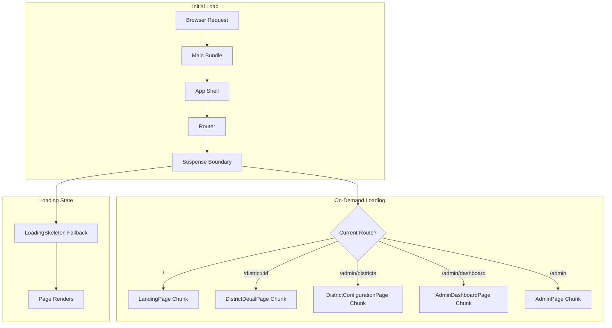

# Design Document: Frontend Code Splitting

## Overview

This design implements route-based code splitting for the frontend application to comply with performance SLO requirements. The implementation converts static page component imports to dynamic imports using React.lazy() and wraps route components with Suspense boundaries that display loading feedback.

The approach leverages Vite's built-in code splitting capabilities, which automatically creates separate chunks for dynamically imported modules. This reduces the initial bundle size by deferring the loading of page-specific code until the user navigates to that route.

## Architecture



### Bundle Structure

```
dist/
├── assets/
│   ├── index-[hash].js          # Main bundle (React, Router, App shell)
│   ├── vendor-[hash].js         # Third-party dependencies
│   ├── LandingPage-[hash].js    # Lazy chunk
│   ├── DistrictDetailPage-[hash].js
│   ├── DistrictConfigurationPage-[hash].js
│   ├── AdminDashboardPage-[hash].js
│   └── AdminPage-[hash].js
```

## Components and Interfaces

### Modified App.tsx Structure

```typescript
import { lazy, Suspense } from 'react'
import { createBrowserRouter, RouterProvider, Outlet } from 'react-router-dom'
import { QueryClientProvider } from '@tanstack/react-query'
import { queryClient } from './config/queryClient'
import {
  BackfillProvider,
  useBackfillContext,
} from './contexts/BackfillContext'
import { ProgramYearProvider } from './contexts/ProgramYearContext'
import { BackfillProgressBar } from './components/BackfillProgressBar'
import { LoadingSkeleton } from './components/LoadingSkeleton'

// Lazy-loaded page components
const LandingPage = lazy(() => import('./pages/LandingPage'))
const DistrictDetailPage = lazy(() => import('./pages/DistrictDetailPage'))
const DistrictConfigurationPage = lazy(
  () => import('./pages/DistrictConfigurationPage')
)
const AdminDashboardPage = lazy(() => import('./pages/AdminDashboardPage'))
const AdminPage = lazy(() => import('./pages/AdminPage'))
```

### PageLoadingFallback Component

A dedicated fallback component for page-level Suspense boundaries:

```typescript
interface PageLoadingFallbackProps {
  variant?: 'default' | 'admin'
}

function PageLoadingFallback({ variant = 'default' }: PageLoadingFallbackProps): React.JSX.Element {
  return (
    <div className="min-h-screen bg-gray-50 p-4 sm:p-6 lg:p-8">
      <div className="max-w-7xl mx-auto space-y-6">
        <LoadingSkeleton variant="card" />
        <LoadingSkeleton variant="chart" />
        <LoadingSkeleton variant="table" count={5} />
      </div>
    </div>
  )
}
```

### Router Configuration with Suspense

```typescript
const router = createBrowserRouter([
  {
    path: '/',
    element: <Layout />,
    children: [
      {
        index: true,
        element: (
          <Suspense fallback={<PageLoadingFallback />}>
            <LandingPage />
          </Suspense>
        ),
      },
      {
        path: 'district/:districtId',
        element: (
          <Suspense fallback={<PageLoadingFallback />}>
            <DistrictDetailPage />
          </Suspense>
        ),
      },
      // ... other routes
    ],
  },
])
```

### Error Boundary for Chunk Loading Failures

```typescript
interface ChunkErrorBoundaryState {
  hasError: boolean
  error: Error | null
}

class ChunkErrorBoundary extends React.Component<
  { children: React.ReactNode; fallback?: React.ReactNode },
  ChunkErrorBoundaryState
> {
  state: ChunkErrorBoundaryState = { hasError: false, error: null }

  static getDerivedStateFromError(error: Error): ChunkErrorBoundaryState {
    return { hasError: true, error }
  }

  handleRetry = (): void => {
    this.setState({ hasError: false, error: null })
    window.location.reload()
  }

  render(): React.ReactNode {
    if (this.state.hasError) {
      return this.props.fallback ?? (
        <ChunkLoadError onRetry={this.handleRetry} error={this.state.error} />
      )
    }
    return this.props.children
  }
}
```

## Data Models

### Lazy Component Type

React.lazy() returns a component with the following characteristics:

```typescript
// React.lazy signature
type LazyExoticComponent<T extends ComponentType<unknown>> = ExoticComponent<
  ComponentPropsWithRef<T>
> & {
  readonly _result: T
}

// Usage pattern
const LazyPage: LazyExoticComponent<ComponentType<PageProps>> = lazy(
  () => import('./pages/Page')
)
```

### Chunk Loading States

```typescript
type ChunkLoadingState =
  | { status: 'idle' }
  | { status: 'loading' }
  | { status: 'success'; component: React.ComponentType }
  | { status: 'error'; error: Error }
```

## Correctness Properties

_A property is a characteristic or behavior that should hold true across all valid executions of a system—essentially, a formal statement about what the system should do. Properties serve as the bridge between human-readable specifications and machine-verifiable correctness guarantees._

### Property 1: Fallback Display During Loading

_For any_ lazy component that is in a loading state, the Suspense boundary SHALL display the LoadingSkeleton fallback component until the lazy component resolves successfully.

**Validates: Requirements 2.2**

### Property 2: On-Demand Chunk Loading

_For any_ navigation from one route to another, the Router SHALL trigger loading of only the target route's chunk, and the chunk SHALL be loaded on-demand rather than eagerly.

**Validates: Requirements 3.6, 4.3**

### Property 3: Error Boundary Containment

_For any_ chunk loading failure (network error, missing chunk, or import error), the error boundary SHALL catch the error, display an error message, and the rest of the application SHALL remain functional without crashing.

**Validates: Requirements 5.1, 5.3**

## Error Handling

### Chunk Loading Failures

Network failures or missing chunks are handled by:

1. **Error Boundary**: Catches the error thrown by React.lazy()
2. **User Feedback**: Displays an error message with retry option
3. **Recovery**: Reload button triggers a fresh attempt to load the chunk

```typescript
function ChunkLoadError({
  onRetry,
  error
}: {
  onRetry: () => void
  error: Error | null
}): React.JSX.Element {
  return (
    <div className="min-h-screen bg-gray-50 flex items-center justify-center p-4">
      <div className="bg-white rounded-lg shadow-md p-6 max-w-md text-center">
        <h2 className="text-xl font-semibold text-gray-900 mb-2">
          Failed to Load Page
        </h2>
        <p className="text-gray-600 mb-4">
          There was a problem loading this page. Please check your connection and try again.
        </p>
        <button
          onClick={onRetry}
          className="px-4 py-2 bg-tm-loyal-blue text-white rounded-lg hover:bg-tm-loyal-blue-80"
        >
          Retry
        </button>
      </div>
    </div>
  )
}
```

### Suspense Timeout Considerations

For slow networks, the fallback may display for extended periods. The LoadingSkeleton component provides appropriate visual feedback with:

- Animated pulse effect
- Accessible ARIA labels
- Screen reader announcements

## Testing Strategy

### Unit Tests

Unit tests verify individual component behavior:

- PageLoadingFallback renders correct skeleton structure
- ChunkErrorBoundary catches errors and displays fallback
- ChunkLoadError displays retry button and calls handler

### Integration Tests

Integration tests verify the lazy loading behavior:

- Routes render correct lazy components
- Suspense fallback displays during loading
- Navigation between routes triggers chunk loading
- Error boundary catches chunk loading failures

### Property-Based Tests

Property tests use fast-check to verify:

- **Property 1**: Fallback display during loading - verify Suspense shows fallback for any lazy component
- **Property 2**: On-demand chunk loading - verify navigation triggers correct chunk loading
- **Property 3**: Error boundary containment - verify errors are caught without crashing app

### Test Configuration

- Property-based tests: Minimum 100 iterations using fast-check
- Tag format: **Feature: frontend-code-splitting, Property N: [property text]**
- Test framework: Vitest with React Testing Library
