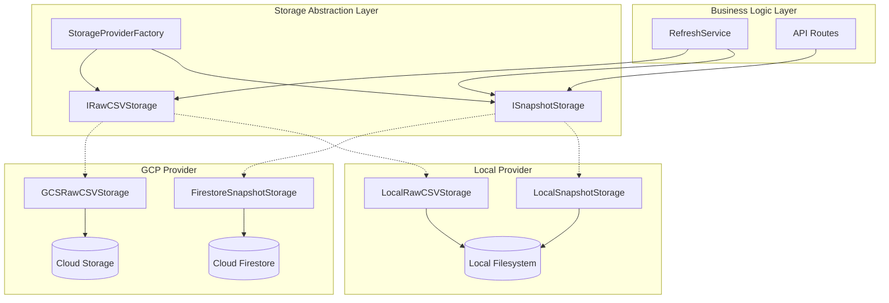
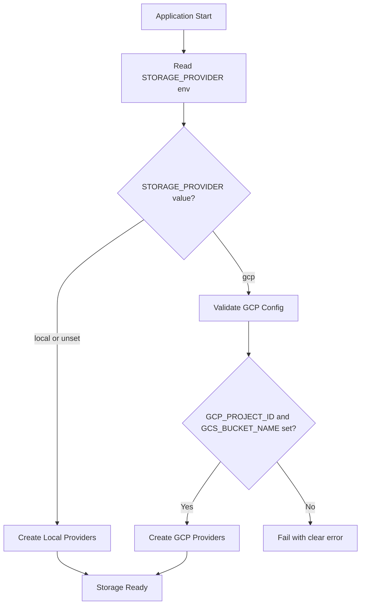

# Design Document: GCP Storage Migration

## Overview

This design describes the migration of Toast-Stats backend storage from local filesystem to Google Cloud Platform services. The architecture introduces a storage abstraction layer that enables swappable implementations for:

1. **Cloud Firestore** - Document database for structured snapshot data
2. **Cloud Storage (GCS)** - Object storage for raw CSV files
3. **Local Filesystem** - Development-friendly storage requiring no GCP credentials

The design prioritizes:

- Clean separation between storage contracts and implementations
- Zero changes to existing business logic and data types
- Environment-based provider selection
- Testability through dependency injection
- Operational simplicity for single-user deployment

## Architecture



### Provider Selection Flow



## Components and Interfaces

### 1. Storage Provider Interfaces

The abstraction layer defines two core interfaces that mirror the existing service contracts.

```typescript
/**
 * Snapshot storage interface - abstracts snapshot persistence
 * Mirrors the existing SnapshotStore interface for compatibility
 */
interface ISnapshotStorage {
  // Core operations
  getLatestSuccessful(): Promise<Snapshot | null>
  getLatest(): Promise<Snapshot | null>
  writeSnapshot(
    snapshot: Snapshot,
    allDistrictsRankings?: AllDistrictsRankingsData,
    options?: WriteSnapshotOptions
  ): Promise<void>
  listSnapshots(limit?: number, filters?: SnapshotFilters): Promise<SnapshotMetadata[]>
  getSnapshot(snapshotId: string): Promise<Snapshot | null>
  isReady(): Promise<boolean>
  
  // Per-district operations
  writeDistrictData(snapshotId: string, districtId: string, data: DistrictStatistics): Promise<void>
  readDistrictData(snapshotId: string, districtId: string): Promise<DistrictStatistics | null>
  listDistrictsInSnapshot(snapshotId: string): Promise<string[]>
  getSnapshotManifest(snapshotId: string): Promise<SnapshotManifest | null>
  getSnapshotMetadata(snapshotId: string): Promise<PerDistrictSnapshotMetadata | null>
  
  // Rankings operations
  writeAllDistrictsRankings(snapshotId: string, rankingsData: AllDistrictsRankingsData): Promise<void>
  readAllDistrictsRankings(snapshotId: string): Promise<AllDistrictsRankingsData | null>
  hasAllDistrictsRankings(snapshotId: string): Promise<boolean>
}

/**
 * Raw CSV storage interface - abstracts CSV file caching
 * Mirrors the existing IRawCSVCacheService interface for compatibility
 */
interface IRawCSVStorage {
  // Core cache operations
  getCachedCSV(date: string, type: CSVType, districtId?: string): Promise<string | null>
  setCachedCSV(date: string, type: CSVType, csvContent: string, districtId?: string): Promise<void>
  setCachedCSVWithMetadata(
    date: string,
    type: CSVType,
    csvContent: string,
    districtId?: string,
    additionalMetadata?: ClosingPeriodMetadata
  ): Promise<void>
  hasCachedCSV(date: string, type: CSVType, districtId?: string): Promise<boolean>
  
  // Metadata management
  getCacheMetadata(date: string): Promise<RawCSVCacheMetadata | null>
  updateCacheMetadata(date: string, metadata: Partial<RawCSVCacheMetadata>): Promise<void>
  
  // Cache management
  clearCacheForDate(date: string): Promise<void>
  getCachedDates(): Promise<string[]>
  
  // Health and statistics
  getCacheStorageInfo(): Promise<CacheStorageInfo>
  getCacheStatistics(): Promise<RawCSVCacheStatistics>
  getHealthStatus(): Promise<CacheHealthStatus>
}
```

### 2. Storage Provider Factory

```typescript
/**
 * Configuration for storage providers
 */
interface StorageConfig {
  provider: 'local' | 'gcp'
  
  // Local provider config
  local?: {
    cacheDir: string
  }
  
  // GCP provider config
  gcp?: {
    projectId: string
    bucketName: string
    firestoreCollection?: string  // defaults to 'snapshots'
  }
}

/**
 * Factory for creating storage provider instances
 */
class StorageProviderFactory {
  static createFromEnvironment(): {
    snapshotStorage: ISnapshotStorage
    rawCSVStorage: IRawCSVStorage
  }
  
  static create(config: StorageConfig): {
    snapshotStorage: ISnapshotStorage
    rawCSVStorage: IRawCSVStorage
  }
}
```

### 3. Local Filesystem Providers

The local providers wrap the existing `FileSnapshotStore` and `RawCSVCacheService` implementations.

```typescript
/**
 * Local filesystem snapshot storage
 * Delegates to existing FileSnapshotStore implementation
 */
class LocalSnapshotStorage implements ISnapshotStorage {
  private readonly store: FileSnapshotStore
  
  constructor(config: { cacheDir: string })
}

/**
 * Local filesystem raw CSV storage
 * Delegates to existing RawCSVCacheService implementation
 */
class LocalRawCSVStorage implements IRawCSVStorage {
  private readonly cache: RawCSVCacheService
  
  constructor(
    cacheConfigService: ICacheConfigService,
    logger: ILogger
  )
}
```

### 4. Cloud Firestore Snapshot Storage

```typescript
/**
 * Firestore document structure for snapshots
 * 
 * Collection: snapshots
 * Document ID: YYYY-MM-DD (ISO date)
 * 
 * Document structure:
 * {
 *   metadata: PerDistrictSnapshotMetadata,
 *   manifest: SnapshotManifest,
 *   rankings?: AllDistrictsRankingsData
 * }
 * 
 * Subcollection: districts
 * Document ID: district_{id}
 * {
 *   districtId: string,
 *   data: DistrictStatistics
 * }
 */
class FirestoreSnapshotStorage implements ISnapshotStorage {
  private readonly firestore: Firestore
  private readonly collectionName: string
  
  constructor(config: {
    projectId: string
    collectionName?: string  // defaults to 'snapshots'
  })
  
  // Implementation uses Firestore queries for latest snapshot lookup
  // District data stored in subcollection for efficient per-district access
}
```

### 5. Cloud Storage Raw CSV Storage

```typescript
/**
 * GCS object path structure:
 * 
 * raw-csv/{date}/all-districts.csv
 * raw-csv/{date}/district-{id}/club-performance.csv
 * raw-csv/{date}/district-{id}/division-performance.csv
 * raw-csv/{date}/metadata.json
 * 
 * Metadata stored alongside CSV files for atomic operations
 */
class GCSRawCSVStorage implements IRawCSVStorage {
  private readonly storage: Storage
  private readonly bucket: Bucket
  private readonly circuitBreaker: CircuitBreaker
  
  constructor(config: {
    projectId: string
    bucketName: string
  })
  
  // Implementation uses GCS client for object operations
  // Maintains path convention from existing filesystem implementation
}
```

## Data Models

### Firestore Document Schema

```typescript
/**
 * Root snapshot document in Firestore
 */
interface FirestoreSnapshotDocument {
  // Snapshot metadata (same as PerDistrictSnapshotMetadata)
  snapshotId: string
  createdAt: string  // ISO timestamp
  schemaVersion: string
  calculationVersion: string
  rankingVersion?: string
  status: 'success' | 'partial' | 'failed'
  configuredDistricts: string[]
  successfulDistricts: string[]
  failedDistricts: string[]
  errors: string[]
  processingDuration: number
  source: string
  dataAsOfDate: string
  isClosingPeriodData?: boolean
  collectionDate?: string
  logicalDate?: string
  
  // Manifest data (embedded for single-read efficiency)
  manifest: {
    totalDistricts: number
    successfulDistricts: number
    failedDistricts: number
    districts: DistrictManifestEntry[]
    allDistrictsRankings?: {
      filename: string
      size: number
      status: 'present' | 'missing'
    }
  }
  
  // Rankings data (embedded if present, null otherwise)
  rankings?: AllDistrictsRankingsData
}

/**
 * District subdocument in Firestore
 * Path: snapshots/{snapshotId}/districts/{districtId}
 */
interface FirestoreDistrictDocument {
  districtId: string
  districtName: string
  collectedAt: string
  status: 'success' | 'failed'
  errorMessage?: string
  data: DistrictStatistics
}
```

### GCS Object Metadata

```typescript
/**
 * Custom metadata attached to GCS objects
 */
interface GCSObjectMetadata {
  contentType: 'text/csv' | 'application/json'
  csvType?: CSVType
  districtId?: string
  date: string
  createdAt: string
  checksum?: string
}
```

## Error Handling

### Storage Error Types

```typescript
/**
 * Base error for storage operations
 */
class StorageError extends Error {
  constructor(
    message: string,
    public readonly operation: string,
    public readonly provider: 'local' | 'firestore' | 'gcs',
    public readonly cause?: Error
  )
}

/**
 * Error when storage is not properly configured
 */
class StorageConfigurationError extends StorageError {
  constructor(message: string, public readonly missingConfig: string[])
}

/**
 * Error when a storage operation fails
 */
class StorageOperationError extends StorageError {
  constructor(
    message: string,
    operation: string,
    provider: 'local' | 'firestore' | 'gcs',
    public readonly retryable: boolean,
    cause?: Error
  )
}
```

### Circuit Breaker Integration

The GCP providers integrate with the existing `CircuitBreaker` utility:

```typescript
// GCS provider circuit breaker configuration
const gcsCircuitBreaker = CircuitBreaker.createCacheCircuitBreaker('gcs-raw-csv')

// Firestore provider circuit breaker configuration  
const firestoreCircuitBreaker = CircuitBreaker.createCacheCircuitBreaker('firestore-snapshots')
```

## Correctness Properties

*Per the property-testing-guidance steering document, property-based tests are reserved for cases where they genuinely add value—specifically for mathematical invariants, complex input spaces, and universal business rules. The properties below have been evaluated against this guidance.*

### Properties Warranting PBT

The following properties involve encoding/decoding roundtrips with complex input spaces, making them suitable for property-based testing:

#### Property 1: Snapshot Round-Trip Consistency (PBT)

*For any* valid Snapshot object, writing it to storage and then reading it back (via `getSnapshot`) SHALL produce an equivalent Snapshot object with identical metadata, status, and district data.

Validates: Requirements 2.1, 2.2

*Rationale: Snapshot objects have complex nested structures with many fields. PBT can explore edge cases in field combinations that manual examples might miss.*

#### Property 2: CSV Content Round-Trip Consistency (PBT)

*For any* valid CSV content string, date, type, and optional districtId, calling `setCachedCSV` followed by `getCachedCSV` with the same parameters SHALL return the identical CSV content string.

Validates: Requirements 3.1, 3.2

*Rationale: CSV content can contain special characters, unicode, varying line endings, and edge cases. PBT ensures content integrity across the input space.*

#### Property 3: Latest Successful Snapshot Ordering (PBT)

*For any* set of snapshots with varying dates and statuses (success/partial/failed), `getLatestSuccessful` SHALL return the snapshot with the most recent date among those with status 'success', or null if no successful snapshots exist.

Validates: Requirements 2.3, 2.4

*Rationale: This is a sorting/ordering invariant with a complex input space (multiple snapshots with varying dates and statuses). PBT can verify the ordering logic holds across many combinations.*

#### Property 4: Provider Contract Equivalence (PBT)

*For any* sequence of valid storage operations, both LocalSnapshotStorage and FirestoreSnapshotStorage (and LocalRawCSVStorage and GCSRawCSVStorage) SHALL produce equivalent observable results when given the same inputs.

Validates: Requirements 4.4, 1.1, 1.2

*Rationale: This is a critical invariant ensuring both implementations behave identically. PBT can generate operation sequences to verify behavioral equivalence.*

### Properties Suitable for Unit Tests

The following properties are better served by well-chosen unit test examples per the PBT guidance:

#### Property 5: Rankings Round-Trip Consistency (Unit Test)

Writing AllDistrictsRankingsData via `writeAllDistrictsRankings` and reading via `readAllDistrictsRankings` SHALL produce equivalent data.

Validates: Requirements 2.5

*Rationale: Rankings have a bounded, well-defined structure. 3-5 examples covering empty, single, and multiple rankings provide equivalent confidence.*

#### Property 6: Cache Metadata Round-Trip Consistency (Unit Test)

Calling `updateCacheMetadata` followed by `getCacheMetadata` SHALL return metadata containing all updated fields.

Validates: Requirements 3.5

*Rationale: Metadata is a simple object with known fields. Example-based tests are clearer and sufficient.*

#### Property 7: Provider Factory Selection (Unit Test)

`StorageProviderFactory.create` SHALL return provider instances matching the configured backend type.

Validates: Requirements 1.3, 5.1

*Rationale: Only two provider types exist (local, gcp). Two unit tests fully cover this.*

#### Property 8: Missing GCP Configuration Fails Fast (Unit Test)

When `provider` is 'gcp' but required config is missing, `StorageProviderFactory.createFromEnvironment` SHALL throw `StorageConfigurationError`.

Validates: Requirements 5.7

*Rationale: Finite set of missing config scenarios. Unit tests with specific examples are clearer.*

#### Property 9: Storage Errors Include Operation Context (Unit Test)

`StorageOperationError` SHALL include operation name, provider type, and retryable flag.

Validates: Requirements 7.1, 7.2

*Rationale: Error construction is straightforward. Unit tests verifying error fields are sufficient.*

#### Property 10: GCS Path Convention (Unit Test)

GCS object paths SHALL follow `raw-csv/{date}/[district-{districtId}/]{type}.csv`.

Validates: Requirements 3.3

*Rationale: Path building is deterministic string formatting. Unit tests with examples are clearer.*

#### Property 11: Snapshot ID Format (Unit Test)

Firestore document IDs SHALL be valid ISO date strings (YYYY-MM-DD) matching dataAsOfDate.

Validates: Requirements 2.6

*Rationale: Date format validation is simple. Unit tests with valid/invalid examples suffice.*

#### Property 12: CSV Existence Check Consistency (Unit Test)

`hasCachedCSV` SHALL return true for stored CSVs and false otherwise.

Validates: Requirements 3.4

*Rationale: Boolean existence check is straightforward. Unit tests covering present/absent cases are sufficient.*

## Testing Strategy

### Test Approach Per PBT Guidance

Per the property-testing-guidance steering document, this spec uses a targeted approach:

- **Property-based tests (4 properties)**: Reserved for complex input spaces and invariants where PBT genuinely adds value
- **Unit tests (8 properties)**: Used where well-chosen examples provide equivalent confidence

### Property-Based Tests

Using `fast-check` with minimum 100 iterations for the 4 PBT-warranted properties:

1. **Snapshot Round-Trip** (Property 1): Generate complex Snapshot objects with varying metadata, district counts, and field combinations
2. **CSV Content Round-Trip** (Property 2): Generate CSV strings with special characters, unicode, varying lengths, and edge cases
3. **Latest Successful Ordering** (Property 3): Generate sets of snapshots with varying dates and statuses to verify ordering invariant
4. **Provider Contract Equivalence** (Property 4): Generate operation sequences and verify both providers produce identical results

### Unit Tests

Well-chosen examples for the 8 unit-test properties:

1. **Rankings Round-Trip**: Empty rankings, single district, multiple districts with ties
2. **Cache Metadata Round-Trip**: Partial updates, full updates, empty metadata
3. **Provider Factory Selection**: Local config, GCP config
4. **Missing GCP Config**: Missing project ID, missing bucket, both missing
5. **Error Context**: Firestore error, GCS error, local error
6. **GCS Path Convention**: All-districts CSV, district-specific CSV, various types
7. **Snapshot ID Format**: Valid dates, edge dates (year boundaries)
8. **CSV Existence Check**: Present CSV, absent CSV, after deletion

### Test Infrastructure

#### Local Provider Testing

Local providers use isolated temporary directories:

```typescript
const testDir = await createIsolatedTestDirectory()
const provider = new LocalSnapshotStorage({ cacheDir: testDir })
// ... tests ...
await cleanupTestDirectory(testDir)
```

#### GCP Provider Testing

GCP providers use emulators for integration testing:

- **Firestore Emulator**: `firebase emulators:start --only firestore`
- **GCS Emulator**: `fake-gcs-server` or similar

```typescript
// Configure Firestore to use emulator
process.env.FIRESTORE_EMULATOR_HOST = 'localhost:8080'

// Configure GCS to use emulator
const storage = new Storage({
  apiEndpoint: 'http://localhost:4443',
  projectId: 'test-project',
})
```

### Contract Test Suite

Shared test suite verifying both providers implement the interface identically:

```typescript
// Contract test suite runs against any ISnapshotStorage implementation
describe.each([
  ['LocalSnapshotStorage', () => createLocalProvider()],
  ['FirestoreSnapshotStorage', () => createFirestoreProvider()],
])('%s contract tests', (name, createProvider) => {
  // All contract tests run against both implementations
})
```

### Test Isolation Requirements

Per the testing steering document:

1. Each test uses unique, isolated resources (directories, Firestore collections, GCS prefixes)
2. Tests clean up all resources in afterEach hooks
3. Tests do not depend on execution order
4. Environment variables are scoped to individual tests
5. All tests pass when run with `--run` (parallel mode)

## Implementation Notes

### GCP Client Libraries

```json
{
  "dependencies": {
    "@google-cloud/firestore": "^7.x",
    "@google-cloud/storage": "^7.x"
  }
}
```

### Authentication

In GCP Cloud Run, authentication is automatic via the service account. For local development with GCP provider (if needed), use:

```bash
gcloud auth application-default login
```

### Firestore Indexes

No custom indexes required for the query patterns used:

- Query by document ID (snapshot date)
- Order by document ID descending for latest snapshot

### GCS Bucket Configuration

Recommended bucket settings:

- Location: Same region as Cloud Run service
- Storage class: Standard (frequent access)
- Public access: Prevented
- Versioning: Disabled (snapshots are immutable by design)
