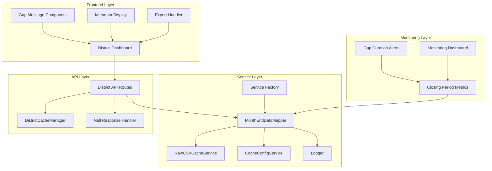

# Month-End Integration Completion - Design Document

## Overview

The Month-End Integration Completion system finalizes the integration of month-end closing period handling into the production Toastmasters Statistics application. The core MonthEndDataMapper service and closing period detection logic has been implemented and tested, but requires integration into the service factory, API layer, frontend components, and monitoring infrastructure to provide a complete user experience.

This design focuses on the four key integration areas: service factory registration, API layer enhancements, frontend user experience improvements, and comprehensive monitoring integration.

## Architecture

### High-Level Integration Architecture



## Components and Interfaces

### 1. Service Factory Integration

**Purpose**: Register MonthEndDataMapper in the dependency injection system.

**Key Methods**:

```typescript
interface ProductionServiceFactory {
  createMonthEndDataMapper(
    cacheConfig?: CacheConfigService,
    rawCSVCache?: RawCSVCacheService
  ): MonthEndDataMapper
}
```

**Implementation Strategy**:

- Add MonthEndDataMapper to service factory with proper dependency injection
- Ensure singleton behavior for consistent service instances
- Add service token for container-based dependency injection
- Include proper disposal handling in cleanup methods

### 2. API Layer Enhancement

**Purpose**: Integrate month-end handling into district data endpoints.

**Key Interfaces**:

```typescript
interface DistrictDataResponse {
  data: DistrictStatistics | null
  metadata: {
    requestedDate: string
    actualDataDate?: string
    isClosingPeriod: boolean
    isExpectedGap: boolean
    gapReason?: 'month_end_closing' | 'system_error'
    estimatedAvailability?: string
  }
  status: 'success' | 'expected_gap' | 'error'
}

interface MonthEndAPIService {
  getDistrictDataWithClosingPeriodHandling(
    districtId: string,
    date: string
  ): Promise<DistrictDataResponse>

  validateDataAvailability(
    districtId: string,
    date: string
  ): Promise<{
    isAvailable: boolean
    reason: string
    alternativeDate?: string
  }>
}
```

### 3. Frontend Integration Components

**Purpose**: Provide clear user communication about closing periods and data gaps.

**Key Components**:

```typescript
interface ClosingPeriodMessageProps {
  requestedDate: string
  actualDataDate?: string
  isExpectedGap: boolean
  estimatedAvailability?: string
}

interface DataMetadataDisplayProps {
  metadata: {
    requestedDate: string
    actualDataDate?: string
    isClosingPeriod: boolean
    collectionSource: 'normal' | 'closing_period'
  }
}

interface ExportMetadataProps {
  includeClosingPeriodContext: boolean
  metadata: DistrictDataResponse['metadata']
}
```

### 4. Monitoring Integration

**Purpose**: Track closing period handling performance and system health.

**Key Interfaces**:

```typescript
interface ClosingPeriodMetrics {
  detectionRate: number
  averageClosingDuration: number
  gapAccuracyRate: number
  mappingSuccessRate: number
  userExperienceScore: number
}

interface MonitoringService {
  recordClosingPeriodDetection(
    districtId: string,
    requestedDate: string,
    actualDate: string,
    duration: number
  ): void

  recordExpectedGap(districtId: string, date: string, gapDuration: number): void

  recordMappingSuccess(
    districtId: string,
    processedDate: string,
    csvDate: string,
    responseTime: number
  ): void

  getClosingPeriodMetrics(timeRange: string): Promise<ClosingPeriodMetrics>
}
```

## Data Models

### Enhanced API Response Model

```typescript
interface EnhancedDistrictDataResponse {
  data: DistrictStatistics | null
  metadata: {
    requestedDate: string
    actualDataDate?: string
    isClosingPeriod: boolean
    isExpectedGap: boolean
    gapReason?: 'month_end_closing' | 'system_error' | 'data_unavailable'
    estimatedAvailability?: string
    dataSource: 'cache' | 'closing_period_mapping' | 'direct_fetch'
    collectionTimestamp?: string
    cacheHitRate?: number
  }
  status: 'success' | 'expected_gap' | 'error'
  timing: {
    requestStart: number
    mappingDuration: number
    cacheAccessDuration: number
    totalDuration: number
  }
}
```

### Frontend State Models

```typescript
interface DistrictDashboardState {
  currentDate: string
  districtData: DistrictStatistics | null
  isLoading: boolean
  closingPeriodInfo: {
    isActive: boolean
    expectedGap: boolean
    message: string
    estimatedAvailability?: string
  }
  dataMetadata: {
    actualCollectionDate?: string
    isFromClosingPeriod: boolean
    lastUpdated: string
  }
}

interface GapMessageState {
  visible: boolean
  type: 'info' | 'warning' | 'error'
  title: string
  description: string
  actionable: boolean
  actions?: Array<{
    label: string
    action: () => void
  }>
}
```

### Monitoring Data Models

```typescript
interface ClosingPeriodEvent {
  eventId: string
  timestamp: Date
  districtId: string
  eventType: 'detection' | 'gap' | 'mapping' | 'error'
  details: {
    requestedDate: string
    actualDate?: string
    duration?: number
    success: boolean
    errorMessage?: string
  }
  userImpact: 'none' | 'minor' | 'moderate' | 'significant'
}

interface SystemHealthMetrics {
  closingPeriodHandling: {
    detectionAccuracy: number
    mappingSuccessRate: number
    averageResponseTime: number
    userSatisfactionScore: number
  }
  dataAvailability: {
    overallAvailability: number
    expectedGapAccuracy: number
    unexpectedGapRate: number
    recoveryTime: number
  }
  performance: {
    cacheHitRate: number
    averageLatency: number
    errorRate: number
    throughput: number
  }
}
```

## Correctness Properties

_A property is a characteristic or behavior that should hold true across all valid executions of a system-essentially, a formal statement about what the system should do. Properties serve as the bridge between human-readable specifications and machine-verifiable correctness guarantees._

Now I need to use the prework tool to analyze the acceptance criteria before writing the correctness properties:

<function_calls>
<invoke name="prework">
<parameter name="featureName">month-end-integration-completion

### Property 1: Service Factory Method Availability

_For any_ ProductionServiceFactory instance, the createMonthEndDataMapper method should exist and return a properly configured MonthEndDataMapper instance with all required dependencies
**Validates: Requirements 1.1, 1.2, 1.3**

### Property 2: Service Instance Consistency

_For any_ multiple requests for MonthEndDataMapper from the service factory, the system should provide consistent service instances with identical configuration
**Validates: Requirements 1.4**

### Property 3: Dependency Validation

_For any_ service factory initialization, the system should validate that all MonthEndDataMapper dependencies are available and properly configured
**Validates: Requirements 1.5**

### Property 4: API Integration Correctness

_For any_ district data request during closing periods, the API should use MonthEndDataMapper to determine data availability and return appropriate responses
**Validates: Requirements 2.1, 2.2, 2.3**

### Property 5: Error Response Differentiation

_For any_ API request that fails, the system should correctly distinguish between expected gaps and actual system errors in the response
**Validates: Requirements 2.4**

### Property 6: Metadata Completeness

_For any_ district data served by the API, the response should include complete metadata about data source and closing period status
**Validates: Requirements 2.5**

### Property 7: UI Gap Communication

_For any_ null data response due to expected gaps, the UI should display clear, informative messages explaining the closing period delay
**Validates: Requirements 3.1**

### Property 8: Date Display Accuracy

_For any_ data from closing periods, the UI should correctly display both the requested date and actual data collection date
**Validates: Requirements 3.2**

### Property 9: UI State Consistency

_For any_ date navigation during closing periods, the UI should maintain consistent messaging about data availability across all interactions
**Validates: Requirements 3.4**

### Property 10: Export Context Inclusion

_For any_ data export or sharing operation, the system should include closing period context and metadata in the shared information
**Validates: Requirements 3.5**

### Property 11: Metrics Emission

_For any_ closing period detection, the system should emit appropriate metrics tracking frequency, duration, and success rates
**Validates: Requirements 4.1, 4.3**

### Property 12: Gap Classification

_For any_ data gap occurrence, the system should correctly classify and track whether the gap is expected or unexpected
**Validates: Requirements 4.2**

### Property 13: Failure Alerting

_For any_ closing period handling failure, the system should generate alerts with detailed context about the failure
**Validates: Requirements 4.4**

### Property 14: Data Availability Maintenance

_For any_ month-end closing period, the system should maintain access to the most recent available data and provide historical access
**Validates: Requirements 6.1, 6.2**

### Property 15: Extended Period Handling

_For any_ closing period that extends longer than expected, the system should continue providing last-known-good data
**Validates: Requirements 6.3**

### Property 16: Automatic Updates

_For any_ closing period that ends, the system should automatically update to use the final reconciled data
**Validates: Requirements 6.4**

### Property 17: Configuration Management

_For any_ configuration changes to closing period parameters, the system should validate, apply, and log the changes without requiring restart
**Validates: Requirements 7.1, 7.2, 7.3, 7.4, 7.5**

## Error Handling

### Service Factory Integration Errors

- **Missing Dependencies**: Validate all required services are available during factory initialization
- **Configuration Errors**: Provide clear error messages when MonthEndDataMapper cannot be created
- **Circular Dependencies**: Detect and prevent circular dependency issues in service creation

### API Layer Error Handling

- **MonthEndDataMapper Failures**: Gracefully handle mapper service failures with fallback to direct cache access
- **Timeout Handling**: Implement timeouts for month-end data mapping operations
- **Invalid Date Requests**: Validate date formats and ranges before processing
- **Concurrent Request Handling**: Ensure thread-safe access to month-end mapping services

### Frontend Error Handling

- **API Communication Failures**: Display appropriate error messages when API calls fail
- **Missing Metadata**: Handle cases where closing period metadata is incomplete
- **State Synchronization**: Ensure UI state remains consistent when data availability changes
- **Export Failures**: Provide clear feedback when export operations fail

### Monitoring Integration Errors

- **Metrics Collection Failures**: Continue operation when metrics cannot be recorded
- **Alert System Failures**: Ensure core functionality continues when alerting fails
- **Dashboard Rendering Errors**: Provide fallback displays when monitoring dashboards fail

## Testing Strategy

### Unit Testing

- Test service factory integration with proper dependency injection
- Test API endpoint enhancements with various closing period scenarios
- Test frontend components with different data availability states
- Test monitoring integration with metrics collection and alerting

### Property-Based Testing

- **Property 1**: Generate random service factory configurations and verify MonthEndDataMapper creation
- **Property 2**: Generate multiple service requests and verify instance consistency
- **Property 3**: Generate various dependency scenarios and verify validation
- **Property 4**: Generate closing period scenarios and verify API integration
- **Property 5**: Generate error conditions and verify response differentiation
- **Property 6**: Generate data responses and verify metadata completeness
- **Property 7**: Generate gap scenarios and verify UI communication
- **Property 8**: Generate closing period data and verify date display
- **Property 9**: Generate navigation sequences and verify UI consistency
- **Property 10**: Generate export scenarios and verify context inclusion
- **Property 11**: Generate closing period events and verify metrics emission
- **Property 12**: Generate gap scenarios and verify classification
- **Property 13**: Generate failure scenarios and verify alerting
- **Property 14**: Generate closing periods and verify data availability
- **Property 15**: Generate extended periods and verify handling
- **Property 16**: Generate period endings and verify updates
- **Property 17**: Generate configuration changes and verify management

### Integration Testing

- Test complete flow from service factory through API to frontend
- Test closing period scenarios with real month-end data patterns
- Test error conditions and recovery scenarios
- Test concurrent access and resource management
- Test configuration changes and system adaptation

### End-to-End Testing

- Test user workflows during typical closing periods
- Test system behavior during extended closing periods
- Test data export and sharing with closing period context
- Test monitoring and alerting during various scenarios

## Implementation Phases

### Phase 1: Service Factory Integration (Week 1)

- Add MonthEndDataMapper to ProductionServiceFactory
- Implement proper dependency injection and service tokens
- Add service registration to container-based DI system
- Implement disposal handling and resource cleanup
- Add comprehensive unit tests for service factory integration

### Phase 2: API Layer Enhancement (Week 1-2)

- Modify district data endpoints to use MonthEndDataMapper
- Implement enhanced response format with metadata
- Add error handling and response differentiation
- Implement data availability validation endpoints
- Add comprehensive API integration tests

### Phase 3: Frontend Integration (Week 2-3)

- Create closing period message components
- Implement metadata display components
- Add export context handling
- Implement UI state management for closing periods
- Add comprehensive frontend component tests

### Phase 4: Monitoring Integration (Week 3-4)

- Implement closing period metrics collection
- Add gap classification and tracking
- Create monitoring dashboards
- Implement alerting for failures and extended periods
- Add comprehensive monitoring integration tests

### Phase 5: Configuration Management (Week 4)

- Implement configuration management for closing period parameters
- Add hot configuration updates without restart
- Implement configuration validation and history
- Add configuration management UI components
- Add comprehensive configuration tests

### Phase 6: End-to-End Integration (Week 5)

- Implement complete integration testing
- Add performance optimization
- Implement comprehensive error handling
- Add production deployment preparation
- Final testing and validation

## Deployment Considerations

### Service Factory Changes

- Ensure MonthEndDataMapper is properly registered in all environments
- Validate dependency injection works correctly in production
- Add monitoring for service creation and disposal

### API Compatibility

- Maintain existing API contracts while adding new metadata
- Implement gradual rollout of enhanced responses
- Add feature flags for new functionality

### Frontend Deployment

- Implement progressive enhancement for closing period features
- Add fallback behavior for older API responses
- Ensure accessibility compliance for new UI components

### Monitoring Infrastructure

- Add new metrics collection endpoints
- Implement dashboard deployment and configuration
- Add alerting rule deployment and testing

### Configuration Management

- Implement configuration migration for existing deployments
- Add configuration validation in deployment pipeline
- Ensure configuration changes are properly versioned

## Performance Considerations

### Service Factory Performance

- Minimize service creation overhead
- Implement efficient dependency resolution
- Add caching for frequently created services

### API Performance

- Optimize month-end data mapping operations
- Implement caching for repeated requests
- Add request batching for multiple date requests

### Frontend Performance

- Implement efficient state management for closing period data
- Add lazy loading for monitoring components
- Optimize rendering for large datasets

### Monitoring Performance

- Implement efficient metrics collection
- Add sampling for high-volume events
- Optimize dashboard query performance

## Security Considerations

### Service Factory Security

- Validate service creation permissions
- Implement secure dependency injection
- Add audit logging for service access

### API Security

- Validate all date parameters to prevent injection
- Implement rate limiting for month-end mapping requests
- Add authentication for administrative endpoints

### Frontend Security

- Sanitize all user-provided data in UI components
- Implement secure export functionality
- Add CSRF protection for configuration changes

### Monitoring Security

- Secure metrics collection endpoints
- Implement access controls for monitoring dashboards
- Add audit logging for configuration changes
