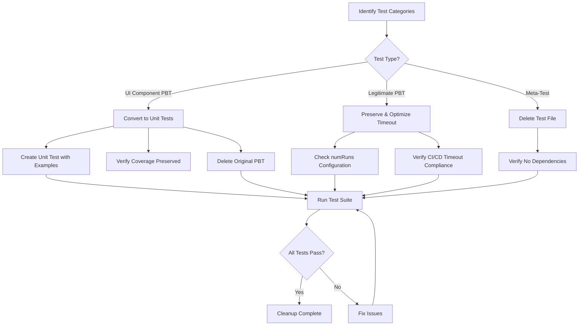

# Design Document: PBT Test Cleanup

## Overview

This design describes a systematic approach to optimize the property-based test (PBT) suite by eliminating meta-tests, converting inappropriate UI component PBTs to unit tests, optimizing timeout configurations, and preserving legitimate PBTs. The cleanup follows the project's property-testing-guidance.md steering document principles.

## Architecture

The cleanup is a manual, phased process executed by a developer with tooling support. It does not introduce new runtime code but modifies the test suite structure.



## Components and Interfaces

### Test Categories

The cleanup process categorizes existing PBT files into three groups:

#### 1. Meta-Tests to Eliminate (~15 files)

Backend:

- `backend/src/utils/__tests__/PropertyTestConfiguration.property.test.ts`
- `backend/src/utils/__tests__/PropertyTestInfrastructure.deterministic-generators.property.test.ts`
- `backend/src/utils/__tests__/PropertyTestInfrastructure.error-reporting.property.test.ts`
- `backend/src/utils/__tests__/test-data-generation.property.test.ts`
- `backend/src/utils/__tests__/generated-data-validation.property.test.ts`
- `backend/src/utils/__tests__/TestIsolationManager.resource-cleanup.property.test.ts`

Frontend:

- `frontend/src/__tests__/properties/testCoveragePreservation.property.test.tsx`
- `frontend/src/__tests__/properties/performanceMaintenance.property.test.tsx`
- `frontend/src/__tests__/properties/codeReductionAchievement.property.test.tsx`
- `frontend/src/__tests__/properties/crossComponentCompatibility.property.test.tsx`
- `frontend/src/__tests__/properties/parallelExecutionPreservation.property.test.tsx`
- `frontend/src/__tests__/properties/propertyBasedTestPreservation.property.test.tsx`
- `frontend/src/__tests__/properties/testPassRateMaintenance.property.test.tsx`

#### 2. UI Component PBTs to Convert (~15 files)

- `frontend/src/components/__tests__/DivisionPerformanceCards.property.test.tsx`
- `frontend/src/components/__tests__/AreaPerformanceRow.property.test.tsx`
- `frontend/src/components/__tests__/AreaPerformanceTable.property.test.tsx`
- `frontend/src/components/__tests__/FocusIndicators.property.test.tsx`
- `frontend/src/components/__tests__/FocusTrapping.property.test.tsx`
- `frontend/src/components/__tests__/KeyboardAccessibility.property.test.tsx`
- `frontend/src/components/__tests__/ColumnHeader.property.test.tsx`
- `frontend/src/components/__tests__/ClubsTable.property.test.tsx`
- `frontend/src/components/__tests__/DivisionSummary.property.test.tsx`
- `frontend/src/components/__tests__/MembershipPaymentsChart.property.test.tsx`
- `frontend/src/components/__tests__/TargetProgressCard.property.test.tsx`
- `frontend/src/components/filters/__tests__/FilterComponentConsistency.property.test.tsx`
- `frontend/src/components/filters/__tests__/TextFilter.debouncing.property.test.tsx`

#### 3. Legitimate PBTs to Preserve (~25 files)

Backend (keep all):

- `backend/src/services/__tests__/RankingCalculator.property.test.ts`
- `backend/src/services/__tests__/ClosingPeriodDetector.property.test.ts`
- `backend/src/services/__tests__/DataNormalizer.property.test.ts`
- `backend/src/services/__tests__/CacheIntegrityValidator.property.test.ts`
- `backend/src/services/__tests__/CacheSecurityManager.property.test.ts`
- `backend/src/services/__tests__/PerDistrictSnapshotStore.property.test.ts`
- `backend/src/services/__tests__/PerDistrictSnapshotStore.closing-period.property.test.ts`
- `backend/src/services/__tests__/PerDistrictSnapshotStore.newer-data-wins.property.test.ts`
- `backend/src/services/__tests__/RegionRankingService.property.test.ts`
- `backend/src/services/__tests__/TargetCalculatorService.property.test.ts`
- `backend/src/services/__tests__/ServiceContainer.property.test.ts`
- And others testing business logic invariants

Frontend utilities (keep):

- `frontend/src/utils/__tests__/divisionStatus.property.test.ts`
- `frontend/src/utils/__tests__/paymentTrend.property.test.ts`
- `frontend/src/utils/__tests__/programYear.property.test.ts`
- `frontend/src/hooks/__tests__/usePaymentsTrend.property.test.ts`

### Conversion Pattern

When converting a UI component PBT to unit tests:

```typescript
// BEFORE: Property-based test with random generation
it('should render N division cards', () => {
  fc.assert(
    fc.property(divisionsArrayArb, (divisions) => {
      // ... test with random divisions
    }),
    { numRuns: 25 }
  )
})

// AFTER: Unit test with well-chosen examples
describe('division card rendering', () => {
  it('renders empty state when no divisions', () => {
    render(<Component divisions={[]} />)
    expect(screen.getByText('No Divisions Found')).toBeInTheDocument()
  })

  it('renders single division correctly', () => {
    render(<Component divisions={[mockDivisionA]} />)
    expect(screen.getByText('Division A')).toBeInTheDocument()
  })

  it('renders multiple divisions in alphabetical order', () => {
    render(<Component divisions={[mockDivisionC, mockDivisionA, mockDivisionB]} />)
    const headings = screen.getAllByRole('heading')
    expect(headings[0]).toHaveTextContent('Division A')
    expect(headings[1]).toHaveTextContent('Division B')
    expect(headings[2]).toHaveTextContent('Division C')
  })

  it('handles maximum divisions (edge case)', () => {
    render(<Component divisions={manyDivisions} />)
    expect(screen.getAllByTestId('division-card')).toHaveLength(26)
  })
})
```

### Timeout Optimization Pattern

For legitimate PBTs that may timeout:

```typescript
// BEFORE: May timeout in CI/CD
it('property test', () => {
  fc.assert(
    fc.property(complexArb, data => {
      // expensive operations
    }),
    { numRuns: 100 }
  )
})

// AFTER: Optimized for CI/CD
it('property test', { timeout: 15000 }, () => {
  fc.assert(
    fc.property(simplifiedArb, data => {
      // same assertions, simpler data
    }),
    { numRuns: 50 } // Reduced from 100
  )
})
```

## Data Models

No new data models are introduced. The cleanup modifies test files only.

### Test File Naming Convention

- Unit tests: `ComponentName.test.tsx`
- Property tests (legitimate): `ServiceName.property.test.ts`
- Integration tests: `ServiceName.integration.test.ts`

## Correctness Properties

_A property is a characteristic or behavior that should hold true across all valid executions of a system—essentially, a formal statement about what the system should do. Properties serve as the bridge between human-readable specifications and machine-verifiable correctness guarantees._

Based on the prework analysis, the following properties can be verified after cleanup:

### Property 1: PBT Timeout Compliance

_For all_ property-based test files remaining after cleanup, executing the test should complete within 30 seconds in a CI/CD environment.

**Validates: Requirements 5.3, 5.4**

### Property 2: UI Component PBT Elimination

_For all_ files in `frontend/src/components/__tests__/` and `frontend/src/components/filters/__tests__/`, no file should have a `.property.test.tsx` suffix after cleanup is complete.

**Validates: Requirements 6.1**

### Property 3: Meta-Test Elimination

_For all_ files in the meta-test elimination list, the file should not exist after cleanup is complete.

**Validates: Requirements 1.1, 1.2, 1.3, 1.4, 6.4**

### Property 4: Test Suite Integrity

_For all_ test files in the repository after cleanup, running `npm test` should result in all tests passing.

**Validates: Requirements 4.3**

### Property 5: Legitimate PBT Preservation

_For all_ files in the legitimate PBT preservation list, the file should still exist after cleanup is complete.

**Validates: Requirements 3.1-3.10**

## Error Handling

### File Deletion Errors

- If a meta-test file cannot be deleted due to permissions, log the error and continue with other files
- If a file in the deletion list doesn't exist, treat as success (idempotent operation)

### Conversion Errors

- If a UI component PBT cannot be converted due to complex dependencies, document the file for manual review
- If the converted unit test fails, keep the original PBT until the issue is resolved

### Test Suite Failures

- If tests fail after cleanup, revert the most recent change and investigate
- Run tests incrementally after each batch of changes to isolate failures

### Timeout Issues

- If a legitimate PBT times out after optimization, consider:
  1. Further reducing `numRuns`
  2. Simplifying generators
  3. Adding explicit timeout with justification
  4. Splitting into multiple smaller property tests

## Testing Strategy

This cleanup is primarily a refactoring effort. Testing focuses on verification rather than new test creation.

### Verification Approach

1. **Pre-Cleanup Baseline**
   - Run full test suite and record pass/fail status
   - Note any existing timeout issues
   - Document current test count

2. **Incremental Verification**
   - After each phase (meta-test deletion, UI PBT conversion, timeout optimization), run the test suite
   - Verify no new failures introduced
   - Check that deleted files don't cause import errors

3. **Post-Cleanup Validation**
   - Run full test suite in CI/CD environment
   - Verify all tests pass within timeout limits
   - Confirm test count reflects expected changes (deletions and conversions)

### Unit Tests for Converted Components

Each converted UI component PBT should result in a unit test file with:

- 3-5 well-chosen examples covering the main behaviors
- Edge cases (empty state, single item, maximum items)
- Error states if applicable

### Property Tests (Preserved)

Legitimate PBTs should be reviewed for:

- `numRuns` configuration (recommend 25-50 for most cases)
- Generator complexity (simplify where possible)
- Explicit timeout if needed (with comment explaining why)

### CI/CD Integration

- All tests must pass in GitHub Actions workflow
- No test should exceed 30-second default timeout
- Tests with extended timeouts must have explicit configuration and justification
