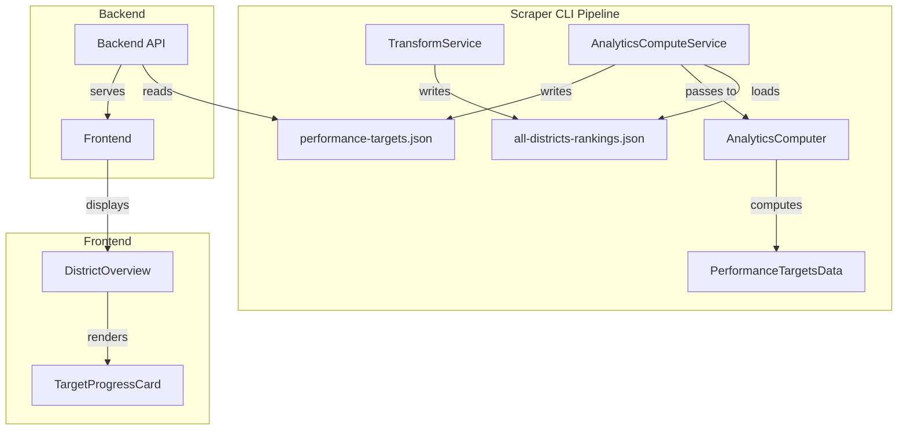

# Design Document: Per-Metric Rankings

## Overview

This design adds per-metric ranking data (world rank, world percentile, region rank) to the district performance targets. The rankings are computed in the scraper-cli pipeline by leveraging the existing `all-districts-rankings.json` file, which already contains per-metric ranks (`clubsRank`, `paymentsRank`, `distinguishedRank`).

The key insight is that we don't need to recompute rankings - we need to:
1. Load the existing all-districts-rankings.json during analytics computation
2. Extract the per-metric ranks for the target district
3. Calculate world percentile from the existing ranks
4. Compute region ranks by filtering and ranking within region subsets
5. Include this data in the performance-targets pre-computed file

## Architecture



### Data Flow

1. **TransformService** already computes and writes `all-districts-rankings.json` with per-metric ranks
2. **AnalyticsComputeService** loads `all-districts-rankings.json` before computing analytics
3. **AnalyticsComputer.computePerformanceTargets()** receives all-districts data and computes:
   - World rank (from existing `clubsRank`, `paymentsRank`, `distinguishedRank`)
   - World percentile (calculated from world rank and total districts)
   - Region rank (computed by filtering districts by region)
4. **AnalyticsWriter** writes the enhanced `performance-targets.json` file
5. **Backend** serves the pre-computed data as-is
6. **Frontend** displays rankings in TargetProgressCard components

## Components and Interfaces

### Modified: AnalyticsComputeService

The service needs a new method to load all-districts rankings:

```typescript
/**
 * Load all-districts rankings from disk
 * @param date - Snapshot date in YYYY-MM-DD format
 * @returns AllDistrictsRankingsData or null if not found
 */
async loadAllDistrictsRankings(date: string): Promise<AllDistrictsRankingsData | null> {
  const rankingsPath = path.join(
    this.getSnapshotDir(date),
    'all-districts-rankings.json'
  )
  
  try {
    const content = await fs.readFile(rankingsPath, 'utf-8')
    return JSON.parse(content) as AllDistrictsRankingsData
  } catch (error) {
    const err = error as { code?: string }
    if (err.code === 'ENOENT') {
      this.logger.warn('All-districts rankings not found', { date, path: rankingsPath })
      return null
    }
    throw error
  }
}
```

The `computeDistrictAnalytics` method needs to:
1. Load all-districts rankings before computing performance targets
2. Pass the rankings data to `computePerformanceTargets`

### Modified: AnalyticsComputer.computePerformanceTargets()

The method signature changes to accept optional all-districts rankings:

```typescript
computePerformanceTargets(
  districtId: string,
  snapshots: DistrictStatistics[],
  allDistrictsRankings?: AllDistrictsRankingsData
): PerformanceTargetsData
```

### New: MetricRankingsCalculator

A new utility class to compute metric rankings:

```typescript
/**
 * Calculates per-metric rankings from all-districts rankings data
 */
export class MetricRankingsCalculator {
  /**
   * Calculate rankings for a specific district and metric
   */
  calculateMetricRankings(
    districtId: string,
    metric: 'clubs' | 'payments' | 'distinguished',
    allDistrictsRankings: AllDistrictsRankingsData
  ): MetricRankings
  
  /**
   * Calculate world percentile from rank and total
   */
  calculateWorldPercentile(worldRank: number, totalDistricts: number): number | null
  
  /**
   * Calculate region rank for a district within its region
   */
  calculateRegionRank(
    districtId: string,
    metric: 'clubs' | 'payments' | 'distinguished',
    allDistrictsRankings: AllDistrictsRankingsData
  ): { regionRank: number | null; totalInRegion: number; region: string | null }
}
```

## Data Models

### Modified: PerformanceTargetsData

The existing type needs to include rankings for each metric:

```typescript
export interface PerformanceTargetsData {
  /** District identifier */
  districtId: string
  /** ISO timestamp when the data was computed */
  computedAt: string
  /** Target for membership (based on base membership + growth target) */
  membershipTarget: number
  /** Target for distinguished clubs count */
  distinguishedTarget: number
  /** Target for club growth (net new clubs) */
  clubGrowthTarget: number
  /** Current progress toward targets */
  currentProgress: {
    membership: number
    distinguished: number
    clubGrowth: number
  }
  /** Whether targets are projected to be achieved */
  projectedAchievement: {
    membership: boolean
    distinguished: boolean
    clubGrowth: boolean
  }
  
  // NEW: Per-metric rankings
  /** Rankings for paid clubs metric */
  paidClubsRankings: MetricRankings
  /** Rankings for membership payments metric */
  membershipPaymentsRankings: MetricRankings
  /** Rankings for distinguished clubs metric */
  distinguishedClubsRankings: MetricRankings
}
```

### Existing: MetricRankings (already defined in types.ts)

```typescript
export interface MetricRankings {
  /** District's world rank (1 = best, null if unavailable) */
  worldRank: number | null
  /** World percentile (0-100, rounded to 1 decimal, null if unavailable) */
  worldPercentile: number | null
  /** District's rank within its region (1 = best, null if unavailable) */
  regionRank: number | null
  /** Total number of districts worldwide */
  totalDistricts: number
  /** Total number of districts in the region */
  totalInRegion: number
  /** Region identifier (null if unknown) */
  region: string | null
}
```

### Mapping from AllDistrictsRankingsData

The existing `DistrictRanking` type in all-districts-rankings.json contains:

| Field | Maps To |
|-------|---------|
| `clubsRank` | `paidClubsRankings.worldRank` |
| `paymentsRank` | `membershipPaymentsRankings.worldRank` |
| `distinguishedRank` | `distinguishedClubsRankings.worldRank` |
| `region` | All three `*.region` fields |
| `metadata.totalDistricts` | All three `*.totalDistricts` fields |


## Correctness Properties

*A property is a characteristic or behavior that should hold true across all valid executions of a system—essentially, a formal statement about what the system should do. Properties serve as the bridge between human-readable specifications and machine-verifiable correctness guarantees.*

Per the testing steering document, property-based tests are warranted here because:
1. **Mathematical invariants exist**: Percentile calculation has algebraic properties
2. **Business rules with universal properties**: "Rankings must be consistent with source data"
3. **Existing PBT coverage**: This codebase already has PBT for ranking calculations

However, some requirements are better tested with well-chosen examples rather than property tests.

### Property 1: World Percentile Calculation Correctness

*For any* valid world rank and total districts count (where totalDistricts > 1 and worldRank is not null), the world percentile SHALL equal `((totalDistricts - worldRank) / totalDistricts) * 100` rounded to 1 decimal place.

**Validates: Requirements 2.1, 2.2**

**Justification**: This is a mathematical formula with algebraic properties. Property testing ensures the formula is correctly implemented across the full input space.

### Property 2: Region Rank Ordering Invariant

*For any* set of districts in the same region, the district with the highest metric value SHALL have region rank 1, and districts with equal values SHALL have equal ranks.

**Validates: Requirements 3.2, 6.1**

**Justification**: This is a ranking invariant - a universal property that must hold for all inputs. The input space (various district configurations) is complex enough to warrant property testing.

### Example-Based Tests (Not Properties)

The following requirements are better tested with specific examples:

**World Rank Extraction (Requirements 1.2, 1.3, 1.4)**
- 3-5 examples with known input/output pairs are sufficient
- The mapping is straightforward (field A → field B)
- Property test would just restate the implementation

**Null Handling (Requirements 1.5, 2.3, 2.4, 3.4, 5.3)**
- Edge cases are finite and enumerable
- Examples: null rankings input, totalDistricts=0, totalDistricts=1, unknown region
- Unit tests with specific examples provide clearer documentation

**Region Filtering (Requirements 3.1, 3.3, 3.5)**
- Can be covered by 3-5 examples with different region configurations
- totalInRegion count is a simple aggregation

## Error Handling

### Missing All-Districts Rankings File

When `all-districts-rankings.json` is not found:
1. Log a warning with the expected file path
2. Continue with null rankings (do not fail the computation)
3. Set all ranking fields to null in the output
4. Set totalDistricts and totalInRegion to 0

```typescript
if (!allDistrictsRankings) {
  this.logger.warn('All-districts rankings not available, rankings will be null', {
    date,
    districtId,
  })
  return createNullRankings()
}
```

### District Not Found in Rankings

When the target district is not found in all-districts-rankings.json:
1. Log a warning
2. Return null rankings for that district
3. Do not fail the computation

### Invalid Region Data

When a district's region is "Unknown", empty, or null:
1. Set `region` to null
2. Set `regionRank` to null
3. Set `totalInRegion` to 0

### Edge Cases

| Scenario | Behavior |
|----------|----------|
| totalDistricts = 0 | worldPercentile = null |
| totalDistricts = 1 | worldPercentile = null |
| worldRank = null | worldPercentile = null |
| region = "Unknown" | regionRank = null, region = null |
| District not in rankings | All rankings = null |

## Testing Strategy

Per the testing steering document: "Prefer the simplest test that provides confidence. Property tests are for invariants, not for everything."

### Unit Tests (Primary)

Unit tests with well-chosen examples should cover:

1. **World rank extraction** (Requirements 1.2, 1.3, 1.4)
   - Example: District with clubsRank=5 → paidClubsRankings.worldRank=5
   - Example: District with paymentsRank=10 → membershipPaymentsRankings.worldRank=10
   - Example: District with distinguishedRank=3 → distinguishedClubsRankings.worldRank=3

2. **Null handling edge cases** (Requirements 1.5, 2.3, 2.4, 3.4, 5.3, 5.4)
   - Example: null allDistrictsRankings → all rankings null
   - Example: totalDistricts=0 → worldPercentile=null
   - Example: totalDistricts=1 → worldPercentile=null
   - Example: worldRank=null → worldPercentile=null
   - Example: region="Unknown" → regionRank=null, region=null

3. **Region filtering and counting** (Requirements 3.1, 3.3, 3.5)
   - Example: 3 districts in "Region 10", 2 in "Region 11" → totalInRegion=3 for Region 10 district
   - Example: District in "Region 10" → region="Region 10"

4. **Percentile calculation examples** (Requirements 2.1, 2.2)
   - Example: rank=1, total=100 → percentile=99.0
   - Example: rank=50, total=100 → percentile=50.0
   - Example: rank=100, total=100 → percentile=0.0

### Property-Based Tests (Selective)

Property tests are warranted for two specific invariants:

1. **Property 1: Percentile calculation formula** (Requirements 2.1, 2.2)
   - Mathematical invariant: `percentile = ((total - rank) / total) * 100`
   - Justification: Algebraic property that must hold for all valid inputs
   - Tag: **Feature: per-metric-rankings, Property 1: Percentile calculation correctness**

2. **Property 2: Region rank ordering** (Requirements 3.2, 6.1)
   - Invariant: Highest value gets rank 1, equal values get equal ranks
   - Justification: Universal ranking property, complex input space
   - Tag: **Feature: per-metric-rankings, Property 2: Region rank ordering invariant**

### Integration Tests

Integration tests should verify:

1. AnalyticsComputeService loads all-districts-rankings.json correctly
2. End-to-end flow produces valid performance-targets.json with rankings
3. Graceful handling when rankings file is missing (no failure, null rankings)

### Test Configuration

- Property tests: Minimum 100 iterations per property
- Use fast-check for property-based testing
- Tests MUST be isolated and concurrent-safe per steering document
- Use dependency injection for service instances
