# Design Document: Pre-Computed Analytics Alignment

## Overview

This design addresses the misalignment between the pre-computed analytics pipeline and the frontend's expected `DistrictAnalytics` structure. The core issue is that two separate analytics computation paths exist:

1. **scraper-cli's `AnalyticsComputer`** (in `analytics-core`) - Produces the correct full `DistrictAnalytics` structure
2. **backend's `PreComputedAnalyticsService`** - Produces simplified summary counts

The solution enhances the `analytics-core` types and modules to produce complete data that matches frontend expectations, ensuring the scraper-cli's output is the single source of truth.

### Key Changes

1. **Extend `ClubTrend` type** in analytics-core to include all frontend-required fields
2. **Enhance `ClubHealthAnalyticsModule`** to extract division/area info, trends, and payment data
3. **Update `ClubStatistics` interface** to include additional fields from snapshot data
4. **Deprecate `PreComputedAnalyticsService`** simplified summaries in favor of full analytics

## Architecture

```mermaid
flowchart TB
    subgraph "Data Pipeline (Current)"
        A[Toastmasters CSV] -->|scrape| B[Raw CSV Cache]
        B -->|transform| C[Snapshots]
        C -->|compute-analytics| D[Pre-Computed Analytics]
        D -->|serve| E[Backend API]
        E --> F[Frontend]
    end
    
    subgraph "Type Flow (Enhanced)"
        G[ClubStatistics] -->|extract| H[Enhanced ClubTrend]
        H -->|categorize| I[ClubHealthData]
        I -->|aggregate| J[DistrictAnalytics]
    end
```



The architecture remains the same - the scraper-cli computes analytics and stores them as JSON files. The backend reads and serves these files. The change is in the **content** of what's computed and stored.

## Components and Interfaces

### 1. Enhanced ClubTrend Type (analytics-core/types.ts)

The `ClubTrend` type must be extended to include all fields the frontend expects:

```typescript
/**
 * Individual club trend data.
 * Enhanced to include all fields required by frontend.
 */
export interface ClubTrend {
  // Existing fields
  clubId: string
  clubName: string
  currentStatus: ClubHealthStatus
  membershipCount: number
  paymentsCount: number
  healthScore: number
  
  // NEW: Division and Area information
  divisionId: string
  divisionName: string
  areaId: string
  areaName: string
  
  // NEW: Trend arrays (not single values)
  membershipTrend: Array<{ date: string; count: number }>
  dcpGoalsTrend: Array<{ date: string; goalsAchieved: number }>
  
  // CHANGED: Risk factors as string array (frontend format)
  riskFactors: string[]
  
  // NEW: Distinguished level
  distinguishedLevel: DistinguishedLevel
  
  // NEW: Payment breakdown fields
  octoberRenewals?: number
  aprilRenewals?: number
  newMembers?: number
  
  // NEW: Club operational status
  clubStatus?: string
}

export type DistinguishedLevel =
  | 'NotDistinguished'
  | 'Smedley'
  | 'President'
  | 'Select'
  | 'Distinguished'
```

### 2. Enhanced ClubStatistics Interface (analytics-core/interfaces.ts)

The `ClubStatistics` interface needs additional fields to capture data from snapshots:

```typescript
export interface ClubStatistics {
  // Existing fields
  clubId: string
  clubName: string
  divisionId: string
  areaId: string
  membershipCount: number
  paymentsCount: number
  dcpGoals: number
  status: string
  charterDate?: string
  
  // NEW: Division and Area names
  divisionName: string
  areaName: string
  
  // NEW: Payment breakdown
  octoberRenewals: number
  aprilRenewals: number
  newMembers: number
  
  // NEW: Membership base for net growth calculation
  membershipBase: number
  
  // NEW: Club operational status
  clubStatus?: string
}
```

### 3. Enhanced ClubHealthAnalyticsModule

The module needs significant enhancement to build complete `ClubTrend` objects:

```typescript
export class ClubHealthAnalyticsModule {
  /**
   * Generate comprehensive club health data from snapshots
   * Enhanced to include all frontend-required fields
   */
  generateClubHealthData(snapshots: DistrictStatistics[]): ClubHealthData {
    // Build membership and DCP trends per club across all snapshots
    // Extract division/area info from latest snapshot
    // Calculate distinguished level per club
    // Convert risk factors to string array format
  }
  
  /**
   * Build membership trend array for a club across snapshots
   */
  private buildMembershipTrend(
    clubId: string,
    snapshots: DistrictStatistics[]
  ): Array<{ date: string; count: number }>
  
  /**
   * Build DCP goals trend array for a club across snapshots
   */
  private buildDcpGoalsTrend(
    clubId: string,
    snapshots: DistrictStatistics[]
  ): Array<{ date: string; goalsAchieved: number }>
  
  /**
   * Convert ClubRiskFactors object to string array
   */
  private riskFactorsToStringArray(factors: ClubRiskFactors): string[]
  
  /**
   * Determine distinguished level for a club
   */
  private determineDistinguishedLevel(club: ClubStatistics): DistinguishedLevel
}
```

### 4. Data Transformer Enhancement

The `DataTransformer` in scraper-cli needs to extract additional fields from CSV:

```typescript
// Fields to extract from club performance CSV
const CLUB_FIELDS = {
  clubId: 'Club Number',
  clubName: 'Club Name',
  division: 'Division',           // Parse to divisionId + divisionName
  area: 'Area',                   // Parse to areaId + areaName
  membership: 'Active Members',
  membershipBase: 'Mem. Base',
  octoberRenewals: 'Oct. Ren.',
  aprilRenewals: 'Apr. Ren.',
  newMembers: 'New Members',
  dcpGoals: 'Goals Met',
  clubStatus: 'Club Status',      // Active, Suspended, Low, Ineligible
}
```

### 5. Backend PreComputedAnalyticsReader (No Changes)

The `PreComputedAnalyticsReader` already reads the correct file format. No changes needed - it will automatically serve the enhanced data once the scraper-cli produces it.

### 6. Deprecation of PreComputedAnalyticsService

The `PreComputedAnalyticsService` will be marked as deprecated:

```typescript
/**
 * @deprecated Use scraper-cli compute-analytics command instead.
 * This service produces simplified summaries that don't match frontend expectations.
 * The analytics-summary.json files are retained for backward compatibility only.
 * 
 * Migration path:
 * 1. Run scraper-cli compute-analytics to generate full analytics
 * 2. Backend will serve from analytics/ directory (full data)
 * 3. analytics-summary.json is no longer the primary data source
 */
export class PreComputedAnalyticsService {
  // ... existing implementation
}
```

## Data Models

### ClubTrend Field Mapping

| Frontend Field | Source | Extraction Method |
|---------------|--------|-------------------|
| `clubId` | CSV `Club Number` | Direct |
| `clubName` | CSV `Club Name` | Direct |
| `divisionId` | CSV `Division` | Parse "A" from "Division A" |
| `divisionName` | CSV `Division` | Use full value or "Division A" |
| `areaId` | CSV `Area` | Parse "12" from "Area 12" |
| `areaName` | CSV `Area` | Use full value or "Area 12" |
| `membershipTrend` | Multiple snapshots | Build array from history |
| `dcpGoalsTrend` | Multiple snapshots | Build array from history |
| `currentStatus` | Calculated | From health assessment |
| `riskFactors` | Calculated | Convert object to string[] |
| `distinguishedLevel` | CSV `Goals Met` + membership | Calculate from thresholds |
| `octoberRenewals` | CSV `Oct. Ren.` | Direct |
| `aprilRenewals` | CSV `Apr. Ren.` | Direct |
| `newMembers` | CSV `New Members` | Direct |
| `clubStatus` | CSV `Club Status` | Direct |

### Distinguished Level Calculation

```typescript
function determineDistinguishedLevel(
  dcpGoals: number,
  membership: number,
  netGrowth: number
): DistinguishedLevel {
  // Smedley: 10+ goals AND 25+ members
  if (dcpGoals >= 10 && membership >= 25) return 'Smedley'
  
  // President's: 9+ goals AND 20+ members
  if (dcpGoals >= 9 && membership >= 20) return 'President'
  
  // Select: 7+ goals AND (20+ members OR 5+ net growth)
  if (dcpGoals >= 7 && (membership >= 20 || netGrowth >= 5)) return 'Select'
  
  // Distinguished: 5+ goals AND (20+ members OR 3+ net growth)
  if (dcpGoals >= 5 && (membership >= 20 || netGrowth >= 3)) return 'Distinguished'
  
  return 'NotDistinguished'
}
```

### Risk Factors Conversion

```typescript
function riskFactorsToStringArray(factors: ClubRiskFactors): string[] {
  const result: string[] = []
  
  if (factors.lowMembership) result.push('Low membership')
  if (factors.decliningMembership) result.push('Declining membership')
  if (factors.lowPayments) result.push('Low payments')
  if (factors.inactiveOfficers) result.push('Inactive officers')
  if (factors.noRecentMeetings) result.push('No recent meetings')
  
  return result
}
```


## Correctness Properties

*A property is a characteristic or behavior that should hold true across all valid executions of a system—essentially, a formal statement about what the system should do. Properties serve as the bridge between human-readable specifications and machine-verifiable correctness guarantees.*

### Property 1: Club Data Extraction Preserves Division/Area Info

*For any* club in the input snapshot that has division and area information, the corresponding ClubTrend in the output should contain the same division ID, division name, area ID, and area name.

**Validates: Requirements 2.1**

### Property 2: Trend Arrays Have Correct Length

*For any* sequence of N snapshots provided to the analytics computation, all trend arrays (membershipTrend, paymentsTrend, dcpGoalsTrend per club) should have length equal to or proportional to N (accounting for clubs that may not exist in all snapshots).

**Validates: Requirements 2.2, 2.3, 5.1, 5.2, 5.3, 5.4**

### Property 3: Payment Fields Are Correctly Extracted

*For any* club in the input snapshot that has payment breakdown data (October renewals, April renewals, new members), the corresponding ClubTrend in the output should contain those same payment values.

**Validates: Requirements 2.4**

### Property 4: Risk Factors Conversion Preserves Information

*For any* ClubRiskFactors object, converting to a string array and then checking which risk factors are present should yield the same set of true risk factors as the original object.

**Validates: Requirements 2.6**

### Property 5: Distinguished Level Calculation Matches Thresholds

*For any* club with DCP goals and membership values, the calculated distinguished level should match the expected level based on the documented thresholds:
- Smedley: goals >= 10 AND membership >= 25
- President: goals >= 9 AND membership >= 20
- Select: goals >= 7 AND (membership >= 20 OR netGrowth >= 5)
- Distinguished: goals >= 5 AND (membership >= 20 OR netGrowth >= 3)

**Validates: Requirements 2.7**

### Property 6: Club Categorization Partitions AllClubs

*For any* computed DistrictAnalytics, the union of thrivingClubs, vulnerableClubs, and interventionRequiredClubs should equal allClubs (no club is missing, no club is duplicated, every club is in exactly one category).

**Validates: Requirements 3.1, 3.2, 3.3, 3.4**

### Property 7: Division/Area Parsing Extracts Correct IDs

*For any* division field value in format "Division X" or area field value in format "Area Y", the parsing function should extract "X" as division ID and "Y" as area ID respectively.

**Validates: Requirements 4.1, 4.2**

### Property 8: Rankings Are Correctly Ordered

*For any* division rankings or area performance arrays, items should be sorted by score in descending order, and rank values should be unique and sequential starting from 1.

**Validates: Requirements 4.4, 4.5**

### Property 9: Distinguished Clubs List Entries Are Complete

*For any* entry in the distinguishedClubsList array, all required fields (clubId, clubName, status, dcpPoints, goalsCompleted) should be present and non-null.

**Validates: Requirements 6.2, 6.3**

### Property 10: Backend Passes Through Data Unchanged

*For any* pre-computed analytics file read by the backend, the data served to the frontend should be identical to the data in the file (no transformation or reduction).

**Validates: Requirements 7.3**

### Property 11: Club Status Extraction and Validation

*For any* club with a status field in the snapshot data, the extracted clubStatus should match the source value and be one of the valid values: 'Active', 'Suspended', 'Low', 'Ineligible', or undefined.

**Validates: Requirements 9.1, 9.2**

### Property 12: Paid Clubs Calculation Is Correct

*For any* club, the paid status should be true if and only if (octoberRenewals + aprilRenewals + newMembers) > 0. The paid club counts in area and division recognition should match the sum of clubs meeting this criterion.

**Validates: Requirements 10.1, 10.2**

## Error Handling

### Data Extraction Errors

| Scenario | Handling | Recovery |
|----------|----------|----------|
| Missing division/area field | Use defaults ('Unknown Division', 'Unknown Area') | Continue processing |
| Invalid payment values | Default to 0 | Continue processing |
| Missing club status | Set to undefined | Continue processing |
| Malformed snapshot data | Log warning, skip club | Continue with other clubs |

### Computation Errors

| Scenario | Handling | Recovery |
|----------|----------|----------|
| Empty snapshots array | Return empty analytics | N/A |
| No clubs in snapshot | Return analytics with empty arrays | N/A |
| Division/area parsing failure | Use raw value as both ID and name | Continue processing |

### Backend Serving Errors

| Scenario | Handling | Response |
|----------|----------|----------|
| Pre-computed file not found | Return 404 | Suggest running compute-analytics |
| Schema version mismatch | Return 500 | Suggest re-running compute-analytics |
| Corrupted JSON file | Return 500 | Suggest re-running compute-analytics |

## Testing Strategy

Per the testing steering document, property-based tests are a tool, not a default. We should prefer unit tests with well-chosen examples unless there are mathematical invariants or complex input spaces.

### Analysis: Which Properties Warrant PBT?

| Property | PBT Warranted? | Rationale |
|----------|----------------|-----------|
| P2: Trend array length | No | Simple length check, 3-5 examples suffice |
| P4: Risk factors conversion | **Yes** | Round-trip property with combinatorial input space (2^5 = 32 combinations) |
| P5: Distinguished level thresholds | No | Boundary conditions, well-chosen examples at thresholds are clearer |
| P6: Club categorization partition | **Yes** | Mathematical invariant (partition property), complex input space |
| P8: Rankings ordering | No | Simple ordering check, examples suffice |
| P12: Paid clubs calculation | No | Simple arithmetic, examples suffice |

### Unit Tests (Preferred Approach)

Unit tests with well-chosen examples should cover:

1. **Division/area parsing**
   - "Division A" → divisionId: "A", divisionName: "Division A"
   - "Area 12" → areaId: "12", areaName: "Area 12"
   - Empty/null values → defaults applied
   - Malformed values → raw value used as fallback

2. **Distinguished level calculation** (boundary conditions)
   - (goals: 10, membership: 25) → Smedley
   - (goals: 9, membership: 25) → President (not Smedley)
   - (goals: 9, membership: 19) → NotDistinguished (membership too low)
   - (goals: 7, membership: 20) → Select
   - (goals: 7, membership: 15, netGrowth: 5) → Select (via net growth)
   - (goals: 5, membership: 20) → Distinguished
   - (goals: 4, membership: 25) → NotDistinguished (goals too low)

3. **Trend array construction**
   - Single snapshot → arrays with 1 element
   - Multiple snapshots → arrays with N elements
   - Club missing from some snapshots → partial trend

4. **Payment field extraction**
   - All fields present → all extracted
   - Some fields missing → defaults to 0
   - Invalid values → defaults to 0

5. **Club status extraction**
   - "Active" → "Active"
   - "Suspended" → "Suspended"
   - Missing → undefined
   - Unknown value → passed through

6. **Rankings ordering**
   - Verify descending score order
   - Verify unique sequential ranks

### Property-Based Tests (Where Warranted)

Only two properties warrant PBT due to mathematical invariants:

1. **Property 4: Risk factors round-trip**
   - Input space: 2^5 combinations of boolean flags
   - Property: Converting to string array and checking membership preserves all true flags
   - Rationale: Combinatorial input space, round-trip property

2. **Property 6: Club categorization partition**
   - Input space: Arbitrary club data with various health indicators
   - Property: Union of categories equals allClubs, intersection is empty
   - Rationale: Mathematical partition invariant

```typescript
// Property test configuration (for the 2 PBT tests)
const PROPERTY_TEST_CONFIG = {
  numRuns: 100,
  verbose: false,
}
```

### Integration Tests

Integration tests should verify:

1. **End-to-end data flow** - Transform CSV → Compute analytics → Verify output structure
2. **Backend serving** - Read pre-computed file → Serve via API → Verify response matches file
3. **Backward compatibility** - Verify analytics-summary.json files still work (deprecated path)
