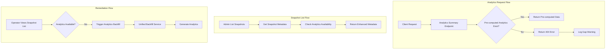

# Design Document: Pre-Computed Analytics Availability

## Overview

This design addresses the issue of expensive on-demand analytics computation (60+ seconds) when pre-computed analytics are unavailable. The solution eliminates the fallback computation entirely, returning a clear error instead, and enhances the snapshot list to show analytics availability status so operators can identify which snapshots need backfill.

The design follows the existing storage abstraction pattern and integrates with the existing unified backfill service for remediation.

## Architecture



## Components and Interfaces

### 1. Modified Analytics Summary Endpoint

The existing `analyticsSummaryRouter` in `backend/src/routes/districts/analyticsSummary.ts` will be modified to remove the on-demand computation fallback.

**Current Behavior:**

```typescript
// When pre-computed analytics not found:
// 1. Log warning
// 2. Fall back to expensive on-demand computation (60+ seconds)
// 3. Return computed result
```

**New Behavior:**

```typescript
// When pre-computed analytics not found:
// 1. Log error with structured gap indicator
// 2. Return 404 with clear error message and backfill recommendation
// 3. No computation performed
```

**Error Response Schema:**

```typescript
interface AnalyticsUnavailableError {
  error: {
    code: 'ANALYTICS_NOT_AVAILABLE'
    message: string
    details: {
      districtId: string
      recommendation: string
      backfillJobType: 'analytics-generation'
    }
  }
}
```

### 2. Enhanced Snapshot List Response

The existing `snapshotsRouter` in `backend/src/routes/admin/snapshots.ts` will be enhanced to include analytics availability.

**Current Response:**

```typescript
interface SnapshotMetadata {
  snapshot_id: string
  created_at: string
  status: SnapshotStatus
  schema_version: string
  calculation_version: string
  size_bytes: number
  error_count: number
  district_count: number
}
```

**Enhanced Response:**

```typescript
interface EnhancedSnapshotMetadata extends SnapshotMetadata {
  analytics_available: boolean
}
```

### 3. Analytics Availability Checker

A new utility function to check if analytics exist for a snapshot.

```typescript
interface IAnalyticsAvailabilityChecker {
  /**
   * Check if analytics-summary.json exists for a snapshot
   * @param snapshotId - The snapshot ID to check
   * @returns true if analytics exist, false otherwise
   */
  hasAnalytics(snapshotId: string): Promise<boolean>

  /**
   * Batch check analytics availability for multiple snapshots
   * @param snapshotIds - Array of snapshot IDs to check
   * @returns Map of snapshotId to availability status
   */
  checkBatch(snapshotIds: string[]): Promise<Map<string, boolean>>
}
```

**Implementation Location:** `backend/src/services/AnalyticsAvailabilityChecker.ts`

This service will use the existing storage abstraction pattern to check for analytics-summary.json files.

## Data Models

### Error Response for Analytics Unavailable

```typescript
// HTTP 404 Response
{
  "error": {
    "code": "ANALYTICS_NOT_AVAILABLE",
    "message": "Pre-computed analytics are not available for district 61. Run analytics backfill to generate them.",
    "details": {
      "districtId": "61",
      "recommendation": "Use the unified backfill service with job type 'analytics-generation' to generate pre-computed analytics for this snapshot.",
      "backfillJobType": "analytics-generation"
    }
  }
}
```

### Enhanced Snapshot List Response

```typescript
{
  "snapshots": [
    {
      "snapshot_id": "2024-01-15",
      "created_at": "2024-01-15T12:00:00Z",
      "status": "success",
      "schema_version": "1.0.0",
      "calculation_version": "1.0.0",
      "size_bytes": 1234567,
      "error_count": 0,
      "district_count": 5,
      "analytics_available": true
    },
    {
      "snapshot_id": "2024-01-14",
      "created_at": "2024-01-14T12:00:00Z",
      "status": "success",
      "schema_version": "1.0.0",
      "calculation_version": "1.0.0",
      "size_bytes": 1234567,
      "error_count": 0,
      "district_count": 5,
      "analytics_available": false
    }
  ],
  "metadata": {
    "total_count": 2,
    "analytics_available_count": 1,
    "analytics_missing_count": 1,
    "filters_applied": {},
    "limit_applied": null,
    "query_duration_ms": 45,
    "generated_at": "2024-01-16T10:00:00Z"
  }
}
```

## Correctness Properties

_A property is a characteristic or behavior that should hold true across all valid executions of a system-essentially, a formal statement about what the system should do. Properties serve as the bridge between human-readable specifications and machine-verifiable correctness guarantees._

Based on the prework analysis and the property-testing-guidance.md steering document, the following correctness properties have been identified. Per the guidance, these will be validated through **unit tests with well-chosen examples** rather than property-based tests, as the behavior is deterministic, easily observable, and does not involve complex input spaces or mathematical invariants.

**Property 1: Analytics unavailable returns 404**

_For any_ district ID and snapshot where pre-computed analytics do not exist, requesting the analytics-summary endpoint SHALL return HTTP status code 404.

**Validates: Requirements 1.1**
**Testing approach:** Unit tests with specific examples

**Property 2: Error response contains required fields**

_For any_ 404 error response from the analytics-summary endpoint, the response body SHALL contain: an error code of "ANALYTICS_NOT_AVAILABLE", a message indicating analytics are not available, the requested district ID, and a recommendation to run analytics backfill.

**Validates: Requirements 1.2, 1.3, 1.5**
**Testing approach:** Unit tests with specific examples

**Property 3: No on-demand computation fallback**

_For any_ request to the analytics-summary endpoint where pre-computed analytics do not exist, the response time SHALL be under 5 seconds (indicating no expensive computation occurred).

**Validates: Requirements 1.4**
**Testing approach:** Unit tests with timing assertions

**Property 4: Snapshot list includes accurate analytics_available field**

_For any_ snapshot in the snapshot list response, the `analytics_available` field SHALL accurately reflect whether an analytics-summary.json file exists for that snapshot.

**Validates: Requirements 2.1, 2.2**
**Testing approach:** Unit tests with specific examples

**Property 5: Snapshot list backward compatible**

_For any_ snapshot list response, all fields from the original SnapshotMetadata interface SHALL be present (snapshot_id, created_at, status, schema_version, calculation_version, size_bytes, error_count, district_count).

**Validates: Requirements 2.3**
**Testing approach:** Unit tests with schema validation

**Property 6: Analytics check performance**

_For any_ snapshot list request, the additional latency introduced by analytics availability checking SHALL be under 100ms compared to the baseline without the check.

**Validates: Requirements 2.4**
**Testing approach:** Unit tests with timing assertions

## Error Handling

### Analytics Summary Endpoint

When pre-computed analytics are not available:

1. **Log the error** with structured fields:
   - `operation`: "analyticsRequest"
   - `districtId`: The requested district ID
   - `snapshotId`: The snapshot that was checked
   - `analytics_gap`: true (structured indicator)
   - `recommendation`: "Run analytics backfill job"

2. **Return 404 response** with:
   - Error code: `ANALYTICS_NOT_AVAILABLE`
   - Clear message explaining the issue
   - District ID in details
   - Backfill recommendation

3. **Do NOT**:
   - Fall back to on-demand computation
   - Return partial data
   - Return 500 error (this is an expected condition, not a server error)

### Snapshot List Endpoint

When checking analytics availability:

1. **Handle file system errors gracefully**:
   - If unable to check a snapshot, assume `analytics_available: false`
   - Log warning but continue processing other snapshots

2. **Performance safeguards**:
   - Use batch checking where possible
   - Implement timeout for analytics checks
   - Cache results if needed for performance

## Testing Strategy

Per the property-testing-guidance.md steering document, property-based testing is reserved for cases with mathematical invariants, complex input spaces, or business rules with universal properties. The requirements in this feature are straightforward CRUD-like operations and response validation where well-chosen unit test examples provide equivalent confidence.

### Unit Tests

**Note:** Unit tests with specific examples are preferred over property-based tests for this feature because:

- The behavior is deterministic and easily observable
- 3-5 examples fully cover each requirement
- No complex input spaces or mathematical invariants exist

1. **AnalyticsAvailabilityChecker**
   - Test `hasAnalytics()` returns true when analytics-summary.json exists
   - Test `hasAnalytics()` returns false when file doesn't exist
   - Test `hasAnalytics()` returns false when snapshot directory doesn't exist
   - Test `checkBatch()` returns correct map for mixed availability
   - Test error handling returns false (not throws) for file system errors
   - _Requirements: 2.1, 2.2_

2. **Analytics Summary Endpoint - 404 Response**
   - Test returns 404 when pre-computed analytics don't exist
   - Test error response has code "ANALYTICS_NOT_AVAILABLE"
   - Test error response includes district ID in details
   - Test error response includes backfill recommendation
   - Test response time is under 5 seconds (no computation fallback)
   - _Requirements: 1.1, 1.2, 1.3, 1.4, 1.5_

3. **Snapshot List Endpoint - Analytics Availability**
   - Test `analytics_available: true` when analytics-summary.json exists
   - Test `analytics_available: false` when file doesn't exist
   - Test all original SnapshotMetadata fields still present (backward compatibility)
   - Test metadata includes `analytics_available_count` and `analytics_missing_count`
   - Test response time increase is under 100ms
   - _Requirements: 2.1, 2.2, 2.3, 2.4_

4. **Error Logging**
   - Test log includes district ID when returning 404
   - Test log includes snapshot ID that was checked
   - Test log includes `analytics_gap: true` structured field
   - Test log includes backfill recommendation
   - _Requirements: 3.1, 3.2, 3.3, 3.4_

### Integration Tests

1. **End-to-end analytics request flow**
   - Create snapshot without analytics-summary.json
   - Request analytics summary for a district
   - Verify 404 response with correct error structure
   - Verify appropriate log entries created

2. **Snapshot list with mixed analytics availability**
   - Create 3 snapshots
   - Add analytics-summary.json to 2 of them
   - Request snapshot list
   - Verify `analytics_available` is true for 2, false for 1
   - Verify metadata counts are correct

## API Documentation Updates

### backend/openapi.yaml Changes

Add 404 response to analytics-summary endpoint:

```yaml
/districts/{districtId}/analytics-summary:
  get:
    responses:
      '404':
        description: Pre-computed analytics not available
        schema:
          type: object
          properties:
            error:
              type: object
              properties:
                code:
                  type: string
                  enum: [ANALYTICS_NOT_AVAILABLE]
                message:
                  type: string
                details:
                  type: object
                  properties:
                    districtId:
                      type: string
                    recommendation:
                      type: string
                    backfillJobType:
                      type: string
```

Update snapshot list response schema to include `analytics_available`:

```yaml
/admin/snapshots:
  get:
    responses:
      '200':
        schema:
          properties:
            snapshots:
              items:
                properties:
                  analytics_available:
                    type: boolean
                    description: Whether pre-computed analytics exist for this snapshot
```
