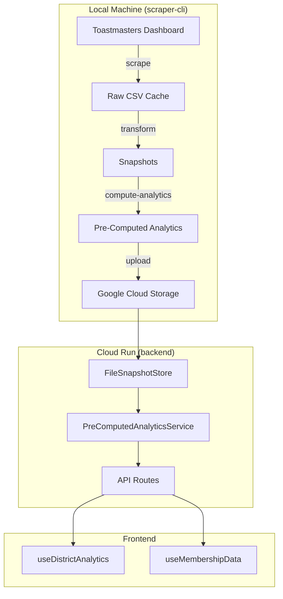

# Design Document: Pre-Computed Analytics Pipeline

## Overview

This design transforms the Toast-Stats application from a "compute on request" architecture to a "serve pre-computed files" architecture. The solution moves all heavy computation (raw CSV transformation, snapshot creation, and analytics computation) to the local scraper-cli tool, stores results as small JSON files, and has the backend serve these files directly without any computation.

The architecture follows a pipeline pattern:

```
Raw CSV → Snapshot → Pre-Computed Analytics → Backend Serving
```

All pipeline stages run locally on the operator's machine. The backend becomes a thin file-serving layer that reads pre-computed JSON files from the file system (local or GCS).

## Architecture



### Key Design Decisions

1. **No on-demand computation in backend**: The backend never computes analytics. If pre-computed files don't exist, it returns 404. This eliminates memory pressure in Cloud Run.

2. **Shared computation modules**: Analytics algorithms are extracted into a shared package (`@toastmasters/analytics-core`) used by both scraper-cli and backend (for validation only).

3. **File-based storage**: Pre-computed analytics are stored as JSON files alongside snapshots, using the existing FileSnapshotStore directory structure.

4. **Incremental updates**: The scraper-cli tracks checksums to avoid recomputing unchanged data.

## Components and Interfaces

### 1. Shared Analytics Core Package

**Location**: `packages/analytics-core/`

This new package contains the analytics computation logic extracted from the backend, making it usable by both scraper-cli and backend.

```typescript
// packages/analytics-core/src/index.ts
export interface AnalyticsComputationResult {
  districtAnalytics: DistrictAnalytics
  membershipTrends: MembershipTrendData
  clubHealth: ClubHealthData
  computedAt: string
  schemaVersion: string
}

export interface IAnalyticsComputer {
  computeDistrictAnalytics(
    districtId: string,
    snapshots: DistrictStatistics[],
    options?: ComputeOptions
  ): Promise<AnalyticsComputationResult>
}

export class AnalyticsComputer implements IAnalyticsComputer {
  private membershipModule: MembershipAnalyticsModule
  private clubHealthModule: ClubHealthAnalyticsModule
  private distinguishedModule: DistinguishedClubAnalyticsModule
  private divisionAreaModule: DivisionAreaAnalyticsModule

  async computeDistrictAnalytics(
    districtId: string,
    snapshots: DistrictStatistics[],
    options?: ComputeOptions
  ): Promise<AnalyticsComputationResult>
}
```

### 2. Data Transformation Service (Shared)

**Location**: `packages/analytics-core/src/transformation/`

Extracts the CSV-to-snapshot transformation logic from the backend.

```typescript
export interface IDataTransformer {
  transformRawCSV(
    date: string,
    districtId: string,
    csvData: RawCSVData
  ): Promise<DistrictStatistics>

  createSnapshot(
    date: string,
    districts: DistrictStatistics[]
  ): Promise<Snapshot>
}
```

### 3. Pre-Computed Analytics Writer (scraper-cli)

**Location**: `packages/scraper-cli/src/services/AnalyticsWriter.ts`

Writes computed analytics to the file system.

```typescript
export interface PreComputedAnalyticsFile {
  metadata: {
    schemaVersion: string
    computedAt: string
    snapshotDate: string
    districtId: string
    checksum: string
  }
  data: DistrictAnalytics | MembershipTrendData | ClubHealthData
}

export interface IAnalyticsWriter {
  writeDistrictAnalytics(
    snapshotDate: string,
    districtId: string,
    analytics: DistrictAnalytics
  ): Promise<string> // Returns file path

  writeMembershipTrends(
    snapshotDate: string,
    districtId: string,
    trends: MembershipTrendData
  ): Promise<string>

  writeClubHealth(
    snapshotDate: string,
    districtId: string,
    health: ClubHealthData
  ): Promise<string>

  writeAnalyticsManifest(
    snapshotDate: string,
    files: AnalyticsManifestEntry[]
  ): Promise<void>
}
```

### 4. Pre-Computed Analytics Reader (backend)

**Location**: `backend/src/services/PreComputedAnalyticsReader.ts`

Reads pre-computed analytics from the file system.

```typescript
export interface IPreComputedAnalyticsReader {
  readDistrictAnalytics(
    snapshotDate: string,
    districtId: string
  ): Promise<DistrictAnalytics | null>

  readMembershipTrends(
    snapshotDate: string,
    districtId: string
  ): Promise<MembershipTrendData | null>

  readClubHealth(
    snapshotDate: string,
    districtId: string
  ): Promise<ClubHealthData | null>

  validateSchemaVersion(file: PreComputedAnalyticsFile): boolean

  getAnalyticsManifest(snapshotDate: string): Promise<AnalyticsManifest | null>
}
```

### 5. CLI Commands (scraper-cli)

**New commands added to scraper-cli:**

```typescript
// transform command
interface TransformOptions {
  date: string
  districts?: string[]
  force?: boolean
  verbose?: boolean
}

// compute-analytics command
interface ComputeAnalyticsOptions {
  date: string
  districts?: string[]
  force?: boolean
  verbose?: boolean
}

// upload command
interface UploadOptions {
  date?: string // Specific date or all
  incremental?: boolean // Only changed files
  dryRun?: boolean // Show what would be uploaded
  verbose?: boolean
}
```

## Data Models

### Pre-Computed Analytics File Structure

```
CACHE_DIR/
├── raw-csv/
│   └── {date}/
│       ├── all-districts.csv
│       └── district-{id}/
│           ├── club-performance.csv
│           ├── division-performance.csv
│           └── district-performance.csv
├── snapshots/
│   └── {date}/
│       ├── metadata.json
│       ├── manifest.json
│       ├── district_{id}.json
│       └── analytics/                          # NEW
│           ├── manifest.json                   # Analytics manifest
│           ├── district_{id}_analytics.json    # Full DistrictAnalytics
│           ├── district_{id}_membership.json   # Membership trends
│           ├── district_{id}_clubhealth.json   # Club health data
│           └── global_rankings.json            # Cross-district rankings
```

### Analytics File Schemas

```typescript
// district_{id}_analytics.json
interface PreComputedDistrictAnalytics {
  metadata: {
    schemaVersion: '1.0.0'
    computedAt: string // ISO timestamp
    snapshotDate: string // YYYY-MM-DD
    districtId: string
    checksum: string // SHA256 of data
  }
  data: DistrictAnalytics // Matches frontend type exactly
}

// district_{id}_membership.json
interface PreComputedMembershipTrends {
  metadata: {
    schemaVersion: '1.0.0'
    computedAt: string
    snapshotDate: string
    districtId: string
    checksum: string
  }
  data: {
    membershipTrend: Array<{ date: string; count: number }>
    paymentsTrend: Array<{ date: string; payments: number }>
    yearOverYear?: YearOverYearComparison
  }
}

// district_{id}_clubhealth.json
interface PreComputedClubHealth {
  metadata: {
    schemaVersion: '1.0.0'
    computedAt: string
    snapshotDate: string
    districtId: string
    checksum: string
  }
  data: {
    allClubs: ClubTrend[]
    thrivingClubs: ClubTrend[]
    vulnerableClubs: ClubTrend[]
    interventionRequiredClubs: ClubTrend[]
  }
}

// analytics/manifest.json
interface AnalyticsManifest {
  snapshotDate: string
  generatedAt: string
  schemaVersion: string
  files: Array<{
    filename: string
    districtId: string
    type: 'analytics' | 'membership' | 'clubhealth' | 'rankings'
    size: number
    checksum: string
  }>
  totalFiles: number
  totalSize: number
}
```

### Schema Versioning

```typescript
// packages/analytics-core/src/version.ts
export const ANALYTICS_SCHEMA_VERSION = '1.0.0'
export const COMPUTATION_VERSION = '1.0.0'

export function isCompatibleVersion(fileVersion: string): boolean {
  const [fileMajor] = fileVersion.split('.')
  const [currentMajor] = ANALYTICS_SCHEMA_VERSION.split('.')
  return fileMajor === currentMajor // Major version must match
}
```

## Correctness Properties

_A property is a characteristic or behavior that should hold true across all valid executions of a system—essentially, a formal statement about what the system should do. Properties serve as the bridge between human-readable specifications and machine-verifiable correctness guarantees._

### Property 1: Analytics Computation Equivalence

_For any_ valid snapshot data containing district statistics, computing analytics using the shared `AnalyticsComputer` module SHALL produce results identical to computing analytics using the original `AnalyticsEngine` with the same input data.

**Validates: Requirements 1.2, 1.4, 7.2, 7.3, 7.4, 7.5**

### Property 2: Metadata Presence in All Analytics Files

_For any_ pre-computed analytics file written by the Scraper_CLI, the file SHALL contain metadata with all required fields: `schemaVersion`, `computedAt`, `snapshotDate`, `districtId`, and `checksum`.

**Validates: Requirements 3.2, 9.2**

### Property 3: Analytics File Size Constraint

_For any_ pre-computed analytics file generated by the Scraper_CLI, the file size SHALL be less than 100KB.

**Validates: Requirements 3.3**

### Property 4: Manifest Checksum Validity

_For any_ analytics manifest file, all listed file checksums SHALL match the actual SHA256 checksums of the corresponding files on disk.

**Validates: Requirements 3.5**

### Property 5: API Response Compatibility

_For any_ pre-computed district analytics file served by the Backend, the response structure SHALL conform to the `DistrictAnalytics` TypeScript interface expected by frontend hooks.

**Validates: Requirements 4.3**

### Property 6: Checksum-Based Incremental Updates

_For any_ snapshot with unchanged checksum compared to a previous run, the Scraper_CLI SHALL skip analytics recomputation and preserve existing analytics files.

**Validates: Requirements 5.2, 5.3, 5.5**

### Property 7: Incremental Upload Correctness

_For any_ upload operation with `--incremental` flag, only files with checksums different from the remote storage SHALL be uploaded.

**Validates: Requirements 6.3**

### Property 8: Error Isolation

_For any_ set of districts being processed, if analytics computation fails for one district, all other districts SHALL complete processing successfully and produce valid output files.

**Validates: Requirements 1.5, 6.4**

### Property 9: JSON Serialization Round-Trip

_For any_ valid `PreComputedAnalyticsFile` object, serializing to JSON and deserializing back SHALL produce an object equivalent to the original.

**Validates: Requirements 9.6**

### Property 10: Valid JSON Output

_For any_ file written to the analytics directory, the file content SHALL be valid JSON parseable by `JSON.parse()`.

**Validates: Requirements 9.1**

### Property 11: District Analytics Type Conformance

_For any_ district analytics file, the `data` field SHALL contain all required fields of the `DistrictAnalytics` type: `districtId`, `dateRange`, `totalMembership`, `membershipChange`, `membershipTrend`, `allClubs`, `vulnerableClubs`, `thrivingClubs`, `interventionRequiredClubs`, `distinguishedClubs`, `distinguishedProjection`, `divisionRankings`, `topPerformingAreas`.

**Validates: Requirements 9.3**

### Property 12: Membership Trends Completeness

_For any_ membership trends file, the `data` field SHALL contain `membershipTrend` array with date and count for each data point, and `paymentsTrend` array with date and payments for each data point.

**Validates: Requirements 9.4**

### Property 13: Club Health Completeness

_For any_ club health file, the `data` field SHALL contain arrays for `allClubs`, `thrivingClubs`, `vulnerableClubs`, and `interventionRequiredClubs`, where each club entry includes `clubId`, `clubName`, `currentStatus`, and `riskFactors`.

**Validates: Requirements 9.5**

### Property 14: Snapshot File Completeness

_For any_ snapshot created by the Scraper*CLI, the snapshot directory SHALL contain `metadata.json`, `manifest.json`, and at least one `district*{id}.json` file.

**Validates: Requirements 2.4**

## Error Handling

### Scraper CLI Error Handling

| Error Condition                        | Behavior                              | Exit Code            |
| -------------------------------------- | ------------------------------------- | -------------------- |
| Raw CSV not found                      | Log error, skip district, continue    | 1 (partial)          |
| Transformation failure                 | Log error with details, skip district | 1 (partial)          |
| Analytics computation failure          | Log error, skip district, continue    | 1 (partial)          |
| All districts fail                     | Log summary, exit                     | 2 (complete failure) |
| Snapshot not found (compute-analytics) | Log error, exit                       | 2                    |
| Upload failure (single file)           | Log error, continue with others       | 1 (partial)          |
| GCS authentication failure             | Log error, exit                       | 2                    |

### Backend Error Handling

| Error Condition          | HTTP Status | Response                                                           |
| ------------------------ | ----------- | ------------------------------------------------------------------ |
| Analytics file not found | 404         | `{ error: "Analytics not available for district {id} on {date}" }` |
| Invalid JSON in file     | 500         | `{ error: "Corrupted analytics file" }`                            |
| Schema version mismatch  | 500         | `{ error: "Incompatible analytics schema version" }`               |
| File read error          | 500         | `{ error: "Failed to read analytics" }`                            |

### Logging Strategy

```typescript
// Structured logging for analytics operations
interface AnalyticsOperationLog {
  operation: 'transform' | 'compute' | 'write' | 'read' | 'upload'
  districtId: string
  snapshotDate: string
  status: 'started' | 'completed' | 'failed' | 'skipped'
  duration_ms?: number
  error?: string
  details?: Record<string, unknown>
}
```

## Testing Strategy

Testing follows the project's testing steering document and property-testing-guidance principles. Property tests are reserved for cases where they genuinely add value; unit tests with well-chosen examples are preferred when they provide equivalent confidence.

### PBT Decision Framework Applied

| Property                           | PBT Warranted? | Rationale                                                                      |
| ---------------------------------- | -------------- | ------------------------------------------------------------------------------ |
| Property 1: Analytics Equivalence  | **Yes**        | Complex input space (snapshot data), mathematical invariant (identical output) |
| Property 9: JSON Round-Trip        | **Yes**        | Classic PBT use case - encoding/decoding roundtrip with complex objects        |
| Property 4: Manifest Checksums     | **Yes**        | Mathematical invariant (SHA256 must match), many files to verify               |
| Property 6: Checksum-Based Skip    | No             | 3-5 examples (unchanged, changed, new) provide equivalent confidence           |
| Property 8: Error Isolation        | No             | Test specific failure patterns with examples                                   |
| Properties 10-14: Type Conformance | No             | Finite set of required fields; enumerate with examples                         |
| Property 3: File Size              | No             | Simple threshold check; test with boundary examples                            |
| Property 5: API Compatibility      | No             | Test with specific response examples                                           |
| Property 7: Incremental Upload     | No             | Test with specific file change scenarios                                       |

### Unit Tests

Unit tests focus on individual components in isolation with dependency injection:

1. **AnalyticsComputer**: Test each analytics module with specific snapshot examples
2. **DataTransformer**: Test CSV parsing with representative CSV samples
3. **AnalyticsWriter**: Test file writing with unique temp directories, verify structure
4. **AnalyticsReader**: Test file reading with valid/invalid/missing file examples
5. **Version compatibility**: Test schema version comparison (pure function, enumerate cases)
6. **Type conformance**: Verify required fields present with specific examples
7. **File size constraint**: Test with boundary examples (99KB, 100KB, 101KB)
8. **Error isolation**: Test with injected failures for specific districts

Unit tests MUST:

- Use unique, isolated directories created per test (timestamps/random IDs)
- Clean up all created files in afterEach hooks
- Accept dependencies via constructor injection
- Not depend on execution order or shared state

### Property-Based Tests (Targeted Use)

Only three properties warrant PBT per the steering guidance:

1. **Analytics Computation Equivalence** (Property 1)
   - **Rationale**: Complex input space with many edge cases; mathematical invariant
   - Generate random DistrictStatistics with varying club counts, membership values
   - Compute with shared module AND original AnalyticsEngine
   - Assert outputs are deeply equal

2. **JSON Serialization Round-Trip** (Property 9)
   - **Rationale**: Classic PBT use case for encoding/decoding
   - Generate random PreComputedAnalyticsFile objects
   - Serialize to JSON string, parse back to object
   - Assert equivalence to original

3. **Manifest Checksum Validity** (Property 4)
   - **Rationale**: Mathematical invariant across many files
   - Generate random analytics files, write to disk
   - Generate manifest with checksums
   - Verify each checksum matches actual file hash

Property tests MUST:

- Run minimum 100 iterations
- Use isolated temp directories with automatic cleanup
- Tag each test: `Feature: precomputed-analytics-pipeline, Property N: {description}`

### Integration Tests

Integration tests verify real behaviour across boundaries with proper isolation:

1. **Full pipeline**: Create isolated cache dir → write test CSVs → transform → compute → verify files → cleanup
2. **Backend serving**: Create isolated cache dir → write analytics files → create fresh app instance → request via API → verify response → cleanup
3. **Incremental updates**: Isolated dir → run twice with same data → verify skip behavior via logs/timestamps
4. **Error isolation**: Inject failure for one district → verify others complete → verify partial success output

Integration tests MUST:

- Create fresh service instances per test via dependency injection
- Use unique cache directories per test (e.g., `test-cache-${Date.now()}-${randomId}`)
- Properly await all cleanup operations
- Be safe for parallel execution (`vitest --run`)

### Test File Structure

```
packages/analytics-core/src/__tests__/
├── AnalyticsComputer.test.ts              # Unit tests with examples
├── AnalyticsComputer.property.test.ts     # PBT: equivalence property
├── DataTransformer.test.ts                # Unit tests
└── version.test.ts                        # Unit tests

packages/scraper-cli/src/__tests__/
├── AnalyticsWriter.test.ts                # Unit tests
├── AnalyticsWriter.property.test.ts       # PBT: round-trip, checksums
├── commands/transform.test.ts             # Unit tests
├── commands/compute-analytics.test.ts     # Unit tests
└── commands/upload.test.ts                # Unit tests

backend/src/services/__tests__/
├── PreComputedAnalyticsReader.test.ts     # Unit tests
└── PreComputedAnalyticsReader.integration.test.ts  # Integration tests
```

### Test Isolation Utilities

```typescript
// Shared test utilities for isolation
export function createIsolatedCacheDir(): {
  path: string
  cleanup: () => Promise<void>
} {
  const uniqueId = `${Date.now()}-${Math.random().toString(36).slice(2)}`
  const cachePath = path.join(os.tmpdir(), `toast-stats-test-${uniqueId}`)

  return {
    path: cachePath,
    cleanup: async () => {
      await fs.rm(cachePath, { recursive: true, force: true })
    },
  }
}
```
