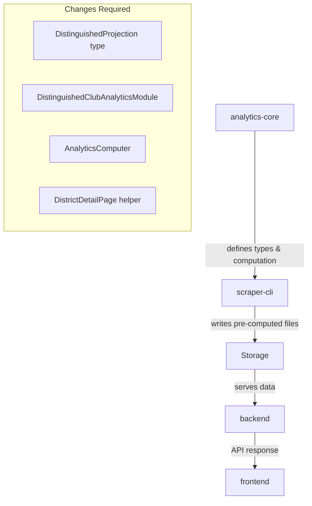

# Design: Projected Year-End Simplification

## Overview

This design simplifies the "Projected Year-End" distinguished clubs calculation by:
1. Replacing the complex linear regression approach with a direct count of thriving clubs
2. Consolidating three separate projected fields into a single `projectedDistinguished` field
3. Fixing the frontend bug where all three projected values were being summed (causing 3x the actual value)

## Architecture

The change spans multiple packages in the monorepo:



### Current State (Bug)

The `DistinguishedProjection` interface has three projected fields:
- `projectedDistinguished`
- `projectedSelect`  
- `projectedPresident`

After the previous change (Task 1), all three fields contain the same value (thriving count). However, the frontend helper function `getDistinguishedProjectionValue()` sums all three, resulting in 3x the actual projection.

### Target State

Simplify to a single `projectedDistinguished` field. Remove `projectedSelect` and `projectedPresident` entirely.

## Components and Interfaces

### 1. Modified Type: DistinguishedProjection

**File:** `packages/analytics-core/src/types.ts`

Current:
```typescript
export interface DistinguishedProjection {
  projectedDistinguished: number
  projectedSelect: number
  projectedPresident: number
  currentDistinguished: number
  currentSelect: number
  currentPresident: number
  projectionDate: string
}
```

New:
```typescript
export interface DistinguishedProjection {
  projectedDistinguished: number  // Single projected field = thriving count
  currentDistinguished: number
  currentSelect: number
  currentPresident: number
  projectionDate: string
}
```

### 2. Modified Component: DistinguishedClubAnalyticsModule

**File:** `packages/analytics-core/src/analytics/DistinguishedClubAnalyticsModule.ts`

Update `generateDistinguishedProjection()` to return only `projectedDistinguished`:

```typescript
generateDistinguishedProjection(
  snapshots: DistrictStatistics[],
  thrivingCount?: number
): DistinguishedProjection {
  // ... existing logic ...
  
  return {
    projectedDistinguished: thrivingCount ?? 0,
    currentDistinguished: current.distinguished,
    currentSelect: current.select,
    currentPresident: current.presidents,
    projectionDate: latestSnapshot.date,
  }
}
```

### 3. Modified Component: AnalyticsComputer

**File:** `packages/analytics-core/src/analytics/AnalyticsComputer.ts`

Update the `distinguishedLevelBreakdown` construction to use only `projectedDistinguished`:

```typescript
distinguishedLevelBreakdown: {
  smedley: {
    current: counts.smedley,
    projected: projection.projectedDistinguished,
    trend: trends.smedley,
  },
  presidents: {
    current: counts.presidents,
    projected: projection.projectedDistinguished,
    trend: trends.presidents,
  },
  select: {
    current: counts.select,
    projected: projection.projectedDistinguished,
    trend: trends.select,
  },
  distinguished: {
    current: counts.distinguished,
    projected: projection.projectedDistinguished,
    trend: trends.distinguished,
  },
}
```

### 4. Modified Frontend Helper

**File:** `frontend/src/pages/DistrictDetailPage.tsx`

Simplify `getDistinguishedProjectionValue()` to use only `projectedDistinguished`:

```typescript
function getDistinguishedProjectionValue(
  projection:
    | number
    | { projectedDistinguished?: number }
    | null
    | undefined
): number {
  if (projection === null || projection === undefined) {
    return 0
  }
  if (typeof projection === 'number') {
    return projection
  }
  return projection.projectedDistinguished ?? 0
}
```

## Data Models

### DistinguishedProjection (simplified)

```typescript
interface DistinguishedProjection {
  projectedDistinguished: number  // = thriving club count
  currentDistinguished: number    // actual current count
  currentSelect: number           // actual current count
  currentPresident: number        // actual current count
  projectionDate: string          // date of projection
}
```

## Files to Modify

| Package | File | Change |
|---------|------|--------|
| analytics-core | `src/types.ts` | Remove `projectedSelect`, `projectedPresident` from interface |
| analytics-core | `src/analytics/DistinguishedClubAnalyticsModule.ts` | Update return object |
| analytics-core | `src/analytics/AnalyticsComputer.ts` | Update `distinguishedLevelBreakdown` |
| analytics-core | `src/__tests__/DistinguishedClubAnalyticsModule.test.ts` | Update test assertions |
| analytics-core | `src/analytics/AnalyticsComputer.integration.test.ts` | Update test assertions |
| backend | `src/types/analytics.ts` | Update `DistinguishedClubAnalytics.distinguishedProjection` type |
| backend | `src/services/__tests__/PreComputedAnalyticsReader.test.ts` | Update test fixtures |
| backend | `src/services/__tests__/PreComputedAnalyticsReader.integration.test.ts` | Update test fixtures |
| backend | `src/services/__tests__/PreComputedAnalyticsReader.extended.test.ts` | Update test fixtures |
| backend | `src/routes/districts/__tests__/analyticsSummary.test.ts` | Update test fixtures |
| scraper-cli | `src/__tests__/AnalyticsWriter.test.ts` | Update test fixtures |
| scraper-cli | `src/__tests__/AnalyticsWriter.property.test.ts` | Update arbitrary generators |
| scraper-cli | `src/__tests__/AnalyticsComputeService.test.ts` | Update test fixtures |
| frontend | `src/pages/DistrictDetailPage.tsx` | Simplify helper function |
| frontend | `src/hooks/__tests__/useAggregatedAnalytics.test.tsx` | Update test fixtures |

## Error Handling

No new error handling required. The simplification reduces complexity and potential for errors.

## Testing Strategy

Per `testing.md` Section 7.3: "Would 5 well-chosen examples provide equivalent confidence? If yes, prefer the examples."

This is a type simplification with straightforward changes. Unit tests with well-chosen examples provide sufficient confidence.

### Unit Tests to Update

1. **DistinguishedClubAnalyticsModule.test.ts** - Update assertions to check only `projectedDistinguished`
2. **AnalyticsComputer.integration.test.ts** - Update projection validation
3. **AnalyticsWriter tests** - Update test fixtures to use simplified type

### Test Verification

After changes, verify:
- All existing tests pass with updated assertions
- Frontend displays correct (non-tripled) projection value
- Pre-computed analytics files have correct structure
