# Design Document: Rankings District Validation Fix

## Overview

This design addresses a bug where rankings data includes invalid "As of MM/DD/YYYY" entries as district IDs. The fix integrates the existing `DistrictIdValidator` service into two critical code paths that currently bypass validation when calculating rankings.

The solution is minimal and surgical: we add validation calls to filter invalid records before they are converted to `DistrictStatistics` for ranking calculation. The existing `DistrictIdValidator` already has the correct logic and comprehensive tests; we simply need to use it in the right places.

## Architecture

The fix follows the existing architecture patterns in the codebase:

```mermaid
flowchart TD
    subgraph "Current Flow (Bug)"
        CSV1[CSV Data] --> Parse1[Parse CSV]
        Parse1 --> Convert1[Convert to DistrictStatistics]
        Convert1 --> Rank1[Calculate Rankings]
        Rank1 --> Invalid[Rankings with Invalid IDs]
    end

    subgraph "Fixed Flow"
        CSV2[CSV Data] --> Parse2[Parse CSV]
        Parse2 --> Validate[DistrictIdValidator.filterValidRecords]
        Validate --> Convert2[Convert to DistrictStatistics]
        Convert2 --> Rank2[Calculate Rankings]
        Rank2 --> Valid[Clean Rankings]
    end
```



### Affected Components

1. **SnapshotBuilder.calculateAllDistrictsRankings()** (lines 834-910)
   - Currently converts `ScrapedRecord[]` directly to `DistrictStatistics[]`
   - Fix: Filter records using `DistrictIdValidator.filterValidRecords()` before conversion

2. **BackfillService.fetchAndCalculateAllDistrictsRankings()** (lines 1237-1430)
   - Currently converts parsed CSV records directly to `DistrictStatistics[]`
   - Fix: Filter records using `DistrictIdValidator.filterValidRecords()` before conversion

### Dependency Injection

The `SnapshotBuilder` already accepts an optional `IDistrictIdValidator` in its constructor and creates a default instance if not provided. This pattern will be extended to `BackfillService`.

## Components and Interfaces

### Existing Interface: IDistrictIdValidator

The existing interface provides all needed functionality:

```typescript
interface IDistrictIdValidator {
  validate(districtId: string): ValidationResult
  filterValid(districts: DistrictStatistics[]): FilterResult
  filterValidRecords(records: ScrapedRecord[]): ScrapedRecordFilterResult
}

interface ScrapedRecordFilterResult {
  valid: ScrapedRecord[]
  rejected: Array<{ districtId: string; reason: string }>
}
```

### SnapshotBuilder Changes

The `calculateAllDistrictsRankings` method will be modified to filter records before conversion:

```typescript
private async calculateAllDistrictsRankings(
  allDistricts: ScrapedRecord[],
  metadata: RawData['allDistrictsMetadata']
): Promise<AllDistrictsRankingsData | undefined> {
  if (!this.rankingCalculator || allDistricts.length === 0) {
    return undefined;
  }

  // NEW: Filter invalid district IDs before processing
  const validationResult = this.districtIdValidator.filterValidRecords(allDistricts);
  const validRecords = validationResult.valid;

  // Log validation summary if records were rejected
  if (validationResult.rejected.length > 0) {
    this.log.info('Filtered invalid district records during rankings calculation', {
      totalRecords: allDistricts.length,
      validRecords: validRecords.length,
      rejectedRecords: validationResult.rejected.length,
    });
  }

  // Return undefined if no valid records remain
  if (validRecords.length === 0) {
    this.log.warn('No valid district records for rankings calculation after filtering');
    return undefined;
  }

  // Convert filtered ScrapedRecord to DistrictStatistics
  const districtStats = validRecords.map(record => ({
    // ... existing conversion logic
  }));

  // ... rest of existing method
}
```

### BackfillService Changes

The `fetchAndCalculateAllDistrictsRankings` method will be modified similarly:

```typescript
private async fetchAndCalculateAllDistrictsRankings(
  backfillId: string,
  date: string,
  snapshotId: string
): Promise<AllDistrictsRankingsData> {
  // ... existing CSV reading logic ...

  const allDistrictsData = this.parseCSVContent(csvContent);

  // NEW: Filter invalid district IDs before processing
  const validationResult = this.districtIdValidator.filterValidRecords(allDistrictsData);
  const validRecords = validationResult.valid;

  // Log validation summary if records were rejected
  if (validationResult.rejected.length > 0) {
    logger.info('Filtered invalid district records during backfill rankings calculation', {
      backfillId,
      date,
      totalRecords: allDistrictsData.length,
      validRecords: validRecords.length,
      rejectedRecords: validationResult.rejected.length,
      operation: 'fetchAndCalculateAllDistrictsRankings',
    });
  }

  // Throw error if no valid records remain
  if (validRecords.length === 0) {
    throw new Error(
      `No valid district records found in All Districts CSV for date ${date} after filtering invalid IDs.`
    );
  }

  // Convert filtered records to DistrictStatistics
  const districtStats: DistrictStatistics[] = validRecords.map(record => {
    // ... existing conversion logic
  });

  // ... rest of existing method
}
```

The `BackfillService` constructor will be updated to accept and store a `DistrictIdValidator`:

```typescript
constructor(
  refreshService: RefreshService,
  snapshotStore: ISnapshotStorage | SnapshotStore,
  configService: DistrictConfigurationService,
  alertManager?: AlertManager,
  circuitBreakerManager?: ICircuitBreakerManager,
  rankingCalculator?: RankingCalculator,
  districtIdValidator?: IDistrictIdValidator  // NEW parameter
) {
  // ... existing initialization ...
  this.districtIdValidator = districtIdValidator ?? new DistrictIdValidator();
}
```

## Data Models

No changes to data models are required. The fix uses existing types:

- `ScrapedRecord`: Raw CSV record (input)
- `ScrapedRecordFilterResult`: Validation result with valid/rejected arrays
- `DistrictStatistics`: Normalized district data (output)
- `AllDistrictsRankingsData`: Final rankings structure

## Correctness Properties

_A property is a characteristic or behavior that should hold true across all valid executions of a system—essentially, a formal statement about what the system should do. Properties serve as the bridge between human-readable specifications and machine-verifiable correctness guarantees._

Based on the prework analysis, the core validation properties (3.2, 3.3, 3.4, 3.5) are already comprehensively tested in `DistrictIdValidator.test.ts`. The new code being added is integration/wiring code that connects the existing validator to the rankings calculation paths.

Per the project's `property-testing-guidance.md`:

> "Property tests are a tool, not a default. Unit tests with well-chosen examples are often sufficient and more maintainable."

This fix falls into the category of "integration glue code" where:

- The input space is not genuinely complex
- 3-5 well-chosen examples provide equivalent confidence
- The underlying validation logic already has property-based test coverage

**No new property-based tests are warranted for this fix.** The existing `DistrictIdValidator` tests provide comprehensive coverage of the validation logic. The new integration points will be verified through unit tests with specific examples.

## Error Handling

### SnapshotBuilder Error Handling

- If all records are filtered out, return `undefined` for rankings (graceful degradation)
- Log warnings for rejected records to aid debugging
- Continue snapshot creation even if rankings cannot be calculated

### BackfillService Error Handling

- If all records are filtered out, throw an error with a descriptive message
- Log warnings for rejected records to aid debugging
- The error will be caught by the calling code and handled appropriately

### Logging Strategy

Both services will log:

1. Individual warnings for each rejected record (via `DistrictIdValidator`)
2. Summary information when records are rejected (total, valid, rejected counts)
3. Debug-level information about the filtering operation

## Testing Strategy

### Unit Tests

Unit tests will verify the integration points with specific examples:

**SnapshotBuilder Tests:**

1. Verify `calculateAllDistrictsRankings` filters invalid records before ranking calculation
2. Verify undefined is returned when all records are invalid (edge case)
3. Verify valid records are processed correctly after filtering

**BackfillService Tests:**

1. Verify `fetchAndCalculateAllDistrictsRankings` filters invalid records before ranking calculation
2. Verify error is thrown when all records are invalid (edge case)
3. Verify valid records are processed correctly after filtering

### Property-Based Tests

No new property-based tests are needed for this fix because:

1. The `DistrictIdValidator` already has comprehensive test coverage (see `DistrictIdValidator.test.ts`)
2. The fix is integration-level (wiring the validator into existing code paths)
3. The validation logic itself is not changing
4. Unit tests with well-chosen examples provide equivalent confidence

Per the project's `property-testing-guidance.md`:

> "Property tests are a tool, not a default. Unit tests with well-chosen examples are often sufficient and more maintainable."

### Test Configuration

- Tests will use Vitest (existing test framework)
- Mock the logger to verify logging behavior
- Mock the DistrictIdValidator to verify it's called correctly
- Use existing test helpers for creating test data
- Minimum test coverage: 4 unit tests (2 per service)
